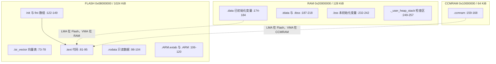
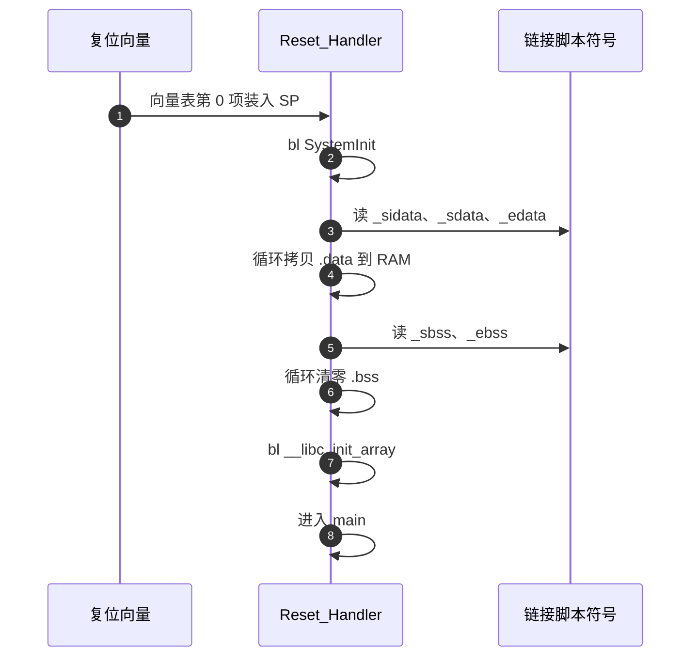

# 链接脚本与内存布局

链接脚本回答两件事：物理存储区长什么样，输入段分别放到哪里。它还定义启动代码要用的符号，如栈顶、`.data` 在 Flash 中的源地址、`.bss` 的起止。F407IGH6 的 192 KiB SRAM 分成不连续的 128 KiB 主 SRAM 与 64 KiB CCMRAM，脚本用三段 `MEMORY` 表达。

> 依据 `STM32F407XX_FLASH.ld`（269 行，两板逐字节相同）与启动文件 `startup_stm32f407xx.s`，并用仓库内已有构建产物 `build/Debug/sentriomeni2026.map` 核对实际占用。map 数字来自历史构建，重新构建会变化。

工程结构与两板差异见同单元 `01-CMake工程结构与双板同构.md`，只讲存储区划分与段映射。

## 1. 三段 MEMORY 与设备容量

| 区域 | 起始地址 | 长度 | 属性 | 本工程用途 |
| --- | --- | --- | --- | --- |
| FLASH | `0x08000000` | 1024 KiB | rx | 向量表、代码、只读数据、初始化值 |
| RAM | `0x20000000` | 128 KiB | xrw | `.data`、`.bss`、FreeRTOS 堆、栈 |
| CCMRAM | `0x10000000` | 64 KiB | xrw | `.ccmram`，本工程未使用 |

```ld
MEMORY
{
  RAM (xrw)      : ORIGIN = 0x20000000, LENGTH = 128K
  CCMRAM (xrw)   : ORIGIN = 0x10000000, LENGTH = 64K
  FLASH (rx)     : ORIGIN = 0x8000000, LENGTH = 1024K
}
```

脚本注释把目标描述为 STM32F407IGHx，1024 KiB Flash 与 192 KiB RAM（`:9-10`）。192 KiB 是 128 KiB 主 SRAM 加 64 KiB CCMRAM 的和，地址不连续，因此必须分成两段。把两段合并成一段会让链接器把变量放到两段之间的空隙里，运行期访问到不存在的地址。

`ORIGIN` 与 `LENGTH` 的数值来自芯片手册，改动它们要同时改启动文件与时钟配置，不属于常规调整项。CCMRAM 的 `(xrw)` 属性表示可执行、可读写，它挂在 CPU 的专用总线上，与主 SRAM 的访问路径不同。

## 2. 栈顶与符号计算

链接期先算两个符号。栈顶放在主 SRAM 的最高地址：

$$ \texttt{\_estack} = \texttt{ORIGIN(RAM)} + \texttt{LENGTH(RAM)} = 0x20000000 + 0x20000 = 0x20020000 $$

对应 `STM32F407XX_FLASH.ld:64`。启动文件把 `_estack` 装入 SP（`startup_stm32f407xx.s:61`），因此主栈不会落在 CCMRAM。$0x20000$ 是 128 KiB 的十六进制写法，相加得到 $0x20020000$。

堆与栈的最小检查量是 `_Min_Heap_Size = 0x200`、`_Min_Stack_Size = 0x400`（`:66-67`），它们只在 `._user_heap_stack` 里占位，用于链接期判断剩余 RAM 是否够用（`:249-257`），不代表实际可用堆的大小。两个符号的作用时机是链接期：若主 SRAM 已被占满，链接器报该段溢出，而不是在运行期才暴露。

## 3. 段到区域的映射



`.isr_vector` 用 `KEEP` 防止被回收，`.text`、`.rodata` 与异常索引表都落在 FLASH。`.data` 写成 `>RAM AT> FLASH`（`:174-184`），表示运行地址在 RAM、加载地址在 FLASH，初值由启动代码搬运。`.ccmram` 同理写成 `>CCMRAM AT> FLASH`（`:159-168`），脚本为它定义了 `_siccmram = LOADADDR(.ccmram)`（`:151`）。

`.bss` 与 `.tbss` 带 `NOLOAD`（`:210`、`:232`），只占地址不占 Flash。判断一个段会不会进镜像，看它有没有 `NOLOAD`：带 `NOLOAD` 的段在 ELF 里分配地址但不占用加载空间，烧录文件里没有它的内容。

## 4. 地址分离与启动期搬运

链接脚本把 VMA 与 LMA 分开表示之后，启动代码必须自己把初值搬过去。执行顺序是固定的：



搬运与清零的代码在 `startup_stm32f407xx.s:66-95`：`_sidata` 到 `_sdata`、`_edata` 的循环拷贝在前，`_sbss` 到 `_ebss` 的循环清零在后，`:98` 调用 `__libc_init_array` 执行 C++ 静态构造，之后进入 `main`。

顺序不能交换。`.bss` 清零若放在 `.data` 搬运之前，搬运过程写在 RAM 里的值不会被清掉；搬运若放在 `__libc_init_array` 之后，静态构造函数会先看到未初始化的变量。三段顺序与三个符号组一一对应：`_sidata/_sdata/_edata` 一组，`_sbss/_ebss` 一组。

## 5. CCMRAM 段为什么是空的

脚本注释对 CCMRAM 有一段提醒：若把带初值的变量放进该段，启动代码需要同步修改（`:153-158`）。核对启动文件后，它只引用 `_sidata`、`_sdata`、`_edata`、`_sbss`、`_ebss`，没有引用 `_siccmram`；工程源码里也检索不到 `.ccmram` 段属性（已核查）。该段当前为空，CCMRAM 未使用。

CCMRAM 的定位需要三处同时改动：链接脚本已就绪，启动文件缺搬运代码，源码缺段属性。只改其中一处不会生效，反而可能让变量落在没有初值的地址上。

## 6. TLS 符号与 /DISCARD/ 的来源

TLS 相关符号 `__tdata_start`、`__tls_base` 等（`:196-230`）由 CubeMX 模板附带，本工程的任务栈由 FreeRTOS 管理，不依赖这些符号。`/DISCARD/` 段排除 `libc.a`、`libm.a`、`libgcc.a` 的条目（`:262-267`），按 ST 模板的注释用于去掉标准库的调试信息，具体丢弃范围属按模板推导。

这两部分都属于模板带来的内容，与业务无关。核对链接脚本时把它们与业务段分开看：业务段决定内存布局，模板段决定链接期的杂项处理，出问题的排查方向完全不同。

## 7. 链接选项与段回收

两板共用同一份链接脚本，工具链文件用 `-T` 指向它（`gcc-arm-none-eabi.cmake:39`），并开启 `--gc-sections` 与 `-Map`（`:41`）。`--gc-sections` 要与 `-ffunction-sections -fdata-sections`（`:29`）配合，否则每个目标文件只有一个 `.text` 段，回收粒度到不了函数。

两个选项的作用可以分开理解：前者把每个函数与数据放进独立段，后者让链接器丢弃没有引用的段。缺任何一个，未引用代码都会留在镜像里；两者都开时，被丢弃的函数不会出现在 map 的段列表里。

## 8. 从 map 读实际占用

从已有 map 可以读出实际占用。下表数字取自 `build/Debug/sentriomeni2026.map`，属历史构建结果：

| 指标 | 底盘板 Debug | 云台板 Debug | 容量 |
| --- | --- | --- | --- |
| `.data` 起止 | `0x20000000` 到 `0x200000a0` | `0x20000000` 到 `0x200001a4` | 128 KiB |
| `.data` 大小 | 0xa0 = 160 B | 0x1a4 = 420 B | 128 KiB |
| `.bss` 大小 | `_ebss - _sbss` = 45512 B | `_ebss - _sbss` = 54244 B | 128 KiB |
| 堆栈检查区 | 0x200 + 0x400 = 1536 B | 同 | 128 KiB |
| RAM 占用合计 | 约 47208 B，折合 46.1 KiB | 约 56200 B，折合 54.9 KiB | 128 KiB |
| Flash 占用合计 | 约 55040 B，折合 53.8 KiB | 约 90068 B，折合 88.0 KiB | 1024 KiB |
| CCMRAM 占用 | 0 B | 0 B | 64 KiB |

Flash 合计的算法是加载地址终点减 `0x08000000` 再加 `.data` 的初值长度；底盘板的加载终点为 `0x0800d660`，云台板为 `0x08015e30`。RAM 合计的算法是 `_ebss` 减 `0x20000000` 再加 1536 B 检查区。两类数字都只反映这次构建的 Debug 配置。

$$ RAM_{底盘} = 45512 + 160 + 1536 = 47208\ \text{B} \approx 46.1\ \text{KiB} $$

$$ RAM_{云台} = 54244 + 420 + 1536 = 56200\ \text{B} \approx 54.9\ \text{KiB} $$

两式都只把 `.data`、`.bss` 与检查区相加，不含 FreeRTOS 任务栈的独立分配量（栈在堆里，已包含在 `ucHeap` 之内）。换算成百分比后，云台板的 RAM 占用约为 128 KiB 的 43%，底盘板约为 36%。

## 9. 占用里最大的一块

`.bss` 里最大的一块来自 FreeRTOS 堆：`Core/Inc/FreeRTOSConfig.h:67` 把 `configTOTAL_HEAP_SIZE` 定为 40960，`Middlewares/Third_Party/FreeRTOS/Source/portable/MemMang/heap_4.c:64` 用静态数组 `ucHeap[configTOTAL_HEAP_SIZE]` 承载它。40960 B 约占底盘板 `.bss` 的 90%、云台板的 76%（按 map 数值计算），因此链接脚本里的 0x200 堆检查区与实际堆是两回事。

$$ \frac{40960}{45512} \approx 90\%, \qquad \frac{40960}{54244} \approx 76\% $$

调整内核堆会直接影响 `.bss` 与整包 RAM 占用，而链接脚本里的检查区数值不变。核对 RAM 余量时以 `_ebss` 为准，不要用检查区推算。

## 10. 链接脚本相关的易错点

| 易错点 | 现象 | 对应位置 |
| --- | --- | --- |
| 把带初值变量定位到 `.ccmram` | 启动不搬运该段，变量初值丢失 | `STM32F407XX_FLASH.ld:153-168`、`startup_stm32f407xx.s:66-95` |
| 把 `_Min_Heap_Size` 当成可用堆 | 实际堆是 FreeRTOS 的 `ucHeap` | `:66`、`heap_4.c:64` |
| 认为栈顶可以改到 CCMRAM | 向量表首项与 `_estack` 必须一致 | `:64`、`startup_stm32f407xx.s:37` |
| 手工改链接脚本后期望持久 | `.ld` 是 CubeMX 生成物，重生成会覆盖 | 两板根目录的 `.ioc` |
| 只加 `--gc-sections` | 未加 `-ffunction-sections` 时回收粒度到不了函数 | `gcc-arm-none-eabi.cmake:29`、`:41` |
| 两板 `.ld` 与 `.map` 同名 | 交叉核对构建目录时读错板 | 两板根目录 |
| 依赖 `/DISCARD/` 的副作用 | 标准库调试信息缺失（按 ST 模板注释） | `:262-267` |

## 11. 小结

### 核心概念

- `MEMORY` 把 F407 的 192 KiB SRAM 拆成主 SRAM 与 CCMRAM 两段，地址不连续。
- `.data`、`.tdata` 与 `.ccmram` 使用 `AT> FLASH`，运行地址与加载地址分离，初值由启动代码搬运。
- `.bss` 与 `.tbss` 使用 `NOLOAD`，只占 RAM 地址，启动期清零。
- 堆栈检查区只用于链接期校验，FreeRTOS 的实际堆是 `.bss` 里的 `ucHeap` 数组。
- CCMRAM 段当前为空，启动文件也没有搬运该段的代码。

### 设计权衡

| 决策 | 选择 | 收益 | 代价 |
| --- | --- | --- | --- |
| 栈的位置 | 主 SRAM 顶端 `0x20020000` | 地址连续、容量大 | 不能利用更快的 CCMRAM |
| 是否使用 CCMRAM | 未使用 | 避免启动代码改写与搬运遗漏 | 放弃 64 KiB 零等待内存 |
| 段回收 | `-ffunction-sections` 配合 `--gc-sections` | 未引用函数不进最终镜像 | 段数增多，map 可读性下降 |
| 标准库处理 | `/DISCARD/` 排除条目 | 镜像更小 | 调试信息可能缺失 |

## 12. 练习

### 基础题

1. 打开 `STM32F407XX_FLASH.ld`，写出三段 `MEMORY` 的起始地址与长度，并计算 `_estack` 的数值。
2. 在启动文件里找出搬运 `.data` 与清零 `.bss` 的循环入口，写出它们使用的链接脚本符号与行号。
3. 说明 `.data` 与 `.bss` 在链接脚本属性上的区别，并指出 `NOLOAD` 出现在哪些段。

### 挑战题

1. 把一个带初值的全局数组用段属性放进 `.ccmram`，重新构建后用 map 检查 `_sccmram` 与 `_eccmram`，说明初值是否被搬运（属未实测操作）。
2. 对照两板 map 的 `_ebss` 与 `_etext`，把 Flash 与 RAM 占用换算成百分比，指出哪一板的余量更紧，并说明 `configTOTAL_HEAP_SIZE` 调整后的影响（属按 map 推导）。

## 附：本页引用的固件路径

| 路径 | 用途 |
| --- | --- |
| `/home/wyx/rm/2026SentriOmeniChassis/2026OmniSentryChassis` | 底盘板根目录 |
| `/home/wyx/rm/2026SentriOmeniGimbal/2026OmniSentryGimbal` | 云台板根目录 |
| `STM32F407XX_FLASH.ld` | 链接脚本，269 行，两板相同 |
| `startup_stm32f407xx.s` | 启动文件，搬运 `.data` 与清零 `.bss` |
| `cmake/gcc-arm-none-eabi.cmake` | `-T`、`--gc-sections` 与 map 选项 |
| `Core/Inc/FreeRTOSConfig.h` | `configTOTAL_HEAP_SIZE` 等内核配置 |
| `Middlewares/Third_Party/FreeRTOS/Source/portable/MemMang/heap_4.c` | `ucHeap` 静态数组 |
