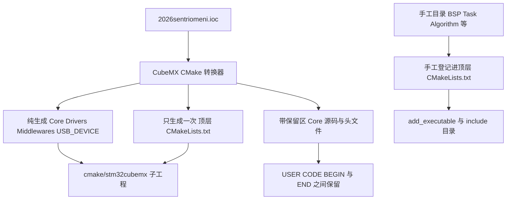
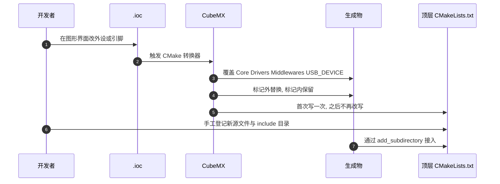

# CubeMX 生成物与 USER CODE 段

> 源码对象：两块板的 `2026sentriomeni.ioc`、顶层 `CMakeLists.txt` 与 `cmake/stm32cubemx/CMakeLists.txt`，梳理生成物与手工维护文件的边界，以及 `USER CODE` 段的保留规则。

CubeMX 的 CMake 转换器以 `.ioc` 为输入，一次生成整套可编译工程，同时在部分文件里留下供用户写代码的保留区。理解这套机制要回答三个问题：哪些文件会被下一次重生成覆盖、用户代码写在哪里才不会被覆盖、手工目录怎么接进构建。

## 1. 生成物分四类，判据只有一条

按重生成时是否保留用户内容，工程里的文件分成三类，手工目录是第四类。

| 类别 | 范围 | 重生成行为 | 依据 |
| --- | --- | --- | --- |
| 纯生成 | `Core/Inc`、`Drivers/`、`Middlewares/`、`USB_DEVICE/` | 整体覆盖 | `cmake/stm32cubemx/CMakeLists.txt:28-100` |
| 带保留区 | `Core/Src/*.c`、`Core/Inc/*.h` | 覆盖，USER CODE 段保留 | `.ioc` 的 KeepUserCode |
| 只生成一次 | 顶层 `CMakeLists.txt` | 不覆盖 | `CMakeLists.txt:3-7` |
| 手工维护 | `BSP/`、`Task/`、`Algorithm/`、`Communication/`、`PID/`、`Chassis/`、`Debug_vars/`、`Message_Bus/`、`referee/`、`BMI088/` | 生成器不感知 | `CMakeLists.txt:34-92` |

区分的判据只有一条：文件是否出现在 `.ioc` 的工程配置与转换器输出清单里。自建目录不在清单内，所以 CubeMX 重生成既不覆盖也不登记，必须手工写进顶层 `CMakeLists.txt`。

“不覆盖也不登记”带来的直接后果是双向的：手写代码放在自建目录里很安全，但编译器也看不到它，除非有人把它写进源文件清单。判断一个目录属于哪一类，看它有没有进过转换器输出，而不是看它是否在工程根目录下。

四个类别的处理方式互不相同：纯生成文件改动必丢，带保留区的文件只有标记内安全，顶层文件改了就生效但不自动更新，手工目录要自己接到构建里。把文件放错类别，问题会在下一次重生成或下一次配置时才暴露。

## 2. .ioc 是唯一配置源

`.ioc` 用键值对记录 MCU 型号、时钟、外设、中间件与工程管理选项。转换器读取 `ProjectManager.*` 决定输出格式：

| 键 | 值 | 位置 |
| --- | --- | --- |
| ProjectManager.TargetToolchain | CMake | 底盘 `.ioc:358`、云台 `.ioc:355` |
| ProjectManager.KeepUserCode | true | 底盘 `.ioc:346`、云台 `.ioc:343` |
| ProjectManager.CoupleFile | true | 底盘 `.ioc:336`、云台 `.ioc:333` |
| ProjectManager.DeletePrevious | true | 底盘 `.ioc:339`、云台 `.ioc:336` |
| ProjectManager.DeviceId | STM32F407IGHx | 底盘 `.ioc:340`、云台 `.ioc:337` |

`KeepUserCode=true` 决定 USER CODE 段的保留，`DeletePrevious=true` 决定不再使用的旧生成文件会被删除。`.mxproject` 记录上一次的生成清单：`[PreviousUsedCMakes]` 在 `:4`，`[PreviousGenFiles]` 从 `:9` 开始列出源文件与头文件。

`.ioc` 与 `.mxproject` 的分工是输入与记录：前者是配置意图，后者是上次生成的实际结果。删除过时文件依赖后者的准确性，如果手工改动过生成目录导致清单与实际不符，重生成可能删错或漏删。

两个文件都随工程提交，不能用文本比较判断哪一份更新。判断配置当前状态时以 `.ioc` 为准，判断上一次生成了哪些文件时看 `.mxproject`。

## 3. USER CODE 段的判定与计数

每处保留区由一对注释夹住：

```c
/* USER CODE BEGIN Includes */
...
/* USER CODE END Includes */
```

标签名对应代码位置，`Includes`、`PV`、`0`、`2`、`RTOS_MUTEX` 各自独立。转换器重写文件时只替换标记之外的内容。两板 `Core` 下各有 25 个源文件与头文件带标记，`BEGIN` 与 `END` 各 241 个，数量相等，说明没有未闭合的保留区。

数量相等是判断标记完整性的第一道检查。若某次手工编辑删掉了 `END`，转换器无法确定保留区边界，可能把后续生成内容一起当作用户代码保留，或按最坏情况覆盖整段。核对时按标签名成对比较，而不是只数总数。

241 对标记分布在 `Core` 下 25 个文件里，平均每个文件约 10 对。文件数量与标记数量会随外设配置变化，记录这两个数只用于发现异常，不构成固定指标。



## 4. 生成与保留的分工



时序里最后一次交互由人完成。转换器不会替手工目录登记文件，这一步必须在改完 `.ioc` 之后单独做一次，且只做一次：顶层文件不会被重生成覆盖，重复登记同一文件会导致目标里出现重复源文件。

## 5. 两板生成边界对照

| 项 | 位置 | 内容 |
| --- | --- | --- |
| MCU 与封装 | `.ioc:159`、`.ioc:179` | STM32F407IGH6、UFBGA176 |
| FreeRTOS 堆编号 | `.ioc:92` | HEAP_NUMBER=4 |
| FreeRTOS 堆大小 | `.ioc:128` | configTOTAL_HEAP_SIZE=40960 |
| 应用源清单 | `cmake/stm32cubemx/CMakeLists.txt:28-49` | USB、Core 与启动文件共 20 项 |
| 系统与 HAL 源 | `cmake/stm32cubemx/CMakeLists.txt:52-78` | 共 25 项 |
| 中间件源 | `cmake/stm32cubemx/CMakeLists.txt:83-100` | USB CDC 与 FreeRTOS |
| 聚合接口库 | `cmake/stm32cubemx/CMakeLists.txt:113-115` | `stm32cubemx` INTERFACE 目标 |
| 顶层源清单 | `CMakeLists.txt:34-92` | `add_executable` 列全部手工源文件 |
| 顶层 include | `CMakeLists.txt:120-142` | 手工 include 目录 |
| 子工程接入 | `CMakeLists.txt:95` | `add_subdirectory(cmake/stm32cubemx)` |

两板的子工程清单逐行相同，差异只在自建源文件上：底盘 `CMakeLists.txt:79-82` 登记 `TestTask` 与 `ChassisTask`，云台 `CMakeLists.txt:60-61` 登记 `GimbalTask`，并在 `:88-97` 登记 USB 与裁判协议。手工清单是两板工程的主要分叉点。

子工程清单相同这一点要单独记下：它意味着两板的 HAL、USB 与 FreeRTOS 源文件集合一致，重生成后的差异也只会来自各自 `.ioc` 的外设配置。核对两板差异时，先排除相同的部分，再只看顶层手工清单。

生成清单相同还意味着一件事：两板的编译单元里都有同一批 HAL 与 FreeRTOS 文件。改动 CubeMX 相关配置时，两板都要重新生成并重新配置，只做一块会让两边的生成物版本不一致。

## 6. 保留区里实际写了什么

`Core/Src/main.c` 的保留区承担启动序列：

| 保留区 | 位置 | 内容 |
| --- | --- | --- |
| Includes | `Core/Src/main.c:33-39` | 引入 `bsp_dwt.h`、`bsp_can.h`、`dbus.h` |
| 0 | 底盘 `main.c:70-82`；云台 `main.c:70-78` | DBUS 与裁判回调函数 |
| 2 | 底盘 `main.c:124-133`；云台 `main.c:120-127` | `BSP_CAN_Init`、`BSP_DWT_Init`、串口登记 |
| WHILE | 底盘 `main.c:144-151`；云台 `main.c:138-142` | 空循环主体 |

`Core/Src/freertos.c` 的保留区承担任务入口登记，位置在两板之间相差 1 行以内：`FunctionPrototypes` 在底盘 `:59-65`、`RTOS_MUTEX` 在底盘 `:98-105`，云台对应 `:58-64` 与 `:99-105`。这些声明把 `Task/Inc` 下的任务入口接到 CubeMX 生成的调度框架里。USER CODE 之外的内容，例如 `osThreadDef(defaultTask, ...)`，由 `.ioc` 的 `FREERTOS.Tasks01` 决定。

保留区的内容分布说明生成物与手工代码是交织的：同一个文件里既有转换器写的初始化代码，也有用户写的回调与登记语句。读这类文件时要按标记分段，不能按函数名猜测归属。

`main.c` 的保留区里写的是回调与初始化登记，函数体在自建目录里。看到保留区里出现长实现，说明实现没有放到该放的位置，重生成虽然不会立刻覆盖它，但会让生成文件承担业务逻辑。

两板的保留区位置差在 1 行以内，说明它们来自同一份 CubeMX 模板与相近的外设配置。核对某段代码属于生成物还是手写代码时，位置相近不足以作为判据，仍要按 USER CODE 标记判断。

## 7. 易错点

| # | 易错点 | 现象 | 对应位置 |
| --- | --- | --- | --- |
| 1 | 把手工代码写在 USER CODE 之外 | 下次重生成被覆盖 | `Core/Src/*.c` 标记外 |
| 2 | 新增自建源文件不登记 | 链接期未定义引用 | `CMakeLists.txt:34-92` |
| 3 | 修改 `cmake/stm32cubemx/CMakeLists.txt` | 重生成被覆盖 | 子工程无 USER CODE 段 |
| 4 | 认为顶层 CMakeLists.txt 会自动更新 | 新目录始终不编译 | `CMakeLists.txt:3-7` |
| 5 | 手工文件放进 `Core/` | 与生成物同名时被覆盖 | `Core` 目录边界 |
| 6 | 两板 `.ioc` 与 `.ld` 同名 | 改错板后现象无法区分 | `2026sentriomeni.ioc`、`STM32F407XX_FLASH.ld` |

第 3 条按转换器行为推断：`cmake/stm32cubemx/CMakeLists.txt` 内没有 USER CODE 标记，且清单随 `.ioc` 外设变化，本次未实测重生成过程。

## 8. 小结

### 核心概念

- `.ioc` 是唯一配置源，`ProjectManager.*` 决定输出格式与保留策略。
- 生成物分四类：纯生成、带保留区、只生成一次、手工维护。
- `USER CODE BEGIN/END` 是重生成时唯一保留用户代码的位置，两板 Core 下各 241 对。
- 顶层 `CMakeLists.txt` 只生成一次，手工目录必须自己登记源文件与 include 路径。
- `.mxproject` 记录上次生成清单，供 `DeletePrevious=true` 删除过时文件。
- `cmake/stm32cubemx/CMakeLists.txt` 的清单跟随外设配置，改动不持久。

### 设计权衡

| 决策 | 选择 | 收益 | 代价 |
| --- | --- | --- | --- |
| 用户代码位置 | 全部放 USER CODE 段 | 重生成不丢代码 | 标签之外不能放实现 |
| 自建目录 | 顶层目录加手工登记 | 与生成物隔离 | 每加文件要改 CMakeLists |
| 顶层 CMakeLists | 只生成一次 | 手工清单持久 | 不会随 `.ioc` 自动更新 |
| CubeMX 输出目录 | Core 与 Drivers 固定 | 目录结构统一 | 手工文件不能随意混入 |

生成物与手工代码的边界稳定之后，两板工程的维护动作就只剩两种：改 `.ioc` 后重新生成，或在自建目录里加文件并登记。两种动作都不涉及对方的范围。

## 9. 练习

### 基础题

1. 列出 `Core/Src/main.c` 中所有 USER CODE 保留区的标签名与含义。
2. 说明 `KeepUserCode=true` 与 `DeletePrevious=true` 分别影响哪类文件。
3. 在顶层 `CMakeLists.txt` 里找到 `add_subdirectory(cmake/stm32cubemx)`，说明它把哪个目标接进来。

### 挑战题

4. 新增一个 `Task/Src/NewTask.cpp`，写出需要修改的两处顶层 CMakeLists 语句，并说明漏改其中一处分别是什么后果。
5. 设计一套检查脚本，判断 `Core/Src` 下是否存在未配对的 USER CODE 标记，给出判定规则。
6. 对比两板 `cmake/stm32cubemx/CMakeLists.txt`，说明它们逐行相同却仍可能因 `.ioc` 差异而重生成出不同清单的原因。

## 附：本页引用的固件路径

| 路径 | 用途 |
| --- | --- |
| `/home/wyx/rm/2026SentriOmeniGimbal/2026OmniSentryGimbal/2026sentriomeni.ioc` | 云台配置源 |
| `/home/wyx/rm/2026SentriOmeniChassis/2026OmniSentryChassis/2026sentriomeni.ioc` | 底盘配置源 |
| `/home/wyx/rm/2026SentriOmeniGimbal/2026OmniSentryGimbal/CMakeLists.txt` | 顶层手工源清单 |
| `/home/wyx/rm/2026SentriOmeniGimbal/2026OmniSentryGimbal/cmake/stm32cubemx/CMakeLists.txt` | 生成子工程清单 |
| `/home/wyx/rm/2026SentriOmeniGimbal/2026OmniSentryGimbal/Core/Src/main.c` | 启动序列保留区 |
| `/home/wyx/rm/2026SentriOmeniGimbal/2026OmniSentryGimbal/Core/Src/freertos.c` | 任务入口登记 |
| `/home/wyx/rm/2026SentriOmeniGimbal/2026OmniSentryGimbal/.mxproject` | 上次生成清单 |
| `/home/wyx/rm/2026SentriOmeniChassis/2026OmniSentryChassis/Core/Src/main.c` | 底盘启动序列 |
| `/home/wyx/rm/2026SentriOmeniChassis/2026OmniSentryChassis/CMakeLists.txt` | 底盘顶层清单 |
