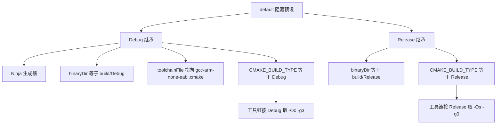
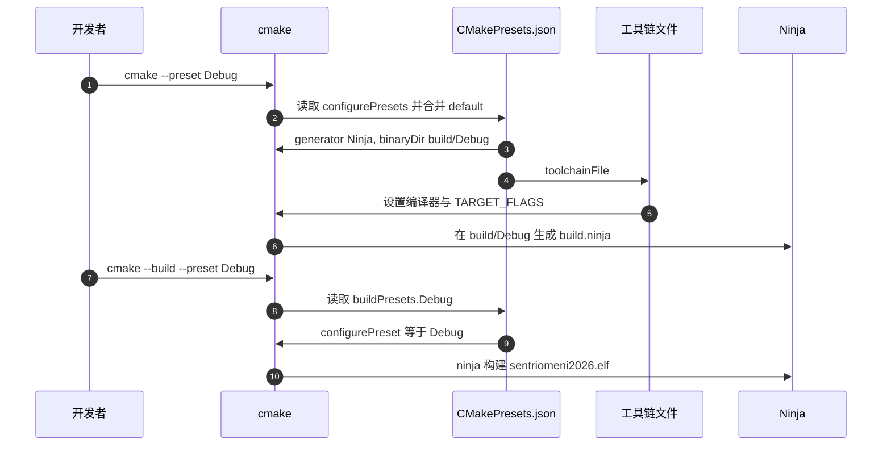

# CMakePresets 与多目标构建

> 源码对象：两块板的 `CMakePresets.json`、`cmake/gcc-arm-none-eabi.cmake` 与仓库里的 `build/`、`cmake-build-*` 目录，说明预设如何解析成一次 configure 与 build。

预设把经常重复的一整串命令行参数固化成具名条目，一个 `--preset` 就能完成配置或构建。回指关系与继承展开决定参数最终从哪来，两板的字段与构建类型映射存在差异，仓库里也因此出现多套构建目录。

## 1. 两类预设与必填的回指

CMakePresets 把一组 configure 参数固化成具名条目，命令行用 `--preset` 引用。文件里有两类预设：

| 类型 | 作用 | 关键字段 |
| --- | --- | --- |
| configure preset | 生成构建系统 | generator、binaryDir、toolchainFile、cacheVariables |
| build preset | 触发一次构建 | configurePreset、targets、jobs |

`configurePresets` 里 `hidden: true` 的基础预设不直接使用，只供继承。`buildPresets` 必须通过 `configurePreset` 指回一个存在的配置预设。

回指关系是单值的：一个构建预设只能指向一个配置预设，因此同一份源码可以按不同配置各建一个构建目录，再由各自的构建预设分别触发。缺省情况下若省略 `configurePreset`，会按同名配置预设匹配，本工程两板都显式写出。

## 2. 继承链与 binaryDir 展开

`Debug` 与 `Release` 都继承 `default`，字段按继承链合并。本工程的展开关系：

$$\text{binaryDir} = \text{sourceDir} + \text{/build/} + \text{presetName}$$

`${sourceDir}` 指含 `CMakePresets.json` 的目录，`${presetName}` 指当前配置预设名，所以 Debug 与 Release 各写一个独立目录，互不覆盖。

继承只合并字段，不合并命令。每个配置预设最终都是一套完整的 generator、binaryDir、toolchainFile 与 cacheVariables，继承只是减少重复书写。核对某个预设实际用了什么，要看展开后的结果而不是看它自己写了哪几行。

## 3. 从预设到构建

`configurePreset` 是 build preset 的唯一入口。本工程显式写出，不使用同名缺省。

两次命令之间状态保存在 `binaryDir` 里：配置阶段写出 `CMakeCache.txt` 与 `build.ninja`，构建阶段读取它们。若两次命令用了不同的预设名而 `binaryDir` 指向同一目录，第二次会复用第一次的缓存，工具链与构建类型不会重新判定。

## 4. 构建类型如何映射到编译标志

构建类型只决定工具链文件里 `_DEBUG` 与 `_RELEASE` 后缀变量，最终编译命令由三段拼接：

$$\text{flags} = \text{TARGET\_FLAGS} + \text{CMAKE\_C\_FLAGS} + \text{CMAKE\_C\_FLAGS\_{CONFIG}}$$

| 段 | Debug | Release |
| --- | --- | --- |
| TARGET_FLAGS | `-mcpu=cortex-m4 -mfpu=fpv4-sp-d16 -mfloat-abi=hard` | 同 |
| 公共 C 标志 | `-Wall -fdata-sections -ffunction-sections` | 同 |
| 配置标志 | `-O0 -g3` | `-Os -g0` |

`cmake/stm32cubemx/CMakeLists.txt` 用生成器表达式按配置给 `DEBUG` 宏：`$<$<CONFIG:Debug>:DEBUG>`。构建类型未指定时，顶层 `CMakeLists.txt` 兜底为 `Debug`。

三段里只有最后一段随配置变化，前两段对 Debug 与 Release 相同。因此从 Debug 切到 Release 时，指令集、FPU 与段粒度都不变，变化的是优化级别与调试信息，这也是两个构建目录可以共用同一份源码与工具链文件的原因。

## 5. 预设字段逐项对照

| 字段 | 底盘 | 云台 |
| --- | --- | --- |
| version 3 | `CMakePresets.json` | 同 |
| default 预设 | — | — |
| generator |  Ninja |  Ninja |
| binaryDir |  `build/${presetName}` |  同 |
| toolchainFile |  `cmake/gcc-arm-none-eabi.cmake` |  同 |
| Debug 与 Release | — | — |
| buildPresets.Debug |  指向 `Debug-1` |  指向 `Debug` |
| buildPresets.Release |  指向 `Release` |  同 |

两板的配置预设完全一致，构建预设里只有 Debug 一项的回指名不同。这个差异不影响配置阶段，只在 `cmake --build --preset` 时暴露。

## 6. 底盘板的 Debug-1 缺陷

底盘 `CMakePresets.json` 的构建预设名为 `Debug-1`，`configurePreset` 也写 `Debug-1`，但 `configurePresets` 里只有 `default`、`Debug`、`Release`。按预设解析规则，`cmake --build --preset Debug-1` 会因找不到同名配置预设而失败；云台板同一位置写的是 `Debug`，可用。该命令在本次未实测，结论由文件内容推出。

修复方式有两种：把构建预设名与回指名都改为 `Debug`，或在配置预设里补一个 `Debug-1`。前一种改动面小，后一种会多出重复的构建目录。选择哪一种取决于是否真的需要两套 Debug 配置。

修复后要重新配置一次才能让 `binaryDir` 与缓存对齐，只改预设文件不重新配置时，旧的 `CMakeCache.txt` 仍按上一套参数生效。

## 7. 仓库里的多套构建目录

`binaryDir` 只在预设路径下输出 `build/Debug`、`build/Release`；仓库里还有一批手工或 IDE 生成的目录。已核对各目录 `CMakeCache.txt`：

| 目录 | 生成器 | C 编译器 | 工具链文件 | 现象 |
| --- | --- | --- | --- | --- |
| 底盘 `build/Debug` | Ninja | 未记录 | 未记录 | 无 CMakeCache，build.ninja 指向云台源码树 |
| 底盘 `build/Release` | 未生成 | 未记录 | 未记录 | 只有 CMakeFiles，无 cache |
| 底盘 `cmake-build-debug` | Ninja | 主机 MinGW gcc | 无 | 构建类型为空，按主机编译器配置 |
| 底盘 `cmake-build-debug-mingw` | MinGW Makefiles | arm-none-eabi | 有 | Debug |
| 底盘 `cmake-build-debug-stm32` | Ninja | arm-none-eabi | 有 | Debug |
| 底盘 `cmake-build-debugchassis` | Ninja | 未记录 | 未记录 | 无 cache，保留 .elf 与 .map |
| 云台 `build/Debug` | Ninja | arm-none-eabi | 有 | Debug，指向云台树 |
| 云台 `build_test` | Visual Studio 2019 | MSVC | 无 | 主机工程，产出 .sln |
| 云台 `cmake-build-debug-stm32` | Ninja | 未记录 | 未记录 | 无 cache |

底盘 `build/Debug/build.ninja` 里 1126 处路径指向 `D:/RM/2026sentriomeni_gimbal`，同目录没有 `CMakeCache.txt`。两板的预设路径同名，一个目录里出现另一板的构建图，成因待现场确认；判断当前目录属于哪块板，应看 `CMakeCache.txt` 的 `CMAKE_HOME_DIRECTORY` 与 build.ninja 的源路径。

三类目录的用途必须分开记：预设输出目录由 CMakePresets 管理，IDE 目录由各 IDE 的配置管理，手工目录由创建者管理。混用时会遇到“改了预设但构建结果没变”的情况，原因通常是命令落在了另一个目录。

## 8. clang 工具链不在预设内

`cmake/starm-clang.cmake` 存在于两板 `cmake/` 目录，但 `CMakePresets.json` 的 `toolchainFile` 只指向 `gcc-arm-none-eabi.cmake`。默认库模式为 `STARM_PICOLIBC`（`starm-clang.cmake`），要用它得手动传 `-DCMAKE_TOOLCHAIN_FILE=cmake/starm-clang.cmake`。

手动传参会绕开 `binaryDir`，输出落在命令行当前目录或 `-B` 指定的位置。用 clang 工具链时建议单独指定构建目录，避免与预设目录混在一起，导致下一次用预设构建时读到错误的缓存。

## 9. 易错点

| # | 易错点 | 现象 | 对应位置 |
| --- | --- | --- | --- |
| 1 | 用不存在的构建预设 | 配置阶段报找不到预设 | 底盘 `CMakePresets.json` |
| 2 | 在错误的构建目录里构建 | 编出别的板或主机目标的产物 | `build/Debug`、`cmake-build-debug` |
| 3 | 改了工具链仍用旧 cache | 编译器与缓存不一致，报错难定位 | `cmake-build-debug/CMakeCache.txt` |
| 4 | 把 `build/Debug` 当成当前板 | 源路径指向另一板 | 底盘 `build/Debug/build.ninja` |
| 5 | 认为预设会覆盖全部构建目录 | `cmake-build-*` 不受预设管理 | `CMakePresets.json` |
| 6 | 只改 `CMAKE_BUILD_TYPE` 就改优化 | 需要重新 configure 才生效 | `gcc-arm-none-eabi.cmake` |
| 7 | 用 clang 工具链却不指定 | 报链接器或库缺失 | `starm-clang.cmake` 未被预设引用 |

## 10. 小结

### 核心概念

- 预设分 configure preset 与 build preset，后者用 `configurePreset` 指回前者。
- `default` 隐藏预设提供 Ninja、`binaryDir` 与 `toolchainFile`，Debug、Release 只改构建类型。
- `binaryDir` 展开为 `build/Debug` 与 `build/Release`，是预设唯一的输出根。
- 底盘板的 `Debug-1` 构建预设指向不存在的配置预设，云台板写 `Debug`。
- 构建类型通过工具链文件的 `_DEBUG`、`_RELEASE` 变量映射到 `-O0 -g3` 与 `-Os -g0`。
- 仓库里的 `cmake-build-*`、`build_test` 不由预设产生，可能带主机编译器缓存。

### 设计权衡

| 决策 | 选择 | 收益 | 代价 |
| --- | --- | --- | --- |
| 生成器 | Ninja | 增量构建快 | 需要额外装 Ninja |
| 预设路径 | `build/${presetName}` | Debug 与 Release 分开 | 两板同名目录易混 |
| 工具链入口 | 预设内写死 GCC | 一条命令即可 configure | 换 clang 要手动传参 |
| 构建类型默认值 | CMakeLists 兜底 Debug | 不设也有优化等级 | 与预设默认重复 |

预设的价值在于把一次 configure 的全部参数固定下来，核对预设是否按预期工作，只需要看 `binaryDir` 里的缓存与 `build.ninja` 指向的源路径。

## 11. 练习

### 基础题

1. 写出 `cmake --preset Debug` 展开后的 `binaryDir` 与所用生成器。
2. 说明 `buildPresets.Debug-1` 的 `configurePreset` 字段为什么会导致失败。
3. 从 `gcc-arm-none-eabi.cmake` 找出 Debug 与 Release 各自的优化与调试选项。

### 挑战题

4. 要新增一个 `RelWithDebInfo` 预设，写出需要在 `CMakePresets.json` 增加的字段，并说明构建类型如何映射到编译标志。
5. 给定一个未知来源的 `cmake-build-xxx` 目录，写出确认它属于哪块板、哪个工具链的检查步骤。
6. 把 `toolchainFile` 改成 `starm-clang.cmake` 后，分析 `TARGET_FLAGS`、链接库与 `.ld` 引用会分别发生什么变化。

## 附：本页引用的固件路径

| 路径 | 用途 |
| --- | --- |
| `/home/wyx/rm/2026SentriOmeniGimbal/2026OmniSentryGimbal/CMakePresets.json` | 云台预设 |
| `/home/wyx/rm/2026SentriOmeniChassis/2026OmniSentryChassis/CMakePresets.json` | 底盘预设与 Debug-1 |
| `/home/wyx/rm/2026SentriOmeniGimbal/2026OmniSentryGimbal/cmake/gcc-arm-none-eabi.cmake` | GCC 工具链与编译标志 |
| `/home/wyx/rm/2026SentriOmeniGimbal/2026OmniSentryGimbal/cmake/starm-clang.cmake` | clang 工具链 |
| `/home/wyx/rm/2026SentriOmeniGimbal/2026OmniSentryGimbal/CMakeLists.txt` | 构建类型兜底与编译命令导出 |
| `/home/wyx/rm/2026SentriOmeniGimbal/2026OmniSentryGimbal/cmake/stm32cubemx/CMakeLists.txt` | DEBUG 宏生成器表达式 |
| `/home/wyx/rm/2026SentriOmeniChassis/2026OmniSentryChassis/build/Debug/build.ninja` | 跨板构建图 |
| `/home/wyx/rm/2026SentriOmeniChassis/2026OmniSentryChassis/cmake-build-debug-stm32/CMakeCache.txt` | ARM 工具链缓存 |
