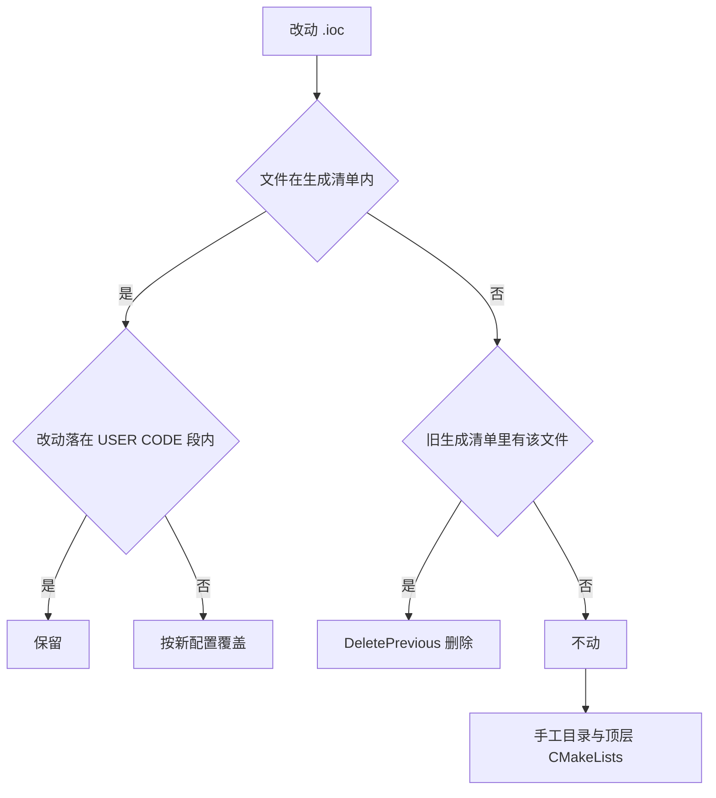
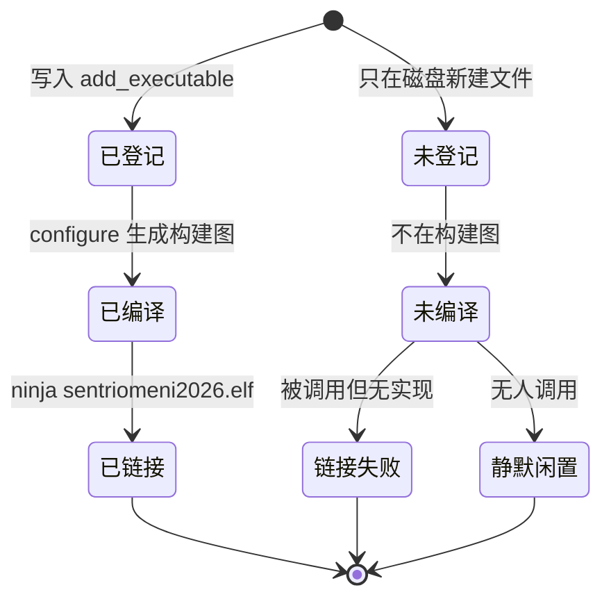

# 增量重生成与易错点

> 源码对象：`.ioc` 的 `ProjectManager.*`、顶层 `CMakeLists.txt` 与两板的 `cmake-build-*` 目录，说明重生成改变什么、不改变什么，以及由此产生的排查项。

重生成指修改 `.ioc` 后再次运行 CubeMX 的 CMake 转换器。它按增量语义工作：配置里新增的外设进入生成清单，移除的外设对应文件被删除，用户在 USER CODE 段内的内容保留。手工目录不参与这次比对。漏编与缓存错配两类问题，分别对应这三条规则在具体键与具体文件上的表现。

## 1. 重生成改变什么，不改变什么

| 改动 | 生成物 | USER CODE 段 | 手工目录 |
| --- | --- | --- | --- |
| 新增外设 | 增加源文件与 include | 保留 | 不受影响 |
| 删除外设 | 删除旧文件 | 保留 | 不受影响 |
| 改引脚或时钟 | 改写初始化代码 | 保留 | 不受影响 |
| 在标记外改代码 | 被覆盖 | 不适用 | 不受影响 |
| 新增手工源文件 | 不感知 | 不适用 | 需手工登记 |

表格里前三行是配置层面的改动，后两行是代码层面的改动。重生成只对配置层面生效，代码层面的改动要么落在被覆盖区，要么落在生成器看不到的目录里，两种位置的后果正好相反。

判断一段代码在重生成后能不能保留，只需看它是否在 USER CODE 标记之间。

配置层面改动的影响面比想象中大：改一个引脚可能同时改写 `main.c` 的初始化序列、`.ioc` 的键值与 `cmake/stm32cubemx/CMakeLists.txt` 的源文件清单。重生成后要按这三处分别核对，不能只看代码有没有变。文件级判断不可靠：同一个 `.c` 文件里可能既有保留区也有生成区，重生成后保留区原样留下，生成区按新配置改写。

## 2. 三个 ProjectManager 键决定行为

`.ioc` 里三个键决定重生成行为：

| 键 | 值 | 作用 |
| --- | --- | --- |
| ProjectManager.KeepUserCode | true | 保留 USER CODE 段 |
| ProjectManager.DeletePrevious | true | 删除上一次生成、这次不再需要的文件 |
| ProjectManager.CoupleFile | true | 生成物与用户文件按目录配对 |

三个键的组合决定了重生成是“覆盖加保留”而不是“清空重建”。

若 `KeepUserCode` 被改成 false，标记内内容也会按模板覆盖，用户代码全部丢失。核对 `.ioc` 时把这个键与 `DeletePrevious` 一起看，两者分别控制保留与删除。`DeletePrevious=true` 的删除范围由上一次的生成清单界定，清单来自 `.mxproject` 的 `[PreviousGenFiles]`，因此删除动作依赖文件记录准确。若手工删过生成文件而没同步记录，重生成会按旧清单去删已经不存在的目标，具体行为属待确认。

`CoupleFile=true` 控制生成物与用户文件的配对方式，影响的是外设初始化代码如何按目录组织，不改变保留区规则。三个键中前两个与代码是否丢失直接相关，核对 `.ioc` 时优先看这两个。

## 3. 手工清单漂移的两种结局

顶层 `CMakeLists.txt` 只生成一次（`CMakeLists.txt`），之后源文件列表由人维护。`add_executable` 里逐个列出 `Task/Src`、`BSP/Src`、`Algorithm/Src` 等目录下的实现文件。新增文件不入列表就不会进编译单元，链接期以未定义引用暴露；无人调用的文件则一直闲置。

两种结局的排查成本差别很大。

未登记文件在增量构建里不会产生任何提示，因为构建系统根本不知道它存在。把它找出来的唯一办法是把磁盘上的源文件集合与构建图里的集合做差集，差集里就是漏登项。被调用而未编译时链接器直接给出符号名，定位很快；无人调用时既不报错也不提示，只有在统计源码与编译单元时才看得出来。定期做一次“磁盘文件与构建图对照”可以把第二类问题提前暴露。

## 4. 顶层清单的维护点

| 项 | 位置 | 内容 |
| --- | --- | --- |
| 只生成一次 | `CMakeLists.txt` | 转换器注释 |
| 源文件列表 | 底盘 、云台  | `add_executable` 参数 |
| 目录形态的追加 | 底盘 、云台  | `target_sources` 收到目录名 |
| include 列表 | 底盘 、云台  | 手工 include 目录 |
| 子工程接入 | 底盘 、云台  | `add_subdirectory` |

`target_sources` 的实参是 `BSP/Src`、`Task/Src` 这类目录，不是文件。这些条目不会递归收集源文件，实际参与编译的仍是 `add_executable` 里列出的文件。这是转换器留下的形态，不影响构建，已由现有 `build.ninja` 里目标只出现一次印证。

维护点的数量只有两处：源文件列表与 include 列表。

两处的更新时机不同：源文件列表在新增 `.cpp` 时改，include 列表在新增对外头目录时改。只加实现不改 include，编译仍能通过，因为同目录下的相对包含不需要搜索路径。新增目录要同时改这两处，只加文件不改列表会编译不到，只加 include 不改源列表会链接不到。

## 5. 已核实的两处清单问题

其一，`PID/PID.cpp` 在底盘与云台都存在，共 210 行，内容引 `../PID/PID.h`，两板顶层 `CMakeLists.txt` 都没有登记，仓库里除它自己外没有引用点。该文件不参与编译。`PID/PidBase.h` 与 `PID/Src/*.cpp` 是实际使用的实现。

其二，两板的 `.ioc` 与链接脚本同名：`2026sentriomeni.ioc`、`STM32F407XX_FLASH.ld`。在同一台机器上交替重生成两块板时，工作目录一旦弄错，生成结果无法从文件名区分。

两处问题的共同点是“磁盘上有、构建里没有”。第一处是漏登记，第二处是容易拿错文件。核对时先确认目标文件在不在构建图里，再确认它属于哪块板，两步都做完再动手改。

两处问题的修法不同：漏登记要在顶层 `CMakeLists.txt` 补上或删掉多余文件；同名文件要靠工作目录与构建目录区分，不涉及代码改动。

## 6. 多套构建目录的现状

底盘有 `build/Debug`、`build/Release`、`cmake-build-debug`、`cmake-build-debug-mingw`、`cmake-build-debug-stm32`、`cmake-build-debugchassis`；云台有 `build/Debug`、`build_test`、`cmake-build-debug-stm32`。其中：

| 目录 | 缓存状态 | 判断 |
| --- | --- | --- |
| 底盘 `build/Debug` | 无 CMakeCache，build.ninja 指向云台源码 | 内容与目录名不符 |
| 底盘 `cmake-build-debug` | MinGW 主机 gcc，无工具链，构建类型为空 | 主机配置遗留 |
| 底盘 `cmake-build-debug-stm32` | arm-none-eabi 加工具链，Debug | 可用的 ARM 构建 |
| 云台 `build_test` | Visual Studio 2019，无工具链 | 主机工程遗留 |
| 云台 `build/Debug` | arm-none-eabi 加工具链，Debug | 预设输出 |

按代码与缓存推导，误用这些目录时的典型表现是：编译通过但产物是主机目标，或配置阶段报工具链与缓存不一致。缓存文件不提供跨版本兼容信息，最稳妥的做法是在预设目录里重新 configure。

判断一个构建目录是否可用，看四项：`CMakeCache.txt` 的 `CMAKE_HOME_DIRECTORY` 是否指向本板、`CMAKE_C_COMPILER` 是否为 `arm-none-eabi`、`CMAKE_TOOLCHAIN_FILE` 是否存在、`CMAKE_BUILD_TYPE` 是否与预期一致。四项里缺任何一项，都不要在该目录上继续构建。

目录名的可信度低于缓存内容，`build/Debug` 这种预设命名的目录里也可能放着另一块板的构建图。核对时以缓存里的绝对路径为准，不以目录名为准。

## 7. 重生成后的核对清单

每次重生成之后按下面的顺序核对一遍：

1. `git status` 看生成物改动是否都在预期文件内。
2. 检查 `Core` 下 USER CODE 标记是否仍然成对，数量与重生成前一致。
3. 确认新增外设对应的源文件已经出现在 `cmake/stm32cubemx/CMakeLists.txt` 的清单里。
4. 确认手工目录的源文件与 include 仍在顶层 `CMakeLists.txt` 中。
5. 在预设目录里重新 configure，确认缓存与生成图都指向本板。

五步都是只读检查，做完之后再提交生成物。顺序上先看差异再看标记，能区分“配置改动引起的差异”与“误改引起的差异”。

## 8. 易错点

| # | 易错点 | 现象 | 对应位置 |
| --- | --- | --- | --- |
| 1 | 在 USER CODE 段外补代码 | 重生成被覆盖 | `Core/Src/*.c` 标记外 |
| 2 | 新增 `.cpp` 不登记 | 链接期未定义引用，或文件静默闲置 | `CMakeLists.txt` |
| 3 | 以为目录会被递归收集 | 新文件一直不编译 | `CMakeLists.txt` |
| 4 | 改错板的 `.ioc` | 两板生成物同名，问题难定位 | `2026sentriomeni.ioc` |
| 5 | 在旧 `cmake-build-*` 上继续构建 | 工具链或目标与预期不符 | 各目录 `CMakeCache.txt` |
| 6 | 把无缓存目录当成可用构建 | 缺 CMakeCache 时 configure 行为不确定 | 底盘 `cmake-build-debugchassis` |
| 7 | 手工改 `cmake/stm32cubemx/CMakeLists.txt` | 重生成后丢失 | 子工程无 USER CODE 段 |

## 9. 小结

### 核心概念

- 重生成按 `.ioc` 清单增量改写生成物，只保留 USER CODE 段内的内容。
- `DeletePrevious=true` 会删除上次生成、这次不再需要的文件。
- 顶层 `CMakeLists.txt` 只生成一次，新增手工源必须自己登记进 `add_executable`。
- `target_sources` 收到目录名，不会递归收集源文件。
- `PID/PID.cpp` 在磁盘上存在但两板都未登记，不参与编译。
- 构建目录身份由 `CMakeCache.txt` 的源目录、生成器与编译器字段决定。

### 设计权衡

| 决策 | 选择 | 收益 | 代价 |
| --- | --- | --- | --- |
| 用户代码位置 | USER CODE 段内 | 重生成可保留 | 段外不能补实现 |
| 源文件登记 | 显式列表 | 编译单元可控 | 新增文件易漏登 |
| 过时文件 | DeletePrevious 删除 | 目录不残留旧生成物 | 依赖生成清单准确 |
| 构建目录 | 预设目录与手工目录并存 | 兼容不同 IDE 习惯 | 缓存易错配 |

## 10. 练习

### 基础题

1. 修改 `.ioc` 删除一个已配置外设，说明对应生成文件、USER CODE 段与手工目录各受什么影响。
2. 说明 `target_sources(${CMAKE_PROJECT_NAME} PRIVATE Task/Src)` 不会编译 `Task/Src` 下文件的原因。
3. 给出两条命令，分别查看某构建目录的生成器与所用工具链文件。

### 挑战题

4. 写出一段检查，找出仓库中存在于磁盘、但未登记进顶层 `CMakeLists.txt` 的 `.c` 与 `.cpp` 文件，并说明可能的误报来源。
5. 在底盘板上重做一次干净的 `Debug` 配置，写出要删除的目录与要执行的命令，并说明不能直接复用现有 `build/Debug` 的原因。
6. `.ioc` 把某个外设从一个引脚改到另一个引脚后，分析 USER CODE 段里直接操作旧引脚的代码会怎样失效，给出定位方法。

## 附：本页引用的固件路径

| 路径 | 用途 |
| --- | --- |
| `/home/wyx/rm/2026SentriOmeniChassis/2026OmniSentryChassis/2026sentriomeni.ioc` | 底盘配置源 |
| `/home/wyx/rm/2026SentriOmeniGimbal/2026OmniSentryGimbal/2026sentriomeni.ioc` | 云台配置源 |
| `/home/wyx/rm/2026SentriOmeniChassis/2026OmniSentryChassis/CMakeLists.txt` | 底盘手工源清单 |
| `/home/wyx/rm/2026SentriOmeniGimbal/2026OmniSentryGimbal/CMakeLists.txt` | 云台手工源清单 |
| `/home/wyx/rm/2026SentriOmeniChassis/2026OmniSentryChassis/PID/PID.cpp` | 未登记源文件 |
| `/home/wyx/rm/2026SentriOmeniChassis/2026OmniSentryChassis/PID/PID.h` | 未登记源文件的头文件 |
| `/home/wyx/rm/2026SentriOmeniChassis/2026OmniSentryChassis/build/Debug/build.ninja` | 跨板构建图 |
| `/home/wyx/rm/2026SentriOmeniGimbal/2026OmniSentryGimbal/build_test/CMakeCache.txt` | Visual Studio 缓存 |
| `/home/wyx/rm/2026SentriOmeniGimbal/2026OmniSentryGimbal/.mxproject` | 上次生成清单 |
