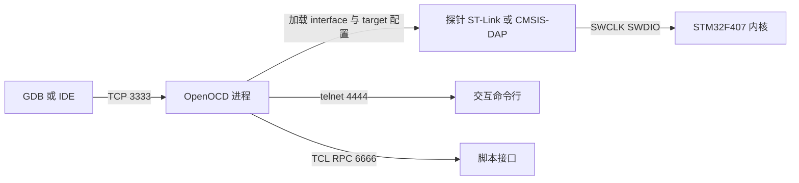
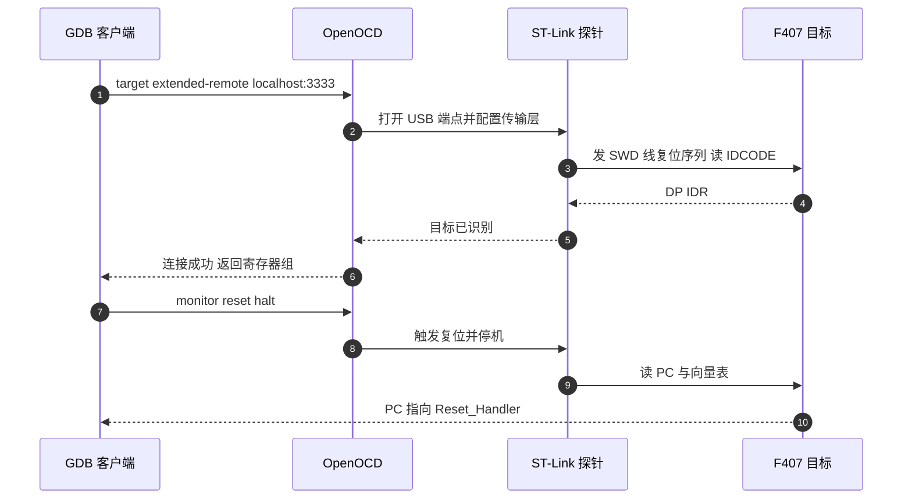
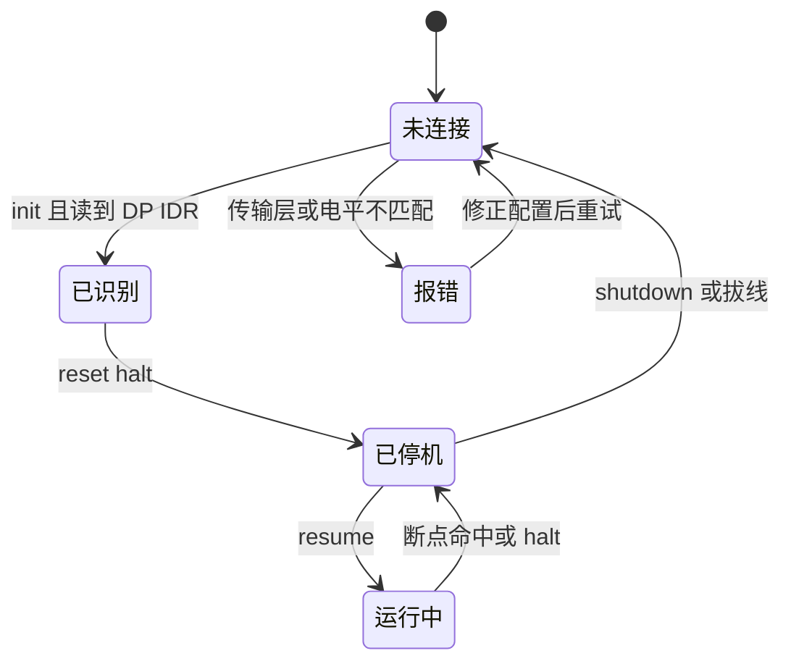

# OpenOCD与调试探针

> 对象是烧录与调试链路的 PC 侧：调试探针、传输协议与 OpenOCD 的进程模型。两板仓库里没有 `.openocd.cfg`、`openocd*` 脚本或 `.vscode/launch.json`（已核查），因此命令行与配置文件按 OpenOCD 通用做法给出，目标一侧的引脚与时钟以 `.ioc` 为准。

一次调试访问由三段组成：PC 上的客户端（GDB、IDE 或 OpenOCD 自带 telnet）生成请求；探针固件把 USB 报文翻译成 SWD 时序；目标内核执行读内存、停机、单步这些动作。三段之间是标准接口，替换其中一段不影响另外两段。

## 1. 三段链路与各段的可用性

| 环节 | 常见实现 | 本工程可用性 |
| --- | --- | --- |
| 客户端 | `arm-none-eabi-gdb`、IDE 调试器、telnet | 取决于本机安装，未在仓库内固定 |
| 调试服务器 | OpenOCD、pyOCD、探针厂商工具 | 仓库内无配置脚本 |
| 探针 | ST-Link/V2、ST-Link/V3、CMSIS-DAP（DAPLink） | 未在工程内声明型号 |
| 目标接口 | SWD 两线、JTAG 四线 | PA13/PA14 已配为 SWD |

三段的分界决定了排查顺序：客户端连不上时先看 OpenOCD 日志里有没有识别到目标，识别到了再怀疑 GDB 参数。把客户端的报错当成链路故障，会漏掉卡在探针与目标之间的那一层。

## 2. SWD 与 JTAG 的取舍

| 对比项 | SWD | JTAG |
| --- | --- | --- |
| 信号线 | SWCLK、SWDIO，另加 GND | TCK、TMS、TDI、TDO |
| 引脚占用 | PA13、PA14 | PA13 至 PA15、PB3、PB4 |
| 本工程状态 | 已配置（`2026sentriomeni.ioc`） | 未配置 |
| 典型用途 | 单芯片下载与调试 | 多器件菊花链、边界扫描 |

F407 上两种接口共用 PA13 到 PA15 与 PB3、PB4 这组引脚，同一时刻只能选一种。本工程只配了 SWD，因为目标是单芯片、不需要菊花链，而 JTAG 多占的三根线在板级布局里没有余量。

SWD 的两根线里 SWDIO 双向，SWCLK 由探针单向驱动。协议层没有握手包，靠固定的请求与应答周期工作，因此对时序完整性的要求高于对速率的要求。

## 3. OpenOCD 的进程模型与监听端口



OpenOCD 启动时按顺序解释若干配置文件，常用两类：`interface/*.cfg` 描述探针与传输层，`target/*.cfg` 描述芯片的 flash 算法与调试逻辑。当前目录下的 `openocd.cfg` 会被自动读取，命令行用 `-f` 显式追加。默认监听三个端口：3333 给 GDB，4444 给 telnet，6666 给 TCL。

三个端口的分工不同：3333 走 GDB 远程协议，承载断点、内存访问与运行控制；4444 是 OpenOCD 自己的命令行，用于执行 `reset`、`flash` 这类不经过 GDB 的动作；6666 供脚本语言远程调用。排查时若 GDB 连得上但目标没反应，可以先在 4444 上直接发一条 `reset halt`，把问题限定在 OpenOCD 与目标之间。

## 4. 配置文件的加载与覆盖顺序

传输层由 `transport select` 决定。ST-Link 有两条驱动路径：旧的 HLA 用 `hla_swd`，新的 DAP 直连用 `dapdirect_swd`。前者兼容老固件，后者访问延时更低但要求探针固件足够新。选择哪条属通用做法，本工程未实测。

配置的加载顺序决定了后一个文件能否覆盖前一个的变量。常见写法是让 `interface` 先加载，再用命令行 `-c` 覆盖 `adapter speed` 与 `transport select`，这样同一份文件可以服务多块探针。

覆盖只能发生在变量层面，不能撤销已执行的命令。若某个配置文件在加载时就执行了 `init`，后续的 `-c "transport select ..."` 已经在错误传输层之上，这时要么换文件，要么把 `init` 延后到自己拼接的命令行里。

## 5. 复位来源：srst 与 sysresetreq

复位来源有两种。硬件复位线 NRST 由探针拉低，走 `srst`；内核的 `AirCR.SYSRESETREQ` 由软件写寄存器触发，走 `sysresetreq`。只接 SWCLK、SWDIO、GND 时，`reset` 仍可经 SYSRESETREQ 复位内核，但外设寄存器不一定回到上电值；接了 NRST 才能做上电级别的复位，以及连接时保持复位。

OpenOCD 里用 `reset_config` 描述这两条线的组合。`connect_assert_srst` 让连接阶段先按住复位，适合目标程序一上电就跑飞、来不及连接的情况。这类配置属通用做法，未在本工程实测。



两种复位对调试的意义不同：`srst` 把整块板的相关复位域拉回上电状态，适合复现启动期问题；`sysresetreq` 只复位内核，适合保留外设寄存器现场。判断当前用的是哪一种，看 OpenOCD 的 `reset_config` 输出与接线里 NRST 是否连上。

## 6. SWD 的电气与接线

SWD 是同步串行总线，SWCLK 由探针驱动，SWDIO 双向。最低连接是 SWCLK、SWDIO、GND 三根：GND 必须共地，探针的参考电压取自目标板的 VTref。多数探针在 SWCLK、SWDIO 上内置上拉，目标板不需要额外电阻，但走线过长时上拉不足会出现偶发读失败。

ST-Link 与目标之间通常只做电平转换，不供电。目标板单独供电是常规做法，用探针的 3.3 V 输出驱动整板会让电流不足。连接前先量目标板 3.3 V 与 GND 是否短路，属通用检查。

VTref 的作用是给探针提供电平参考，不是给目标供电。VTref 缺失时探针可能识别不到目标，表现为 `init` 阶段报 DP IDR 读不到值，而目标板本身工作正常。

## 7. 探针版本与传输能力

| 探针 | 主机侧驱动 | 可用传输层 | 备注 |
| --- | --- | --- | --- |
| ST-Link/V2 | ST-Link USB 驱动 | `hla_swd` | 老板常用，固件停更 |
| ST-Link/V2-1 | ST-Link USB 驱动 | `hla_swd` | 板载于 Nucleo，可导出 |
| ST-Link/V3 | ST-Link USB 驱动 | `hla_swd`、`dapdirect_swd` | 支持 SWO 与更高 SWD 时钟 |
| CMSIS-DAP | 免驱 HID | `dapdirect_swd` | 与 ST 主机工具无关 |

探针固件版本决定 `dapdirect_swd` 是否可用。版本过低时 OpenOCD 会在 `init` 阶段报传输层不被支持，回退 `hla_swd` 即可连接，功能上没有差别，只是访问速度不同。



状态图里“报错到未连接”是唯一的回退边：OpenOCD 的 `init` 失败后不会自动重试，要修正配置并重新启动进程。把失败状态当成可恢复状态，会误以为换一根线就能连上。

探针侧的排查还可以用自检短路：把 SWCLK 与 SWDIO 之外全部断开，只留 GND 与 VTref，若 `init` 仍读不到 DP IDR，问题在探针或驱动。这一步不依赖目标板程序，属通用做法。

## 8. 两板的 SWD 引脚与时钟前提

两板都是 STM32F407IGH6（`2026sentriomeni.ioc`，`Mcu.UserName` 在 ），SWD 引脚已由 CubeMX 固定为 PA13/PA14，没有 JTAG 走线。系统时钟是 12 MHz 外部晶振经 PLL 倍频到 168 MHz（`2026sentriomeni.ioc,383-390`；`Core/Src/main.c`）。

一个最小的 ST-Link 命令行写法如下，未在本工程实测：

```bash
openocd -f interface/stlink.cfg -f target/stm32f4x.cfg \
  -c "transport select hla_swd" \
  -c "adapter speed 1000" \
  -c "init" -c "reset halt"
```

`adapter speed` 的单位是 kHz。探针与目标之间的 SWD 时钟与内核主频无关，但板级走线越长、干扰越大，越需要降低这个值换取稳定。先用 1 MHz 连接，失败再降到 500 kHz 复测，属通用做法。

两板工程同名：`.ioc` 都叫 `2026sentriomeni.ioc`，链接脚本都叫 `STM32F407XX_FLASH.ld`，构建产物都叫 `sentriomeni2026.elf`。同一台 PC 上同时接两块板时，靠文件名区分不了目标，要靠探针序列号（`-c "adapter serial <sn>"`）或只接一块板。这一条是两板工程同名带来的直接后果。

两板工程都没有提交调试配置，因此探针型号、序列号与传输层都由使用者自行确定。把这些信息写进一份本地脚本，可以避免每次连接都重新试参数。

## 9. 易错点

| 易错点 | 现象 | 判据或位置 |
| --- | --- | --- |
| 只接 SWCLK、SWDIO，未共地 | 连接随机失败 | 必须连 GND，VTref 提供参考电平 |
| 用探针给整板供电 | 上电即复位或跑不起来 | ST-Link 只做电平转换 |
| 传输层选错 | `init` 报传输层不支持 | 固件新用 `dapdirect_swd`，旧用 `hla_swd` |
| SWD 时钟过高 | 偶发读失败 | `adapter speed` 从 1000 降到 500 kHz |
| 认为 `reset` 等于断电复位 | 外设寄存器未回上电值 | 未接 NRST 时走的是 SYSRESETREQ |
| 同时接两块同名板 | 连错目标，行为对不上源码 | 用探针序列号选择 |
| 期望仓库里有现成配置 | 找不到 `openocd.cfg` | 两板仓库均无（已核查） |

探针与传输层的选择是链路侧唯一需要按硬件调整的部分，其余参数在同一台 PC 上可以固定下来。

## 10. 小结

### 核心概念

- 调试链路分客户端、调试服务器、探针、目标接口四段，接口标准化，可分段替换。
- 本工程只配 SWD（PA13/PA14），JTAG 未配置。
- OpenOCD 默认监听 3333 给 GDB、4444 给 telnet、6666 给 TCL RPC。
- 传输层有 `hla_swd` 与 `dapdirect_swd` 两条路径，后者要求探针固件较新。
- 复位来源分 `srst`（NRST 线）与 `sysresetreq`（AirCR 寄存器）。
- 两板工程文件同名，多目标场景要靠探针序列号区分。

### 设计权衡

| 决策 | 选择 | 收益 | 代价 |
| --- | --- | --- | --- |
| 调试接口 | SWD 两线 | 占用引脚少，够单芯片使用 | 不支持菊花链与边界扫描 |
| 传输层 | 按探针固件选择 | 新旧探针都能连 | 需要按固件版本试选 |
| 复位方式 | SWD 三线不接 NRST | 接线最简 | 无法做上电级复位 |
| 配置来源 | 命令行自建 | 不依赖 IDE | 每次输入参数，易写错 |

连接阶段的判据只有两条：`init` 日志里能否读到 DP IDR，以及 `reset halt` 后 PC 是否落在向量表入口。两条都满足时，链路侧已经排查完毕，问题在程序本身。

## 11. 练习

### 基础题

1. 写出 SWD 与 JTAG 各自占用的引脚，并说明本工程为什么只配 SWD。
2. 说明 OpenOCD 三个默认监听端口各自的用途与客户端类型。
3. 从 `.ioc` 找出 SWD 引脚与外设时钟的配置位置。

### 挑战题

4. 写出一份 `openocd.cfg`，要求同时支持 ST-Link/V2 与 CMSIS-DAP，并说明如何用命令行覆盖探针相关参数。
5. 设计一段排查流程，区分“探针未识别目标”与“目标被识别但复位异常”两种故障，给出每步的判据。
6. 两板同时接在一台 PC 上时，写出一套从探针序列号到 ELF 路径的对应方案，避免连错目标。

## 附：本页引用的固件路径

| 路径 | 用途 |
| --- | --- |
| `/home/wyx/rm/2026SentriOmeniGimbal/2026OmniSentryGimbal/2026sentriomeni.ioc` | SWD 引脚、MCU 型号与时钟配置 |
| `/home/wyx/rm/2026SentriOmeniGimbal/2026OmniSentryGimbal/Core/Src/main.c` | 时钟配置与 PLL 参数 |
| `/home/wyx/rm/2026SentriOmeniChassis/2026OmniSentryChassis/2026sentriomeni.ioc` | 底盘板同名配置源 |
| `/home/wyx/rm/2026SentriOmeniGimbal/2026OmniSentryGimbal/cmake/gcc-arm-none-eabi.cmake` | 交叉工具链与调试信息选项 |
| `/home/wyx/rm/2026SentriOmeniGimbal/2026OmniSentryGimbal/build/Debug/sentriomeni2026.elf` | 调试构建产物 |
