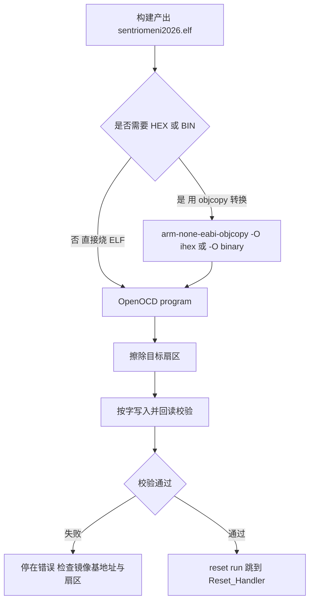
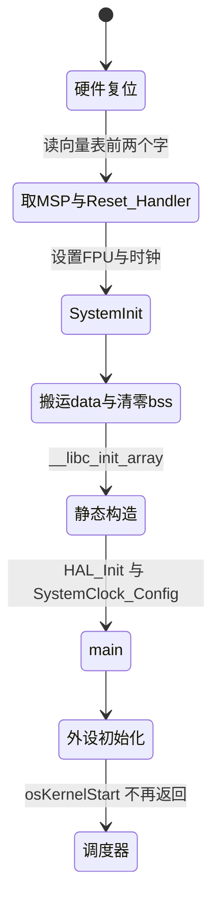

# 烧录流程与复位行为

> 对象是把镜像写进 flash 并让新程序跑起来：镜像格式、擦写校验的顺序、以及复位后 PC 的第一条指令到 `osKernelStart()` 之间的每一段。仓库内没有烧录脚本，OpenOCD 一侧按通用做法给出；复位路径全部有链接脚本与启动文件的行号依据。

烧录是一次「擦除、写入、校验、复位」的序列。擦除以扇区为单位，写入以字或半字为单位，校验逐字节回读。四步里最容易被忽略的是校验与复位方式：校验决定镜像是否完整，复位方式决定新程序是否真的从入口开始执行。

## 1. 镜像格式与烧录入口

| 镜像格式 | 是否含地址 | 是否含符号 | 常见用途 |
| --- | --- | --- | --- |
| ELF | 是，来自链接脚本 | 是，含 DWARF | OpenOCD 直接 `program`，也供 GDB 调试 |
| Intel HEX | 是，按记录给出 | 否 | 通用下载器、产线工具 |
| 纯二进制 | 否，需要给基地址 | 否 | OTA、外部烧录器 |

| 烧录入口 | 驱动方式 | 典型命令 | 本工程状态 |
| --- | --- | --- | --- |
| OpenOCD | 直接操作 flash 算法 | `program`、`flash write_image` | 无配置脚本，命令需自建 |
| ST-Link 官方 CLI | 调用 ST-Link 固件 | `STM32_Programmer_CLI -c port=SWD -w` | 未在仓库内出现 |
| IDE 调试器 | 封装 OpenOCD 或厂商后端 | 图形界面按钮 | 无 `.vscode/launch.json` |

三种格式的差别集中在地址与符号：ELF 两者都有，HEX 只有地址，BIN 两者都没有。用 BIN 时必须显式给出基地址，否则烧录工具无法判断写到哪一段。三种入口的差别在驱动路径：OpenOCD 直接执行 flash 算法，厂商 CLI 把动作交给探针固件，IDE 再把两者包一层。

本工程只提交源码与构建配置，没有任何烧录脚本，因此入口选择不影响仓库内容。团队内约定一种入口即可，混用不同工具时要注意它们的擦除粒度与校验策略可能不同。

## 2. 擦除与写入的粒度

STM32F4 的 flash 按扇区擦除，扇区大小不均：小扇区 16 KB，大扇区 128 KB。按手册，一次全片擦除会把所有扇区清零，改写一小段却要擦掉整个扇区，所以频繁改一个常量会磨损该扇区。写入只能在已擦除的区域进行，写过的位只能由擦除恢复。

1 MB 版本的扇区布局按手册如下，本工程链接脚本只声明了整片范围，没有细分：

| 扇区 | 编号 | 大小 | 起始地址 |
| --- | --- | --- | --- |
| 0 至 3 | 前四个 | 16 KB | `0x08000000` 起 |
| 4 | 第五个 | 64 KB | `0x08010000` |
| 5 至 11 | 后七个 | 128 KB | `0x08020000` 起 |

粒度差异带来一个布局约束：需要频繁写入的常量不要放在与代码相同的扇区里，否则每次改常量都要擦掉包含代码的那一块再整体回写。把这类数据单独放到一个扇区，是产线工具的常规做法。

本工程的链接脚本没有对扇区做细分，代码与只读数据统一放进 FLASH 段。这不会影响正常烧录，只在使用“擦一段写一段”的增量更新方式时才有区别，当前的整片烧录路径不受影响。

## 3. 擦写校验与复位方式



`program` 把四步合成一条命令，其中校验失败会直接返回错误。校验失败的原因集中在三类：镜像基地址与 flash 起始地址不一致、探针时钟过高导致写入时序不满足、扇区被写保护。三类都在 `program` 的日志里能看出区别，不要直接重烧第二遍。

## 4. 复位取指的两个字

Cortex-M4 复位时由硬件做两件事：从向量表偏移 0 处取初始 MSP 写入 SP，从偏移 4 处取 Reset_Handler 地址写入 PC。向量表基址由 BOOT0 选择，从主 flash 启动时 `0x00000000` 映射到 `0x08000000`。

| 地址 | 内容 | 来源 |
| --- | --- | --- |
| `0x00000000` | 初始 MSP 值 | `_estack` |
| `0x00000004` | Reset_Handler 地址 | 启动文件 |
| `0x00000008` | NMI_Handler 地址 | 启动文件 |
| `0x0000000C` | HardFault_Handler 地址 | 启动文件 |

内核的 `SCB->VTOR` 决定异常入口从哪张表取。上电默认是 0，若程序带 bootloader 或把向量表搬到 RAM，必须显式写 VTOR，否则中断会跳到旧表。`BOOT0` 是专用引脚，不出现在 `.ioc` 的 GPIO 配置里。

前两个字是取指顺序的全部依据：SP 与 PC 都从这张表来，因此向量表内容与链接脚本里的段布局必须一致。若把向量表搬到别的地址而忘记写 VTOR，复位本身仍能成功，中断却会从旧地址取入口。

## 5. 从 Reset_Handler 到调度器

入口之后的顺序是固定的：设置 SP、调用 `SystemInit`、把 `.data` 初值从 flash 搬到 RAM、把 `.bss` 清零、调用 C++ 静态构造、进入 `main`。`main` 里先初始化 HAL 与时钟，再逐个初始化外设，最后启动调度器。



调度器启动之后不会返回，因此这条链上没有第二次经过 `main` 的机会。任务创建失败或断言触发都发生在调度器启动前后，两者的现场不同：前者停在创建处，后者停在 `configASSERT` 展开的循环里。

## 6. 本工程的启动顺序与行号依据

链接脚本把向量表放在最前：`ENTRY(Reset_Handler)`（`STM32F407XX_FLASH.ld:53`），`MEMORY` 定义 `RAM` 128 KB、`CCMRAM` 64 KB、`FLASH` 1024 KB（`:56-61`），`_estack` 取 RAM 末端（`:64`），`.isr_vector` 第一个进 FLASH（`:73-78`）。

启动文件的执行顺序与上面一致：`Reset_Handler` 在 `startup_stm32f407xx.s:60`，第一句 `ldr sp, =_estack`（`:61`），接着 `bl SystemInit`（`:64`），搬 `.data`（`:67-81`）、清 `.bss`（`:84-95`），`bl __libc_init_array`（`:98`），最后 `bl main`（`:100`）。向量表里 `.word _estack` 与 `.word Reset_Handler` 分别在 `:128`、`:129`。

`SystemInit` 的实际内容很少：在 `Core/Src/system_stm32f4xx.c:167`，只开 FPU（`:171`）并按需配置外部存储器。向量表重定位被条件编译关掉（`:179` 的 `USER_VECT_TAB_ADDRESS` 未定义，`:180` 的 `SCB->VTOR` 赋值不生效），因此 VTOR 保持复位默认值。

`main` 的顺序是 `HAL_Init()`（`Core/Src/main.c:94`）、`SystemClock_Config()`（`:101`）、外设初始化（`:109-119`）、`BSP_DWT_Init()`（`:123`）、`MX_FREERTOS_Init()`（`:130`）、`osKernelStart()`（`:133`）。注意 `ImuTask.cpp:19` 的 `FusionAHRS ahrs(1000.0f)` 是带初值的全局对象，它的构造在 `__libc_init_array` 阶段执行，早于 `main`。

全局对象构造早于 `main` 这一点决定了启动期故障的表现：若构造里访问未初始化外设，PC 看起来已经走过 `Reset_Handler`，却始终到不了 `main` 首行。定位这类问题要把断点放在 `__libc_init_array` 前后各一处。

## 7. 只产出 ELF 与手动转换

本工程只输出 ELF，没有自动生成 HEX 或 BIN（`cmake/gcc-arm-none-eabi.cmake:15` 只登记了 `objcopy` 变量，链接规则里没有 `POST_BUILD`）。需要转换时手动执行，命令未在本工程实测：

```bash
arm-none-eabi-objcopy -O ihex   build/Debug/sentriomeni2026.elf sentriomeni2026.hex
arm-none-eabi-objcopy -O binary build/Debug/sentriomeni2026.elf sentriomeni2026.bin
arm-none-eabi-size build/Debug/sentriomeni2026.elf
```

用 OpenOCD 写整片 ELF 的写法如下，未在本工程实测：

```bash
openocd -f interface/stlink.cfg -f target/stm32f4x.cfg \
  -c "program build/Debug/sentriomeni2026.elf verify reset exit"
```

`program` 会自动执行擦除、写入、校验与复位。`reset run` 让目标直接跑，`reset halt` 停在 `Reset_Handler`，适合先确认入口。调试构建与发布构建的调试信息不同：`cmake/gcc-arm-none-eabi.cmake:31,33` 给 Debug 加 `-O0 -g3`，`:32,34` 给 Release 加 `-Os -g0`，烧 Release 镜像后没有符号可查。

## 8. 停机期间的时间会继续走

本工程没有配置 `DBGMCU` 的冻结位（全仓库搜索无 `DBGMCU` 写入）。按手册，内核停机时定时器与外设不冻结，HAL 的 1 ms 时基 TIM2（`Core/Src/stm32f4xx_hal_timebase_tim.c:41-101`）会在断点停留期间继续计数，恢复后 `HAL_GetTick()` 会跳变。这条属推断，现场用 `HAL_GetTick()` 观察即可确认。

SysTick 的行为相反：它随内核停止，FreeRTOS 的 tick 计数在停机期间不增加。两个时基在停机后出现偏差，偏差量等于停机时长。涉及超时判断的调试场景要先把这层偏差排除，再怀疑逻辑。

## 9. 两板同名产物的烧录风险

两板的构建产物同名，烧录前要确认读的是哪一份：云台板与底盘板的输出都叫 `build/Debug/sentriomeni2026.elf`，分别在各自仓库根目录下。先看镜像大小与 `.map` 里的差异文件，再用探针序列号选择目标，避免把云台固件写进底盘板。

判断手上这份 ELF 属于哪块板，最快的办法是比较符号：底盘板有 `ChassisTask` 与裁判系统相关符号，云台板有 `GimbalTask` 与 `FireTask`。用 `arm-none-eabi-nm` 列符号并检索任务名，比看文件路径更可靠。

## 10. 易错点

| 易错点 | 现象 | 对应位置或判据 |
| --- | --- | --- |
| 只烧 BIN 却给了错误基地址 | 程序不跑或跑到随机地址 | BIN 无地址信息，基地址必须是 `0x08000000` |
| 烧了 Release 镜像再下断点 | 断点打不上、变量显示为优化掉的寄存器 | `-Os -g0`，换 Debug 构建 |
| 改写常量后整个扇区被擦 | 同扇区其他数据丢失 | F4 按扇区擦除，布局时把常改数据单独放一扇区 |
| 带 bootloader 时忘记写 VTOR | 中断仍进旧向量表，跑飞 | `USER_VECT_TAB_ADDRESS` 当前是关的（`system_stm32f4xx.c:179`） |
| 用 `reset run` 后立刻连 GDB | 连接时程序已跑过入口 | 先 `reset halt`，再下断点 |
| 校验报错却直接重烧 | 重复失败，查不出原因 | 先比较 ELF 与 flash 回读，再查探针时钟 |
| 断电瞬间拔探针 | 写入中断，扇区处于未完成状态 | 擦写期间保持供电，必要时全片重烧 |
| 在 `__libc_init_array` 之前设断点 | 断点命中但外设与时钟都未初始化 | 断点放在 `main` 首行或 `SystemClock_Config` 之后 |

## 11. 小结

### 核心概念

| 概念 | 要点 |
| --- | --- |
| 烧录四步 | 擦除、写入、校验、复位，缺一不可 |
| 镜像格式 | ELF 自带地址与符号，HEX 自带地址无符号，BIN 两者都无 |
| 复位取指 | MSP 取自向量表 0，PC 取自偏移 4 |
| 入口路径 | `Reset_Handler` 设 SP，`SystemInit` 开 FPU，搬 data、清 bss、跑静态构造，再进 `main` |
| 本工程输出 | 只有 `sentriomeni2026.elf`，需要时手动 `objcopy` |
| 停机影响 | 未配置 `DBGMCU` 冻结位，TIM2 时基在停机期间继续走（推断） |

### 设计权衡

| 决策 | 收益 | 代价 |
| --- | --- | --- |
| 只产出 ELF | 省去转换步骤，调试信息一体 | 产线与 OTA 需要另做 HEX 或 BIN |
| 向量表固定在 flash 首地址 | 无需写 VTOR，启动最短 | 加 bootloader 时要改链接脚本并打开 VTOR 配置 |
| 用 TIM2 而非 SysTick 做 HAL 时基 | 与 FreeRTOS 的 SysTick 互不干扰 | 停机时 TIM2 继续走，`HAL_GetTick()` 会跳变 |

四步里的校验与复位最容易被省：校验省掉时坏镜像直接进 flash，复位方式选错时新程序不被执行。两者都不改变文件内容，只改变现场表现。

## 12. 练习

### 基础题

1. 写出三种镜像格式在“是否含地址”“是否含符号”上的区别，并说明 BIN 烧录必须补什么信息。
2. 复位后前两个字分别从哪里取，写入哪个寄存器。
3. 列出 `Reset_Handler` 到 `main` 之间的全部步骤及其源码位置。

### 挑战题

4. 给链接脚本加一个 `POST_BUILD` 步骤自动生成 HEX 与 BIN，写出要修改的文件与命令，并说明为什么当前工程没有自动生成。
5. 设计一个方案，让两板各自的构建产物带可区分的文件名，并说明这对烧录脚本的影响。
6. 若要在本工程引入 bootloader，列出需要改动的文件与配置项，并说明 VTOR 与向量表位置的对应关系。

## 附：本页引用的路径

| 路径 | 用途 |
| --- | --- |
| `/home/wyx/rm/2026SentriOmeniGimbal/2026OmniSentryGimbal/STM32F407XX_FLASH.ld` | 入口、存储器布局、向量表位置（:53、:56-61、:64、:73-78） |
| `/home/wyx/rm/2026SentriOmeniGimbal/2026OmniSentryGimbal/startup_stm32f407xx.s` | 复位流程与向量表（:60-100、:128-129） |
| `/home/wyx/rm/2026SentriOmeniGimbal/2026OmniSentryGimbal/Core/Src/system_stm32f4xx.c` | `SystemInit` 与 VTOR 条件编译（:167-180） |
| `/home/wyx/rm/2026SentriOmeniGimbal/2026OmniSentryGimbal/Core/Src/main.c` | 启动顺序与时钟配置（:94、:101、:109-133、:165-187） |
| `/home/wyx/rm/2026SentriOmeniGimbal/2026OmniSentryGimbal/Core/Src/stm32f4xx_hal_timebase_tim.c` | HAL 时基 TIM2（:41-101） |
| `/home/wyx/rm/2026SentriOmeniGimbal/2026OmniSentryGimbal/cmake/gcc-arm-none-eabi.cmake` | Debug 与 Release 优化选项（:31-34） |
| `/home/wyx/rm/2026SentriOmeniChassis/2026OmniSentryChassis/STM32F407XX_FLASH.ld` | 底盘板同名链接脚本 |
