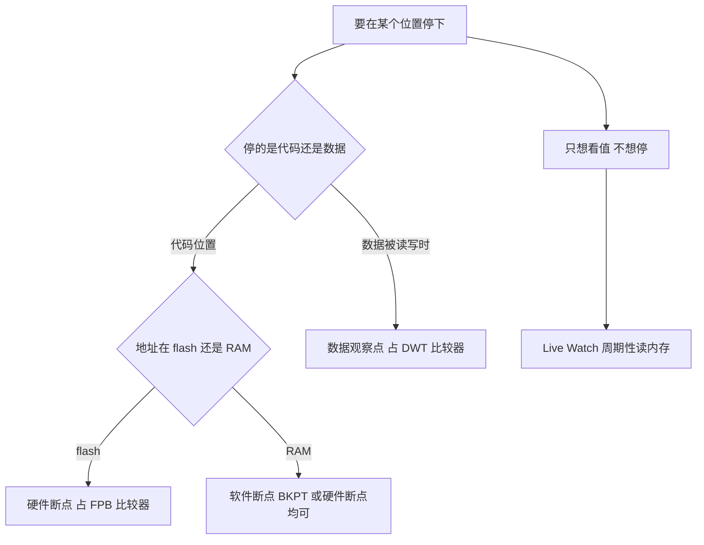
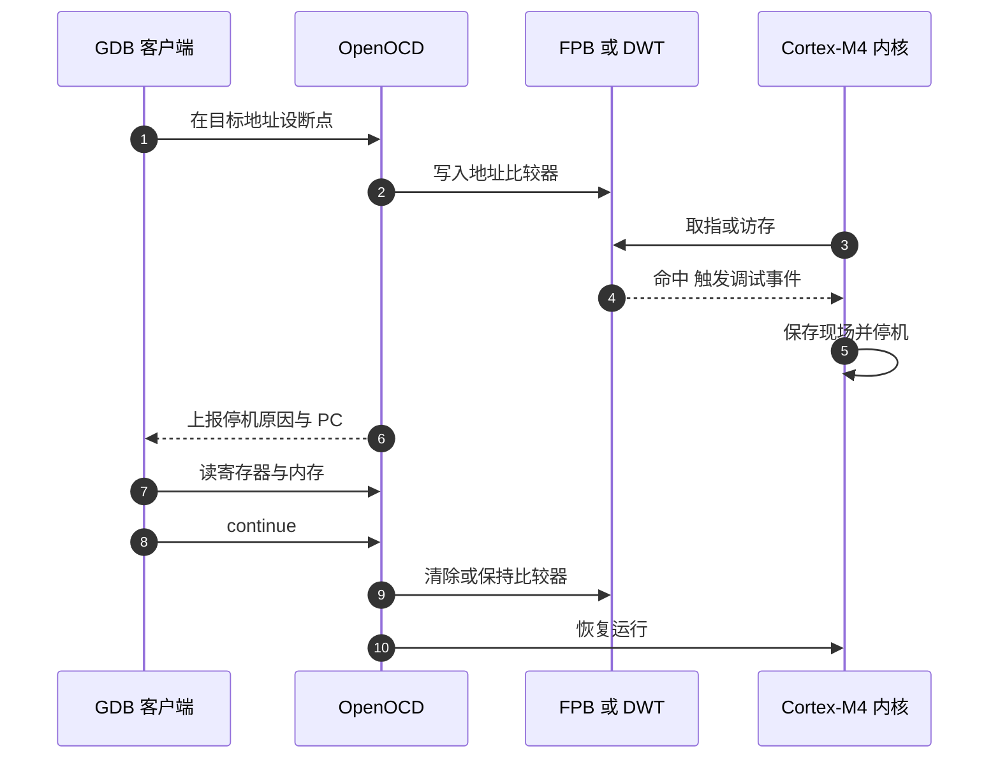

# 断点与变量观测

> 对象是程序运行期的停止与读取：断点靠什么硬件实现、能打几个、变量在什么条件下读得到。变量通道本身的现状已在 `docs/02-STM32 与 HAL/04-DWT计时与在线观测/03-在线变量观测.md` 逐条核对，只接结论，不重复推导。

断点与观察点是两类资源。断点按地址拦截取指，程序停在断点处；观察点按地址或数据值拦截访问，程序停在访存处。两者都会让内核停机，之后由调试器读寄存器与内存。

## 1. 四类观测手段与资源上限

| 类型 | 拦截对象 | 实现单元 | 数量上限 |
| --- | --- | --- | --- |
| 硬件断点 | 取指地址 | FPB 指令比较器 | 按内核型号，F407 为 6 个 |
| 软件断点 | 取指内容 | 替换成 BKPT 指令 | 受可用 RAM 或 flash 补丁限制 |
| 数据观察点 | 数据访问地址 | DWT 地址比较器 | 4 个 |
| Watch 窗口 | 读变量值 | 不占用上述资源 | 每次刷新都停机 |
| Live Watch | 周期性读变量值 | 不占用上述资源 | 后台轮询，需调试器支持 |

资源上限是可以算出来的：FPB 的 6 个指令比较器加 2 个字面量比较器，DWT 的 4 个地址比较器。断点与观察点分别从这两个池子里取，用满之后新请求要么失败，要么被调试器悄悄降级。

两类资源互不通用：断点用满时无法把观察点拿来顶替，反之也一样。规划一次调试时先把要停的位置与要监视的变量分别列出来，再对照两个上限分配。

## 2. 停下还是只看值



分叉的两个判据是“拦截什么”与“要不要停机”。断点与观察点都会停机，区别在触发条件是取指还是访存；Watch 与 Live Watch 不停机，区别在刷新方式。选择时先确定要不要停，再确定用哪种资源。

## 3. 硬件断点与软件断点

Cortex-M4 的 FPB 单元含 6 个指令比较器与 2 个字面量比较器。指令比较器把取指地址与设定的地址比较，命中就产生调试事件。这是调试器在 flash 里下断点的首选，因为不需要改写 flash。

软件断点把目标指令的第一个字节替换为 BKPT 操作码 `0xBE`。它适用于可写内存，在 flash 中改写需要先把整个扇区读出、擦除、再回写，代价高。OpenOCD 在 flash 上默认尽量用硬件断点，硬件资源用尽时才走 flash 断点路径。

| 场景 | 优先选择 | 原因 |
| --- | --- | --- |
| flash 中的函数 | 硬件断点 | 不改写 flash，命中无副作用 |
| RAM 中的函数 | 软件断点 | 写一个字节即可，省硬件比较器 |
| 断点数超过 6 | 分批下断点 | FPB 只有 6 个指令比较器 |
| 需要统计命中次数 | 硬件断点加计数 | 软件断点反复擦写代价高 |

在 flash 上使用软件断点的副作用不止是慢：擦写期间若断电，被改写的那一扇区处于未完成状态，需要整片重烧。硬件断点没有这个风险，所以工程里默认把断点留给 flash。

判断当前命中的是硬件还是软件断点，看 OpenOCD 日志里的断点设置行；若资源已满，日志会出现改写 flash 的提示，此时应删掉不用的断点再重设。

## 4. 数据观察点与写入点定位

DWT 含 4 个地址比较器，可配置为监视某个地址的读、写，或两者。命中时产生调试事件，内核停机。它适合抓「谁改了某个全局变量」这类问题：把变量地址写进比较器，命中后看调用栈，就能定位写入点。

观察点的地址必须与比较器的对齐要求匹配，监视一个字节或一个 32 位字都可以，跨字访问则要按手册确认是否被拆成多次比较。资源上限同样是 4 个，超了要复用。



“清除或保持比较器”这一步由调试器的断点管理决定。保持比较器意味着下一次仍会命中，清除则只命中一次。`watch` 通常保持，`continue` 之后同一地址再次被写会再次停机，连续放行时要注意这一点。

## 5. 调试信息与优化是两条失效路径

断点打在源码行上依赖 DWARF 行号表，变量名能解析依赖 DWARF 变量描述。两者都由 `-g` 生成。优化等级决定变量是否留在内存：`-O0` 下局部变量通常在栈上，`-Os` 下可能只存在于寄存器，Watch 窗口会显示「已被优化掉」。

链接期的 `--gc-sections` 是另一条独立的失效路径：`-fdata-sections` 把每个变量放进独立段，没有被任何代码引用的段会被回收。`volatile` 只影响编译器优化，不影响链接期回收，两者的作用范围不同。

两条路径的排查方法也不同：优化导致的失效换 Debug 构建即可解决，链接期回收导致的失效换构建类型没用，必须在代码里引用一次变量。把两者混为一谈，会反复在构建类型上打转。

验证方法很直接：在 Debug 构建下用 `arm-none-eabi-nm` 查该变量符号是否存在。符号存在说明是优化问题，符号不存在说明被链接期回收，两步就能分开。

## 6. 一次典型的 GDB 会话

下面这组命令给出断点与观察点的实际入口，未在本工程实测。`target extended-remote` 连的是 OpenOCD 而不是目标，`monitor` 前缀的命令被转发给 OpenOCD 执行。

```bash
arm-none-eabi-gdb build/Debug/sentriomeni2026.elf
(gdb) target extended-remote localhost:3333
(gdb) monitor reset halt
(gdb) break StartImuTask::run
(gdb) watch gimbal_yaw_total
(gdb) info threads
(gdb) continue
```

`watch` 会占用一个 DWT 比较器，`break` 占用一个 FPB 比较器。`info threads` 只有在调试器启用了 RTOS 感知时才会列出任务；没有启用时只会显示当前内核线程。用完的断点用 `delete` 删除，否则放行时会反复命中。

连接顺序上 `monitor reset halt` 一定要在设置断点之前。若先 `continue` 再补断点，程序可能已经跑过目标位置，断点永远不命中，表现为“断点无效”。

会话结束时用 `detach` 或 `monitor shutdown` 释放资源。直接拔线会让比较器配置留在调试器一侧，下一次连接可能读到上一次的断点列表。

## 7. Debug 构建与变量通道的现状

调试构建与发布构建的选项在 `cmake/gcc-arm-none-eabi.cmake` 里分叉：Debug 是 `-O0 -g3`（`:31,33`），Release 是 `-Os -g0`（`:32,34`）；`:29` 加 `-fdata-sections`，`:41` 加 `--gc-sections`。下断点与看变量都应在 Debug 构建下做，`build/Debug/sentriomeni2026.elf` 是唯一带完整 DWARF 的产物。

变量通道的现状照搬已有结论：`Debug_vars/debug_vars.cpp:11-19` 定义的 9 个变量全部被 `--gc-sections` 回收，`Debug_vars/debug_vars.h` 的声明处于注释状态，Watch 窗口拿不到有效地址；`BSP/Src/debug.cpp` 的串口帧 `SendDebugData` 在两块板都没有调用点。修法与判据见引用文档的 3.1 至 3.4 节。

在运行期下断点要注意任务上下文。云台板的采样循环在 `Task/Src/ImuTask.cpp:41` 的 `for (;;)` 里，循环体内有 `DWT_Delay_ms(1000)` 只在初始化阶段执行（`:37`），循环本身没有阻塞调用。断点落在循环体里会每 1 ms 命中一次，适合单次观察，不适合连续放行。

把断点设在初始化完成之后的第一个调用点上，可以避免在时钟或外设未就绪时命中。观察循环行为时用条件断点，例如按计数值或某个变量取值命中，比每毫秒都停一次更可控。

## 8. 任务上下文与断言

FreeRTOS 的 `configASSERT` 打开着：`Core/Inc/FreeRTOSConfig.h:122` 展开为 `if ((x) == 0) {taskDISABLE_INTERRUPTS(); for(;;);}`。断言失败时中断被关掉并死循环，调试器连上后会停在关闭中断的状态，这时看 PC 才能知道是哪个断言。

停机期间的时基行为与上一页一致：没有 `DBGMCU` 冻结配置，TIM2 继续计数而 SysTick 随内核停止。连续放行多个断点后，`HAL_GetTick()` 的跳变量与停机时长相关，FreeRTOS 的 tick 计数则基本不变，两者会出现偏差。这条属推断，未实测。

任务感知是另一层能力：OpenOCD 的 `rtos` 支持可枚举 FreeRTOS 任务并给每个任务一个线程视图。它需要目标符号可解析，是否还需要 `configUSE_TRACE_FACILITY` 取决于调试器实现，本工程该宏未定义（全仓库搜索无），这条标注为未实测。

没有任务视图时，仍可以通过读 `pxCurrentTCB` 与任务控制块里的字段判断当前运行的是哪个任务。这属于手工读取，不依赖调试器的 RTOS 支持。

## 9. 断点资源的分配建议

一次调试会话开始前，按下面的顺序分配资源：

1. 先列出必须停下的位置，优先用硬件断点，flash 中的函数不占用软件断点。
2. 再列出需要监视写入的全局量，每个占一个 DWT 比较器，控制在 4 个以内。
3. 只想看值时改用 Live Watch，不占比较器。
4. 断点用满时删掉已不需要的，或改成条件断点减少命中次数。

四步做完再连接目标。资源分配在连接前规划，比连接后发现断点失效再回头删要省时间。

## 10. 易错点

| 易错点 | 现象 | 对应位置或判据 |
| --- | --- | --- |
| 在 Release 构建下单步 | 行号跳跃、变量显示为已优化 | `-Os -g0`，换 Debug |
| 断点打在头文件的行号上 | 命中在多个实例中的任意一个 | 头文件被多份 TU 包含，断点按地址生效 |
| 全局变量在 Watch 里显示无效地址 | 段被 `--gc-sections` 回收 | 在初始化代码里引用一次，依据见引用文档 |
| 认为 `volatile` 能保住变量 | 编译通过，链接后符号消失 | `volatile` 不管链接期回收 |
| 硬件断点用满还想再加 | 新断点被静默改成软件断点或失败 | FPB 指令比较器只有 6 个 |
| 观察点超过 4 个 | 后设的无效或报错 | DWT 地址比较器只有 4 个 |
| 断言失败后只看串口 | 无输出，不知道谁触发 | `configASSERT` 关中断死循环，看 PC 与调用栈 |
| 连续放行断点后比对 tick | HAL tick 跳变，FreeRTOS tick 不跳 | TIM2 与 SysTick 的停机行为不同（推断） |

## 11. 小结

### 核心概念

| 概念 | 要点 |
| --- | --- |
| 断点资源 | FPB 6 个指令比较器加 2 个字面量比较器 |
| 观察点资源 | DWT 4 个地址比较器 |
| 软件断点 | BKPT 改写指令首字节，flash 中代价高 |
| 调试信息 | Debug 构建 `-O0 -g3`，Release 构建 `-Os -g0` |
| 变量失效 | 优化进寄存器与链接期回收是两条独立路径 |
| 本工程变量通道 | 9 个 `Debug_vars` 变量全被回收，串口帧无调用点 |

### 设计权衡

| 决策 | 收益 | 代价 |
| --- | --- | --- |
| flash 上优先硬件断点 | 不改写 flash，命中快 | 占用有限的 FPB 比较器 |
| 用数据观察点抓写入 | 能定位到具体调用栈 | 只有 4 个，且停机频繁 |
| Debug 构建带完整 DWARF | 断点与变量可用 | 镜像大、`-O0` 执行慢，实时性不同于发布版 |

## 12. 练习

### 基础题

1. 写出 F407 上硬件断点与数据观察点各自的资源数量与实现单元。
2. 说明为什么在 flash 上改写指令做软件断点代价高。
3. 说明 `volatile` 与 `--gc-sections` 各自影响哪一步，为什么前者不能防止变量被回收。

### 挑战题

4. 用数据观察点定位一个全局量的写入点：写出要监视的地址来源、GDB 命令与命中后读调用栈的步骤。
5. 设计一个不依赖 Watch 窗口的变量观测方案，要求变量不被 `--gc-sections` 回收，并说明它与 `Debug_vars` 现状的差别。
6. 在同一处代码上分别用硬件断点与数据观察点观察，说明两者命中时刻的差别与适用场景。

## 附：本页引用的路径

| 路径 | 用途 |
| --- | --- |
| `/home/wyx/rm/2026SentriOmeniGimbal/2026OmniSentryGimbal/cmake/gcc-arm-none-eabi.cmake` | 调试与发布选项、段回收（:29、:31-34、:41） |
| `/home/wyx/rm/2026SentriOmeniGimbal/2026OmniSentryGimbal/Core/Inc/FreeRTOSConfig.h` | `configASSERT` 与 tick 配置（:64、:122） |
| `/home/wyx/rm/2026SentriOmeniGimbal/2026OmniSentryGimbal/Debug_vars/debug_vars.cpp` | 9 个观测变量定义（:11-19） |
| `/home/wyx/rm/2026SentriOmeniGimbal/2026OmniSentryGimbal/BSP/Src/debug.cpp` | `SendDebugData` 帧实现（:54-115） |
| `/home/wyx/rm/2026SentriOmeniGimbal/2026OmniSentryGimbal/Task/Src/ImuTask.cpp` | 采样循环与初始化（:19、:34、:37、:41） |
| `/home/wyx/rm/2026SentriOmeniGimbal/2026OmniSentryGimbal/Core/Src/stm32f4xx_hal_timebase_tim.c` | HAL 时基 TIM2（:41-101） |
| `docs/02-STM32 与 HAL/04-DWT计时与在线观测/03-在线变量观测.md` | 变量通道现状与最小改法 |
