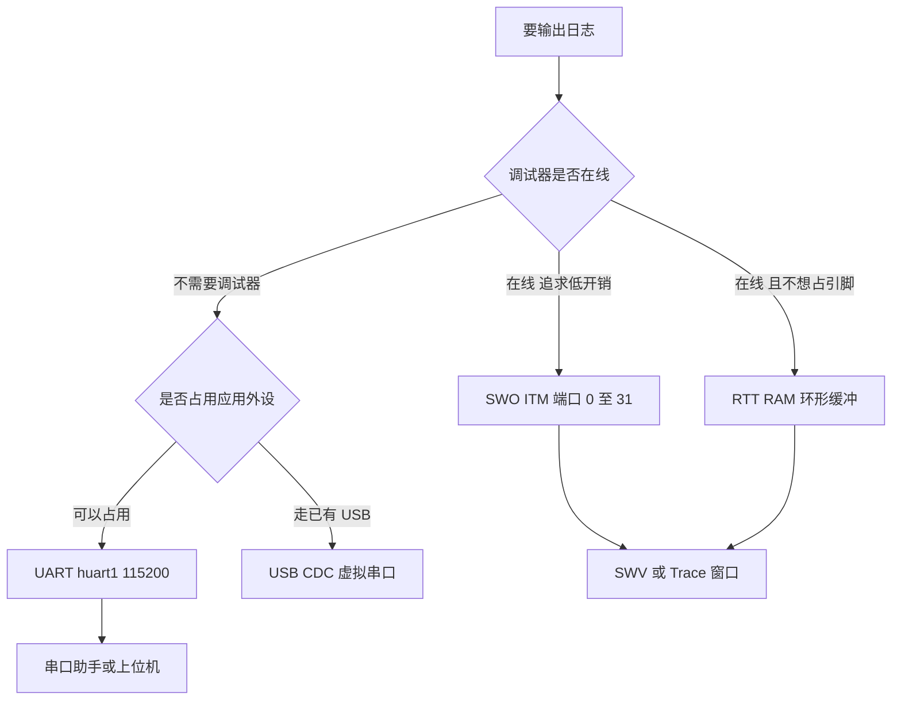
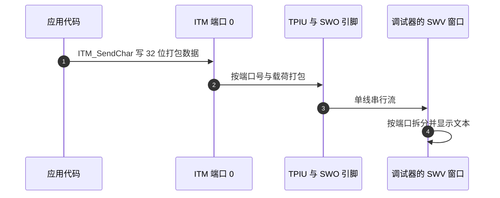

# SWO与日志

> 对象是不停机也能看到程序动静的输出通道：SWO/ITM 单线跟踪、UART 日志、RTT 与半主机。本工程没有启用 SWO，也没有可用的 `printf`；串口一侧有 `huart1` 与 `SendDebugData` 帧，帧格式已在 `docs/02-STM32 与 HAL/04-DWT计时与在线观测/03-在线变量观测.md` 核对。

日志通道分成两类：借调试硬件输出的（SWO、RTT、半主机）和借普通外设输出的（UART、USB CDC）。前者不占用应用引脚，但依赖调试器在线；后者独立于调试器，代价是占用引脚与中断或 DMA 资源。

## 1. 五条通道与各自代价

| 通道 | 物理路径 | 需要调试器 | 占用应用资源 | 本工程状态 |
| --- | --- | --- | --- | --- |
| SWO/ITM | SWD 的 SWO 单线 | 是 | PB3 | 未配置，引脚被 SPI1 占用 |
| UART | USART1 的 TX/RX | 否 | PA9、PB7 | `huart1` 已初始化 |
| RTT | 调试器读写 RAM 环 | 是 | 一段 RAM | 未使用 |
| 半主机 | 调试器代理系统调用 | 是 | 无 | 未使用 |
| USB CDC | USB 端点 | 否 | USB 外设 | 已有 USB Device 栈 |

五条通道里只有 UART 与 USB CDC 能在没有调试器的现场使用。

两类通道可以同时保留：调试阶段用 SWO 或 RTT 观察高频事件，现场用 UART 记录关键状态。两者的代码入口相同，只是底层重定向不同，切换时只改 `__io_putchar` 的实现。两者的差别在资源：UART 占两个引脚且发送是阻塞的，USB CDC 复用已有的 USB 栈但依赖主机侧驱动与协议实现。

## 2. 选择通道的判据



分叉的两个判据是“调试器是否在线”与“是否愿意占用应用外设”。四个终点对应四种代价：SWO 占一根调试线，RTT 占一段 RAM，UART 占两个引脚，USB CDC 占主机侧驱动。按场景选，而不是按实现难度选。

## 3. ITM 与 SWO 的分工

Cortex-M4 内部有一组 ITM 端口，应用把 8 位数据写入某个端口，TPIU 再把端口数据打包成 SWO 串行流送出。ITM 端口号从 0 到 31，端口 0 通常作为文本通道。SWO 只需要一根线，方向单向，从目标到调试器。

SWO 用异步模式时，目标按固定波特率发送，调试器按相同时钟采样。这个波特率由跟踪时钟分频得到，跟踪时钟通常取自 HCLK。主频改变而调试器端设置不变时，收到的字符会变成乱码。

ITM 与 SWO 是两个层次：ITM 决定数据怎么分端口，SWO 决定数据怎么送到 PC。

端口号的选择没有协议约束，只要求收发两侧一致。工程里常见的做法是端口 0 放文本、端口 1 放时间戳，接收工具按端口分开显示，避免两类数据混在一行里。端口 0 的文本通道之外，其余端口可以用来传时间戳或自定义事件，接收侧按端口号分开解析。

## 4. 使能顺序

按手册，异步 SWO 的使能分三步：先在 `DBGMCU_CR` 里置 `TRACE_IOEN` 并把 `TRACE_MODE` 设为异步；再把 SWO 引脚（F407 上是 PB3）配成 AF0 复用；最后解锁 ITM 并打开目标端口。CMSIS 的 `CoreDebug->DEMCR` 里的 `TRCENA` 也要置位，否则 ITM 寄存器不响应。

下面是最小使能片段，属通用写法，本工程未启用：

```c
/* 通用写法，未在本工程启用 */
GPIO_InitTypeDef g = {0};
g.Pin = GPIO_PIN_3;
g.Mode = GPIO_MODE_AF_PP;
g.Alternate = GPIO_AF0_TRACE;
HAL_GPIO_Init(GPIOB, &g);

DBGMCU->CR |= DBGMCU_CR_TRACE_IOEN;
DBGMCU->CR &= ~DBGMCU_CR_TRACE_MODE;   /* 异步模式 */
CoreDebug->DEMCR |= CoreDebug_DEMCR_TRCENA_Msk;
ITM->LAR = 0xC5ACCE55;                 /* 解锁 */
ITM->TER |= (1UL << 0);                /* 打开端口 0 */
int __io_putchar(int ch) { ITM_SendChar(ch); return ch; }
```

`ITM_SendChar` 在端口满时返回忙，忙等会拖慢调用点。放在 1 kHz 控制循环里要限制输出频率，或只在事件发生时打印。



时序里没有任何握手：数据写入端口后由硬件异步送出，目标不等调试器确认。因此调试器没连上时数据直接丢弃，不会阻塞应用，这既是优点也是缺点——丢数据时应用侧没有感知。

## 5. printf 与半主机的两条重定向路径

在没有操作系统的固件里，`printf` 走两条重定向路径。newlib 的做法是实现 `_write`，最底层再调 `__io_putchar`；半主机则让 `_write` 触发 `BKPT`，由调试器代为输出。半主机慢且需要调试器在线，通常在发布镜像里禁用。

不实现任何底层时，`printf` 要么链接失败，要么调用到空符号。判断方法很直接：看 `_write` 调用的 `__io_putchar` 有没有定义，看有没有代码真的调用 `printf`。

输入方向同样缺底层。`Core/Src/syscalls.c` 的 `_read`调用弱符号 `__io_getchar`，仓库内也没有它的定义，`scanf` 与 `getchar` 同样不可用。

两条路径的选择决定了发布镜像的行为：走 `__io_putchar` 时没有调试器也能输出，走半主机时没有调试器会卡在 `BKPT`。发布前要确认重定向落在哪一条上。

检查方式是在没有调试器的环境下启动一次：卡住不动说明走了半主机，能正常跑说明走的是 `__io_putchar` 或根本没有输出调用。

## 6. SWO 引脚与 SPI1 的占用冲突

SWO 在这两块板上用不了，原因是引脚冲突。SWO 固定用 PB3 的 AF0，而当前 PB3 被 SPI1 用作 SCK，PB4 用作 MISO，PA7 用作 MOSI（`Core/Src/spi.c`，`.ioc` 在 `2026sentriomeni.ioc`）。`.ioc` 里没有任何 `TRACE` 或 `DBGMCU` 配置项，仓库里也没有写 `DBGMCU` 的代码。

PA5 与 PA6 在当前 `.ioc` 里没有分配（全文件搜索无 `PA5`、`PA6`）。按手册，SPI1 的 SCK 可复用映射到 PA5、MISO 可映射到 PA6，把这两根从 PB3、PB4 挪走后 PB3 即可作 SWO。这属于改动建议，未实测，改完要重新验证 BMI088 的 SPI 通信。

改引脚要在 `.ioc` 里改，不要直接改生成物：SPI 的初始化代码由 CubeMX 生成，手工改 `spi.c` 会在下一次重生成时丢失。迁移之后再按上一节的顺序打开 SWO。

## 7. 串口通道与日志帧

串口通道是现成的：`huart1` 是 USART1，115200、8 位、1 停止位、无校验（`Core/Src/usart.c`），引脚 PB7 作 RX、PA9 作 TX，复用 AF7。云台板在 `Task/Src/ImuTask.cpp` 调 `DebugUART_Init(&huart1)`，底盘板在 `Task/Src/ImuTask.cpp` 调用同一句。

日志帧由 `BSP/Src/debug.cpp` 的 `SendDebugData` 打包：固定头 `0xAA 0xBB`，按格式字符顺序追加定长字段，最后一次 `HAL_UART_Transmit` 发出。超时 100 ms、缓冲区 128 字节在 `BSP/Inc/debug.h`。帧没有长度与校验，接收端必须与发送端共享同一个格式字符串，细节见引用文档。

帧结构的代价很明确：没有长度字段时，接收端只能靠格式字符串判断每个字段的位置；丢一个字节后所有后续字段都会错位，而校验的缺失让接收端无法发现这种错位。

## 8. printf 在本工程不可用的两层原因

`printf` 在本工程里不可用，原因有两层。`Core/Src/syscalls.c` 的 `_write`调用弱符号 `__io_putchar`（声明在 ，调用在 ），而全仓库没有任何 `__io_putchar` 定义，调用点会落到空地址。另一方面也没有调用者：USB Device 的日志宏由 `USBD_DEBUG_LEVEL` 控制，当前是 0（`USB_DEVICE/Target/usbd_conf.h`），三个打印宏全部展开为空。

要用 `printf` 就得补一个 `__io_putchar`，把字符送到 `huart1` 或 ITM。送到串口时注意 `HAL_UART_Transmit` 是阻塞调用，不能放在高频任务里。RTT 是另一条路：它不占引脚、不依赖 SWO，靠调试器周期读 RAM 环形缓冲，本工程未使用，属通用备选。

两层原因里先解决哪一层都可以，但两层都要解决才有输出：补上 `__io_putchar` 只是让符号有定义，还需要有代码实际调用 `printf` 或其上层日志宏。

补 `__io_putchar` 时要注意它的调用上下文：中断里调用串口发送会阻塞，进而延长中断时间，建议只把它用于任务上下文或 SWO 通道。

## 9. 确认串口是否真的在发

确认串口通道是否真在发，可以用逻辑分析仪或示波器抓 PA9；没有仪器时，把 USB 转 TTL 的 RX 接到 PA9、GND 共地，用 115200 的串口助手看是否出现帧头 `0xAA 0xBB`。

先看帧头再解字段。帧头出现说明发送路径通了，之后按格式字符串逐字段解析；帧头不出现时按三层查：`DebugUART_Init` 有没有被调用、`SendDebugData` 有没有被调用、串口参数是否一致。三层里前两层是代码问题，第三层是配置问题。

串口助手侧的参数只要与 `usart.c` 中的波特率、数据位与校验设置一致即可。本工程是 115200 加 8N1，两端不一致时看到的是乱码而不是没有数据，这一现象可以把配置问题与代码问题分开。

## 10. 易错点

| 易错点 | 现象 | 对应位置或判据 |
| --- | --- | --- |
| 直接调 `printf` | 链接通过但运行跑飞，或没有任何输出 | `__io_putchar` 无定义（`syscalls.c,88`） |
| 打开 `USBD_DEBUG_LEVEL` 就以为有日志 | 编译进 `printf`，却仍无输出 | 该宏打开后反而暴露 `__io_putchar` 缺失（`usbd_conf.h`） |
| 在 PB3 上直接使能 SWO | BMI088 的 SPI 时钟失效，姿态数据异常 | PB3 是 SPI1_SCK（`spi.c`） |
| 改主频后 SWO 变乱码 | 文本全是随机字符 | SWO 波特率由跟踪时钟分频，需同步改调试器设置 |
| 忘记置 `TRCENA` | ITM 寄存器写不进，无输出 | `CoreDebug->DEMCR` 的使能位 |
| 在高频循环里打印 | 控制周期被拖长，电机响应变差 | 阻塞发送，参考 `debug.h` 的 100 ms 超时 |
| 用无长度无校验的帧做长记录 | 丢一个字节后字段全部错位 | `SendDebugData` 帧结构 |
| 半主机留在发布镜像里 | 无调试器时卡在 BKPT | 半主机需要调试器在线 |

## 11. 小结

### 核心概念

| 概念 | 要点 |
| --- | --- |
| SWO/ITM | 单线异步跟踪，端口 0 至 31，依赖调试器在线 |
| 使能顺序 | `TRACE_IOEN`、引脚 AF0、`TRCENA`、ITM 解锁与开端口 |
| 本工程 SWO | 不可用，PB3 被 SPI1_SCK 占用；PA5 未分配，可作迁移目标 |
| 串口日志 | `huart1` 115200，`DebugUART_Init` 在两板 ImuTask 中各调用一次 |
| `printf` 现状 | `__io_putchar` 无定义且无调用者，日志宏被 `USBD_DEBUG_LEVEL=0` 关闭 |
| 备选通道 | RTT 与 USB CDC，前者不占引脚，后者已有协议栈 |

### 设计权衡

| 决策 | 收益 | 代价 |
| --- | --- | --- |
| 用 SWO 而非 UART | 不占应用引脚，目标无需等待 | 依赖调试器与正确的时钟设置 |
| 用 UART 日志 | 独立于调试器，可事后抓取 | 占用两个引脚，阻塞发送会拖周期 |
| 用 RTT | 不占引脚，读写可交互 | 需要调试器与额外 RAM 缓冲 |
| 保留空符号的 `printf` 路径 | 上层代码不用改 | 一旦实际调用就是空地址 |

## 12. 练习

### 基础题

1. 写出五条日志通道各自是否需要调试器、占用什么资源，并说明本工程的可用性。
2. 列出异步 SWO 使能的四个寄存器或配置位及其顺序。
3. 说明 `printf` 在本工程无输出的两层原因，分别给出源码位置。

### 挑战题

4. 把 PB3、PB4 上的 SPI1 功能迁移到 PA5、PA6，写出要改的 `.ioc` 配置、要重新生成的目录与迁移后需要复测的功能。
5. 实现一个把日志写到 RAM 环形缓冲的方案，要求不占引脚、不依赖 SWO，并说明读取方式与缓冲区大小的取舍。
6. 给定一段串口抓包数据，设计一个解析流程，处理帧头出现但字段错位的情况，并说明为什么当前帧结构无法自校验。

## 附：本页引用的路径

| 路径 | 用途 |
| --- | --- |
| `/home/wyx/rm/2026SentriOmeniGimbal/2026OmniSentryGimbal/Core/Src/spi.c` | SPI1 引脚与复用 |
| `/home/wyx/rm/2026SentriOmeniGimbal/2026OmniSentryGimbal/2026sentriomeni.ioc` | SPI1 与 PA13/PA14 引脚配置 |
| `/home/wyx/rm/2026SentriOmeniGimbal/2026OmniSentryGimbal/Core/Src/usart.c` | `huart1` 参数与 USART1 引脚 |
| `/home/wyx/rm/2026SentriOmeniGimbal/2026OmniSentryGimbal/Core/Src/syscalls.c` | `_write` 与 `__io_putchar` 声明 |
| `/home/wyx/rm/2026SentriOmeniGimbal/2026OmniSentryGimbal/USB_DEVICE/Target/usbd_conf.h` | `USBD_DEBUG_LEVEL` 与日志宏 |
| `/home/wyx/rm/2026SentriOmeniGimbal/2026OmniSentryGimbal/BSP/Inc/debug.h` | 超时与缓冲区常量 |
| `/home/wyx/rm/2026SentriOmeniGimbal/2026OmniSentryGimbal/BSP/Src/debug.cpp` | 帧打包与发送 |
| `/home/wyx/rm/2026SentriOmeniChassis/2026OmniSentryChassis/Task/Src/ImuTask.cpp` | 底盘板 `DebugUART_Init` 调用点 |
