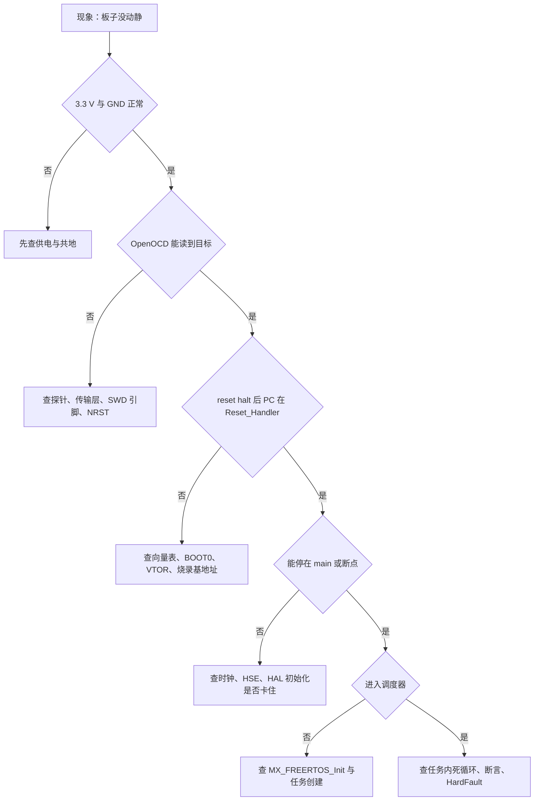
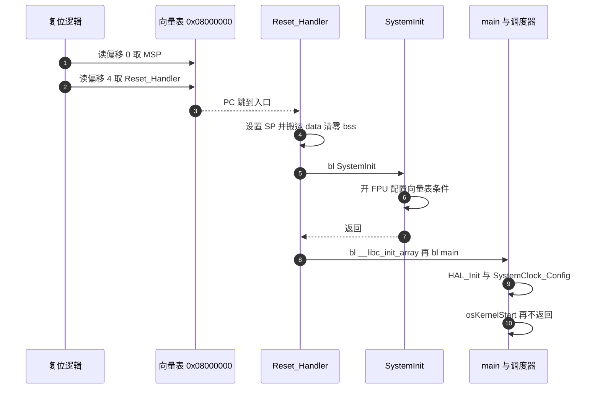

# 易错点与调试

> 「10-嵌入式构建与调试/03-烧录与调试」前三篇的失败模式按分层顺序汇总成排查流程，并把复位后的实际行为接到本工程的异常处理代码上。命令与配置仍属通用做法，代码与符号依据全部来自两板源码。

调试失败时最容易犯的错是跳到结论：看到没有输出就怀疑代码，看到连不上就怀疑探针。把链路分成五层逐层确认，能快速缩小范围。每一层都有独立的判据，前一层不通过时后一层的结果没有意义。

## 1. 五层排查与每层的判据

| 层 | 要确认的事 | 判据或工具 |
| --- | --- | --- |
| 供电 | 目标板 3.3 V 正常、GND 共地 | 万用表量电压与通断 |
| 链路 | 探针识别目标、读到 DP IDR | OpenOCD `init` 日志 |
| 镜像 | ELF 是本次构建、地址正确、校验通过 | 文件时间戳、`program verify` |
| 启动 | 复位后 PC 落在 `Reset_Handler` | `reset halt` 后读 PC |
| 运行期 | 进入 `main`、进调度器、无死循环 | 断点与 Live Watch |

每层的判据都必须是二值的，才能决定下一步往哪走。电压只有正常与不正常，`init` 日志只有读到 DP IDR 与读不到，PC 只有落在入口与不落在入口。用“看起来还行”这种判断会卡在同一层反复尝试。

五层的顺序是固定的：后一层的现象可能由前一层引起，反过来不成立。把链路层的问题当成运行期问题查，会长时间停在断点无效这类现象上。

## 2. 逐层排查的流程

流程的形状是单链带分叉，每一层只回答一个问题。走到最后一层仍无结论时，说明问题不在链路与启动，而在任务逻辑里，此时应该回到断点与变量观测的结论上，而不是重新从供电查起。

## 3. 复位后行为的完整链条

复位把 PC 和 SP 重新装载，之后是一条固定链条：硬件从向量表取初始 MSP 与 `Reset_Handler`，`Reset_Handler` 调用 `SystemInit`，再把 `.data` 从 flash 搬到 RAM、把 `.bss` 清零、运行 C++ 静态构造，最后进入 `main`。`main` 依次初始化 HAL、时钟、外设，启动调度器后不再返回。

链条上每一段都能成为分界点：断点放在 `Reset_Handler` 第一句，能区分硬件复位是否正常；放在 `main` 首行，能区分静态构造是否跑完。两个断点配合使用，可以把启动期故障缩到一小段代码里。

## 4. 四处死循环与现场特征

本工程有三处会让程序停住的死循环，表现相似但成因不同。分清它们才能选对下一步。

| 路径 | 触发条件 | 现场特征 | 依据 |
| --- | --- | --- | --- |
| DEFAULT 处理 | 未实现的中断向量 | PC 落在同一地址反复，外设可能仍在跑 | `startup_stm32f407xx.s:112-114` |
| 硬件错误 | HardFault 等内核异常 | PC 在 `HardFault_Handler` 内 | `Core/Src/stm32f4xx_it.c:97,102` |
| 断言失败 | FreeRTOS 的 `configASSERT` | 中断被关，PC 在断言展开处 | `Core/Inc/FreeRTOSConfig.h:122` |
| HAL 错误 | 外设初始化返回非 `HAL_OK` | PC 在 `Error_Handler`，中断已关 | `Core/Src/main.c:223-231` |

`startup_stm32f407xx.s` 把没有实现的异常全部弱别名到 `Default_Handler`（`:241-508`），处理器停在 `Infinite_Loop`。硬件错误处理函数由 CubeMX 生成，循环体为空。`Error_Handler` 先调 `__disable_irq()` 再进入空循环。

四处循环的区别在于是否关中断：DEFAULT 与硬件错误循环通常不关中断，外设与中断仍在工作；断言与 HAL 错误会关中断，串口输出可能随之停止。看到中断已经关闭，就可以把范围收窄到后两处。

区分还要看进入循环之前的现场：`Error_Handler` 由外设初始化返回错误触发，调用栈里能看到具体的外设初始化函数；`configASSERT` 由内核或任务检查触发，调用栈里是 FreeRTOS 内部函数。

## 5. 停机对时间的扭曲

调试会改变被观察对象，最直接的是时间。内核停机时 SysTick 不再计数，FreeRTOS 的 tick 暂停；TIM2 作为 HAL 时基不带冻结配置，仍按 168 MHz 时钟来源计数。两者的差值等于停机时长，恢复运行后一次 `HAL_GetTick()` 可能跳变几百毫秒。

这类偏差属推断，依据是本工程没有任何写 `DBGMCU` 冻结位的代码。要确认，可在停机前后各打印一次 `HAL_GetTick()` 与 `xTaskGetTickCount()`，比较两者增量。

排除这层偏差的办法是控制停机次数：把断点设在关键分支而不是循环体里，或用数据观察点只在特定写入时命中。观察时间相关逻辑时，先连续放行一次记录基线，再下断点比较。

停机偏差对通信类问题的影响尤其明显：CAN 或串口在停机期间收不到中断，恢复后可能出现一次性积压的帧。判断通信是否正常，要在连续运行状态下观察，不能只看断点命中的那几次。

## 6. 复位路径与时钟前提的行号依据

本工程复位后的实际路径与前文一致：`ENTRY(Reset_Handler)` 在 `STM32F407XX_FLASH.ld:53`，向量表 `.isr_vector` 第一个进 FLASH（`:73-78`），`_estack` 取 RAM 末端（`:64`）；`startup_stm32f407xx.s:60-100` 完成设 SP、`SystemInit`、搬 data、清 bss、跑静态构造、进 `main`。

向量表没有重定位：`Core/Src/system_stm32f4xx.c` 的 `USER_VECT_TAB_ADDRESS` 处于注释状态（`:94`），对应的 `SCB->VTOR` 赋值也随条件编译失效（`:179-180`）。从主 flash 启动时默认映射即可工作；引入 bootloader 后这里必须打开并改链接脚本。

`SystemCoreClock` 初值是 `16000000`（`system_stm32f4xx.c:137`），要等 `main` 里 `SystemClock_Config()`（`Core/Src/main.c:101,152`）把 PLL 打开后才变成 168 MHz。在 `SystemClock_Config` 之前用 `HAL_RCC_GetHCLKFreq()` 得到的还是 HSI 频率，基于 DWT 的延时也会随之不准。

时钟链路的参数是 12 MHz 外部晶振、PLLM 6、PLLN 168、PLLP 2（`main.c:165-172`，`.ioc:374-390`）。HSE 不起振时 `HAL_RCC_OscConfig` 返回错误，`main.c:173-175` 直接进 `Error_Handler`，不会带着错误时钟继续跑。若某次改动让程序留在 HSI 上运行，频率从 168 MHz 降到 16 MHz，串口与 CAN 的波特率会整体偏移，属推断。

## 7. 全局对象构造早于 main

启动顺序里有一处容易忽略：`Task/Src/ImuTask.cpp:19` 的 `FusionAHRS ahrs(1000.0f)` 是全局对象，构造函数在 `__libc_init_array` 阶段执行，早于 `main`。如果构造里访问了未初始化的外设，会在进入 `main` 之前跑飞，PC 看起来已经过了 `Reset_Handler`，却到不了 `main` 首行。

这类故障的定位方式是把断点放在 `__libc_init_array` 调用处与 `main` 首行各一处。前者命中而后者不命中，且没有进异常处理，问题就在静态构造阶段。改动方式是让构造不访问外设，把初始化移到任务里。

本工程的全局对象不止一个，排查时要逐个确认构造体内容。构造体内只做赋值与常量计算的可以保留，涉及 GPIO、串口或传感器的必须挪走。

## 8. 运行期死循环与两板同名文件的混淆

运行期的三处死循环都在源码里：`startup_stm32f407xx.s:112-114` 的 `Default_Handler`，`Core/Src/stm32f4xx_it.c:97,102` 的硬件错误循环，`Core/Inc/FreeRTOSConfig.h:122` 的断言循环，再加上 `Core/Src/main.c:223-231` 的 HAL 错误循环。连上调试器后先读 PC，再对照这张表定位。

两板共享同名文件是调试期的主要混淆来源：`.ioc`、链接脚本、ELF 都同名，`CMakePresets.json` 里还有一个指向不存在配置预设的 `buildPresets.Debug-1`。烧录或下断点前先确认连的是哪块板、载入的是哪份 ELF，用探针序列号选择目标。

仓库内没有任何 OpenOCD 配置或 IDE 调试配置，因此所有命令都要自建。把常用的 `openocd` 启动行、GDB 连接行与探针序列号写成本地脚本，是减少重复出错的做法。

本地脚本不提交到仓库，因此不受两板同名文件的影响。脚本里写清楚目标板名与 ELF 路径的对应关系，可以在多人协作时避免把镜像写到另一块板上。

## 9. 易错点与排查动作

表里的每一行都能对应到第 1 节的一层。排查时按层取行，不要按现象随机取：

- 供电与链路层的行优先查，判据便宜且不需要接调试器。
- 镜像与启动层的行需要用探针，但判据仍然是二值的。
- 运行期的行需要断点与变量观测，代价最高，放在最后。

| 易错点 | 现象 | 排查动作 |
| --- | --- | --- |
| 目标未供电或未共地 | 探针报无法连接 | 先量 3.3 V 与 GND，再接探针 |
| 连到另一块同名板 | 断点打不上，行为对不上源码 | 用探针序列号选择目标，核对 ELF 时间戳 |
| 载入 Release 镜像 | 行号错位，变量显示已优化 | 换 `build/Debug/sentriomeni2026.elf` |
| `reset run` 后连 GDB | 断点命中在入口之后 | 先 `reset halt`，在 `main` 或初始化后下断点 |
| 未实现的中断被触发 | PC 停在 `Infinite_Loop`，外设仍在动 | 看 PC 对应哪个向量，补上中断处理 |
| HardFault 只看到循环 | 不知道异常来源 | 读 `CFSR`、`HFSR` 与入栈 PC（按 ARM 手册） |
| 断言失败后没有输出 | 中断被关，串口可能已停 | 看 PC 与调用栈，回到断言点 |
| 全局对象构造访问外设 | 到不了 `main` 首行 | 把 `FusionAHRS` 的构造移到 `main` 内或延后 |
| 在 `SystemClock_Config` 前测频 | DWT 延时与串口速率都不对 | 等时钟配置完成后再测量 |
| 高频循环里设断点 | 每毫秒命中，无法连续观察 | 改条件断点或数据观察点 |
| 观察全局变量显示无效地址 | 段被 `--gc-sections` 回收 | 引用一次变量，参考第 3 篇的结论 |
| 烧录中途断电 | 扇区写入不完整 | 保持供电，必要时整片重烧 |

定位顺序建议按第 1 节的分层表自上而下走。每一层用一个最小判据收口：供电看电压，链路看 `init` 日志，镜像看校验，启动看 PC，运行期看断点。跳层排查会把简单问题复杂化。

五层排查做完仍无结论时，记录下每层的判据结果再从头看一遍，通常能发现某一层的判据被跳过或判断错误。

## 10. 小结

### 核心概念

| 概念 | 要点 |
| --- | --- |
| 分层排查 | 供电、链路、镜像、启动、运行期，逐层收口 |
| 复位链条 | 向量表取 MSP 与入口，`Reset_Handler` 后进 `main` |
| 三条死循环 | `Default_Handler`、硬件错误、`configASSERT`，另加 `Error_Handler` |
| 向量表 | 未重定位，`USER_VECT_TAB_ADDRESS` 关闭（`system_stm32f4xx.c:94,179`） |
| 时钟前提 | `SystemCoreClock` 初始 16 MHz，配置后才 168 MHz |
| 停机影响 | SysTick 停、TIM2 走，tick 与 `HAL_GetTick` 出现偏差（推断） |

### 设计权衡

| 决策 | 收益 | 代价 |
| --- | --- | --- |
| 异常处理保持空循环 | 实现简单，不引入额外依赖 | 现场信息全靠调试器读取 |
| 全局对象在静态构造阶段初始化 | 使用处无需判空 | 早于 `main`，访问外设会跑飞 |
| 两板共用同名工程文件 | 复制与同步方便 | 调试时容易连错、载错镜像 |

排查记录本身也要留档：记录每层判据的结果、探针序列号与载入的 ELF 路径，下次遇到同类现象可以直接对照。

## 11. 练习

### 基础题

1. 写出从零开始连接云台板的最小命令序列，要求能停在 `Reset_Handler`。列出用到的探针配置文件、传输层选择与 GDB 命令。
2. `reset halt` 后 PC 正确，但继续运行到不了 `main` 首行。列出至少三条可能原因，并给出各自的判据。
3. 说明 `Debug_vars` 里的变量在 Watch 窗口显示无效地址的完整原因链，从 `volatile`、`-fdata-sections`、`--gc-sections` 一路讲到调试器取地址。

### 挑战题

4. 设计一个不依赖调试器在线、也不占用 SWO 的现场排障方案：要求能在板子独立运行时记录至少三个控制周期的内部量，给出存储介质、触发条件、写入时机与读取方式，并说明它与本工程已有通道（`huart1`、USB CDC、DWT）的分工。

## 附：本页引用的路径

| 路径 | 用途 |
| --- | --- |
| `/home/wyx/rm/2026SentriOmeniGimbal/2026OmniSentryGimbal/startup_stm32f407xx.s` | 复位流程、`Default_Handler`、向量别名（:60-100、:112-114、:241-508） |
| `/home/wyx/rm/2026SentriOmeniGimbal/2026OmniSentryGimbal/Core/Src/stm32f4xx_it.c` | 硬件错误处理循环（:97、:102、:112-147） |
| `/home/wyx/rm/2026SentriOmeniGimbal/2026OmniSentryGimbal/Core/Src/main.c` | `Error_Handler` 与时钟配置（:101、:152-187、:223-231） |
| `/home/wyx/rm/2026SentriOmeniGimbal/2026OmniSentryGimbal/Core/Src/system_stm32f4xx.c` | `SystemCoreClock` 与 VTOR 条件（:94、:137、:167-180） |
| `/home/wyx/rm/2026SentriOmeniGimbal/2026OmniSentryGimbal/Core/Inc/FreeRTOSConfig.h` | `configASSERT` 与 tick 配置（:64、:122） |
| `/home/wyx/rm/2026SentriOmeniGimbal/2026OmniSentryGimbal/STM32F407XX_FLASH.ld` | 入口与向量表布局（:53、:64、:73-78） |
| `/home/wyx/rm/2026SentriOmeniGimbal/2026OmniSentryGimbal/Task/Src/ImuTask.cpp` | 全局对象与采样循环（:19、:34、:41） |
| `/home/wyx/rm/2026SentriOmeniChassis/2026OmniSentryChassis/CMakePresets.json` | 两板同名构建预设与 `Debug-1` 缺陷 |
