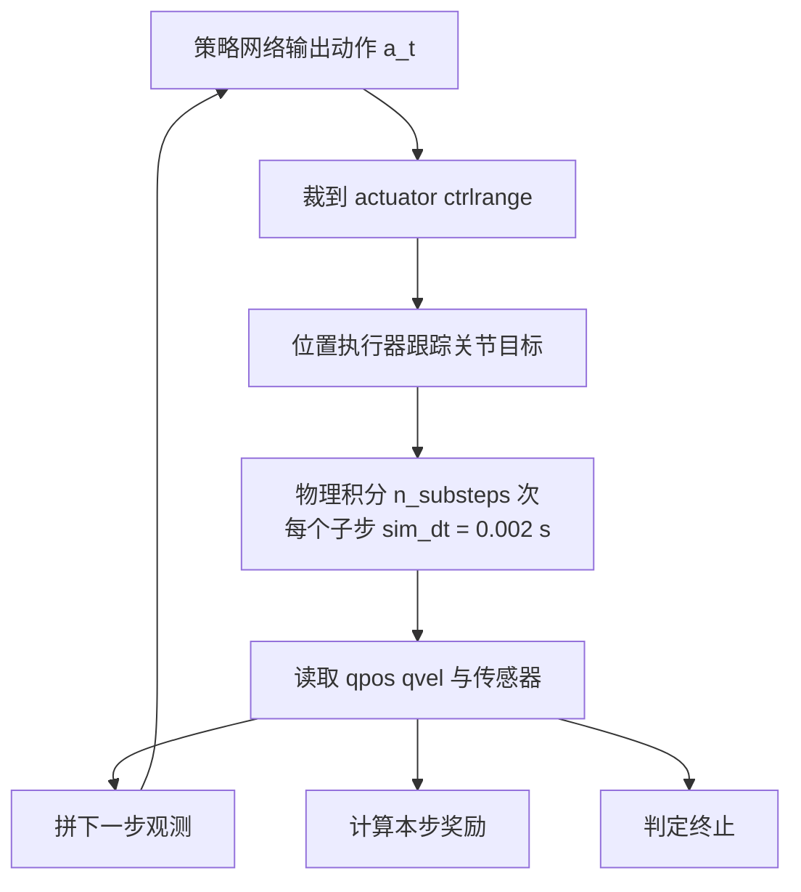
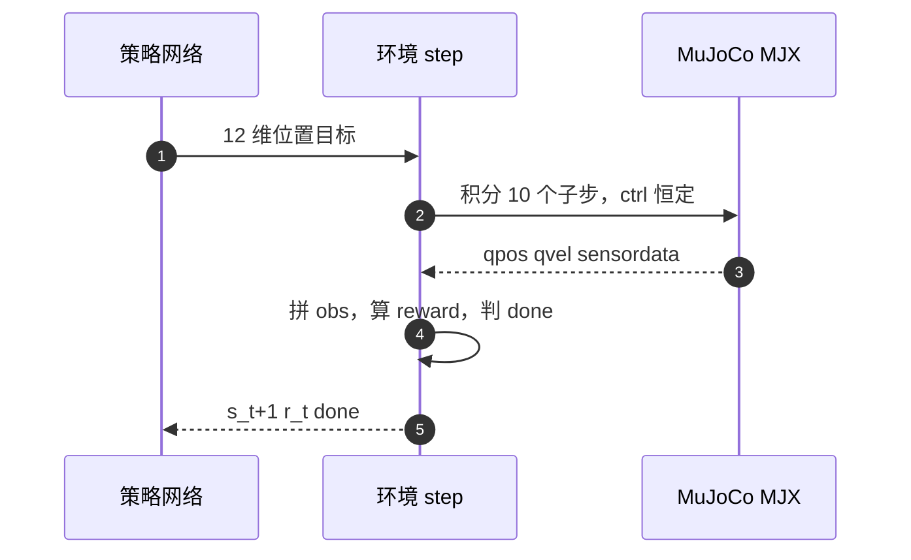

# MDP 建模与时间尺度

mjx-go1-getup 里走路与起身两个任务共用一套 Go1 模型与同一份物理参数，只把状态分布、奖励配方和终止判据分开。这里的 MJX 是 MuJoCo 在 JAX 上的实现，物理可以整批并行、也能编进 JIT 静态图，这是"几千个环境同时训练"能跑起来的前提。

把它们放到同一个离散时间 MDP 的框架里看，最容易忽略的是时间尺度这一层：策略每 0.02 s 决策一次，物理每 0.002 s 积分一次，两者相差十倍。一段 15 s 的 episode，网络只看到 750 个决策点，物理却推进了 7500 步。

> 涉及对象是 mjx-go1-getup 里两个任务的 MDP 骨架：走路 `envs/go1_walk.py`、起身 v2 `envs/go1_getup_v2.py`。时间尺度取值在 `envs/go1_walk.py`，参考仓库的对应实现在 quadruped-rl-locomotion-main 的 `go1_mujoco_env.py`。

## 1. 两个任务共享的五元组

MDP 用 $(\mathcal{S},\mathcal{A},P,R,\gamma)$ 描述一个决策问题：状态集合、动作集合、状态转移、奖励函数、折扣因子。"离散时间"指决策按固定间隔发生——本工程每 0.02 s 一次；"状态"是策略每一步实际拿到的输入（也就是观测），"折扣因子" $\gamma$ 决定未来奖励折算到当前时刻的权重。本工程两个任务的模型与转移完全相同，差异集中在 $\mathcal{S}$ 的构造和 $R$ 的配比上：

| 维度 | 走路 Go1Walk | 起身 v2 Go1GetupV2 | 参考仓库 Go1MujocoEnv |
| --- | --- | --- | --- |
| 状态 | 48 维基座，加高度扫描与相位为 91 | 42×5 = 210 维历史 | 48 维 |
| 动作 | 12 维绝对关节位置目标 | 12 维锚定位置目标 | 12 维位置或力矩 |
| 控制周期 | 0.02 s | 0.02 s | 0.02 s |
| 物理步长 | 0.002 s | 0.002 s | 0.002 s |
| episode | 750 步 = 15 s | 400 步 = 8 s | 750 步 = 15 s |
| 每步奖励下界 | 0 | -1e6 | 0 |
| 终止 | 姿态与高度 | 只挡 NaN 与出界 | 姿态与高度 |

动作维度的 12 对应四条腿各三个关节。走路的观测在平地任务里是 48 维单帧，打开地形以后追加 35 维高度扫描与 8 维相位；起身 v2 换成 42 维单帧堆五帧历史。两者的动作都是 12 维连续量，但落到执行器上的解释不同：走路直接给出绝对关节位置，起身 v2 给出锚在名义站姿上的偏移量。

奖励下界这一行是两套任务分歧最大的地方。走路沿用参考仓库的 SB3 语义，把总奖励夹到不小于 0；起身 v2 把下界放到 -1e6，为的是不让早期随机策略的负总分被夹平。这一处的推导在奖励篇展开。

## 2. 一次控制步内部要跑 10 个物理子步

离散时间 MDP 的交互由策略与环境交替完成，一个控制步记为一次 $t$：

$$s_0 \sim \rho_0,\quad a_t \sim \pi_\theta(\cdot \mid s_t),\quad (s_{t+1}, r_t) \sim P(\cdot \mid s_t, a_t),\quad t = 0,1,\dots,T-1$$

环境在收到 $a_t$ 以后连续积分若干子步，同一个控制量在整个控制步内保持不变，之后才回读状态。子步数由控制周期与物理步长之比决定：

$$n_{\text{sub}} = \mathrm{round}\!\left(\frac{ctrl\_dt}{sim\_dt}\right) = \mathrm{round}\!\left(\frac{0.02}{0.002}\right) = 10$$

这个值不在环境代码里，而是由 MuJoCo Playground 基类的属性现算：

```python
@property
def dt(self) -> float:
    """Control timestep for the environment."""
    return self._ctrl_dt

@property
def sim_dt(self) -> float:
    """Simulation timestep for the environment."""
    return self._sim_dt

@property
def n_substeps(self) -> int:
    """Number of sim steps per control step."""
    return int(round(self.dt / self.sim_dt))
```

基类把两个时间常量暴露成只读属性，子步数由它们推导——环境只需要把 `ctrl_dt` 与 `sim_dt` 填对，不必自己维护 `n_substeps`，写错也不会报错、只会静默改变语义。物理积分调用 `mjx_env.step(model, data, ctrl, n_substeps)`，子步之间执行器目标保持不变（`envs/go1_walk.py`）。

于是走路一段完整 episode 的物理调用次数是：

$$N_{\text{physics}} = T \times n_{\text{sub}} = 750 \times 10 = 7500$$

对应时间 $7500 \times 0.002\ \text{s} = 15\ \text{s}$，与 `episode_length × ctrl_dt` 一致。起身 v2 是 $400 \times 10 = 4000$ 个子步、8 s。





控制周期与物理步长的关系再画成一层一层的结构，三个量级的关系就清楚了：


## 3. episode 的三个边界值是谁定的

轨迹长度 $T$ 由 `episode_length` 给出。走路取 750 步（`envs/go1_walk.py`），对应参考仓库的 15 s 上限；起身 v2 取 400 步（`envs/go1_getup_v2.py`），即 8 s。

终止与截断在代码里处理方式不同。走路只用 `done` 表示终止（`envs/go1_walk.py`），达到 `episode_length` 的截断由训练侧的 brax wrapper 负责；参考仓库把 `terminated` 与 `truncated` 分开返回（`go1_mujoco_env.py`），后者由 15 s 的时间上限算出。两种口径在训练循环里最终都表现为一条轨迹结束，但日志里的含义不同。

reset 结束前把 `data.time` 显式置 0（`envs/go1_walk.py`、`envs/go1_getup_v2.py`）。起身 v2 用 `data.time <= 0` 判断本 episode 的第一步，用来复位历史缓冲与低通滤波（`envs/go1_getup_v2.py`）。这一条依赖 `data.time` 能被重置，也是自动重置包装器唯一没有帮它做的事。

训练规模不在环境里，而在训练脚本的命令行默认值：走路 `--num_envs 8192`、`--episode_length 750`（`train/train_go1.py`）；起身 `--num_envs 768`、`--episode_length 300`（`train/train_getup.py`）。起身脚本的 300 只是默认值，`envs/go1_getup_v2.py` 会把 config 覆盖成 400，运行时以 config 为准，两者不一致属于代码现状。

训练启动时会打印实际生效的 dt 与频率，这一段可以直接核对上面的推导：

```python
# train/train_getup.py
print(f"env: {type(env).__name__}  action_size={env.action_size}  "
      f"obs={n_state}/{n_priv}  dt={env.dt}s "
      f"({1/env.dt:.0f}Hz)  episode={args.episode_length} 步 "
      f"({args.episode_length*env.dt:.1f}s)")
```

## 4. 奖励累加口径：走路不乘 dt

奖励的累积有两种写法。参考仓库与走路任务用 SB3 语义，每步奖励不乘 $dt$，直接相加后夹到 $[0,10000]$（`envs/go1_walk.py`）；brax 默认按 $r_t \cdot dt$ 累加（相当于"每秒奖励"），本工程显式避开这个默认，以保持与参考仓库的 episode 总量可比。

这个选择影响的是量纲。若每步奖励乘 0.02，750 步的 episode 总量会被压到原来的五十分之一，权重表里那些 $10^{-4}$ 量级的成本项与 $2.0$ 量级的正项之间的相对比例虽不变，但与参考仓库日志里打印的数值就对不上了。调超参时若误以为已经乘过 dt，会把学习率按错误的量级设大一两个数量级。

## 5. 时间常量落在哪些行

走路环境的时间常量集中在 `default_config()`：

```python
# envs/go1_walk.py
ctrl_dt=0.02,          # 50Hz 控制 = 参考仓库 frame_skip=10 × 0.002
sim_dt=0.002,          # 参考仓库 XML timestep=0.002
episode_length=750,    # 15s (参考 _max_episode_time_sec=15.0)
```

`sim_dt` 在构造时写进模型的 `opt.timestep`（`envs/go1_walk.py`），`mjx.put_model` 之后再交给 warp 后端。`ctrl_dt` 只用于基类属性 `dt`，环境自己的奖励、相位推进都以 `self.dt` 取用（例如 `envs/go1_walk.py`）。

参考仓库用 gymnasium 的 `frame_skip` 表达同一件事，两个数互为倒数关系：

```python
# go1_mujoco_env.py
frame_skip=10,  # dt(=0.002) * 10 = 0.02 seconds -> 50hz action rate
```

它的 episode 上限与走路一致：`_max_episode_time_sec = 15.0`（`go1_mujoco_env.py`），`truncated = self._step >= (self._max_episode_time_sec / self.dt)`（`go1_mujoco_env.py`）。注意这里除的是 `self.dt`，也就是控制周期 0.02，算出 750 步。

起身 v2 直接复用走路的 config 再改四处：

```python
# envs/go1_getup_v2.py
cfg = walk_default_config()
cfg.terrain = True
cfg.height_scan.enable = True
cfg.reward_clip_min = -1.0e6
cfg.episode_length = 400
```

改动的四处里只有 `episode_length` 属于时间尺度，其余三处分别打开地形、打开高度扫描、放开奖励下界。

## 6. 时间尺度相关的故障现象

| 现象 | 根因 | 对应位置 |
| --- | --- | --- |
| 把 0.002 当控制周期，算出的步数放大 10 倍 | 混淆 `dt` 与 `sim_dt` | `envs/go1_walk.py` |
| 以为奖励乘了 dt，超参按错误量级设置 | 走路奖励不乘 dt，与 brax 默认语义相反 | `envs/go1_walk.py` |
| 起身奖励注释与实现不符 | 注释写乘 `step_dt`，共享 `step` 里没有这一步 | `envs/go1_getup_v2.py` 对 `envs/go1_walk.py` |
| episode 长度两处不一致 | 脚本默认 300 与 config 400 不同，以 config 为准 | `train/train_getup.py` 对 `envs/go1_getup_v2.py` |
| 起身早期策略无梯度 | 若沿用走路的奖励下界 0，负总分被夹平 | `envs/go1_getup_v2.py` |

## 7. 小结

### 核心概念

- 两个任务共用 0.02 s 控制周期与 0.002 s 物理步长，子步数为 10，由基类按 `ctrl_dt/sim_dt` 计算（`mjx_env.py`）。
- 走路 episode 750 步（15 s），起身 v2 400 步（8 s），都由 `episode_length` 控制，训练脚本的默认值可能被 config 覆盖。
- 走路奖励每步不乘 dt，直接求和后夹到 [0,10000]，与参考仓库的 SB3 口径一致。
- 参考仓库用 `frame_skip=10` 表达控制频率，语义与本工程的 `n_substeps` 相同，两者互为倒数。
- `reset` 把 `data.time` 置 0；起身 v2 靠这个值判断首步，以复位历史缓冲与低通状态。

### 设计权衡

| 取舍 | 选法 | 代价 |
| --- | --- | --- |
| 控制频率 | 50 Hz，与参考仓库一致 | 高频决策样本量大，低频则接触瞬态被抹平 |
| 奖励是否乘 dt | 走路不乘，保持 episode 总量可比 | 与 brax 默认不同，改超参时容易误判量级 |
| 起身 episode | 400 步，比脚本默认 300 长 | 多 2 s 训练时间，换取站住的学习窗口 |
| 子步实现位置 | 交给基类按 dt 属性算 | 环境必须把 ctrl_dt 与 sim_dt 都填对，写错不会报错只会静默改变语义 |

## 8. 练习

基础题

1. 写出走路环境里 `ctrl_dt`、`sim_dt`、`episode_length` 三个值，并算出一次 episode 的物理积分次数与总时长。
2. 参考仓库的 `frame_skip` 是 10、XML timestep 是 0.002，写出它等价的控制周期；若把 `frame_skip` 改成 5，动作频率变成多少赫兹。
3. 说明起身脚本 `--episode_length` 默认 300 与 config 里 400 冲突时，训练时实际用哪个，依据是哪一行代码。

挑战题

4. 走路奖励不乘 dt。若把 750 步的 episode 总奖励除以总时长，得到的是平均每步奖励还是平均每秒奖励；与参考仓库对比时应当用哪一个量。
5. 把 `ctrl_dt` 改成 0.01 而 `sim_dt` 保持 0.002，重新算 `n_substeps` 与 15 s 对应的步数，并说明这会怎样改变策略的决策频率与单步物理推进距离。

## 附：本页引用的路径

| 路径 | 用途 |
| --- | --- |
| `envs/go1_walk.py` | 走路环境 config、step、奖励与终止 |
| `envs/go1_getup_v2.py` | 起身 v2 config 与复用走路 step |
| `train/train_go1.py` | 走路训练默认 num_envs 与 episode_length |
| `train/train_getup.py` | 起身训练默认步数与运行时自检打印 |
| `mujoco_playground/_src/mjx_env.py` | 基类 dt 与 n_substeps 定义 |
| 仓库根 /home/tc63/mujoco/mjx-go1-getup | mjx-go1-getup 全部源码 |
| 仓库根 /home/tc63/mujoco/quadruped-rl-locomotion-main | 参考仓库 go1_mujoco_env.py |
| 依赖根 mujoco_playground 包 | MuJoCo Playground 基类 |
