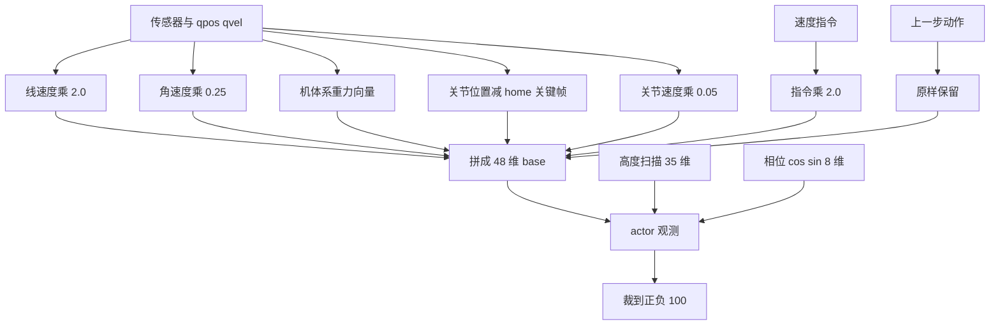
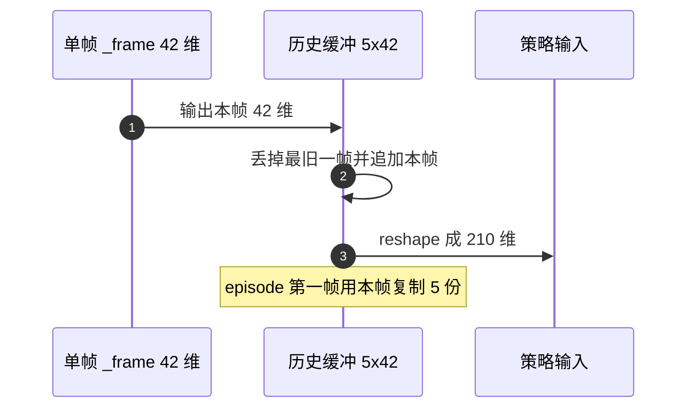

# 观测空间设计

奖励函数里用到的量如果观测里看不到，策略就只能把它当成不可预测的噪声。强化学习里策略能学到什么，上限由观测里有没有那条信息决定；观测就是策略在每一步实际拿到的状态摘要。走路与起身 v2 对这个问题给了两个不同答案：走路用单帧向量，起身 v2 用连续五帧堆叠。

> 本页对象是 mjx-go1-getup 两个任务的观测向量：走路 `envs/go1_walk.py:1070-1162`，起身 v2 `envs/go1_getup_v2.py:288-325`。参考仓库的单帧实现在 `go1_mujoco_env.py:383-415`。

## 1. 两套观测并存：单帧向量与历史堆叠

本工程有两套观测形式。走路把当前时刻的状态拼成一个向量直接交给策略；起身 v2 把当前帧保留在一个长度为 5 的环形缓冲里，展平成 210 维再交给策略。两者都拆成 actor 与 critic 两份，critic 多拿传感器真值。

| 版本 | 单帧维度 | 堆叠后维度 | 关键额外量 |
| --- | --- | --- | --- |
| 走路 v1-v18 | 48 | 48 | 无 |
| 走路 v19+ 平地 | 48 | 48 | 无 |
| 走路 v19+/v20+ 地形 | 48 + 35 + 8 | 91 | 高度扫描、步态相位 |
| 起身 v1、残差 | 91 | 91 | 与走路同形 |
| 起身 v2 | 42 | 42×5 = 210 | 5 帧历史 |
| 参考仓库 | 48 | 48 | 无 |

48 维基座的构成是固定的七块：线速度 3、角速度 3、机体系重力 3、指令 3、关节位置 12、关节速度 12、上一步动作 12。前四块各 3 维、后三块各 12 维，$4 \times 3 + 3 \times 12 = 48$。高度扫描与相位是可选的追加块，分别 35 与 8 维，追加后 $48 + 35 + 8 = 91$。

## 2. 48 维基座按什么顺序拼、每一项乘多少

单帧观测按固定顺序拼接，再整体截断：

$$s_t = \mathrm{clip}\!\big(\left[ v_b \cdot 2,\ \omega_b \cdot 0.25,\ g_b,\ cmd \cdot 2,\ (q_{j}-q_{\text{home}}),\ \dot{q}_j \cdot 0.05,\ a_{t-1} \right],\ -100,\ 100\big)$$

缩放系数来自 `obs_scale`（`envs/go1_walk.py:312-317`），逐项对照：

| 分量 | 是否乘系数 | 系数 | 出处 |
| --- | --- | --- | --- |
| 线速度 | 是 | 2.0 | `linear_velocity=2.0` |
| 角速度 | 是 | 0.25 | `angular_velocity=0.25` |
| 机体系重力 | 否 | 1.0 | 本身在 ±1 内 |
| 指令 | 是 | 2.0 | 复用 `linear_velocity` |
| 关节位置 | 否 | 1.0 | `dofs_position=1.0` |
| 关节速度 | 是 | 0.05 | `dofs_velocity=0.05` |
| 上一步动作 | 否 | 1.0 | 原样保留 |

关节位置这一块进网络的是相对量：`data.qpos[7:] - key_ctrl[0]`（`envs/go1_walk.py:1083`）。`key_ctrl` 是 home 关键帧的执行器目标，减掉它以后每一维都是相对名义站姿的偏移，策略不需要再从绝对角度里学出零位。参考仓库用的是 `key_qpos[0,7:]`（`go1_mujoco_env.py:389`），两者的差别在于关键帧里存的是关节角还是执行器目标。

整体截断阈值 `obs_clip=100.0`（`envs/go1_walk.py:318`），与参考仓库的 `_clip_obs_threshold` 同值。截断放在拼接之后、加噪之前，作用对象是已经缩放过的特征。

线速度默认取全局 `data.qvel[0:3]`；只有 `command_config.frame="body"` 时换成机体系速度 $R^T v$（`envs/go1_walk.py:1077-1080`）。机体系重力用 IMU site 的旋转矩阵求 $R^T g$（`envs/go1_walk.py:610-612`），参考仓库改用四元数转欧拉再点乘重力（`go1_mujoco_env.py:185-197`），小角度下等价且不引入奇异点。



## 3. 高度扫描的 35 个点怎么算

高度扫描给出的是一族相对高差，不是单点高度。网格为 7×5，共 35 个点；前向范围 $[-0.3, 0.9]$ m、侧向 $[-0.4, 0.4]$ m（`envs/go1_walk.py:351-355`）。前向范围比后向长，是为了给上台阶留预判距离。

每个点的特征这样算：

$$f_i = \mathrm{clip}\!\big(z_{\text{trunk}} - h(x_i,y_i) - 0.28,\ -0.35,\ 0.35\big) \times 5.0$$

$0.28$ 是基准高度 `base`（`envs/go1_walk.py:361`），按 Go1 沉降后的躯干高度标定；$\mathrm{clip}$ 的 $0.35$ 是 `clip_m`（`envs/go1_walk.py:367`），作用在米制高差上。地形总高差 0.30 m，$0.35 > 0.30$ 保证正常行走时不饱和，只有摔倒等异常姿态才截断。乘 5.0 之后值域是 $\pm 1.75$（`envs/go1_walk.py:368`），与关节角、重力的量级可比。

网格点一次性算好后按 yaw 旋转到世界系（`envs/go1_walk.py:714-745`），其中网格坐标的构造在 `envs/go1_walk.py:660-667`。旋转只取 yaw、不跟 roll 与 pitch。上坡时躯干会前倾，若网格跟着倾斜，特征就会随姿态抖动而不是随地形变化。高度扫描必须先开地形：`terrain=True` 而 `height_scan.enable=True` 时若采样器没初始化会直接抛 `RuntimeError`（`envs/go1_walk.py:349-350` 附近的检查）。

actor 用带噪声的扫描，critic 用干净扫描（`envs/go1_walk.py:1108-1109`）。噪声加在采到的地面高度上，作用是避免策略记住精确地形，也是 sim2real 的一部分。

```mermaid
flowchart LR
  A["机体系 7x5 网格点"] --> B["只按 yaw 旋转到世界系"]
  B --> C["在 hfield 上插值采样地面高度 h"]
  C --> D["计算米制高差<br/>z_trunk - h - 0.28"]
  D --> E["裁到正负 0.35 m"]
  E --> F["乘 5.0 得到 35 维特征"]
  F --> G["actor 额外加地面高度噪声"]
````

## 4. 相位块是相位奖励起作用的前提

步态相位用 $\cos\phi$ 与 $\sin\phi$ 表达，每足一对，共 8 维（`envs/go1_walk.py:1120-1124`）。这一块不是无条件进观测：只有 `reward_config.scales` 里 `feet_phase` 不为 0 时才拼进去，否则观测退回 83 维。

相位进观测的必要性来自奖励的形式。相位奖励的目标足高 $r_z(\phi)$ 随相位周期变化，策略若看不到自己处在哪个相位，这个目标对它就是一个随时间变化却无从观测的量，无法学习。源码注释记录的实测证据是：不给相位时相关系数约 0.00、`feet_phase` 恒为 0；给了之后才有可学性。

用 $\cos$ 与 $\sin$ 两个分量而不是原始相位角，是因为原始角在 $\pm\pi$ 处不连续，网络拟合周期函数时在这个跳变上会吃力。$\cos$ 与 $\sin$ 在整个圆周上连续，且两个分量一起唯一确定相位。

## 5. actor 与 critic 的非对称信息

两部分观测的分工写在返回字典里（`envs/go1_walk.py:1159-1162`）：

```python
# envs/go1_walk.py:1159-1162
return {
    "state": state,
    "privileged_state": privileged_state,
}
```

`state` 是 91 维 actor 输入，带裁剪过的传感器噪声；`privileged_state` 是 162 维 critic 输入，无噪声且含接触与执行器力。噪声的幅度向量与 48 维基座同布局（`envs/go1_walk.py:1050-1068`）：每一维的噪声上限等于该维的 `noise_scale × obs_scale`，采样是 $[-1,1]$ 上的均匀分布。指令与上一步动作两块的噪声上限是 0，因为这两个量由策略自己产生，没有传感器误差。

critic 拿到的特权状态在 91 维之外再加陀螺、加速度计、全局速度、执行器力、足端接触与腾空时间，合计 162 维（`envs/go1_walk.py:1138-1157`）。这多出的 71 维按源码顺序是：

| 追加量 | 维度 | 含义 |
| --- | --- | --- |
| `get_gyro` | 3 | 陀螺角速度真值 |
| `get_accelerometer` | 3 | 加速度计真值 |
| `projected_gravity` | 3 | 机体系重力，与 actor 同源无噪 |
| `get_global_linvel` | 3 | 世界系线速度 |
| `get_global_angvel` | 3 | 世界系角速度 |
| `dofs_position` | 12 | 关节位置 |
| `dofs_velocity` | 12 | 关节速度 |
| `data.actuator_force` | 12 | 执行器力 |
| `last_contact` | 4 | 四足接触标记 |
| 足端线速度传感器 | 12 | `_foot_linvel_sensor_adr` 对应分量 |
| `feet_air_time` | 4 | 四足累计腾空时间 |

合计 $3+3+3+3+3+12+12+12+4+12+4 = 71$，加上 actor 的 91 维正好 162。这是单阶段非对称 actor-critic：一个策略配一个看了更多信息的价值函数，部署时只带策略，特权量需要另找来源。

## 6. 起身 v2 的 42 维单帧与五帧历史

起身 v2 覆盖了 `_get_obs`，单帧 42 维的顺序是陀螺 3、机体系重力 3、关节位置减默认姿势 12、关节速度 12、上一步原始动作 12：

```python
# envs/go1_getup_v2.py:293-299
return jp.concatenate([
    self.get_gyro(data),                       # 3  ang_vel_b
    self.get_gravity(data),                    # 3  projected_gravity_b
    data.qpos[7:] - self._default_pose,        # 12 joint_pos - default
    data.qvel[6:],                             # 12 joint_vel
    raw,                                       # 12 prev raw action
])
```

历史缓冲在 `_get_obs` 里滚动：每步追加一帧、丢掉最旧一帧；`obs_hist` 为空时（episode 第一帧）用当前帧复制 5 份；`_restart` 为真时同样复制 5 份（`envs/go1_getup_v2.py:302-313`）。展平后得到 210 维。这里传进网络的是上一步的原始动作 `raw`，不是低通滤波后的 $a_f$，两者在动作篇里有区分。

特权量在 210 维之后再追加相对高度、地面高、世界 $up_z$ 与四足接触共 7 维，得到 217 维 critic 输入（`envs/go1_getup_v2.py:315-325`）。



训练脚本用观测维度做同形自检：非 v2 任务要求 `(n_state, n_priv) == (91, 162)`（`train/train_getup.py:317-319`），v2 则明确声明 210 维与走路不同形（`train/train_getup.py:321-323`）。

## 7. 维度与语义对不上的排查线索

| 现象 | 原因 | 对应位置 |
| --- | --- | --- |
| 只开 `terrain` 没开 `height_scan` | 观测停在 48 维，与 91 维策略不同形 | `envs/go1_walk.py:349-350` |
| `feet_phase` 权重为 0 | 相位块不进观测，维度变 83 | `envs/go1_walk.py:1120-1124` |
| 参考仓库用 `key_qpos`，本工程用 `key_ctrl` | 关节位置零位不同 | `envs/go1_walk.py:1083` 对 `go1_mujoco_env.py:389` |
| 把特权量喂给 actor | 噪声灌进 critic，非对称失去意义 | `envs/go1_walk.py:1087-1092` |
| 起身 v2 的历史没有维护 | 210 维退化成单帧复制 | `envs/go1_getup_v2.py:302-313` |
| 高度扫描的 `clip` 加在缩放之后 | 高差超过 6.25 cm 就饱和，梯度消失 | `envs/go1_walk.py:362-367` |

## 8. 小结

### 核心概念

- 走路基座观测 48 维，加 35 维高度扫描与 8 维相位得 91 维，critic 特权状态 162 维，多出的 71 维可逐项相加核对。
- 起身 v2 用 42 维单帧堆 5 帧得到 210 维，critic 再加 7 维得 217 维。
- 所有观测在拼好后统一裁到正负 100，缩放系数集中在 `obs_scale`（`envs/go1_walk.py:312-317`）。
- actor 噪声只作用于传感器量，指令与上一步动作不加噪，噪声上限按已缩放量级给出。
- 高度扫描的 $\mathrm{clip}$ 作用在米制高差上，阈值必须大于地形总高差。
- 相位块只在相位奖励开启时进观测，它是相位奖励可学的前提。

### 设计权衡

| 取舍 | 选法 | 代价 |
| --- | --- | --- |
| 是否给高度扫描 | 地形任务给，平地任务关 | 多 35 维输入与采样开销 |
| 是否用历史帧 | 起身 v2 用 5 帧 | 与走路不同形，查看器需单独维护缓冲 |
| actor/critic 是否同构 | 非对称，critic 多拿特权量 | 部署时只能带 actor，特权量需另找来源 |
| 相位编码方式 | cos 与 sin 两个分量 | 维度翻倍，换取周期上的连续性 |
| 关节位置零位 | 减 home 关键帧 | 依赖关键帧定义，换模型要同步核对 |

## 9. 练习

基础题

1. 写出走路 48 维基座的七块构成与各自维度，并说明 `key_ctrl` 与 `key_qpos` 的差别。提示：`envs/go1_walk.py:1082-1101`、`go1_mujoco_env.py:389`。
2. 高度扫描网格为 7×5，前向 $[-0.3, 0.9]$ m、侧向 $[-0.4, 0.4]$ m，算出前向与侧向的相邻点间距。
3. 若 `feet_phase` 权重为 0，走路观测会变成多少维；若同时关闭 `height_scan.enable`，又变成多少维。

挑战题

4. 特权状态的 71 维里有两处是重复量（`projected_gravity`、关节位置与速度同时出现在 base 与追加块）。说明这种重复对 critic 的训练有没有影响，以及为什么源码选择保留重复而不是去重。
5. 设计一组对照实验，判断训练失败是因为观测维度不匹配，还是因为奖励项权重不对。写出自变量、观测指标与用于排除维度问题的最小检查命令。

## 附：本页引用的路径

| 路径 | 用途 |
| --- | --- |
| `envs/go1_walk.py` | 走路观测拼装、高度扫描、相位与特权量 |
| `envs/go1_getup_v2.py` | 起身 v2 单帧与 5 帧历史实现 |
| `train/train_getup.py` | 训练前观测维度自检 |
| `go1_mujoco_env.py` | 参考仓库 48 维观测实现 |
| `models/go1/go1_mjx_position.xml` | IMU site 与传感器定义来源 |
| 仓库根 /home/tc63/mujoco/mjx-go1-getup | 全部环境与训练源码 |
| 仓库根 /home/tc63/mujoco/quadruped-rl-locomotion-main | 参考仓库观测实现 |
