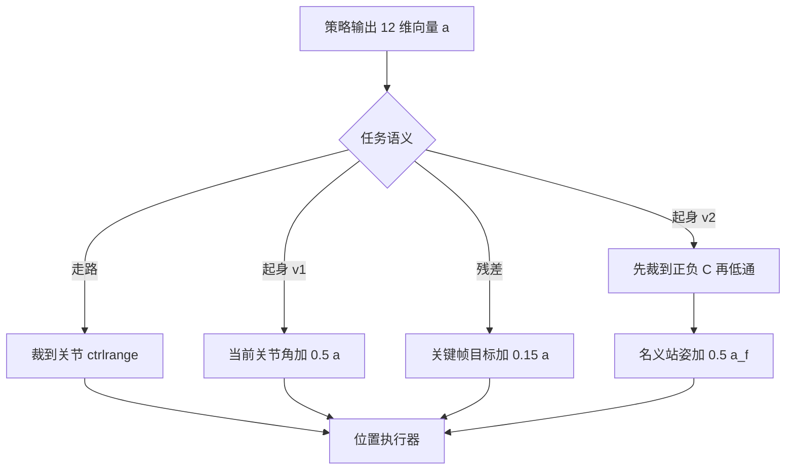
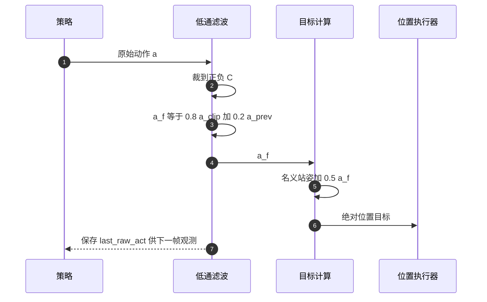

# 动作空间与执行器

四个任务的动作都是 12 维连续向量，对应四条腿各三个关节。同一条向量落到模型上却有四种不同的解释：走路把它当绝对关节位置目标，起身 v1 把它当当前位置之上的增量，起身 v2 把它当名义站姿上的锚定偏移量，残差任务把它当关键帧目标的修正量。语义不同，训练时的收敛速度与部署时的成败都跟着不同。

> 本页对象是 mjx-go1-getup 的动作定义：走路 `envs/go1_walk.py`，起身 v1 `envs/go1_getup.py`，起身 v2 `envs/go1_getup_v2.py`，残差 `envs/go1_getup_residual.py`。参考仓库的两种动作实现在 `go1_mujoco_env.py`。

## 1. 同一条 12 维向量在四个任务里的解释

动作有界性的来源不止一个：MuJoCo 执行器自身的 `ctrlrange`、代码里的显式裁剪、以及归一化动作的幅度上限。四者对照如下：

| 任务 | 变换 | 有界方式 | 代码位置 |
| --- | --- | --- | --- |
| 走路 | `target = clip(a, ctrlrange)` | MuJoCo ctrlrange | `envs/go1_walk.py` |
| 起身 v1 | `target = clip(q_{j} + 0.5a, ctrlrange)` | 关节 ctrlrange | `envs/go1_getup.py` |
| 起身 v2 | `target = q_{home} + 0.5 \cdot a_f` | 先裁 `a` 再低通 | `envs/go1_getup_v2.py` |
| 残差 | `target = clip(ctrl_{fsm} + 0.15a, ctrlrange)` | 关节 ctrlrange | `envs/go1_getup_residual.py` |
| 参考仓库位置 | `target = a` | MuJoCo ctrlrange | `go1_mujoco_env.py` |
| 参考仓库力矩 | `ctrl = a`，力矩 | motor ctrlrange | `go1_torque.xml` |

走路与 v2 都属于绝对目标，区别在锚点：走路锚在动作坐标系自身，v2 锚在名义站姿上并加低通。v1 与残差是相对量，前者相对当前关节角，后者相对状态机给出的关键帧目标。



## 2. 位置执行器把目标角变成力矩

模型用位置执行器，目标角与关节角的差经比例增益变成力矩，再叠加微分项阻尼：

$$\tau = k_p (q_{\text{target}} - q) - k_v \dot{q}$$

本工程的 $k_p=20$、$k_v=1$（`models/go1/go1_mjx_position.xml`）。力矩上限按关节类别分两档：大腿与髋 $\pm 23.7$ N·m，小腿 $\pm 35.55$ N·m（`models/go1/go1_mjx_position.xml`）。小腿扭矩上限更高，因为它在站立与蹬地时承担的力臂更短。

位置目标的可达范围由每类关节的 `ctrlrange` 限定：

| 关节类别 | `ctrlrange`（rad） | XML 行 |
| --- | --- | --- |
| 髋（abduction） | $\pm 0.863$ | `go1_mjx_position.xml` |
| 大腿（thigh） | $[-0.686, 4.501]$ | `go1_mjx_position.xml` |
| 小腿（calf） | $[-2.818, -0.888]$ | `go1_mjx_position.xml` |

这份 XML 保留参考仓库原配置：elliptic cone 加 `impratio=100`、关节阻尼 1、`frictionloss=0.1`（`models/go1/go1_mjx_position.xml`）。小腿的 `ctrlrange` 完全落在负半轴，说明这个模型里的膝关节按一个固定方向弯折，写正值目标会被裁到上界 $-0.888$。

## 3. 走路：策略输出直接当目标

走路把策略输出原样当目标，只做范围裁剪：

$$a^{\text{target}}_i = \min(\max(a_i, lo_i), hi_i)$$

实现只有三行（`envs/go1_walk.py`）：

```python
# envs/go1_walk.py
lo = self.mj_model.actuator_ctrlrange[:, 0]
hi = self.mj_model.actuator_ctrlrange[:, 1]
motor_targets = jp.clip(action, lo, hi)
```

这段代码之前有过一版归一化映射：把策略输出从 $[-1,1]$ 线性映射到 `ctrlrange`。那一版的零动作落在 `ctrlrange` 中点，髋关节目标是 1.9 rad，离 home 的 0.8 rad 很远，初始策略一上来就大幅摆腿，关节速度冲到 7 rad/s，成本项压过奖励、总奖励被夹到下限，PPO 全程没有梯度。v8 改成直接裁剪后，零动作就等于 home 目标，这条失效路径才被消除。

`action_size` 不写死 12，而是取模型的执行器数：

```python
# envs/go1_walk.py
@property
def action_size(self) -> int:
  return self._mjx_model.nu
```

`nu` 是 MuJoCo 模型里的执行器数量，这份 XML 定义了 12 个位置执行器（`go1_mjx_position.xml`）。

## 4. 起身 v1 的增量式与残差任务的先验

起身 v1 把策略输出加到当前关节角上，目标随状态移动：

```python
# envs/go1_getup.py
target = (state.data.qpos[7:]
          + action * self._config.getup.action_scale)
return super().step(state, jp.clip(target, self._ctrl_lo, self._ctrl_hi))
```

增量式的早期行为温和：策略输出为零时目标就是当前姿态，机器人保持不动，不会因为零动作远离 home 而剧烈摆腿。代价是策略要从零开始学关节角的绝对标定，因为它看到的输出是相对量，最终的姿态由状态决定。

残差任务在状态机给出的先验目标上叠加修正：

$$a^{\text{target}} = \mathrm{clip}\!\big(ctrl_{fsm} + s_{res} \cdot a,\ lo,\ hi\big)$$

$ctrl_{fsm}$ 由状态机按当前姿态算出，动作只负责修正，幅度系数是 `_res_scale`（`envs/go1_getup_residual.py`）。这条路线把已知的起身动作序列当作先验，策略只学残差，样本效率高于从零学绝对目标。

## 5. 起身 v2 的锚定式：裁剪、低通、缩放

起身 v2 多两级处理。先裁到幅度上限 $C$，再做一阶低通：

$$a^{\text{clip}} = \mathrm{clip}(a, -C, C),\qquad a^{\text{fil}}_t = 0.8\,a^{\text{clip}}_t + 0.2\,a^{\text{fil}}_{t-1}$$

$$q^{\text{target}} = q_{\text{home}} + 0.5\,a^{\text{fil}}$$

系数 0.8 是 `action_filter_alpha`，0.5 是 `action_scale`（`envs/go1_getup_v2.py`）。可达范围由此确定为名义站姿加减 $0.5C$。低通让相邻两步的目标连续，减小执行器冲击。

滤波器状态每 episode 第一步清零：

```python
# envs/go1_getup_v2.py
info["prev_a_filt"] = jp.where(restart, jp.zeros(NU), info["prev_a_filt"])
info["prev_a_filt2"] = jp.where(restart, jp.zeros(NU),
                                info["prev_a_filt2"])
a = jp.clip(action, -self._clip_a, self._clip_a)
a_f = self._alpha * a + (1.0 - self._alpha) * info["prev_a_filt"]
info["prev_a_filt2"] = info["prev_a_filt"]
info["prev_a_filt"] = a_f
info["last_raw_act"] = a
target = self._default_pose + self._act_scale * a_f
```

`last_raw_act` 保存的是裁剪后的原始动作 $a$，不是滤波后的 $a_f$。观测篇里起身 v2 的第 12 维上一动作用的就是这个值，两处必须一致，否则策略看到的历史与它实际发出的动作对不上。



配置默认幅度上限是 3.0，训练好的策略用的是 8.0：

```python
# envs/go1_getup_v2.py
action_clip=3.0,           # desired_clip_actions
action_scale=0.5,
action_filter_alpha=0.8,   # use_filter_actions
```

## 6. 训练与评估的 action_clip 必须一致

查看器与评估脚本的默认值是 8.0，注释写明这是本项目实测值：`--getup_action_clip` 默认 8.0（`sim/view_go1.py`），`eval_getup.py` 的用法示例也传 8.0（`README.md`）。README 用警告明确要求评估时与训练一致（`README.md`）。

不一致的后果可以算出来：配置默认 $C=3.0$ 时，目标的可用范围是名义站姿加减 $0.5 \times 3.0 = 1.5$ rad；策略训练时用的是 $C=8.0$，实际可达加减 $0.5 \times 8.0 = 4.0$ rad。评估若沿用默认值，超过 1.5 rad 的动作全被裁掉，策略在需要大幅摆腿的起身中段被卡住，成功率会显示成 0，而这个 0 与策略本身无关。

参考仓库默认走位置控制：`--ctrl_type` 的默认值是 `"position"`（`train.py`）。切到力矩时 XML 换成 `go1_torque.xml`，执行器是 `<motor>`，控制范围 $\pm 35$，hip 与 thigh 齿比 23、calf 齿比 35（`go1_torque.xml`）。位置与力矩两条路的动作语义完全不同：位置目标的单位是弧度，力矩的单位是 N·m，模型选错时不会报错，只会让机器人不动或者乱动。

## 7. 动作语义相关的故障现象

| 现象 | 原因 | 对应位置 |
| --- | --- | --- |
| 评估成功率恒 0 | 评估用默认 3.0 把动作夹掉 | `envs/go1_getup_v2.py` 对 `sim/view_go1.py` |
| 零动作含义混淆 | v2 零动作是名义站姿，错误映射下变成 ctrlrange 中点 | `envs/go1_walk.py` |
| 首帧动作跳变 | 低通状态未复位，episode 首步沿用上一条轨迹的 $a_f$ | `envs/go1_getup_v2.py` |
| 查看器与训练幅度不同 | 两处 `residual_scale` 不一致 | `envs/go1_getup_residual.py` 对 `sim/view_go1.py` |
| 用 torque XML 却按位置发送目标 | 单位与执行器类型都变了 | `train.py` |

## 8. 小结

### 核心概念

- 动作恒为 12 维，走路是绝对关节位置目标，直接裁到 `ctrlrange`。
- 起身 v1 是增量式，目标等于当前关节角加 0.5 倍动作，零动作保持当前姿态。
- 起身 v2 是锚定式，先裁到正负 $C$，再以 0.8 低通，最后乘 0.5 加到名义站姿。
- 残差任务把动作当作关键帧目标的修正量，幅度系数是 `_res_scale`。
- 位置执行器按 $\tau = k_p \Delta q - k_v \dot{q}$ 出力，$k_p=20$、$k_v=1$，力矩上限分大腿髋 23.7 与小腿 35.55 两档。
- 参考仓库默认位置控制，可切换到力矩 XML，两者动作单位不同。

### 设计权衡

| 取舍 | 选法 | 代价 |
| --- | --- | --- |
| 绝对目标与增量目标 | 走路绝对，起身 v1 增量 | 增量早期温和，但策略要从零学关节角 |
| 锚定动作 | v2 锚在名义站姿 | 收敛快，可达范围受 $C$ 限制 |
| 是否低通 | v2 低通 alpha 0.8 | 动作平滑，响应稍有滞后 |
| 位置与力矩 | 默认位置，保留力矩 XML | 位置控制稳定，力矩端到端更难训 |
| 动作上限值 | 训练与评估都用 8.0 | 依赖人工同步，两处不一致时结果不可比 |

## 9. 练习

基础题

1. 起身 v2 的关节目标为 `default_pose + 0.5 * a_f`，`a_f` 由 0.8 倍当前动作与 0.2 倍上一帧组成。取 $a=1.0$、上一帧 $a_f=0$、$C=8.0$，算出这一帧的目标相对名义站姿的偏移量。
2. 写出位置执行器的力矩公式，并说明把 $k_v$ 从 1 改成 0 会带来什么后果。
3. 小腿的 `ctrlrange` 是 $[-2.818, -0.888]$，说明为什么写一个正的关节目标不会让腿反向弯折。

挑战题

4. 设计一组对照实验，证明评估成功率假 0 来自 `action_clip` 默认值 3.0，而不是策略本身。写出唯一自变量、观察指标，以及如何排除出生即终止与奖励为零两种原因。
5. 走路早期版本用 $[-1,1]$ 到 `ctrlrange` 的线性映射。推导该映射下零动作对应的髋关节目标角，并说明它为什么会让初始策略的关节速度达到 7 rad/s。

## 附：本页引用的路径

| 路径 | 用途 |
| --- | --- |
| `envs/go1_walk.py` | 走路动作裁剪与 action_size |
| `envs/go1_getup.py` | 起身 v1 增量动作 |
| `envs/go1_getup_v2.py` | 起身 v2 锚定动作与低通 |
| `envs/go1_getup_residual.py` | 残差动作与幅度系数 |
| `models/go1/go1_mjx_position.xml` | 位置执行器增益与 ctrlrange |
| `sim/view_go1.py` | 推理侧动作变换与默认幅度 |
| 仓库根 /home/tc63/mujoco/mjx-go1-getup | 全部环境与查看器源码 |
| 仓库根 /home/tc63/mujoco/quadruped-rl-locomotion-main | 参考仓库位置与力矩模型 |
