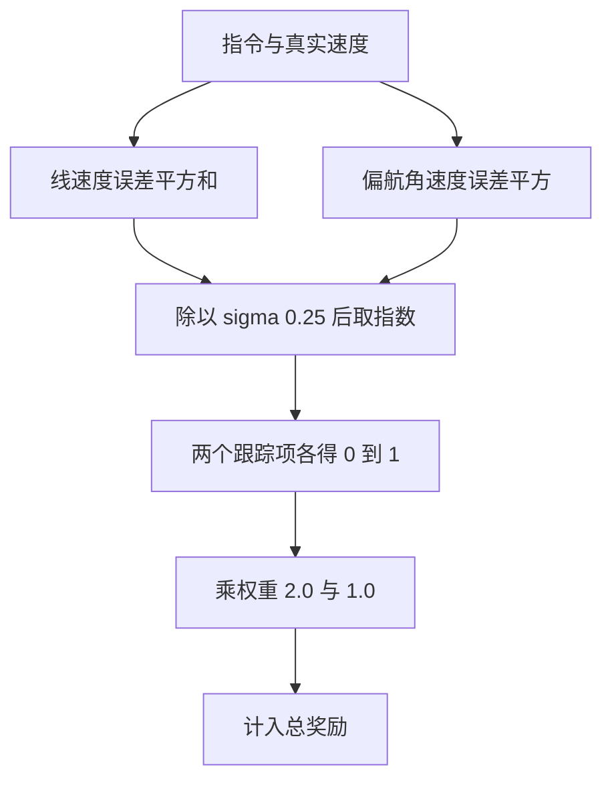
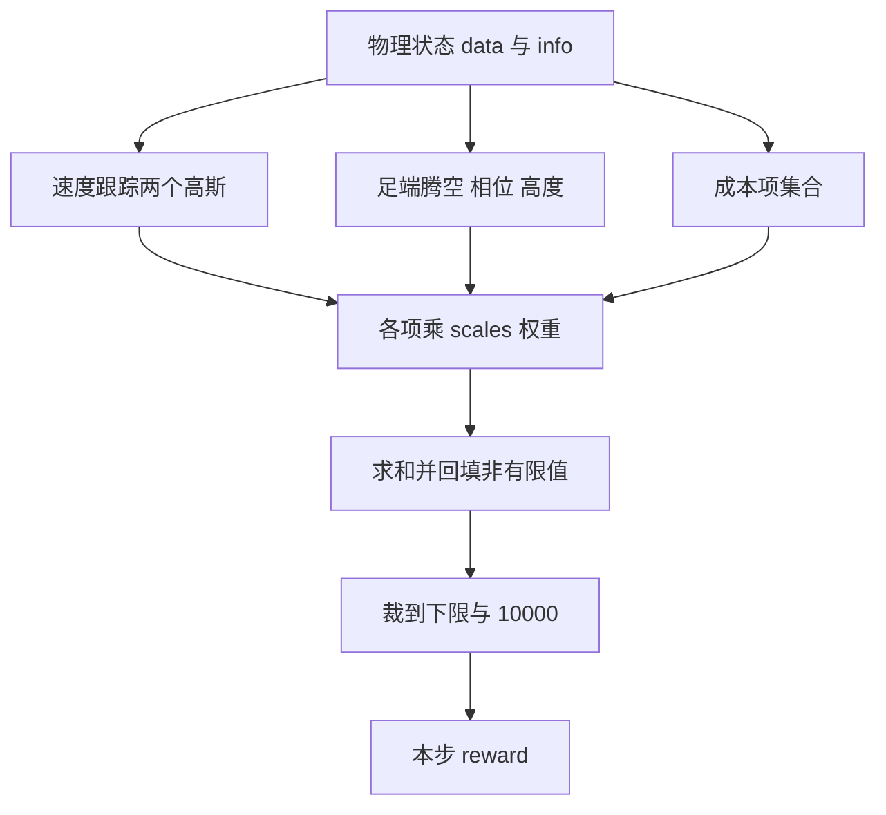

# 奖励项与权重

奖励函数决定策略把什么学会。走路的奖励面是从参考仓库逐项复刻的线性配方：三个正项加一组成本项，每一项乘权重后求和，再夹到一个区间里。起身 v2 换了一套形式，用两个很宽的高斯核加一个站姿项，另外给一个只发一次的成功奖金。

这里的顺序是先把走路的权重表列出来，再推导两个速度跟踪项的公式与 $\sigma$ 的取值，然后解释腾空奖励在什么时刻结算、受什么门控，接着列出各成本项的具体形式，最后说明总奖励为什么必须裁到区间、起身 v2 为什么要把下界放到 $-10^6$。读完应当能对照训练日志里的分项均值判断哪一项在主导奖励。

> 本页对象是 mjx-go1-getup 的奖励函数：走路 `envs/go1_walk.py` 与权重 `envs/go1_walk.py`，起身 v2 `envs/go1_getup_v2.py` 与权重 `envs/go1_getup_v2.py`。参考仓库实现在 `go1_mujoco_env.py`。

## 1. 奖励是加权和，两个任务用了两种形式

走路把奖励拆成若干分项，每项算出标量后乘权重求和：

$$r_t = \mathrm{clip}\!\left(\sum_i w_i\, r_i(s_t, a_t),\ r_{\min},\ 10000\right)$$

其中只有权重非零的项实际进入总和。走路取 $r_{\min}=0$，对应参考仓库的 `max(0, rewards - costs)`（`go1_mujoco_env.py`）。起身 v2 取 $r_{\min}=-10^6$，允许负奖励，避免早期随机策略的总分被夹到 0 以后没有梯度（`envs/go1_getup_v2.py`）。

参考仓库的权重表分 `reward_weights` 与 `cost_weights` 两份（`go1_mujoco_env.py`）。它的成本权重都是正数，最后做一次 `rewards - costs`；本工程的成本权重直接带负号，最后统一相加。符号约定不同，抄权重时容易正负颠倒。

## 2. 走路默认生效的 12 项权重

走路默认权重写在 `reward_config.scales`（`envs/go1_walk.py`）：

| 分项 | 权重 | 方向 |
| --- | --- | --- |
| linear_vel_tracking | +2.0 | 速度指令跟踪 |
| angular_vel_tracking | +1.0 | 偏航角速度跟踪 |
| feet_airtime | +1.0 | 落地时的步幅 |
| torque | -0.0002 | 执行器力矩平方 |
| vertical_vel | -2.0 | 躯干垂直速度 |
| xy_angular_vel | -0.05 | 横滚俯仰角速度 |
| action_rate | -0.01 | 相邻动作差 |
| joint_limit | -10.0 | 软关节范围越界量 |
| joint_acceleration | -2.5e-7 | 关节加速度平方 |
| orientation | -1.0 | 机体系重力水平分量平方 |
| default_joint_position | -0.1 | 偏离 home 关节角 |

`joint_velocity` 与 `collision` 的权重默认 0；其余 `feet_slip`、`feet_height`、`feet_dangle`、`base_height`、`feet_impact`、`feet_phase`、`body_contact`、`ascent`、`symmetry` 等默认也是 0，由训练脚本按开关打开。置 0 不等于这些分项不算，`_get_reward` 里每一项都会返回一个值，只是乘 0 之后不进总和。

`joint_velocity` 与 `collision` 置 0 有具体原因：参考仓库把这两项算出来了，却没有加进 `costs` 的求和（`go1_mujoco_env.py`）。保持权重 0 才能与参考仓库实际生效的奖励面对齐。

## 3. 两个速度跟踪项是高斯核

$$ r_{\text{lin}} = \exp\!\left(-\frac{\|cmd_{xy} - v_{xy}\|^2}{\sigma}\right),\qquad r_{\text{ang}} = \exp\!\left(-\frac{(cmd_\omega - \omega_z)^2}{\sigma}\right)$$

$\sigma = 0.25$，与参考仓库的 `_tracking_velocity_sigma` 同值（`envs/go1_walk.py`）。两个核在误差为 0 时取 1，误差增大后指数衰减。$\sigma$ 越大，同样的速度误差扣得越少，跟踪越松；$\sigma$ 越小，策略越倾向于紧紧贴住指令。

线速度项默认用全局速度 `data.qvel[0:2]`；`command_config.frame="body"` 时换成机体系速度（`envs/go1_walk.py`）。转弯任务必须用机体系速度，否则策略看不到自身朝向，无法把"朝向速度指令"对上。角速度项直接比较 `cmd[2]` 与 `data.qvel[5]`，也就是偏航角速度。



## 4. 腾空奖励只在落地帧结算，并且受门控

腾空奖励的形式是：

$$r_{\text{air}} = \sum_i \big(\min(t_i, t_{\max}) - t_{\text{th}}\big) \cdot c_i$$

其中 $t_i$ 是该足的累计腾空时间、$c_i$ 是首次接触标记。走路默认 $t_{\text{th}}=1.0$、$t_{\max}=\infty$（`envs/go1_walk.py`）。正常步态的摆动时间只有 0.2 s 到 0.4 s，低于阈值 1.0 时这一项为负，于是默认值下腾空反而倒扣；训练脚本用 `--natural_gait` 把它改成 0.2，并给 $t_{\max}$ 设 0.5 s 的封顶（`train/train_go1.py`）。

所有腾空与滑移类项都乘一个门控：指令水平范数大于 0.1 时才生效（`envs/go1_walk.py`）。纯转向（$v_x=v_y=0$）时整项关掉，避免策略在没有前进指令时靠抬腿刷分。

## 5. 各成本项的具体形式

权重表只给了系数，每项算的是什么要看函数体：

| 成本项 | 计算式 | 单位与量级 |
| --- | --- | --- |
| torque | $\sum \tau_{\text{act}}^2$ | N·m 的平方，12 个执行器求和 |
| action_rate | $\sum (a_{t-1} - a_t)^2$ | 相邻两步动作差平方 |
| vertical_vel | $v_z^2$ | 躯干垂直速度平方 |
| xy_angular_vel | $\sum \omega_{x,y}^2$ | 横滚与俯仰角速度平方 |
| joint_limit | $\sum \mathrm{clip}(q_{\text{lo}} - q, 0) + \mathrm{clip}(q - q_{\text{hi}}, 0)$ | 超出软限位的弧度之和 |
| joint_velocity | $\sum \dot{q}^2$ | 默认权重 0 |
| joint_acceleration | $\sum \ddot{q}^2$ | 12 个关节加速度平方 |
| orientation | $\sum g_{b,(x,y)}^2$ | 机体系重力水平分量平方 |
| collision | 空实现 | 默认权重 0 |

`vertical_vel` 与 `xy_angular_vel` 只惩罚躯干的垂直速度与横滚俯仰角速度，不约束足端的垂直速度。落地冲击由单独的 `feet_impact` 管，默认权重 0。`orientation` 用机体系重力的水平分量而不是欧拉角，避免角度回绕。

分项字典在 `_get_reward` 里组装（`envs/go1_walk.py`），返回后在 `step` 里统一乘权重：

```python
# envs/go1_walk.py
rewards = {
    k: v * self._config.reward_config.scales[k] for k, v in rewards.items()
}
total = sum(rewards.values())
total = jp.where(jp.isfinite(total), total, 0.0)
reward = jp.clip(total, self._config.reward_clip_min, 10000.0)
```

第三行的非有限值回填也很关键：warp 求解器在极端自碰撞下可能发散出 NaN，若让 NaN 进奖励，整批梯度都会被污染。



## 6. 起身 v2 的两个宽高斯与成功奖金

起身 v2 的权重只有 8 项（`envs/go1_getup_v2.py`）：

```python
# envs/go1_getup_v2.py
cfg.reward_config.scales = config_dict.create(
    track_orientation=1.0,
    track_height=1.0,
    feet_to_hip=1.5,
    action_rate=-0.001,
    action_smoothness=-0.001,
    joints_acc=-2.5e-7,
    joints_torques=-2.5e-6,
    joints_energy=-1e-4,
)
```

前两项是宽高斯：

$$r_{\text{ori}} = \exp\!\left(-\frac{2(1-\cos\theta)}{0.1}\right),\qquad r_{\text{height}} = \exp\!\left(-\frac{(0.28 + z_{\text{ref}} - z)^2}{0.1}\right) \cdot g$$

$g$ 是姿态门控，当躯干与法向夹角小于 28.6 度时为 1（`envs/go1_getup_v2.py`）。分母 $0.1$ 是方差而不是标准差，对应 $\sigma = 0.1^{0.5} \approx 0.316$ m，对高度来说很宽：躯干高度偏离目标 0.3 m 时该项仍有 $\exp(-0.9) \approx 0.41$。

成功奖金是 $600$，条件是连续 25 步满足站姿判据，只给一次，且不终止 episode（`envs/go1_getup_v2.py`）。不终止是为了保住稠密奖励：一旦成功即结束，策略会宁可晚点站起来，因为站起来以后能继续拿的分就没了。

## 7. 训练开关按需覆盖权重

走路训练脚本用一组开关覆盖默认权重：`--natural_gait` 设 `feet_slip=-0.5`、`feet_height=-1.0`、`air_time_threshold=0.2`、`air_time_max=0.5`（`train/train_go1.py`）；`--climb_reward` 设 `base_height=-200.0`、`ascent=2.0`；`--gait_phase` 设 `feet_phase=2.0`；`--body_contact_w` 设 `body_contact=-150.0`；`--symmetry` 设 `symmetry=-0.4`。

这些开关意味着同一份环境代码可以对应多个奖励面，日志里看到的分数不能跨配置比较。`ascent` 这一项还有一个权重上界问题：它是状态型奖励，在台顶站着不动也能持续得分，权重取 8 会超过正常行走的每步收益，策略会主动退化成站着不动（`envs/go1_walk.py`）。

## 8. 权重配比相关的故障现象

| 现象 | 原因 | 对应位置 |
| --- | --- | --- |
| 起身早期无梯度 | 奖励下界沿用 0，负总分被夹平 | `envs/go1_getup_v2.py` |
| 权重符号抄反 | 参考仓库成本权重为正，最后相减 | `go1_mujoco_env.py` |
| 日志里分项非 0 但不进总分 | 该分项权重为 0 | `envs/go1_walk.py` |
| 腾空项反而扣分 | 阈值取默认 1.0，正常摆动只有 0.2 到 0.4 s | `envs/go1_walk.py` |
| 策略站桩 | `ascent` 权重过大，台顶静止得分超过行走 | `envs/go1_walk.py` |
| 成功以后不再起身 | 把成功奖金改成立即终止 | `envs/go1_getup_v2.py` |

## 9. 小结

### 核心概念

- 走路奖励是线性加权和，三个正项加一组成本，总奖励夹到 `[0,10000]`。
- 参考仓库漏加 `joint_velocity` 与 `collision`，本工程把这两项权重设为 0 以对齐。
- 两个速度跟踪项是 $\sigma=0.25$ 的高斯核，线速度项在 `frame="body"` 时切到机体系。
- 腾空与滑移类项都受指令门控，指令接近零时不生效。
- 起身 v2 用两个宽高斯加站姿项，允许负奖励，成功给一次性奖金而不终止 episode。
- 训练脚本的开关会覆盖默认权重，跨配置比较分数没有意义。

### 设计权衡

| 取舍 | 选法 | 代价 |
| --- | --- | --- |
| 奖励下界 | 走路 0，起身 -1e6 | 走路对齐参考，起身避免零梯度 |
| 腾空结算方式 | 落地帧结算 | 不落地的腿可以绕开，需另加逐步惩罚 |
| 成功是否终止 | 不终止，只给奖金 | 保留稠密分，需靠 hold 判据维持 |
| 高度奖励形式 | 状态型升高量 | 需行进门控与权重上界防套利 |
| 成本项符号 | 本工程带负号直接相加 | 抄参考仓库权重时必须先确认符号约定 |

## 10. 练习

基础题

1. 写出走路奖励的 12 个默认生效项与权重，并指出哪两项虽然计算了但权重为 0。
2. 线速度跟踪项在误差为 0 时取值多少；若 $\sigma$ 从 0.25 改成 1.0，误差 1 m/s 时该项从多少变成多少。
3. 说明总奖励里那句非有限值回填的作用，以及去掉它会发生什么。

挑战题

4. 成功奖金 $600$ 分摊到连续 25 步上，平均每步多少；与起身 v2 每步的常规奖励量级相比，这一笔奖金是否足以主导策略。写出估算依据。
5. 参考仓库用 `max(0, rewards - costs)`，本工程用 `clip(total, r_min, 10000)`。说明当负成本超过正奖励时两者的差别，以及为什么本工程保留 `10000` 这个上界。

## 附：本页引用的路径

| 路径 | 用途 |
| --- | --- |
| `envs/go1_walk.py` | 走路奖励分项、权重与总奖励裁剪 |
| `envs/go1_getup_v2.py` | 起身 v2 奖励与成功奖金 |
| `train/train_go1.py` | 训练开关对权重的覆盖 |
| `go1_mujoco_env.py` | 参考仓库权重表与求和实现 |
| 仓库根 /home/tc63/mujoco/mjx-go1-getup | 环境与训练源码 |
| 仓库根 /home/tc63/mujoco/quadruped-rl-locomotion-main | 参考仓库奖励实现 |
