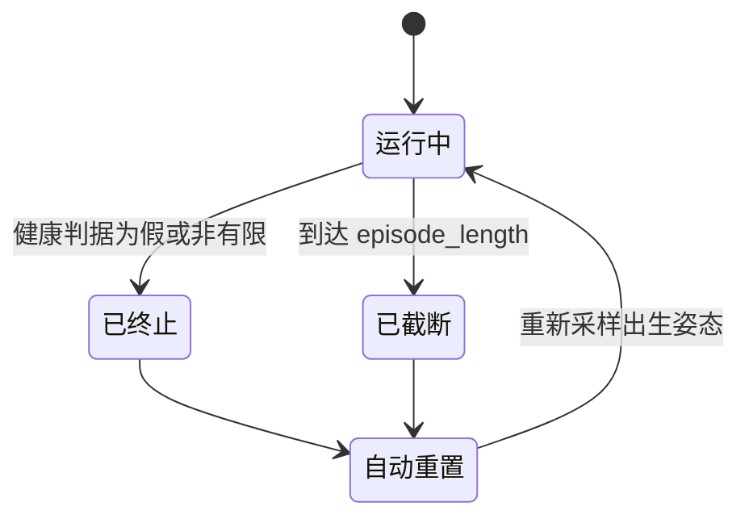
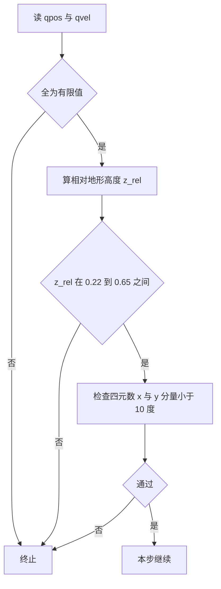
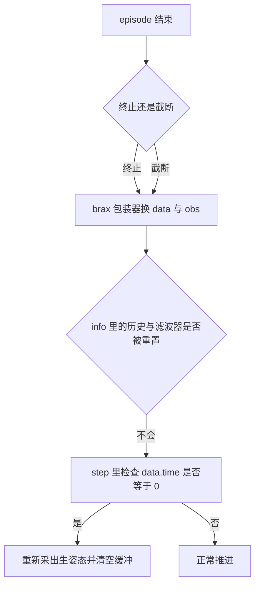

# 终止条件与重置

episode 的边界由两件事决定：什么时候算失败要提前结束，以及每次结束后从什么姿态重新开始。走路对这两件事都很严格，起身 v2 则把边界放到最松，只留几条防止数值发散的护栏。这个差异来自任务本身：起身过程全程在躺倒姿态附近，走路的姿态判据一旦套过来，episode 会在第一步就结束。

> 本页对象是 mjx-go1-getup 的终止判据与出生分布：走路 `envs/go1_walk.py` 与 `envs/go1_walk.py`，起身 v2 `envs/go1_getup_v2.py`。参考仓库的对应实现是 `go1_mujoco_env.py` 与 `go1_mujoco_env.py`。

## 1. 两条结束路径：终止与截断

episode 结束有两条路径：健康判据失败触发终止，或达到 `episode_length` 触发截断。走路两套都管，起身 v2 只留护栏。两者在代码里的写法也不一样：走路把 `done` 直接算在 `step` 里，截断交给 brax 的包装器；参考仓库则显式返回 `terminated` 与 `truncated` 两个布尔量。

| 判据 | 走路 | 起身 v2 | 参考仓库 |
| --- | --- | --- | --- |
| 有限值 | 是 | 是 | 是 |
| 躯干高度 | 相对地形 (0.22, 0.65) | 只挡低于 -0.30 | 绝对 (0.22, 0.65) |
| 姿态 | 四元数 x、y 分量 | 无 | 四元数 x、y 分量 |
| 出界 | 无 | 水平坐标小于 5.8 | 无 |
| 成功终止 | 无 | 无，只给一次性奖金 | 无 |

参考仓库把终止与截断分开返回，`truncated` 由 15 s 上限决定（`go1_mujoco_env.py`）。本工程走路只用 `done` 表示终止（`envs/go1_walk.py`），达到 `episode_length` 的截断由训练侧的 brax wrapper 负责。两条路径的训练表现一样，日志里的含义不同。



## 2. 走路健康判据的三段与运算

走路的健康判据由四段与运算组成，全部为真才继续：

$$\text{healthy} = \text{finite}(q) \wedge \text{finite}(\dot{q}) \wedge (z_{\text{rel}} \in (0.22, 0.65)) \wedge (|q_x| < \theta) \wedge (|q_y| < \theta)$$

其中 $q_x, q_y$ 是根四元数的第 2、3 个分量，$\theta = 10^\circ$（`envs/go1_walk.py`）。实现是四行按位与：

```python
# envs/go1_walk.py
z_ref = self.terrain_height(data.qpos[None, :2])[0] if self._hfield_ok else 0.0
z_rel = data.qpos[2] - z_ref
healthy &= (z_rel > min_z) & (z_rel < max_z)
q = data.qpos[3:7]
q = q / jp.linalg.norm(q)
rad = jp.deg2rad(jp.float32(self._config.healthy_roll_range))
healthy &= (jp.abs(q[1]) < rad) & (jp.abs(q[2]) < rad)
```

终止信号在 `step` 里与非有限值护栏合并：

```python
# envs/go1_walk.py
done = self._get_termination(data) | (~finite)
```

阈值来自 config（`envs/go1_walk.py`）：

```python
# envs/go1_walk.py
healthy_z_range=(0.22, 0.65),
healthy_roll_range=10.0,   # deg
healthy_pitch_range=10.0,  # deg
```

注意 `healthy_roll_range` 与 `healthy_pitch_range` 两个配置项，实现里只用了前者：两个方向都按同一个阈值检查 `q[1]` 与 `q[2]`，改 `healthy_pitch_range` 不会影响行为。



## 3. 姿态阈值 10 度为什么等效正负 20 度

判据里的 10 度作用在四元数分量上，不是欧拉角。四元数在小角度下满足 $q_x \approx \text{roll}/2$、$q_y \approx \text{pitch}/2$，所以 $|q_x| < 10^\circ$ 等价于 $|\text{roll}| < 20^\circ$，俯仰同理。实际允许的姿态范围比"10 度"看起来宽一倍。

参考仓库沿用同一写法，直接卡 `state[4]` 与 `state[5]`（`go1_mujoco_env.py`）。源码注释记录了一段教训：早期版本按真欧拉角取 10 度，严格了一倍，reset 噪声让机器人落地即越界，episode 一开场就结束，在奖励下界为 0 的配置下 PPO 拿不到正信号，评估奖励长期恒为 0.000。

训练脚本提供 `--tilt_deg` 覆盖这个值，帮助文本写明"默认 10 等效正负 20 度"，并记录转弯时躯干正常俯仰会越界（`train/train_go1.py`）。也就是说这个阈值在直行时够用，在转弯时偏紧，是已知的折中点。

## 4. 高度判据从绝对量改成相对地形

相对高度这样算：

$$z_{\text{rel}} = q_z - h_{\text{terrain}}(q_x, q_y)$$

有 hfield 时减去足下地面高度，平地时 $h=0$（`envs/go1_walk.py`）。改成相对量以后，阈值语义与地形幅度解耦。地形总高差 0.30 m 时，站在最高台顶的绝对高度逼近 0.65 上界，若继续用绝对高度，出生点随机化到台顶时 z 直接落在上界之外，episode 出生即终止。用相对高度以后，以后加大地形不必回来重调这两个阈值。

这个改动与随机出生是配套的。`random_init` 让部分环境直接出生在斜坡或台阶上，绝对高度判据和它放在一起就会互相冲突。

## 5. 起身 v2 为什么不做姿态终止

起身 v2 的护栏只有三条：

$$\text{alive} = \text{finite}(q) \wedge \text{finite}(\dot{q}) \wedge (\|q_{xy}\| < 5.8) \wedge (z_{\text{rel}} > -0.30)$$

实现见 `envs/go1_getup_v2.py`。注释明确说明这对应 get-up-isaaclab 的 `_get_dones` 中 `died` 恒为 False。三条护栏分别挡数值发散、跑出地形范围、以及陷进地面。

不做姿态终止是被任务性质决定的：起身过程要在躺倒姿态附近停留相当长时间，走路的姿态判据一进这个区域就会把 episode 判死。这也解释了为什么起身 v2 的出生姿态是站立落位加随机关节，而不是像起身 v1 那样撒摔倒姿态。

## 6. 走路的出生分布：home 加噪声，按需重采

走路 reset 从 home 关键帧出发，先加均匀噪声，再可选地重采出生位姿：

```python
# envs/go1_walk.py
qpos = jp.array(self._mj_model.keyframe("home").qpos)
s = self._config.reset_noise_scale
qpos = qpos + jax.random.uniform(
    key, (self.mjx_model.nq,), minval=-s, maxval=s)
ctrl = jp.array(self._mj_model.key_ctrl[0]) + s * jax.random.normal(
    key, (self.mjx_model.nu,))
qvel = jp.zeros(self.mjx_model.nv)
```

`reset_noise_scale` 取 0.1，与参考仓库的 `_reset_noise_scale=0.1` 一致。关节位置加 $[-0.1, 0.1]$ 的均匀噪声，执行器目标加 $\mathcal{N}(0, 0.1)$ 的正态噪声，速度清零。

随机出生只在 `random_init.enable` 时生效：xy 均匀取 $\pm 5$ m，z 取出生点地面高加 0.35 m，朝向均匀随机，前 6 维速度取 $\pm 0.3$（`envs/go1_walk.py`）。开启它的原因是地形训练的前提：不随机 xy 的话，8192 个环境全落在原点那块半径 0.5 m 的压平区，永远见不到 6 cm 台阶与 30 cm 楼梯。z 取地面高加偏置是为了让机器人从地面之上一点自由沉降，不会穿地。

关节速度仍然为零，只有前 6 维基座速度带扰动。这是设计而非遗漏：让策略不是每次都从完全静止开始。

## 7. 起身的两个出生分布与自动重置的边界

起身 v2 覆盖 reset，出生点直接在站立高度落位：

```python
# envs/go1_getup_v2.py
xy = jax.random.uniform(kxy, (2,), minval=-self._spawn_xy,
                        maxval=self._spawn_xy)
quat = jax.random.normal(kq, (4,))
quat = quat / (jp.linalg.norm(quat) + 1e-6)
joints_r = jax.random.uniform(kj, (NU,), minval=self._lowers,
                              maxval=self._uppers)
joints = (1.0 - a) * self._default_pose + a * joints_r
qpos = jp.concatenate([xy, (h0 + self._spawn_h)[None], quat, joints])
```

朝向用四元数正态采样再归一化，关节角在名义站姿与上下限之间按 `joint_alpha` 插值。reset 里还把历史缓冲、两级低通状态与上一次动作全部清零，并把 `_restart` 置假（`envs/go1_getup_v2.py`）。

自动重置有一处必须自己处理的边界：brax 的 AutoResetWrapper 只替换 `data` 与 `obs`，不会重置 `info` 里的历史缓冲与滤波器（源码注释记 `training.py`）。起身 v2 因此用 `data.time <= 0` 识别本 episode 的第一步，并在这一帧重新采出生姿态（`envs/go1_getup_v2.py`）。reset 里 `data.time` 显式置 0，每步加 0.02，所以这个判据只在首帧成立。

起身 v1 的出生分布更复杂：以 `drop_prob=0.75` 的概率撒摔倒姿态、相对高度 0.5 m、自由沉降 0.6 s（`envs/go1_getup.py`）。这条分布更接近真实摔倒场景，代价是早期探索的空间更大。



## 8. 终止与重置相关的故障现象

| 现象 | 原因 | 对应位置 |
| --- | --- | --- |
| 按欧拉角理解 10 度 | 实际等效正负 20 度，判据比直觉宽一倍 | `envs/go1_walk.py` |
| 地形上出生即终止 | 高度判据用绝对量 | `envs/go1_walk.py` |
| 给起身套走路判据 | 躺地姿态直接判死，episode 迅速结束 | `envs/go1_getup.py` |
| 历史缓冲跨 episode 残留 | 忽略自动重置不碰 info | `envs/go1_getup_v2.py` |
| 出生速度只有前 6 维带扰动 | 关节速度为零，属设计而非遗漏 | `envs/go1_walk.py` |
| 把成功当终止 | 起身 v2 成功只给奖金，episode 继续 | `envs/go1_getup_v2.py` |

## 9. 小结

### 核心概念

- 走路用有限值、相对高度与四元数分量四段判据，姿态阈值 10 度等效正负 20 度。
- 高度判据在 v19 后改成相对足下地形，与地形幅度解耦，是随机出生的配套条件。
- 起身 v2 只留有限值、出界与最低高度三条护栏，不做姿态终止，出界阈值 5.8、最低相对高度 -0.30。
- 自动重置不重置 info，起身 v2 用 `data.time == 0` 判首步并自行复位缓冲。
- 走路 reset 从 home 关键帧加噪声，随机出生由 `random_init` 控制。
- 起身 v1 用 `drop_prob=0.75` 撒摔倒姿态，v2 直接站立落位。

### 设计权衡

| 取舍 | 选法 | 代价 |
| --- | --- | --- |
| 姿态阈值宽窄 | 走路等效正负 20 度 | 直行够用，转弯时躯干俯仰易越界 |
| 高度基准 | 相对地形 | 需 hfield 采样器，平地退化为绝对 |
| 起身是否终止 | 不终止姿态，只留护栏 | 躺地不结束，靠奖励引导起身 |
| 出生分布 | 站立落位或摔倒撒点 | 起身 v2 便宜，v1 更接近真实摔倒 |
| 随机出生的范围 | xy 正负 5 m 加随机朝向 | 地形覆盖充分，早期 episode 更难 |

## 10. 练习

基础题

1. 写出走路健康判据的四段条件，并说明 `healthy_pitch_range` 这个配置项在实现里有没有被使用。
2. 判据配置为 10 度，作用在四元数分量上。算出它等效的横滚与俯仰范围，并说明为什么会出现这个倍数。
3. 地形总高差 0.30 m，躯干站高约 0.28 m。估算站在最高台顶时相对高度是否落在 (0.22, 0.65) 区间内，并说明用绝对高度会怎样。

挑战题

4. 起身 v2 的出界阈值是 5.8 m。结合 `random_init` 的 xy 范围说明这个值为什么必须大于它，以及出界判据漏掉哪一维。
5. 设计一组对照实验，判断训练中 episode 长度远小于 `episode_length` 是姿态判据过严还是高度判据用了绝对量。写出自变量、观察指标与最小验证方式。

## 附：本页引用的路径

| 路径 | 用途 |
| --- | --- |
| `envs/go1_walk.py` | 走路健康判据、reset 与随机出生 |
| `envs/go1_getup_v2.py` | 起身 v2 护栏、出生与自动重置边界 |
| `envs/go1_getup.py` | 起身 v1 摔倒出生分布 |
| `train/train_go1.py` | tilt_deg 覆盖选项 |
| `go1_mujoco_env.py` | 参考仓库健康判据与 reset |
| 仓库根 /home/tc63/mujoco/mjx-go1-getup | 环境与训练源码 |
| 仓库根 /home/tc63/mujoco/quadruped-rl-locomotion-main | 参考仓库实现 |
