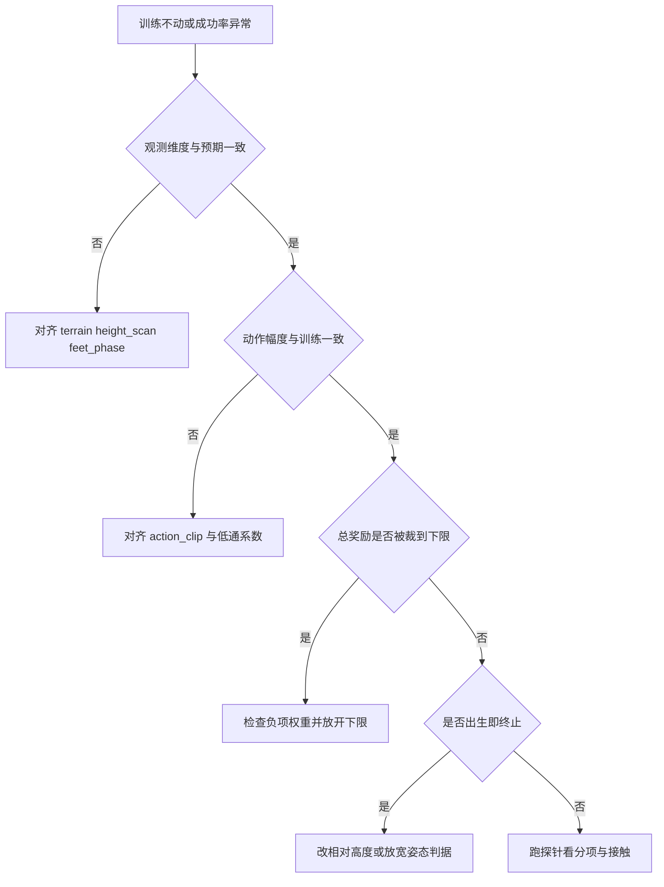
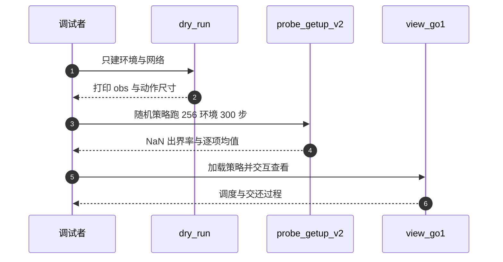

# 易错点与调试

观测、动作、奖励、终止四类改动都会让训练表现异常，但现象高度重叠：奖励不涨、成功率恒 0、episode 迅速结束。只看训练曲线不足以区分原因，因为四条链最终都表现为同一组数字不动。可操作的区分办法是把每一层与它的预期值对齐，用最便宜的检查先排除最容易确认的那些。

> 本页对象是 mjx-go1-getup 里 MDP 相关问题的排查路径：环境自检 `train/train_getup.py`，起身探针 `sim/probe_getup_v2.py`，交互查看器 `sim/view_go1.py`。

## 1. 每一层都有一个可以对齐的预期值

四层各有自己的预期值来源，异常时的表现也不同：

| 层次 | 预期值来源 | 异常时的表现 |
| --- | --- | --- |
| 观测维度 | 91 / 162，或 v2 的 210 | 加载策略报维度不符，或策略输出无意义 |
| 动作语义 | 训练与推理同一变换 | 评估成功率与训练日志差一个量级 |
| 奖励下界与权重 | `scales` 与 `reward_clip_min` | 分项非 0 但总奖励恒 0，PPO 无梯度 |
| 终止判据 | 相对高度与等效姿态角 | episode 长度远小于 `episode_length` |

这四层的排列顺序就是排查顺序：维度错会让后面的检查全部失去意义，所以先确认维度；动作语义错不影响训练但影响评估，放在第二步；奖励与终止的异常会直接体现在曲线形态上，放在最后。

顺序还有一个好处是可回退：每一层都有独立的预期值，确认一层通过以后就不必再回头怀疑它。反过来，若从奖励项开始调权重，调完仍不动时无法判断是奖励没改对还是更上游的维度就不匹配。


## 2. 四条因果链

第一，观测维度错。走路 91 维要求 `terrain`、`height_scan.enable`、`feet_phase` 同时开；缺一项就退回 48 或 83 维，加载同名策略时输入层对不上。训练脚本已把这条写成断言式打印（`train/train_getup.py`）。

第二，动作幅度错。起身 v2 的 config 默认 `action_clip=3.0`，训练好的策略用 8.0。评估若沿用默认值，动作被夹到 3.0 后可达范围从名义站姿正负 4.0 rad 缩到正负 1.5 rad，成功率会显示成 0。这一条在动作篇里有完整推导。

第三，奖励被夹到下限。走路取 `reward_clip_min=0`，一旦负成本压过正奖励，总奖励归零、梯度消失。起身 v2 显式取 $-10^6$ 规避这一点，新增惩罚项时要检查它会不会把总奖励压到 0 以下。

第四，终止过严。走路姿态阈值等效正负 20 度，改成真欧拉 10 度会让落地噪声直接触发终止；高度判据若用绝对量，在地形上会出生即终止。



## 3. 排查从零成本的自检开始

先只建环境与网络，不进入训练循环：

```bash
# 只建环境与网络，不调用 ppo.train
python -m train.train_getup --dry_run
```

它会打印观测维度、动作尺寸与用时（`train/train_getup.py`）。这一步能立刻暴露维度错与配置冲突，成本只有几秒。维度对不上时不需要再往下查，先改配置。

再用随机策略跑起身环境，看 NaN、出界率与逐项奖励：

```bash
python sim/probe_getup_v2.py --envs 256 --steps 300
```

脚本打印 obs 尺寸、`clip_a`、`scale`、`alpha`，以及出生姿态分布与每步分项均值（`sim/probe_getup_v2.py`）。分项均值能直接区分"正项没起来"与"负项过大"这两种看起来一样的现象：前者表现为正项接近 0，后者表现为某一负项绝对值很大。



## 4. 评估命令里的动作幅度必须与训练一致

评估起身时动作幅度必须与训练一致：

```bash
python sim/eval_getup.py --task getup_v2 --getup2_action_clip 8.0 \
    --up_th 0.95 --z_lo 0.20 --z_hi 0.34 \
    --pkl policies/go1_getup_policy.pkl --envs 256 --steps 400
```

README 对 `--getup2_action_clip` 有专门警告，用配置默认 3.0 评出来的成功率是假的 0%（`README.md`）。两组参数的差距可以直接算出来：上限 3.0 时目标可用范围是名义站姿正负 1.5 rad，上限 8.0 时是正负 4.0 rad，相差 2.7 倍。这一条的排除办法是固定 `--envs`、`--steps`、`--up_th`、`--z_lo`、`--z_hi` 与同一个 `--pkl`，只改动作上限，比较两组成功率。若上限改回 8.0 后成功率恢复，原因就确定在动作幅度上。

## 5. 交互查看器必须对齐的两件事

交互查看器要同时对齐观测形态与动作语义：

```bash
python sim/view_go1.py \
    --pkl policies/go1_walk_policy.pkl \
    --getup_pkl policies/go1_getup_policy.pkl \
    --getup_obs history --getup_action anchored --cmd 0
```

`--getup_obs history` 让查看器自己维护 5×42 缓冲，`--getup_action anchored` 复刻锚定式变换（`sim/view_go1.py`）。漏掉前者会让 210 维历史策略收到单帧观测，漏掉后者会让动作语义与训练不一致。两处都属于"不报错但行为全错"的类型，只能靠对照参数确认。

查看器还负责策略调度：走路策略与起身策略的切换时机、以及交还瞬间的姿态混合。

调度逻辑本身也是排查对象：切换条件写在查看器里，而训练时不走这段代码，所以调度引起的异常不会在训练日志里出现。

查看器的另一类用途是确认动作语义。让机器人原地站立并传 `--cmd 0`，观察关节是否保持名义站姿；若零指令下关节持续偏向一侧，说明动作变换的零位不对。交还时刻的量化结果是前 10 帧摔倒率升到 38.3%（`sim/probe_handover.py`），这一项由单独的探针测量，不在查看器里。

## 6. 两个独立探针：约束溢出与交还瞬间

`nefc` 是 MuJoCo 求解器在一次求解里要处理的约束个数。起身过程里躺地接触多，约束数随接触面上升，超过预算时出现 `nefc overflow` 告警，表现为接触力异常、姿态抖动。这一项与观测、动作、奖励三层都无关，只能单独测（`sim/probe_nefc.py`）。把它混进"策略学不会"的结论里会掩盖求解器层面的问题。

交还指走路策略与起身策略切换的瞬间。两个策略的动作幅度与观测形态不同，切换时若直接换动作源，会产生一次跳变。`sim/probe_handover.py` 量到的结果是前 10 帧摔倒率 38.3%。这个数字同时包含动作跳变与观测缓冲未重置两份贡献，要分开测：固定观测缓冲的重置方式、只改切换时的动作过渡，看摔倒率的变化。

两个探针都不进训练循环，跑一次即可复现，属于最便宜的确认手段。

## 7. 排查清单

| 现象 | 原因 | 对应位置 |
| --- | --- | --- |
| 评估未传 `--getup2_action_clip` | 动作被夹到 3.0，成功率假 0 | `README.md` |
| 忘了 `--getup_obs history` | 210 维历史策略收到单帧，行为错乱 | `sim/view_go1.py` |
| 观测维度没对齐 | 训练脚本报警或加载策略失败 | `train/train_getup.py` |
| 奖励被负项压到下限 | 分项有值但总奖励恒 0，无梯度 | `envs/go1_walk.py` |
| 终止阈值按真欧拉理解 | 判据实际宽一倍，或反向过严 | `envs/go1_walk.py` |
| 约束溢出 | `nefc overflow` 告警与躺地接触异常 | `sim/probe_nefc.py` |
| 交还时混合两策略动作 | 前 10 帧摔倒率升到 38.3% | `sim/probe_handover.py` |

## 8. 小结

### 核心概念

- 排查顺序是观测维度、动作幅度、奖励下界、终止判据，逐层与预期值对齐。
- `--dry_run` 成本最低，能立刻暴露维度与配置冲突，应当总是第一步。
- `probe_getup_v2.py` 的逐项均值能区分正项不足与负项过大。
- 评估与查看器的动作幅度、观测形态必须与训练一致，两处不一致都不报错。
- `nefc` 溢出与交还混合是两个独立问题，各有专用探针。

### 设计权衡

| 取舍 | 选法 | 代价 |
| --- | --- | --- |
| 排查从哪层开始 | 先跑零成本自检 | 多一步，但避免只看曲线猜原因 |
| 探针环境数 | 256 环境，够看分布 | 样本量小，极端姿态覆盖有限 |
| 失败后是否重置 | 查看器默认尝试起身 | 观察窗口长，交还逻辑复杂 |
| 评估口径 | 显式传动作上限与判据阈值 | 命令行变长，换实验要重抄参数 |

## 9. 练习

### 基础题

1. 写出走路观测 91 维的三块构成与各自维度，并说明 critic 特权状态 162 维比 actor 多出的 71 维由哪些量组成。
   提示：`envs/go1_walk.py`。

2. 起身 v2 的关节目标为 `default_pose + 0.5 * a_f`，`a_f = 0.8 a + 0.2 a_prev`。取 `a = 1.0`、`a_prev = 0`、clip 为 8.0，求该关节目标相对名义站姿的偏移量。
   提示：`envs/go1_getup_v2.py`，偏移 0.4 rad。

3. 走路姿态阈值配置为 10 度，实际等效的横滚与俯仰范围是多少；若打开 `terrain` 但关闭 `height_scan.enable`，观测维度是多少，会造成什么后果。
   提示：`envs/go1_walk.py`，等效正负 20 度，观测退回 48 维。

### 挑战题

4. 设计一组实验，证明"评估起身成功率假 0"来自 `action_clip` 默认值 3.0 而不是策略本身。写出对照命令、唯一的自变量、观察指标，并说明如何把这一原因与"出生即终止""奖励为零"区分开。
   提示：固定 `--envs --steps --up_th --z_lo --z_hi` 与同一 `--pkl`，只改 `--getup2_action_clip`，比较成功率；再分别用 `probe_getup_v2.py` 的出生姿态分布与 `train/train_getup.py` 的 reward 日志排除另两种原因。

5. `probe_handover.py` 量到交还瞬间前 10 帧摔倒率 38.3%。设计一个对照实验，判断这个数字来自两个策略的动作幅度不一致，还是来自观测缓冲在切换时没有重置。写出自变量与观察指标。

6. 写出 `nefc overflow` 与观测维度错在日志里的可见差异，并说明为什么前者不能用调权重的方式缓解。

## 附：本页引用的路径

| 路径 | 用途 |
| --- | --- |
| `train/train_getup.py` | --dry_run 自检与观测维度守卫 |
| `sim/probe_getup_v2.py` | 起身环境探针与逐项均值 |
| `sim/view_go1.py` | 交互查看器与调度器 |
| `sim/eval_getup.py` | 起身成功率评估 |
| `sim/probe_handover.py` | 交还瞬间量化探针 |
| `sim/probe_nefc.py` | 接触约束溢出探针 |
| 仓库根 /home/tc63/mujoco/mjx-go1-getup | 全部环境、训练与探测脚本 |
| 仓库根 /home/tc63/mujoco/quadruped-rl-locomotion-main | 参考仓库实现 |
