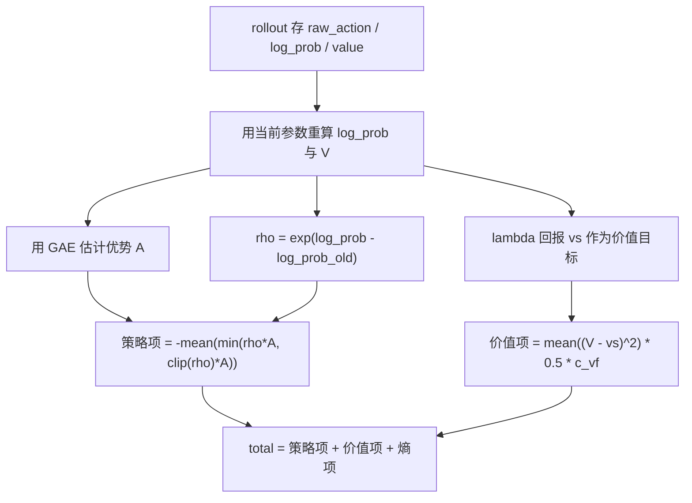
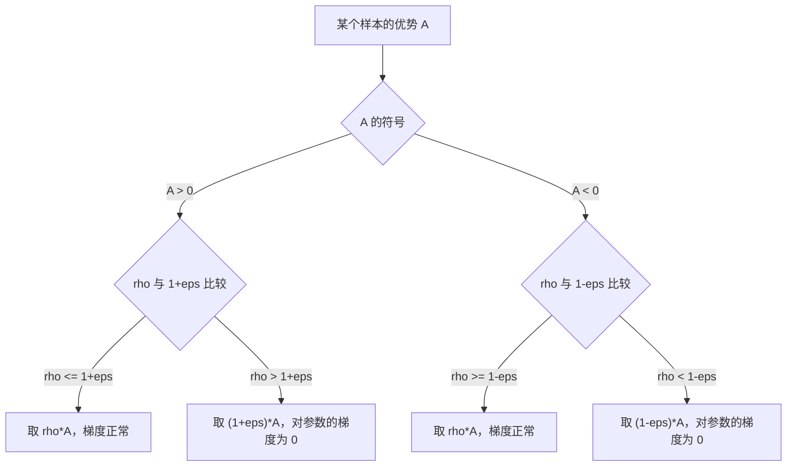

# PPO 的裁剪目标

PPO 要解决的问题是策略梯度的一次更新幅度该有多大。策略梯度是一类直接对策略参数求导的方法：把 $\nabla_\theta \log \pi_\theta(a|s) A_t$ 当梯度，动作越好（优势越大）就越提高它的概率。它的缺点是"步长敏感"——一次更新迈得太大，策略会跳出好区域，而一批采样只能消费一次。PPO（近端策略优化）的做法是给更新加一个基于概率比的悲观界，让同一批数据可以安全地反复使用。

这个悲观界在 Brax 0.14.2 里落在 `brax/training/agents/ppo/losses.py`；本仓库在 `train/train_getup.py` 与 `train/train_go1.py` 两处组装这套损失的超参。

## 1. 为什么要给策略梯度加约束

策略梯度直接最大化 $\mathbb{E}[A_t]$，用 $\nabla_\theta \log \pi_\theta(a_t|s_t) A_t$ 作梯度估计。这条估计的方差大，步长稍大就会让策略跳出好区域，而且一次采样只能用一次。

PPO 把旧策略采样的数据复用若干轮（epoch，一轮指把整批数据完整过一遍），用重要性比 $\rho$ 修正分布偏移，再用 clip 把 $\rho$ 约束在旧策略附近。这里的"信赖域"指每一步只允许策略移动多远：TRPO 显式限制新旧策略的 KL 散度（KL 衡量两个分布的差异）不超过阈值，PPO 用一个一阶可导的裁剪目标近似这件事，不需要 TRPO 的二阶求解。

| 方法 | 替代目标 | 约束方式 | 实现代价 |
| --- | --- | --- | --- |
| 原始策略梯度 | $\mathbb{E}[A\log\pi]$ | 无 | 步长敏感，样本只用一次 |
| TRPO | $\mathbb{E}[\rho A]$ | KL 硬约束加共轭梯度 | 需要 Fisher 向量积 |
| PPO-Penalty | $\mathbb{E}[\rho A]-\beta\,\mathrm{KL}$ | 自适应 KL 惩罚 | $\beta$ 需随 KL 调整 |
| PPO-Clip | $\mathbb{E}[\min(\rho A,\mathrm{clip}(\rho)A)]$ | 一阶裁剪 | 隐式约束，样本可复用 |

本仓库两套训练入口都走 PPO-Clip，没有启用 KL 惩罚，也没有启用自适应学习率（`desired_kl` 与 `learning_rate_schedule` 都取默认值）。

## 2. 重要性比与悲观替代目标

重要性比定义为新旧策略在同一动作上的概率比：

$$\rho_t(\theta)=\frac{\pi_\theta(a_t|s_t)}{\pi_{\theta_{old}}(a_t|s_t)}=\exp\big(\log\pi_\theta(a_t|s_t)-\log\pi_{\theta_{old}}(a_t|s_t)\big)$$

裁剪替代目标取未裁剪项与裁剪项的最小值：

$$L^{clip}(\theta)=\mathbb{E}_t\big[\min\big(\rho_t A_t,\;\mathrm{clip}(\rho_t,1-\epsilon,1+\epsilon)A_t\big)\big]$$

"重要性比"（ratio）是新策略与采样时旧策略在同一个动作上给出概率的比值：等于 1 说明策略没变，大于 1 说明这个动作被提高了概率。Brax 把公式直接写成几行（`brax/training/agents/ppo/losses.py` 的 `compute_ppo_loss`）：

```python
rho_s = jnp.exp(target_action_log_probs - behaviour_action_log_probs)

surrogate_loss1 = rho_s * advantages
surrogate_loss2 = (
    jnp.clip(rho_s, 1 - clipping_epsilon, 1 + clipping_epsilon) * advantages
)

policy_loss = -jnp.mean(jnp.minimum(surrogate_loss1, surrogate_loss2))
```

`jnp.exp(差值)` 把"对数概率相减"还原成概率之比；`jnp.clip` 的上下界就是 $1\pm\epsilon$；`jnp.minimum` 取两者更悲观的一支；最外层的负号是因为优化器做最小化、而目标是最大化替代目标。`advantage` 是 GAE 给出的优势估计，衡量这个动作比价值基线好多少。

$\min$ 让目标成为真实收益的悲观下界，梯度行为分两种情况：

- $A_t>0$ 时，$\rho_t>1+\epsilon$ 后两项都退化为常量 $(1+\epsilon)A_t$，对 $\theta$ 的梯度为零，策略不再被推着继续增大该动作概率。
- $A_t<0$ 时，$\rho_t<1-\epsilon$ 后同样是常量 $(1-\epsilon)A_t$，梯度为零，策略不再被推着继续降低该动作概率。

完整损失由三项相加。价值项把 $V_\theta$ 回归到回报目标；熵项里的"熵"衡量动作分布的不确定度，分布越平坦熵越大，减去熵项等价于奖励探索，避免策略过早收敛成只重复一个动作：

$$L(\theta)=L^{policy}+c_{vf}\cdot\tfrac{1}{2}\mathbb{E}\big[(V_\theta(s_t)-\hat V_t)^2\big]-c_{ent}\,\mathbb{E}[H(\pi_\theta)]$$

### 2.1 悲观界的来由

对单个样本求导，$\frac{\partial \rho_t}{\partial \theta}=\rho_t\,\nabla_\theta\log\pi_\theta$。当 $\rho_t$ 落在 $[1-\epsilon,1+\epsilon]$ 内，目标就是 $\rho_t A_t$，梯度是 $\rho_t A_t \nabla_\theta\log\pi_\theta$；越界后目标变成与 $\theta$ 无关的常数，梯度为零。也就是说，$\epsilon$ 直接给出“每个样本最多把概率抬高或压低多少”的界限。本仓库行走档取 $\epsilon=0.2$，对应 $\rho\in[0.8,1.2]$。

### 2.2 样本复用与 ratio 漂移

同一个 rollout 会被反复消费。brax 每个训练步把 rollout 切成 `num_minibatches` 份，每份过一遍就是一次梯度更新，整个流程重复 `num_updates_per_batch` 轮（`brax/training/agents/ppo/train.py`）。ratio 里的旧概率始终是 rollout 时存下的值，策略更新越多，$\rho$ 偏离 1 越远。clip 约束的正是这种漂移，这也是为什么 epoch 数不能随意加大。

### 2.3 三项损失的数据接口

$A_t$ 由 GAE 给出，$\hat V_t$ 是 GAE 的 $\lambda$-回报，二者都带 `stop_gradient`：

```python
return jax.lax.stop_gradient(vs), jax.lax.stop_gradient(advantages)
```

`stop_gradient` 表示"把这两个张量当常数用、不回传梯度"：它们是这一轮迭代的回归目标，如果目标自己也随参数一起变，价值网络就变成在追一个移动靶。策略项用优势 $A_t$，价值项用回报 $\hat V_t$，两项在同一个 minibatch 里算。优势的估计细节见同单元《GAE 优势估计》。





## 3. Brax 三项损失的组装

Brax 在一个函数里算完三项（`brax/training/agents/ppo/losses.py`）：

- 用当前策略重算 `target_action_log_probs`，旧策略的 `behaviour_action_log_probs` 来自 rollout 存的 `policy_extras.log_prob`。重算传入的是 rollout 存的 `raw_action`，不是送进环境的动作。
- 求 $\rho$ 与裁剪替代目标，就是上面那四行。
- 价值项、熵项与总损失写在同一个函数里：

```python
target_action_log_probs = parametric_action_distribution.log_prob(
    policy_logits, data.extras['policy_extras']['raw_action']
)
behaviour_action_log_probs = data.extras['policy_extras']['log_prob']
...
v_error = vs - baseline
v_loss = v_error * v_error
if clipping_epsilon_value is not None:
    ...  # 价值裁剪：本仓库不传该参数，这一支不走
v_loss = jnp.mean(v_loss) * 0.5 * vf_coefficient

entropy = jnp.mean(parametric_action_distribution.entropy(policy_logits, rng))
entropy_loss = entropy_cost * -entropy

total_loss = policy_loss + v_loss + entropy_loss
```

`log_prob` 在这里重新算了一遍：rollout 时存的是旧策略的概率，PPO 要的是新策略在同一动作上的概率，两者相比才是 ratio。价值项把 $V_\theta$ 回归到 GAE 的 $\lambda$-回报 `vs`（不是优势加基线），再乘 `0.5 * vf_coefficient`。

超参在训练入口组装。起身入口 `train/train_getup.py` 的 `ppo_params` 用 `clipping_epsilon=args.clipping_epsilon`，默认 0.2；`entropy_cost=args.entropy`，默认 0；`reward_scaling=1.0`。`normalize_advantage` 与 `vf_loss_coefficient` 没写进配置，于是落到 brax 函数签名的默认值：

```python
# brax/training/agents/ppo/train.py 的 ppo.train 签名
clipping_epsilon: float = 0.3,
gae_lambda: float = 0.95,
max_grad_norm: Optional[float] = None,
normalize_advantage: bool = True,
vf_loss_coefficient: float = 0.5,
desired_kl: float = 0.01,
```

"没写进 `ppo_params`"不等于"没有值"：签名默认值就是实际生效值。读超参要同时看仓库配置和上游签名，否则会漏掉 `normalize_advantage=True` 这类静默继承项。

行走入口 `train/train_go1.py` 有两套分支：

| 分支 | clip | entropy | 分布 | 学习率 | 梯度裁剪 |
| --- | --- | --- | --- | --- | --- |
| `--sb3_full`（v4 起，v10 验收档） | 0.2 | 0.0 | `normal` | 3e-4 | 0.5 |
| 默认（官方 locomotion 档） | 0.3 | 1e-2 | `tanh_normal` | 3e-4 | 1.0 |

`--sb3_full` 的网络是 (64,64) tanh；默认分支是 (512,256,128) silu。默认分支的 0.3 与 1e-2 是官方 locomotion 档，v1 用它时 eval_reward 长期无平台，v4 换到 SB3 档后才走通（`docs/experiment-log.md`）。这是本仓库算法超参的取值来源。

优化器在 `brax/training/agents/ppo/train.py` 组装：

```python
base_optimizer = optax.adam(learning_rate=learning_rate)
if max_grad_norm is not None:
    optimizer = optax.chain(
        optax.clip_by_global_norm(max_grad_norm),
        base_optimizer,
    )
```

`optax.chain` 把多个变换串成一个优化器、按顺序执行：先裁梯度，再交给 Adam。`clip_by_global_norm` 把所有参数的梯度当成一个长向量、按整段范数缩放，所以 `max_grad_norm=0.5` 是全局范数裁剪而不是逐元素裁剪——单个梯度元素可以大于 0.5，只要整段范数不超。

由于本仓库用 `distribution_type="normal"`，动作分布是不带 tanh 压缩的高斯，postprocess 是恒等映射（`brax/training/distribution.py`）。这一点与 ratio 直接相关：rollout 存的 `raw_action` 与送进环境的动作相同，重算 log 概率时没有 squash 的 Jacobian 修正项。若换成 `tanh_normal`，ratio 在 tanh 之前的空间上算，`log_prob` 会多一项 log-det 修正（`distribution.py`）。

## 4. 易错点

| 易错点 | 现象 | 对应位置 |
| --- | --- | --- |
| 把 clip 当硬约束 | ratio 越界后该样本梯度为零，loss 不再变化 | `losses.py` |
| 用送进环境的动作重算 log 概率 | 与 rollout 存的 `raw_action` 不一致，ratio 偏 | `losses.py` |
| 忘记对目标 detach | 价值目标带梯度，价值网络自己追自己 | `losses.py` |
| 认为价值项系数是 1 | 实际已乘 `0.5 * vf_coefficient`，默认下是 0.25 | `losses.py` |
| 想用 `clipping_epsilon_value` 裁策略 | 该参数只作用于价值网络 | `losses.py` |
| 熵系数写成正值 | 熵项变成鼓励低熵，探索被反向惩罚 | `losses.py` |
| 以为两套入口共用一套超参 | 起身 0.2/(128,128)，行走默认档 0.3/silu | `train_getup.py`、`train_go1.py` |

## 5. 小结

### 核心概念

- PPO 用重要性比与 clip 构成悲观替代目标，以一阶方法近似信赖域。
- 策略项为 `-mean(min(rho*A, clip(rho,1±eps)*A))`，越界样本的梯度为零。
- 价值项回归 GAE 的 $\lambda$-回报；本仓库沿用默认 `vf_loss_coefficient=0.5`。
- 熵项为 `-entropy_cost * entropy`；本仓库起身与 `--sb3_full` 都取 0。
- 梯度先做全局范数裁剪，再交给 Adam 更新。

### 设计权衡

| 权衡点 | 本仓库选择 | 收益与代价 |
| --- | --- | --- |
| 信赖域实现 | clip，不用 KL 惩罚 | 一阶、实现简单；代价是对 ratio 的约束是隐式的 |
| 价值裁剪 | 关闭 | 目标定义稳定；代价是回报尺度异常时无保护 |
| 熵系数 | 0 | 策略梯度不被熵项稀释；代价是探索只靠标准差参数自身收缩 |
| 动作分布 | `normal` | 动作可直达行程端点；代价是比 `tanh_normal` 少了有界的概率修正 |

### 附：本页引用的路径

| 路径 | 用途 |
| --- | --- |
| `train/train_getup.py` | 起身训练入口：PPO 超参默认值与 `ppo_params` 组装 |
| `train/train_go1.py` | 行走训练入口：`--sb3_full` 与官方档两套算法分支 |
| `brax/training/agents/ppo/losses.py` | 替代目标与 GAE 实现 |
| `brax/training/agents/ppo/train.py` | 默认超参与优化器组装 |
| `brax/training/distribution.py` | `normal` 与 `tanh_normal` 的 log 概率、熵 |
| `requirements.txt` | 锁定 `brax==0.14.2` |
| 仓库根 | `mjx-go1-getup`，上游 https://github.com/TC635807/mjx-go1-getup |

> `brax/*` 路径指 `requirements.txt` 所锁定的 brax 0.14.2 包内相对路径，不是本仓库文件。
