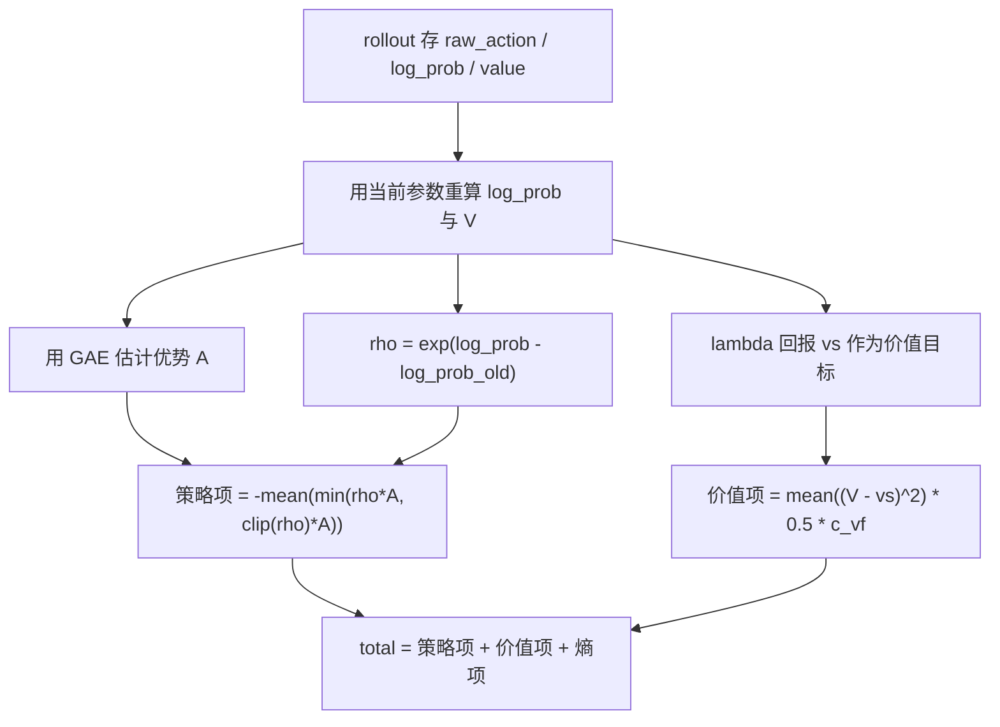
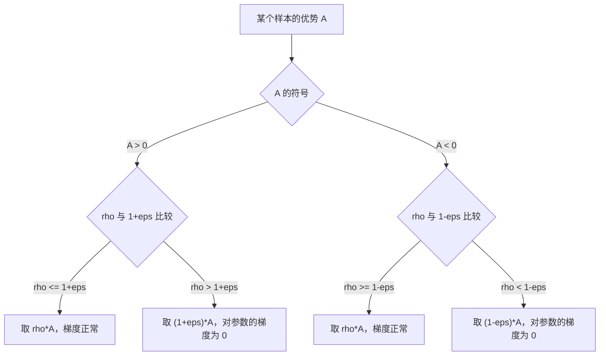

# PPO 的裁剪目标

PPO 要解决的问题是策略梯度的一次更新幅度该有多大。直接按 $\nabla_\theta \log \pi_\theta(a|s) A_t$ 更新，方差大、步长敏感，一批采样只能消费一次。PPO 的做法是给更新加一个基于概率比的悲观界，让同一批数据可以安全地反复使用。

这个悲观界在 Brax 0.14.2 里落在 `brax/training/agents/ppo/losses.py:144-304`；本仓库在 `train/train_getup.py:342-367` 与 `train/train_go1.py:710-736` 两处组装这套损失的超参。

## 1. 为什么要给策略梯度加约束

策略梯度直接最大化 $\mathbb{E}[A_t]$，用 $\nabla_\theta \log \pi_\theta(a_t|s_t) A_t$ 作梯度估计。这条估计的方差大，步长稍大就会让策略跳出好区域，而且一次采样只能用一次。

PPO 把旧策略采样的数据复用若干轮（epoch），用重要性比 $\rho$ 修正分布偏移，再用 clip 把 $\rho$ 约束在旧策略附近。它用一个一阶可导的目标近似 TRPO 的信赖域，不需要二阶求解。

| 方法 | 替代目标 | 约束方式 | 实现代价 |
| --- | --- | --- | --- |
| 原始策略梯度 | $\mathbb{E}[A\log\pi]$ | 无 | 步长敏感，样本只用一次 |
| TRPO | $\mathbb{E}[\rho A]$ | KL 硬约束加共轭梯度 | 需要 Fisher 向量积 |
| PPO-Penalty | $\mathbb{E}[\rho A]-\beta\,\mathrm{KL}$ | 自适应 KL 惩罚 | $\beta$ 需随 KL 调整 |
| PPO-Clip | $\mathbb{E}[\min(\rho A,\mathrm{clip}(\rho)A)]$ | 一阶裁剪 | 隐式约束，样本可复用 |

本仓库两套训练入口都走 PPO-Clip，没有启用 KL 惩罚，也没有启用自适应学习率（`desired_kl` 与 `learning_rate_schedule` 都取默认值）。

## 2. 重要性比与悲观替代目标

重要性比定义为新旧策略在同一动作上的概率比：

$$\rho_t(\theta)=\frac{\pi_\theta(a_t|s_t)}{\pi_{\theta_{old}}(a_t|s_t)}=\exp\big(\log\pi_\theta(a_t|s_t)-\log\pi_{\theta_{old}}(a_t|s_t)\big)$$

裁剪替代目标取未裁剪项与裁剪项的最小值：

$$L^{clip}(\theta)=\mathbb{E}_t\big[\min\big(\rho_t A_t,\;\mathrm{clip}(\rho_t,1-\epsilon,1+\epsilon)A_t\big)\big]$$

$\min$ 让目标成为真实收益的悲观下界，梯度行为分两种情况：

- $A_t>0$ 时，$\rho_t>1+\epsilon$ 后两项都退化为常量 $(1+\epsilon)A_t$，对 $\theta$ 的梯度为零，策略不再被推着继续增大该动作概率。
- $A_t<0$ 时，$\rho_t<1-\epsilon$ 后同样是常量 $(1-\epsilon)A_t$，梯度为零，策略不再被推着继续降低该动作概率。

完整损失由三项相加。价值项把 $V_\theta$ 回归到回报目标，熵项维持探索：

$$L(\theta)=L^{policy}+c_{vf}\cdot\tfrac{1}{2}\mathbb{E}\big[(V_\theta(s_t)-\hat V_t)^2\big]-c_{ent}\,\mathbb{E}[H(\pi_\theta)]$$

### 2.1 悲观界的来由

对单个样本求导，$\frac{\partial \rho_t}{\partial \theta}=\rho_t\,\nabla_\theta\log\pi_\theta$。当 $\rho_t$ 落在 $[1-\epsilon,1+\epsilon]$ 内，目标就是 $\rho_t A_t$，梯度是 $\rho_t A_t \nabla_\theta\log\pi_\theta$；越界后目标变成与 $\theta$ 无关的常数，梯度为零。也就是说，$\epsilon$ 直接给出“每个样本最多把概率抬高或压低多少”的界限。本仓库行走档取 $\epsilon=0.2$，对应 $\rho\in[0.8,1.2]$。

### 2.2 样本复用与 ratio 漂移

同一个 rollout 会被反复消费。brax 每个训练步把 rollout 切成 `num_minibatches` 份，每份过一遍就是一次梯度更新，整个流程重复 `num_updates_per_batch` 轮（`brax/training/agents/ppo/train.py:621-628`）。ratio 里的旧概率始终是 rollout 时存下的值，策略更新越多，$\rho$ 偏离 1 越远。clip 约束的正是这种漂移，这也是为什么 epoch 数不能随意加大。

### 2.3 三项损失的数据接口

$A_t$ 由 GAE 给出，$\hat V_t$ 是 GAE 的 $\lambda$-回报，二者都带 `stop_gradient`（`brax/training/agents/ppo/losses.py:100`、`:233-235`）。策略项用优势 $A_t$，价值项用回报 $\hat V_t$，两项在同一个 minibatch 里算。优势的估计细节见同单元《GAE 优势估计》。

## 3. Brax 三项损失的组装

Brax 在一个函数里算完三项（`brax/training/agents/ppo/losses.py`）：

- `:216-219` 用当前策略重算 `target_action_log_probs`，旧策略的 `behaviour_action_log_probs` 来自 rollout 存的 `policy_extras.log_prob`。重算传入的是 rollout 存的 `raw_action`，不是送进环境的动作。
- `:238-245` 求 $\rho$ 与裁剪替代目标，`policy_loss = -jnp.mean(jnp.minimum(surrogate_loss1, surrogate_loss2))`。
- `:258-269` 价值项，`v_error = vs - baseline`，再乘 `0.5 * vf_coefficient`。$\hat V_t$ 是 GAE 的 $\lambda$-回报 `vs`，不是优势加基线。
- `:272-275` 熵项与总损失，`entropy_loss = entropy_cost * -entropy`，`total_loss = policy_loss + v_loss + entropy_loss`。
- `:260` 的价值裁剪只在 `clipping_epsilon_value` 非空时启用。本仓库不传该参数，价值项不裁剪。

超参在训练入口组装。起身入口 `train/train_getup.py` 的 `ppo_params`（`:342-367`）用 `clipping_epsilon=args.clipping_epsilon`（`:358`），默认 0.2（`:131`）；`entropy_cost=args.entropy`（`:354`），默认 0（`:123`）；`reward_scaling=1.0`（`:345`）。`normalize_advantage` 与 `vf_loss_coefficient` 未出现在配置里，取 brax 默认值 `True` 与 `0.5`（`brax/training/agents/ppo/train.py:210-211`）。

行走入口 `train/train_go1.py` 有两套分支：

| 分支 | clip | entropy | 分布 | 学习率 | 梯度裁剪 |
| --- | --- | --- | --- | --- | --- |
| `--sb3_full`（v4 起，v10 验收档） | 0.2（`:345`） | 0.0（`:342`） | `normal`（`:349`） | 3e-4（`:721`） | 0.5（`:344`） |
| 默认（官方 locomotion 档） | 0.3（`:394`） | 1e-2（`:369`） | `tanh_normal`（`:396`） | 3e-4（`:721`） | 1.0（`:393`） |

`--sb3_full` 的网络是 (64,64) tanh（`:347-351`）；默认分支是 (512,256,128) silu（`:379-380`、`:398`）。默认分支的 0.3 与 1e-2 是官方 locomotion 档，v1 用它时 eval_reward 长期无平台，v4 换到 SB3 档后才走通（`docs/experiment-log.md:210-219`）。这是本仓库算法超参的取值来源。

优化器在 `brax/training/agents/ppo/train.py` 组装：`:452` 建 `optax.adam(learning_rate)`；`:460-465` 在 Adam 之前挂 `optax.clip_by_global_norm(max_grad_norm)`。所以 `max_grad_norm=0.5` 是全局范数裁剪，不是逐元素裁剪。

由于本仓库用 `distribution_type="normal"`，动作分布是不带 tanh 压缩的高斯，postprocess 是恒等映射（`brax/training/distribution.py:188-205`）。这一点与 ratio 直接相关：rollout 存的 `raw_action` 与送进环境的动作相同，重算 log 概率时没有 squash 的 Jacobian 修正项。若换成 `tanh_normal`，ratio 在 tanh 之前的空间上算，`log_prob` 会多一项 log-det 修正（`distribution.py:74-81`）。

## 4. 易错点

| 易错点 | 现象 | 对应位置 |
| --- | --- | --- |
| 把 clip 当硬约束 | ratio 越界后该样本梯度为零，loss 不再变化 | `losses.py:240-245` |
| 用送进环境的动作重算 log 概率 | 与 rollout 存的 `raw_action` 不一致，ratio 偏 | `losses.py:216-218` |
| 忘记对目标 detach | 价值目标带梯度，价值网络自己追自己 | `losses.py:100`、`:233-235` |
| 认为价值项系数是 1 | 实际已乘 `0.5 * vf_coefficient`，默认下是 0.25 | `losses.py:269` |
| 想用 `clipping_epsilon_value` 裁策略 | 该参数只作用于价值网络 | `losses.py:260-268` |
| 熵系数写成正值 | 熵项变成鼓励低熵，探索被反向惩罚 | `losses.py:272-273` |
| 以为两套入口共用一套超参 | 起身 0.2/(128,128)，行走默认档 0.3/silu | `train_getup.py:131-133`、`train_go1.py:394-398` |

## 5. 小结

### 核心概念

- PPO 用重要性比与 clip 构成悲观替代目标，以一阶方法近似信赖域。
- 策略项为 `-mean(min(rho*A, clip(rho,1±eps)*A))`，越界样本的梯度为零。
- 价值项回归 GAE 的 $\lambda$-回报；本仓库沿用默认 `vf_loss_coefficient=0.5`。
- 熵项为 `-entropy_cost * entropy`；本仓库起身与 `--sb3_full` 都取 0。
- 梯度先做全局范数裁剪，再交给 Adam 更新。

### 设计权衡

| 权衡点 | 本仓库选择 | 收益与代价 |
| --- | --- | --- |
| 信赖域实现 | clip，不用 KL 惩罚 | 一阶、实现简单；代价是对 ratio 的约束是隐式的 |
| 价值裁剪 | 关闭 | 目标定义稳定；代价是回报尺度异常时无保护 |
| 熵系数 | 0 | 策略梯度不被熵项稀释；代价是探索只靠标准差参数自身收缩 |
| 动作分布 | `normal` | 动作可直达行程端点；代价是比 `tanh_normal` 少了有界的概率修正 |

### 附：本页引用的路径

| 路径 | 用途 |
| --- | --- |
| `train/train_getup.py` | 起身训练入口，PPO 超参在 `:113-134`、`:342-391` |
| `train/train_go1.py` | 行走训练入口，两套算法分支在 `:318-398`、`:710-754` |
| `brax/training/agents/ppo/losses.py` | 替代目标与 GAE 实现（`:144-304`） |
| `brax/training/agents/ppo/train.py` | 默认超参与优化器组装（`:176-242`、`:452-481`、`:621-628`） |
| `brax/training/distribution.py` | `normal` 与 `tanh_normal` 的 log 概率、熵（`:74-92`、`:188-205`） |
| `requirements.txt` | 锁定 `brax==0.14.2`（`:13`） |
| 仓库根 | `mjx-go1-getup`，上游 https://github.com/TC635807/mjx-go1-getup |

> `brax/*` 路径指 `requirements.txt` 所锁定的 brax 0.14.2 包内相对路径，不是本仓库文件。
