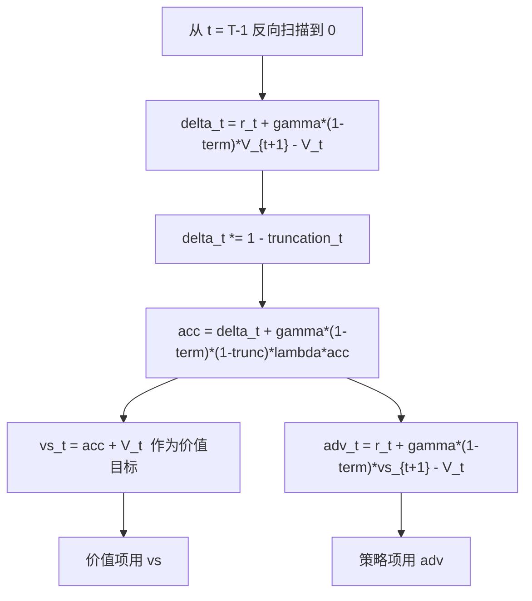
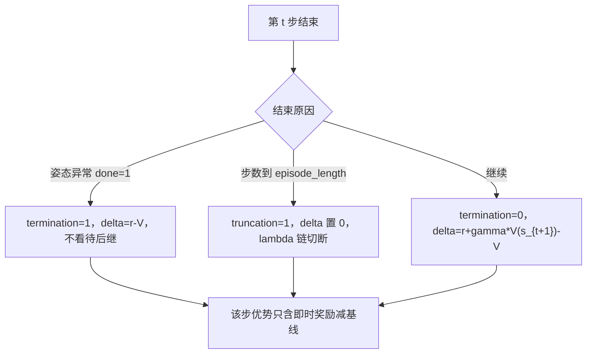

# GAE 优势估计

优势函数衡量某个动作比平均水平好多少，用它代替回报做策略梯度的权重，方差会明显下降。GAE 在此基础上引入衰减因子 $\lambda$，把一步时序差分与蒙特卡洛回报在两端之间插值。

Brax 的实现位于 `brax/training/agents/ppo/losses.py:38-100`，并在 `:221-229` 被 PPO 损失调用。本仓库没有覆写 `gae_lambda`，实际取的是默认值 0.95。

## 1. 优势与基线的作用

策略梯度里直接用回报 $G_t$ 作权重方差很大。减去一个与动作无关的基线 $b(s_t)$ 不改变期望，却能把方差显著压低，于是用优势 $A_t=Q(s_t,a_t)-V(s_t)$ 代替回报。最简单的估计是一步时序差分残差：

$$\delta_t = r_t + \gamma V(s_{t+1}) - V(s_t)$$

$\delta_t$ 只用一步真实奖励，偏差大但方差小；用整条轨迹的蒙特卡洛回报则反过来，方差大而无偏。GAE 用 $\lambda$ 在两者之间插值，是对所有 $n$ 步优势的指数加权和。

| 估计量 | 形式 | 偏差 | 方差 | 有效视野 |
| --- | --- | --- | --- | --- |
| 一步 TD | $\delta_t$ | 高（依赖 $V$ 的准度） | 低 | 1 步 |
| $n$ 步优势 | $\sum_{l=0}^{n-1}\gamma^l\delta_{t+l}$ | 中，随 $n$ 上升 | 中 | $n$ 步 |
| 蒙特卡洛 | $G_t-V_t$ | 零 | 高 | 整条 episode |
| GAE($\lambda$) | $\sum_{l\ge0}(\gamma\lambda)^l\delta_{t+l}$ | 由 $\lambda$ 调节 | 由 $\lambda$ 调节 | $1/(1-\gamma\lambda)$ |

## 2. GAE 的几何加权与递推

### 2.1 闭式与递推

GAE 的定义是 TD 残差的几何加权和：

$$A^{GAE(\lambda)}_t=\sum_{l=0}^{\infty}(\gamma\lambda)^l\,\delta_{t+l}$$

把求和按 $l=0$ 拆开，得到从后向前的递推，这也是代码采用的写法：

$$A_t=\delta_t+\gamma\lambda\,A_{t+1},\qquad A_T=0 \text{（窗口末端另加自举）}$$

$\lambda=0$ 退化为 $\delta_t$，$\lambda=1$ 退化为蒙特卡洛回报减基线。权重按 $(\gamma\lambda)^l$ 衰减，所以有效视野约为 $1/(1-\gamma\lambda)$ 步。本仓库 $\gamma=0.99$、$\lambda=0.95$，$\gamma\lambda=0.9405$，按公式算半衰期约 11.3 步。

$\lambda$ 越小，$\delta$ 里价值误差被叠加的次数越少，偏差也越小；$\lambda$ 越大越接近蒙特卡洛回报，方差越大。所以调参方向是：价值函数估得准时可以把 $\lambda$ 调大，估得不准时调小。

### 2.2 价值目标

优势只用于策略项，价值网络需要的是回报目标。把优势加回基线就得到 $\lambda$-回报：

$$\hat V_t=A_t+V(s_t)$$

价值项把 $V_\theta(s_t)$ 回归到 $\hat V_t$。brax 把 $\hat V_t$ 放在 `vs` 里返回（`losses.py:92`），优势放在另一个张量里（`:97-99`），两者都做 `stop_gradient`（`:100`）。

### 2.3 终止与截断

两者的语义不同，代码用两个独立的信号区分：

- 姿态异常导致的终止（`done=1`，非到时）：不再有后继状态，$\delta_t=r_t-V(s_t)$，自举被关闭。
- 到达 `episode_length` 的截断：回合到点是人为切断，理论上应当自举；brax 的处理是把该步的 $\delta$ 乘 0 并切断 $\lambda$ 链，不引入 $V(s_{t+1})$。

`brax/training/agents/ppo/losses.py:213-214` 用 `termination = (1 - discount) * (1 - truncation)` 把两者合成一个掩码；`:68`、`:74`、`:81` 再把 `truncation` 作为乘子。截断信号由 `EpisodeWrapper` 在步数到达上限且非终止时置 1（`brax/envs/wrappers/training.py:105-112`）。

### 2.4 自举与 detach

窗口末端的 $V(s_T)$ 由当前价值网络给出，与 $A_T=0$ 一起构成自举边界。这个值只作为常数使用，不能带梯度回流，否则价值目标会随参数一起变，回归就没有固定目标。`vs` 与 `advantages` 在返回前都做 `stop_gradient`（`brax/training/agents/ppo/losses.py:100`）。

## 3. 本仓库的 GAE 调用与默认值

PPO 损失函数的签名里 `gae_lambda: float = 0.95`（`brax/training/agents/ppo/train.py:208`）。起身与行走两套入口的 `ppo_params` 都没有 `gae_lambda` 项（`train/train_getup.py:342-367`、`train/train_go1.py:710-736`），所以 $\lambda$ 恒为 0.95。折扣则显式传入：起身 0.99（`train_getup.py:130`、`:352`），行走 `--sb3_full` 档 0.99（`train_go1.py:343`），官方默认档 0.97（`train_go1.py:370`）。

GAE 的窗口在 `compute_ppo_loss` 里按 minibatch 计算，张量形状是 `[unroll_length, batch_size]`（`losses.py:189` 换轴后）。窗口长度等于 `unroll_length`，本仓库是 32（`train_getup.py:119`、`train_go1.py:338`），窗口末尾用价值网络的输出自举（`losses.py:206-209`）。参考实现 SB3 在 2048 步的 rollout 上算优势，这里受显存限制只能取 32（`train/train_go1.py:130-137`、`docs/experiment-log.md:380-384`）。

按公式估算 32 步窗口的截断误差：$\gamma^{32}=0.99^{32}\approx0.725$，$(\gamma\lambda)^{32}=0.9405^{32}\approx0.140$。32 步以外的 TD 残差在求和中的权重已低于 0.14，这是仓库文档判断“影响有限”的依据。该数值为按公式计算，未单独实测。

brax 另有 `bootstrap_on_timeout`，开启时在超时步给奖励补上 $\gamma V(s)$（`train.py:212`、`:599-609`）。本仓库没有传该参数，默认 `False`，超时步的奖励被截断掩码乘 0。

优势归一化由 `normalize_advantage` 控制，默认 `True`（`train.py:210`），代码在本 minibatch 内做零均值单位方差标准化（`losses.py:236-237`）。回报目标不做标准化（`:230-232` 的注释写明要保持物理尺度）。minibatch 只有 `batch_size × unroll_length` 条转移，起身档是 2×32=64 条（`train_getup.py:331-339`），统计量的样本量不大。

奖励缩放写成 `rewards = data.reward * reward_scaling`（`losses.py:212`），本仓库两处都取 `reward_scaling=1.0`（`train_getup.py:345`、`train_go1.py:713`）。缩放会同时改优势与价值目标的尺度，不会改 ratio。

brax 的 `advantages` 用的是 `r_t + \gamma\,vs_{t+1} - V_t`，其中 `vs` 是 $\lambda$-回报。$\lambda=1$ 时它与教科书形式 $A_t$ 一致；$\lambda<1$ 时与 $vs_t-V_t$ 相差 $\gamma(1-\lambda)A_{t+1}$（该差值按递推式推导，未单独实验验证）。价值项使用的是 `vs`（`losses.py:258`），不是 `advantages + baseline`；后者赋值给 `gae_returns`（`:233-235`），在非分布 critic 分支里不参与价值损失。

窗口长短还要和回合长度一起看。起身回合长 300 个控制步（`envs/go1_getup.py:74`），行走回合长 750 步（`envs/go1_walk.py:67`），控制周期 0.02s（`envs/go1_walk.py:65`）。GAE 只看其中连续的 32 步，回合越长，单次优势估计覆盖的比例越小。

保留 $\lambda$-回报的理由在于：优势加回基线得到 $\hat V_t$，与 $\lambda$-回报在 $\lambda=1$ 时等价；$\lambda<1$ 时两者不同，只有 $\hat V_t$ 进入价值损失。读实现时以 `v_error = vs - baseline`（`losses.py:258`）为准。

## 4. 易错点

| 易错点 | 现象 | 对应位置 |
| --- | --- | --- |
| 把截断当终止 | 该步奖励被截断掩码乘 0，优势链提前断 | `losses.py:68-74` |
| 把终止当截断 | 给不存在后继的终止步自举，价值目标偏高 | `losses.py:213-214` |
| 以为 `gae_lambda` 被调过 | 配置里没有该项，一直是 0.95 | `train_getup.py:342-367` |
| 把 rollout 长度当 GAE 窗口 | 窗口是 `unroll_length`=32，不是 24576 | `losses.py:189`、`train_go1.py:338` |
| 用 `vs_t - V_t` 当策略优势 | 与代码用的 `r+\gamma vs_{t+1}-V_t` 不等价 | `losses.py:97-99` |
| 对优势与回报做了同一套缩放 | 回报被标准化后价值网络失去物理尺度 | `losses.py:230-237` |
| 把 `\lambda` 与 `\gamma` 混为一谈 | 有效视野是 $1/(1-\gamma\lambda)$ 步，与 $1/(1-\gamma)$ 相差一倍以上 | `train.py:195`、`:208` |
| 以为窗口末端不需要自举 | 末步优势退化成 TD(0)，价值目标有偏 | `losses.py:206-209` |
| 调大 $\lambda$ 却不同步看有效视野 | 优势方差随 $1/(1-\gamma\lambda)$ 放大 | `train.py:208` |

## 5. 小结

### 核心概念

- 优势减去基线不改变期望，只降方差；GAE 用 $\lambda$ 在 TD 与蒙特卡洛之间插值。
- 递推形式为 $A_t=\delta_t+\gamma\lambda A_{t+1}$，权重按 $(\gamma\lambda)^l$ 衰减。
- 价值目标是 $\lambda$-回报 $\hat V_t=A_t+V_t$，与优势分开返回且都 detach。
- 终止不 bootstrap，截断的 $\delta$ 被置 0；两者由 `termination` 与 `truncation` 两个信号区分。
- 本仓库 $\lambda=0.95$ 取自 brax 默认，GAE 窗口等于 `unroll_length`=32。

### 设计权衡

| 权衡点 | 本仓库选择 | 收益与代价 |
| --- | --- | --- |
| GAE 窗口 | 32 步（=$\lambda$ 自举） | 显存与吞吐可接受；代价是优势视野比 SB3 的 2048 短 |
| $\lambda$ | 默认 0.95 | 偏差方差折中；代价是没有按任务调过 |
| 截断处理 | 置 0 并断链 | 实现简单；代价是超时步的即时奖励被丢弃 |
| 优势归一化 | 开 | 数值稳定；代价是优势绝对尺度被抹掉，64 条样本的统计噪声偏大 |

### 附：本页引用的路径

| 路径 | 用途 |
| --- | --- |
| `brax/training/agents/ppo/losses.py` | `compute_gae` 与损失调用（`:38-100`、`:189-237`） |
| `brax/training/agents/ppo/train.py` | `gae_lambda`、`bootstrap_on_timeout` 默认值（`:208`、`:212`、`:599-609`） |
| `brax/envs/wrappers/training.py` | `EpisodeWrapper` 写 `truncation`（`:105-112`） |
| `train/train_getup.py` | 起身入口，$\gamma$ 与 minibatch 结构（`:130-133`、`:331-339`） |
| `train/train_go1.py` | 行走入口，两档折扣与窗口说明（`:337-370`、`:130-137`） |
| `docs/experiment-log.md` | 与 SB3 的 GAE 视野差异记录（`:380-384`） |
| 仓库根 | `mjx-go1-getup`，上游 https://github.com/TC635807/mjx-go1-getup |
| `requirements.txt` | 锁定 `brax==0.14.2`（`:13`） |
