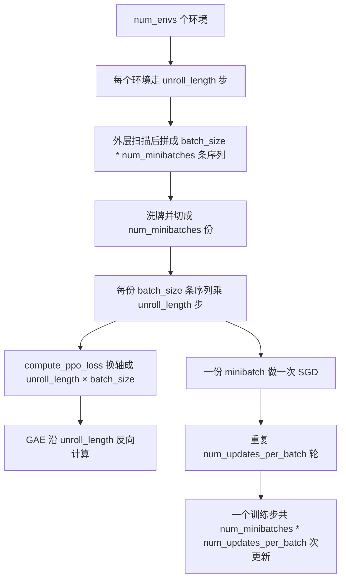
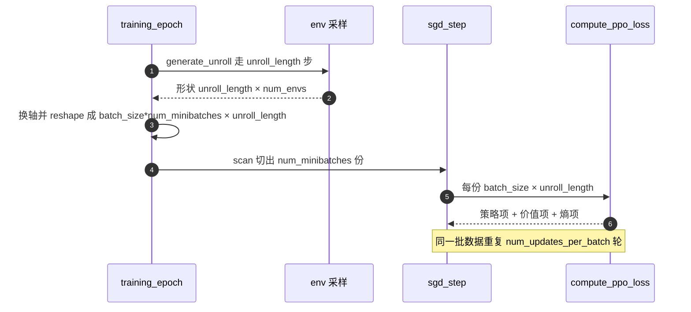

# Brax PPO 的批量语义

brax 的 PPO 训练由三层嵌套组成：训练步、epoch、minibatch。先交代三个词：一次 **rollout** 指并行环境按当前策略连续采样出的一段轨迹集合；一个 **minibatch** 是从这段数据里切出的一小份，做一次梯度更新（SGD）；一个 **epoch** 指把整份 rollout 完整过一遍，也就是切成 `num_minibatches` 份各更新一次。每层的数量都对应一个容易与直觉对不上的参数，比如 `batch_size` 指的是每个 minibatch 的序列数，而不是一次采样的转移总数。

数据流写在 `brax/training/agents/ppo/train.py` 的 `training_step` 里；本仓库把命令行参数映射过去的代码在 `train/train_go1.py` 与 `train/train_getup.py`。

## 1. 三层嵌套与批参数

brax 的 PPO 训练由三层嵌套组成，每层有一个容易与直觉对不上的参数：

| 层 | 参数 | 语义 | 本仓库典型值 |
| --- | --- | --- | --- |
| 采样 | `num_envs` | 并行环境数 | 768 |
| 采样 | `unroll_length` | 每个环境连续走多少步 | 32 |
| 切分 | `batch_size` | 每个 minibatch 的序列条数 | 2 |
| 切分 | `num_minibatches` | 一个 epoch 切成几份，也就是几次 SGD | 384 |
| 更新 | `num_updates_per_batch` | 同一批数据过几遍（epoch 数） | 10 |
| 预算 | `num_timesteps` | 总环境步数，不是梯度更新次数 | 50,000,000 |

关键点在于 `batch_size` 计的是序列条数，一个 minibatch 的转移数是 `batch_size × unroll_length`。这里的"转移"（transition）指一步交互产生的 `(s, a, r, s')` 记录，是 PPO 消费的最小单位。v4 到 v8 曾把 `batch_size` 误当成转移数，填 64，导致每个 minibatch 变成 2048 条，梯度密度只有目标值的 1/32（`docs/experiment-log.md`）。

一个训练步消耗的环境步数是：

$$N_{step}=batch\_size\times unroll\_length\times num\_minibatches\times action\_repeat$$

由于本仓库取 `batch_size = num_envs // num_minibatches`，$batch\_size\times num\_minibatches=num\_envs$，于是 $N_{step}=num\_envs\times unroll\_length$。

## 2. training_step 的四步数据变换

### 2.1 张量布局

`training_step` 里的数据依次经过四步变换（`train.py`）：

1. `generate_unroll` 在 `unroll_length` 步上扫描，单个数据块形状为 `[unroll_length, num_envs, ...]`。
2. 外层 `lax.scan` 重复 `batch_size * num_minibatches // num_envs` 次，再加一个前导维。
3. `swapaxes(1, 2)` 后再 `reshape(-1, unroll_length, ...)`，得到 `[batch_size * num_minibatches, unroll_length, ...]`（的注释与断言给出这一形状）。
4. `sgd_step` 先随机置换，再 `reshape(num_minibatches, -1, ...)`，每个 minibatch 是 `[batch_size, unroll_length, ...]`。

前两步在 `training_step` 里就是三段（`brax/training/agents/ppo/train.py`）：

```python
(state, _), data = jax.lax.scan(
    f, (state, key_generate_unroll), (),
    length=batch_size * num_minibatches // num_envs,
)
# Have leading dimensions (batch_size * num_minibatches, unroll_length)
data = jax.tree_util.tree_map(lambda x: jnp.swapaxes(x, 1, 2), data)
data = jax.tree_util.tree_map(
    lambda x: jnp.reshape(x, (-1,) + x.shape[2:]), data
)
assert data.discount.shape[1:] == (unroll_length,)
```

`jax.lax.scan` 在这里把"重复采样若干次"表达成一个静态长度的循环（长度必须编译期可知，JAX 才能把它压进一张图）。`swapaxes(x, 1, 2)` 交换环境维与时间维，`reshape(-1, unroll_length, ...)` 再把前两维压平，于是得到"一批序列 × 每序列 unroll_length 步"的布局。`jax.tree_util.tree_map` 对 pytree 的每个叶子应用同一个函数——`data` 是嵌套的 `Transition` 结构，这样不用逐字段写一遍。

进 `compute_ppo_loss` 后换轴成 `[unroll_length, batch_size]`，GAE 就沿 `unroll_length` 这一维反向做（`losses.py`）。

### 2.2 步数与 checkpoint 间隔

`training_epoch` 连续跑 `num_training_steps_per_epoch` 个训练步（`train.py`），这个数由总预算按评估次数等分：

$$num\_training\_steps\_per\_epoch=\left\lceil\frac{num\_timesteps}{num\_evals_{after}\times N_{step}\times \max(num\_resets\_per\_eval,1)}\right\rceil$$

每个 epoch 结束时存一次 checkpoint 并评估，所以检查点步数的间隔就是 $epoch\times N_{step}$。行走档 20M 步、`num_evals=5` 时算出每个 epoch 5,013,504 步，检查点落在 5.01M/10.03M 这类位置（`docs/experiment-log.md`）。公式里的 $\lceil\cdot\rceil$ 是向上取整：预算除不尽时会补一步，所以 epoch 长度通常不是整数倍，检查点落点相应偏移。





## 3. 本仓库的批参数映射

起身入口 `train/train_getup.py` 把参数换算成三个数：

```python
layers = tuple(int(x) for x in args.layers.split(","))
batch_size = args.num_envs // args.num_minibatches
assert args.num_envs % args.num_minibatches == 0
rollout = args.num_envs * args.unroll_length
```

默认 `num_envs=768`、`num_minibatches=384`，所以 `batch_size=2`，每个 minibatch 是 2 序列 × 32 步 = 64 条转移，rollout 是 768×32=24576 条。`train/train_getup.py` 会把这三个数打印出来，包括“每批梯度更新 = updates_per_batch × num_minibatches = 3840 次”。

行走入口 `train/train_go1.py` 的 `--sb3_full` 分支直接写死 `num_envs=768`、`unroll_length=32`、`batch_size=2`、`minibatches=384`、`updates_per_batch=10`，并在注释里给出与 SB3 的对应关系与梯度密度 6.4 样本/更新。默认分支不写死，用 `batch_size = num_envs // minibatches` 并断言整除，`num_envs=8192`、`minibatches=32` 时得到 `batch_size=256`。

与 SB3 的映射表 仓库文档把两边逐项对齐（`docs/experiment-log.md`）：

| SB3 参数 | brax 参数 | 本仓库取值 |
| --- | --- | --- |
| `n_envs × n_steps` | `num_envs × unroll_length` | 768 × 32 = 24576 |
| `batch_size` | `batch_size × unroll_length` | 2 × 32 = 64 条转移 |
| `n_epochs` | `num_updates_per_batch` | 10，合计 3840 次更新/rollout |
| `num_timesteps` | `num_timesteps` | 都是环境总步数 |

磁盘证据 v4 到 v8 用 `batch_size=64`，checkpoint 间隔是 786432 = 64×32×384；修正后 v10 的间隔是 270336 = 11×24576（`docs/experiment-log.md`）。检查点间隔直接反映每个训练步吃掉多少环境步，是核对口径最省事的量。

口径区分 `num_timesteps` 是环境步总数。SB3 的 5M 步对应 203 个训练步、约 78 万次梯度更新；v9 只给 400K 步，等于 16 个训练步、约 6.1 万次更新，只有参考的 1/12（`docs/experiment-log.md`）。

## 4. 易错点

| 易错点 | 现象 | 对应位置 |
| --- | --- | --- |
| 把 `batch_size` 当转移数 | 每个 minibatch 大 32 倍，梯度密度骤降 | `train.py`、`docs/experiment-log.md` |
| 忘记整除断言 | `batch_size * num_minibatches % num_envs != 0` 直接报错 | `train.py`、`train_go1.py` |
| 把 `num_timesteps` 当更新次数 | 总预算小一个数量级，学不动 | `docs/experiment-log.md` |
| 把 `num_minibatches` 当 minibatch 条数 | 与 `batch_size` 的关系反了 | `train.py` |
| 以为 epoch 长度正好是 5M 的整数倍 | 实际由向上取整决定，检查点落点偏移 | `docs/experiment-log.md` |
| 改 `unroll_length` 却没改 GAE 预期 | 优势窗口随之变化 | `losses.py` |
| 续训时步数从 0 重新计 | 日志里的 num_steps 是本次训练的步数 | `train/train_go1.py` |

## 5. 小结

### 核心概念

- `batch_size` 是每个 minibatch 的序列数，转移数是 `batch_size × unroll_length`。
- 一个训练步消耗 `batch_size × unroll_length × num_minibatches` 条转移，本仓库等于 `num_envs × unroll_length`。
- 一个训练步内的梯度更新次数是 `num_minibatches × num_updates_per_batch`，起身档为 3840。
- `num_timesteps` 是环境步总数，不是梯度更新次数。
- checkpoint 与 eval 的间隔由 epoch 长度决定，等于总预算除以 `num_evals` 后再向上取整。

### 设计权衡

| 权衡点 | 本仓库选择 | 收益与代价 |
| --- | --- | --- |
| 并行环境数 | 768（SB3 档） | rollout 与参考一致；代价是比官方 8192 档吞吐低 |
| minibatch 大小 | 64 条转移 | 梯度密度对齐 SB3；代价是 minibatch 内统计噪声大 |
| epoch 数 | 10 | 样本复用充分；代价是 ratio 漂移靠 clip 控制 |
| 写死参数 vs 推导 | 两套分支并存 | 可复现 SB3 档；代价是默认档与 SB3 档行为差异大，容易混用 |

### 附：本页引用的路径

| 路径 | 用途 |
| --- | --- |
| `brax/training/agents/ppo/train.py` | 数据布局、步数换算与 SGD 循环 |
| `brax/training/agents/ppo/losses.py` | minibatch 进损失后的换轴 |
| `train/train_getup.py` | 起身入口的批参数推导与打印 |
| `train/train_go1.py` | 行走入口两套批参数分支 |
| `docs/experiment-log.md` | SB3 映射、预算记账与 epoch 长度 |
| 仓库根 | `mjx-go1-getup`，上游 https://github.com/TC635807/mjx-go1-getup |
| `requirements.txt` | 锁定 `brax==0.14.2` |
