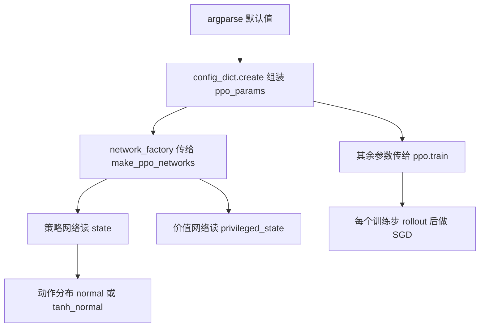
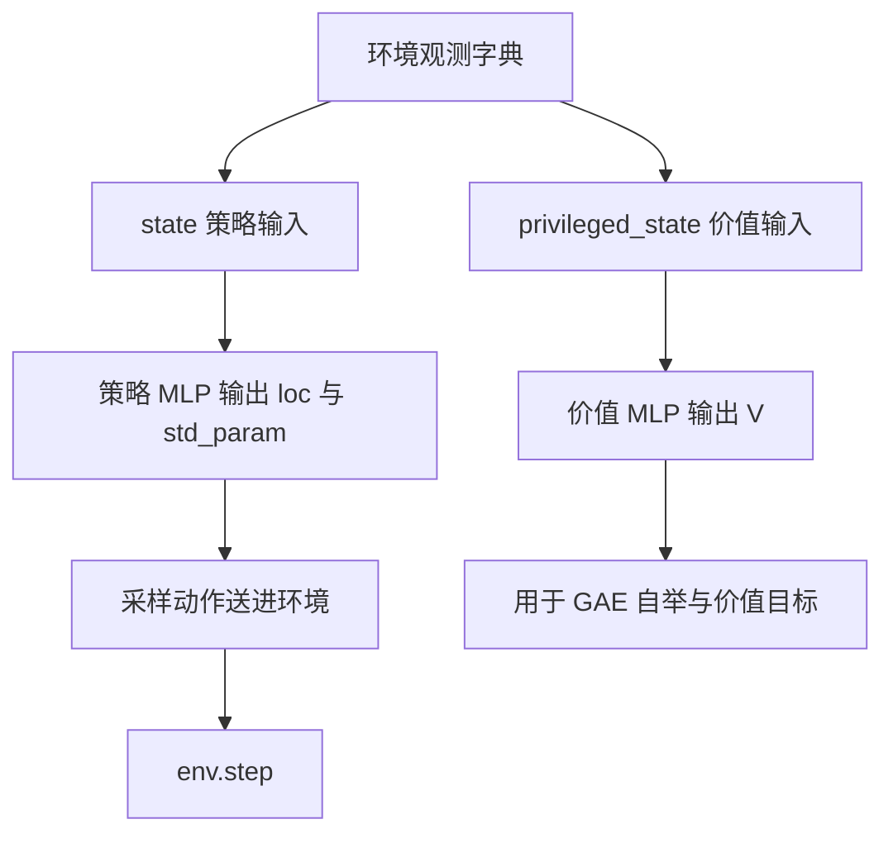

# 本仓库 PPO 超参与映射

PPO 的超参分三层：网络结构、优化器、以及环境与批量口径。混在一起看容易把改环境当成改算法。本仓库有两套训练入口，行走入口用 `--sb3_full` 对齐 Stable-Baselines3 的默认档，起身入口另建一套并沿用同一档取值。

Stable-Baselines3（SB3）是一个常用的开源 RL 参考实现，"对齐 SB3 档"指把超参逐项设成它的默认值，这样两边的训练曲线才有可比性；"官方档"则指上游 MuJoCo Playground 的 locomotion 默认配置。两档的差别在下一节的表里逐项列出。

生效值核对自 `train/train_getup.py` 与 `train/train_go1.py` 两个入口脚本的默认值与装配代码。

## 1. 超参的三个层次

PPO 的超参可以分三层，混在一起看容易把“改环境”当成“改算法”：

| 层 | 参数 | 作用位置 |
| --- | --- | --- |
| 目标 | `discounting`、`gae_lambda`、`clipping_epsilon`、`entropy_cost` | 损失函数 |
| 优化 | `learning_rate`、`max_grad_norm` | 优化器 |
| 网络与分布 | `policy_hidden_layer_sizes`、`activation`、`distribution_type`、`init_noise_std`、obs key | 网络工厂 |

本仓库有两条训练入口。行走入口 `train/train_go1.py` 有 `--sb3_full` 与官方档两套分支；起身入口 `train/train_getup.py` 是独立入口，超参照抄 `--sb3_full` 那一档，保证两个策略的优化制度一致（`train/train_getup.py`）。

## 2. 网络、优化器与组装链路

### 2.1 网络与动作分布

PPO 网络由 `make_ppo_networks` 建出（`brax/training/agents/ppo/networks.py`）。本仓库传的关键参数是 `distribution_type`、`activation`、`policy_obs_key` 与 `value_obs_key`：

```python
network_factory=config_dict.create(
    policy_hidden_layer_sizes=layers,
    value_hidden_layer_sizes=layers,
    policy_obs_key="state",
    value_obs_key="privileged_state",
    distribution_type="normal",
    activation=jax.nn.tanh,
),
```

`config_dict.create` 把一组关键字参数包成可嵌套的字典；`activation` 传的是函数对象（`jax.nn.tanh`）而不是字符串——brax 会直接调用它，写成 `"tanh"` 会 `TypeError`。

策略与价值看不同的观测：策略看 `state`，价值看 `privileged_state`。这是非对称 actor-critic——actor 指输出动作的策略网络，critic 指估计状态价值的价值网络，两者共享同一轮 PPO 更新；价值网络拿到更多信息，只用来把基线估得更准，不进入部署时的策略输入。

两种分布的差别在于是否对高斯做 tanh 压缩（`brax/training/agents/ppo/networks.py`）：

| `distribution_type` | 参数头 | postprocess | log 概率 |
| --- | --- | --- | --- |
| `normal` | loc 与 std_param 两个部分 | 恒等 | 无 Jacobian 修正 |
| `tanh_normal` | MLP 一次输出 $2\times$ 动作维 | tanh | 带 log-det 修正 |

`normal` 的尺度参数是 `PolicyModuleWithStd` 里的 `std_param`，初值就是 `init_noise_std`（`brax/training/networks.py`），它是可学习参数，训练中自己收缩。采样写成 $a=\mu+\sigma\epsilon$，若环境再乘 `action_scale`，送到关节的有效噪声是两者之积。仓库配方调研里把这条写成了“有效探索噪声 = init_noise_std × action_scale”（`docs/getup-recipes.md`）。

两种分布的差别落在 `log_prob` 的实现上：

```python
def log_prob(self, parameters, actions):
    dist = self.create_dist(parameters)
    log_probs = dist.log_prob(actions)
    log_probs -= self._postprocessor.forward_log_det_jacobian(actions)
    ...
```

`forward_log_det_jacobian` 是 tanh 这类可逆变换带来的体积修正项：变量被压缩后概率密度会变，必须把雅可比行列式补回来。`normal` 的 postprocessor 是恒等映射，这一项为 0，ratio 直接在动作空间上算；`tanh_normal` 先采样再压缩到有界区间，少了这一项就会低估概率、让 ratio 偏。

### 2.2 优化器

优化器是 `optax.adam(learning_rate)`，前面挂一层全局范数裁剪（`brax/training/agents/ppo/train.py`）。`lr=3e-4` 与 `max_grad_norm=0.5` 都是 SB3 默认，仓库实验记录把这两项列为“作用在参数空间，与输入维度无关，因此不随 obs 维度变化而改”（`docs/experiment-log.md`）。

### 2.3 参数怎么进入 brax

组装链路是 argparse 默认值到 `config_dict`，再拆成网络工厂与训练参数两个 partial：

```python
ppo_params.network_factory.init_noise_std = args.init_noise_std
training_params = dict(ppo_params)
network_factory = functools.partial(
    ppo_networks.make_ppo_networks, **training_params.pop("network_factory"))
train_fn = functools.partial(
    ppo.train,
    **training_params,
    network_factory=network_factory,
    seed=args.seed,
    save_checkpoint_path=ckpt_path,
    ...
)
```

`init_noise_std` 是建好 `network_factory` 之后再单独塞进去的——`config_dict` 是可变结构，所以能这样补字段。`training_params.pop("network_factory")` 把网络配置从训练参数里摘出来固定给网络工厂，剩下的整包交给 `ppo.train`；`functools.partial` 的作用是"预先把一部分参数绑定好，得到一个新的可调用对象"。





## 3. 起身入口的完整超参

起身入口的完整超参 全部取自 argparse 默认（`train_getup.py`）与装配函数 `ppo_params`：

| 项 | 值 | 来源 |
| --- | --- | --- |
| `num_timesteps` | 50,000,000 | argparse 默认 |
| `num_evals` / `num_eval_envs` | 20 / 128 | argparse 默认 |
| `episode_length` | 300 步（6s） | argparse 默认 |
| `num_envs` / `unroll_length` | 768 / 32 | argparse 默认 |
| `num_minibatches` / `updates_per_batch` | 384 / 10 | argparse 默认 |
| `lr` / `entropy` | 3e-4 / 0.0 | argparse 默认 |
| `init_noise_std` | 1.0 | argparse 默认 |
| `discounting` / `clipping_epsilon` | 0.99 / 0.2 | argparse 默认 |
| `max_grad_norm` | 0.5 | argparse 默认 |
| `layers` | (128,128) | argparse 默认 |
| `reward_scaling` / `normalize_observations` | 1.0 / False | `ppo_params` |
| `distribution_type` / `activation` | `normal` / `jax.nn.tanh` | `ppo_params` |

这些默认值就是 `train/train_getup.py` 里连着几条 `add_argument`（片段）：

```python
ap.add_argument("--num_timesteps", type=int, default=50_000_000)
ap.add_argument("--num_envs", type=int, default=768)
ap.add_argument("--unroll_length", type=int, default=32)
ap.add_argument("--num_minibatches", type=int, default=384)
ap.add_argument("--updates_per_batch", type=int, default=10)
ap.add_argument("--lr", type=float, default=3e-4)
ap.add_argument("--entropy", type=float, default=0.0)
ap.add_argument("--init_noise_std", type=float, default=1.0)
ap.add_argument("--discounting", type=float, default=0.99)
ap.add_argument("--clipping_epsilon", type=float, default=0.2)
ap.add_argument("--max_grad_norm", type=float, default=0.5)
ap.add_argument("--layers", type=str, default="128,128")
```

行走入口两档对照 `--sb3_full` 与官方档（`train/train_go1.py`）：

| 项 | `--sb3_full` | 官方档 |
| --- | --- | --- |
| `num_envs` / `unroll_length` | 768 / 32 | 8192 / 20 |
| `num_minibatches` / `updates_per_batch` | 384 / 10 | 32 / 4 |
| `discounting` | 0.99 | 0.97 |
| `clipping_epsilon` | 0.2 | 0.3 |
| `max_grad_norm` | 0.5 | 1.0 |
| `entropy_cost` | 0.0 | 1e-2 |
| 网络 | (64,64) tanh | (512,256,128) silu |
| 分布 | `normal` | `tanh_normal` |
| obs 归一化 | False | True |

`episode_length` 默认 750 步（`train_go1.py`），对应 15s。v18 用 `--layers 128,128` 覆盖了 `--sb3_full` 的 (64,64)，实际生效的是两层 128 宽（`docs/experiment-log.md`）。

被静默继承的 brax 默认值 两个入口的 `ppo_params` 都没有下列项，于是取 brax 默认（`brax/training/agents/ppo/train.py`）：

| 项 | 默认值 | 影响 |
| --- | --- | --- |
| `gae_lambda` | 0.95 | 优势估计的偏差方差折中 |
| `normalize_advantage` | True | 优势按 minibatch 标准化 |
| `vf_loss_coefficient` | 0.5 | 价值项再乘 0.5 |
| `bootstrap_on_timeout` | False | 超时步不补自举 |
| `deterministic_eval` | False | 评估带采样噪声 |
| `learning_rate_schedule` | None | 不做自适应学习率 |

微调档的建议值 配方调研给 BC 微调提了一组参数：`init_noise_std` 0.3、`num_minibatches` 384→32、`updates_per_batch` 10→2、`lr` 1e-5、`entropy` 0、加 `desired_kl` 约 0.01、第一阶段冻结价值网络（`docs/getup-recipes.md`）。该建议标注为“单用已被否证三次”，属待验证项，不是本仓库当前默认。

动作尺度 `init_noise_std` 要乘环境里的动作尺度才是有效噪声（`action_scale` 是环境把网络输出换算成关节目标时的缩放倍数）。行走 `action_scale=1.0`（`envs/go1_walk.py`），起身增量版 0.5（`envs/go1_getup.py`），`getup_v2` 锚定式 0.5 再配 `action_clip`（`envs/go1_getup_v2.py`）。

## 4. 易错点

| 易错点 | 现象 | 对应位置 |
| --- | --- | --- |
| 漏传 `init_noise_std` | 采样噪声停在 1.0，精细动作学不出来 | `train_getup.py` |
| 把 `activation` 写成字符串 | brax 期待函数，传字符串会报错 | `train_go1.py` |
| 手动建网络时漏传 tanh | 建成 swish 网络，输出错误 | `docs/experiment-log.md` |
| 以为 value 也读 `state` | 价值少一半信息，基线质量下降 | `train_getup.py` |
| 把两档超参混用 | 官方档 entropy/gamma/clip 全不同 | `train_go1.py` |
| 以为 `gae_lambda` 在配置里 | 实际是 brax 默认 0.95 | `train.py` |
| 把建议值当成已生效默认 | 微调档是待验证建议 | `docs/getup-recipes.md` |

## 5. 小结

### 核心概念

- 本仓库两套入口：行走 `--sb3_full` 对齐 SB3，起身独立入口照抄该档。
- 策略读 `state`、价值读 `privileged_state`，是非对称 actor-critic。
- 动作分布 `normal` 不压缩动作，`tanh_normal` 压缩并带 log-det 修正。
- `init_noise_std` 只是标准差初值，有效噪声还要乘环境的 `action_scale`。
- 未写进 `ppo_params` 的项取 brax 默认，最常被忽略的是 `gae_lambda=0.95`。

### 设计权衡

| 权衡点 | 本仓库选择 | 收益与代价 |
| --- | --- | --- |
| 算法档位 | SB3 对齐档 | 与参考仓库可比；代价是放弃官方 8192 环境吞吐 |
| 分布 | `normal`（起身与 SB3 档） | 动作可到行程端点；代价是没有有界概率修正 |
| 网络宽度 | 起身 (128,128)，SB3 档 (64,64) | 与任务容量匹配；代价是两档不可直接互换权重 |
| 价值观测 | `privileged_state` | 基线更准；代价是价值网络不能直接部署 |
| 熵 | 0 | 梯度干净；代价是后期探索靠标准差自行收缩 |

### 附：本页引用的路径

| 路径 | 用途 |
| --- | --- |
| `train/train_getup.py` | 起身超参与组装 |
| `train/train_go1.py` | 行走两档超参 |
| `brax/training/agents/ppo/networks.py` | 网络与分布选择 |
| `brax/training/networks.py` | `PolicyModuleWithStd` 与 `std_param` |
| `brax/training/agents/ppo/train.py` | 默认超参与优化器 |
| `docs/getup-recipes.md` | 有效噪声与微调建议 |
| `docs/experiment-log.md` | v18 网络覆盖与超参核对 |
| 仓库根 | `mjx-go1-getup`，上游 https://github.com/TC635807/mjx-go1-getup |
