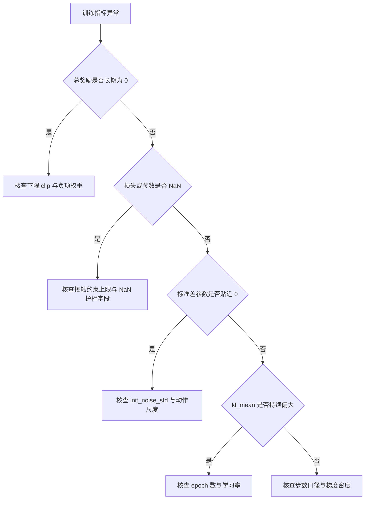
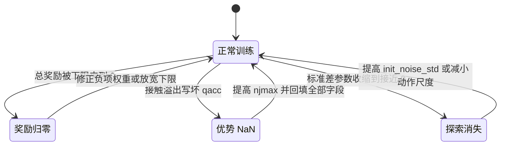
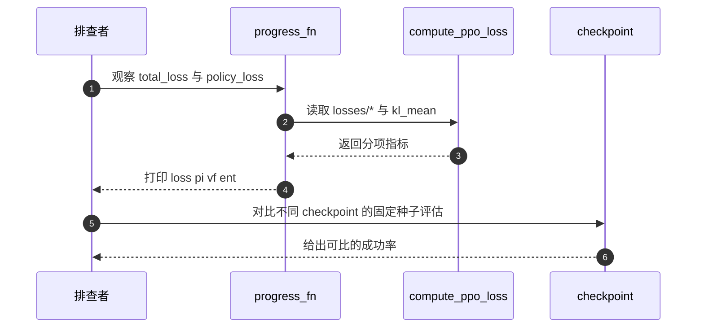

# PPO 与 GAE 易错点与调试

PPO 训练失败很少表现为报错，多数是无梯度、梯度方向错或数值爆掉。这三类的日志特征不同：无梯度时优势是常数，方向错时裁剪比例长期贴边，数值爆掉时优势里先出现 NaN。

这一页把 brax 0.14.2 的 `brax/training/agents/ppo/` 与本仓库 `train/train_go1.py`、`train/train_getup.py` 的失效模式逐条列出，并给出只看训练日志就能区分的判据。

## 1. 症状与根因

| # | 症状 | 根因 | 位置 |
| --- | --- | --- | --- |
| 1 | 总损失长期不变，策略不动 | 总奖励被下限 clip 到 0，优势全为常数 | `docs/experiment-log.md:2463-2475` |
| 2 | 参数突然变成 NaN | 接触溢出写坏 `qacc`，NaN 从奖励进 GAE | `docs/experiment-log.md:187-198` |
| 3 | 损失下降但策略退化成趴平 | 探索噪声初值过大，收敛到鲁棒解 | `train/train_getup.py:124-129` |
| 4 | 续训第一轮就崩 | brax checkpoint 不含优化器状态，Adam 从零重建 | `train/train_go1.py:96-97` |
| 5 | 换了 checkpoint 结果就变 | 手动建网络漏传 tanh 与分布类型 | `docs/experiment-log.md:249-255` |
| 6 | 学习比预期慢几十倍 | `batch_size` 语义记错，梯度密度被稀释 | `docs/experiment-log.md:167-174` |
| 7 | ratio 长期贴住裁剪边界 | epoch 过多或学习率过大，策略漂移超出信任域 | `losses.py:238-245` |
| 8 | 标准差异常小、策略不探索 | `std_param` 收缩到接近 0 | `brax/training/networks.py:502-510` |

## 2. 训练日志里该看什么

brax 的 `compute_ppo_loss` 返回一组指标（`brax/training/agents/ppo/losses.py:292-304`），常用的是：

| 指标 | 含义 | 异常判据 |
| --- | --- | --- |
| `losses/total_loss` | 策略项加价值项加熵项 | 长期不变说明梯度为零或数据重复 |
| `losses/policy_loss` | 裁剪替代目标的负值 | 贴住边界说明 ratio 长期越界 |
| `losses/v_loss` | 价值回归误差乘系数 | 与回报尺度同量级才算正常 |
| `losses/entropy_loss` | 熵项 | 系数为 0 时它恒为 0，不提供信息 |
| `kl_mean` | 新旧分布的平均 KL | 需要分布实现 `kl_divergence`，否则恒为 0 |
| `policy_dist_mean_std` | 动作标准差的均值 | 贴近 0 表示探索消失 |

`kl_mean` 只在分布对象带 `kl_divergence` 时才计算，否则返回 0（`losses.py:277-283`）。本仓库用 `normal`，实现里有该方法（`brax/training/distribution.py:118-126`），所以这个量可用。

两个入口的打印都走 `progress_fn`。行走入口打印 `loss`、`pi`、`vf`、`ent` 与 `fps`（`train/train_go1.py:773-800`）；起身入口打印 `total_loss`、`entropy`，并在有评估时打印 `succ`、`up_z`、`z_rel`（`train/train_getup.py:426-453`）。起身任务的进度信号是评估成功率，不是 `eval_reward`（`train_getup.py:439-442`）。

注意评估口径。brax 内置的 `eval/episode_reward` 用训练同款环境，出生点随 key 变化，不同 checkpoint 的数字不可直接比较（`docs/experiment-log.md:2550-2558`）。

## 3. 典型失效模式

### 3.1 奖励被夹到 0 导致无梯度

行走环境的奖励语义是 `clip(total, 0, ...)`。随机策略下负项合计压过正项时总奖励为 0，优势变成常数，策略梯度没有方向（`docs/experiment-log.md:294-298`）。排查方式是打印单步奖励分项，看合计是否为负。仓库记录里最典型的单项是 `joint_velocity` 的每步 -1.98。

### 3.2 NaN 从奖励进入优势

接触约束数超过 `njmax` 时，warp 求解器会写坏 `qacc` 与 `sensordata`。护栏只回填 `qpos`/`qvel` 拦不住奖励读的字段，NaN 经奖励进入 GAE，优势全变 NaN，参数被一次更新打爆（`docs/experiment-log.md:187-198`）。

### 3.3 探索噪声与动作尺度的乘积

`init_noise_std` 默认 1.0。起身增量动作的目标是 `qpos + 0.5·a`，每步有效噪声约 0.5 rad（`train/train_getup.py:124-129`）。需要精确计时的动作用这个量级学不出来，策略会收敛到对噪声最鲁棒的解。微调时应把它降到 0.1~0.2（`train/train_getup.py:129`）。

### 3.4 续训与恢复

brax 的 checkpoint 不含优化器状态与步数，`--restore` 后 Adam 动量从零重建、`num_steps` 从 0 记（`train/train_go1.py:96-97`、`:769-771`）。恢复参数时如果手动重建网络，必须显式传 `activation=jax.nn.tanh` 与 `distribution_type="normal"`，否则会建出能加载但输出错误的网络（`docs/experiment-log.md:249-255`）。`sim/common.py:65-92` 的加载器把这两项写死了。

## 4. 调试探针

| 探针 | 做法 | 位置 |
| --- | --- | --- |
| 静态自检 | `--dry_run` 只建环境与网络，不训练 | `train/train_getup.py:204-205`、`:393-403` |
| 无训练返回 | `num_timesteps=0` 直接返回初始策略 | `brax/training/agents/ppo/train.py:745-754` |
| 打印分项损失 | 在 `progress_fn` 里取 `losses/*` | `train/train_go1.py:773-780` |
| 观察动作标准差 | 取 `policy_dist_mean_std` | `losses.py:285-287` |
| 观察 KL | 取 `kl_mean` | `losses.py:277-283` |
| 权重自检 | 比较策略与参考权重的输入维 | `train/train_getup.py:83-99` |

## 5. 小结

### 核心概念

- PPO 失效多表现为“无梯度”或“梯度方向错”，先看总奖励与优势的量级。
- NaN 会从环境的接触溢出一路传到优势，护栏要覆盖奖励读取的全部字段。
- 探索由动作标准差控制，`init_noise_std` 要乘环境的 `action_scale` 才是有效幅度。
- brax checkpoint 不带优化器状态，续训等于 Adam 从零重建。
- 内置 `eval/episode_reward` 的出生点不可复现，比较 checkpoint 要用固定种子评估。

### 设计权衡

| 权衡点 | 本仓库选择 | 收益与代价 |
| --- | --- | --- |
| 训练信号 | 起身看成功率，行走看 eval_reward | 与任务目标对齐；代价是两条入口口径不同 |
| 护栏范围 | 回填全部字段加 isfinite | 能挡住 NaN；代价是每步多一点开销 |
| 探索策略 | 靠标准差参数收敛 | 无需额外熵项；代价是后期探索不足 |
| 加载器 | 手动建网络 | 绕开 brax 的加载缺陷；代价是激活与分布要写死 |

## 6. 练习

### 基础题

1. 某样本优势 $A>0$、$\rho=1.35$，`clipping_epsilon=0.2`。判断该样本对策略项的梯度是否为零，并写出替代目标取到的是哪一支。
2. 写出本仓库起身档一个训练步消耗的环境步数与内部梯度更新次数的算式，代入 768、32、384、10 求出结果。
3. 说明 GAE 里终止信号与截断信号的处理差别，并指出超时步的即时奖励在本仓库里发生了什么。

### 挑战题

4. 设计一套诊断方案，只依据训练日志就能区分“优势 NaN”“探索消失”“奖励被夹到 0”三类失效。列出要观察的具体指标、每类的判据与对应的修复动作。

### 附：本页引用的路径

| 路径 | 用途 |
| --- | --- |
| `brax/training/agents/ppo/losses.py` | 损失指标与 KL（`:277-304`） |
| `brax/training/agents/ppo/train.py` | 无训练返回、默认超参（`:193-218`、`:745-754`） |
| `brax/training/distribution.py` | `normal` 的 KL 实现（`:118-126`） |
| `brax/training/networks.py` | `std_param` 初值（`:502-510`） |
| `train/train_getup.py` | 起身打印、`--dry_run`、噪声说明（`:83-99`、`:124-129`、`:393-403`、`:426-453`） |
| `train/train_go1.py` | 行走打印与续训说明（`:96-97`、`:769-800`） |
| `sim/common.py` | 加载器写死激活与分布（`:65-92`） |
| `docs/experiment-log.md` | 失效案例与评估口径（`:167-198`、`:249-255`、`:2463-2475`、`:2550-2558`） |
| 仓库根 | `mjx-go1-getup`，上游 https://github.com/TC635807/mjx-go1-getup |
