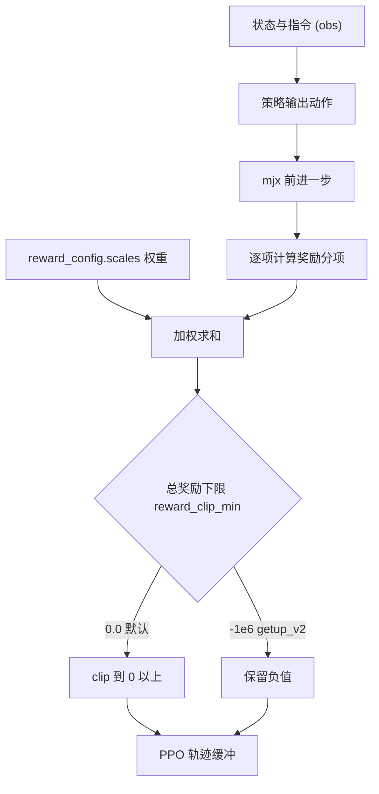
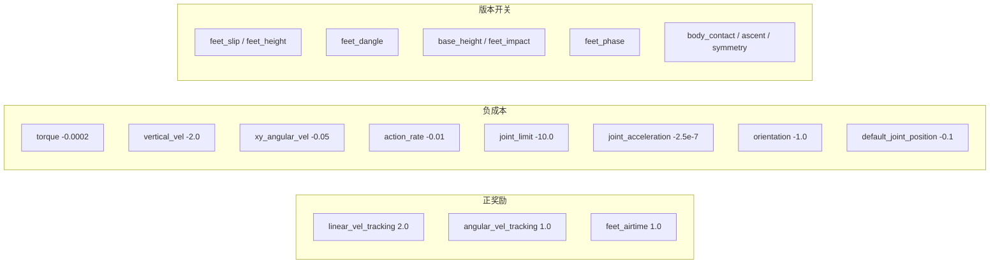
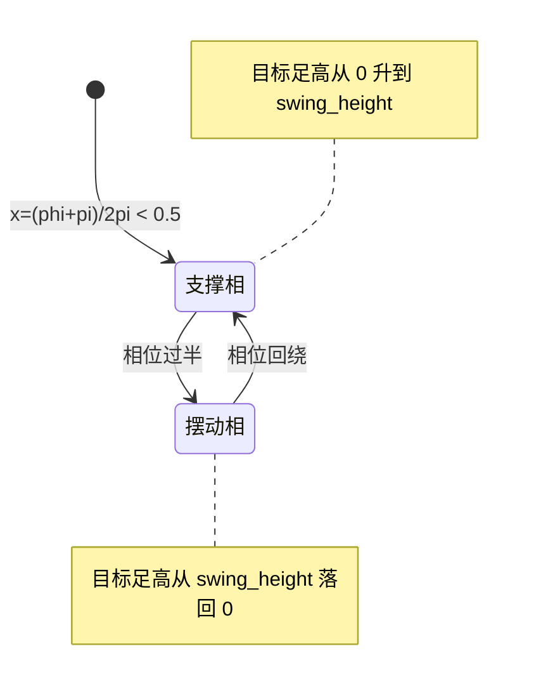

奖励在代码里就是一个标量：环境每一步把若干分项算出来，乘上权重相加，得到该步的奖励，再交给 PPO 的轨迹缓冲区。分项怎么切、权重取多少、目标值跟哪个观测量对齐，决定了策略会往哪个方向收敛。mjx-go1-getup 的行走任务在这方面留下了完整的演化痕迹：每个版本新增一项或改一个系数，注释里都记了动机、实测数字与被否决的取值。

对象是 `envs/go1_walk.py` 里 `default_config()` 的 `reward_config`，以及 `train/train_go1.py` 对这些权重的开关式覆盖。前者给出分项的全集、默认值与量纲，后者决定某次训练实际启用哪些项。两处的分工要分清：默认表是基准面，开关是版本差异，出现异常时先确认这次运行到底加了哪些项，再去看权重。

下面的顺序是先给一条从状态到奖励标量的通路，再分三类过一遍分项与量纲，然后讨论三个必须与观测口径绑定的目标值，最后落到相位奖励的区分度与总奖励截断。

## 从控制量到每步奖励标量的通路

环境的时间步长与回合长度在配置开头就固定：`ctrl_dt=0.02`（50 Hz 控制）、`sim_dt=0.002`、`episode_length=750`，对应 15 s 回合（`envs/go1_walk.py:65-67`）。控制频率决定每个回合只有 750 个决策点，奖励分项的时间常数如果接近这个量级，策略很难在回合内看到效果。

权重表写在 `envs/go1_walk.py:108-173`，紧跟其后的 `:174-262` 是各项的参数与目标值。每步的总奖励按权重求和，求和顺序对结果没有影响，但两项口径要记住：负成本以负权重进入，正奖励以正权重进入；总奖励最后要过一次下限截断（下一节展开）。

奖励分项按结算方式还能再分一层：多数项每步都结算，少数项只在特定事件上结算（触地帧、落地帧、净空低于阈值时）。结算方式决定了漏洞的形态，只在事件上结算的项可以被“永远不触发该事件”的行为绕开，这一点在后面的版本开关里有直接例子。

## 三项正奖励的权重与物理含义

正奖励只有三项，分别是线速度跟踪、角速度跟踪与足端腾空时长，权重 2.0、1.0、1.0（`envs/go1_walk.py:110-112`）。线速度跟踪的权重最高，因为它直接对应任务目标“按指令速度走”。

跟踪项的形状由 `tracking_velocity_sigma=0.25` 控制（`:174`）。这个 0.25 沿用了参考仓库的 `_tracking_velocity_sigma`，是一个指数核的宽度参数，不是速度误差的容差上限。误差超过这个量级后奖励衰减很快，但不会归零，所以“慢一点走”仍然有分，策略不会因为误差大就彻底拿不到梯度。

足端腾空奖励带一个指令门限 `cmd_threshold=0.1`（`:190`）：指令速度低于 0.1 时不给这项分。这个门限的作用是让“站着不动”不靠抬脚刷分，同时避免速度指令接近零时策略靠抖动拿腾空奖励。

## 负成本的量纲与量级

八项负成本里，量级差别很大，看权重数字时必须同时看分项公式的单位。力矩项的权重是 `-0.0002`，因为力矩本身在 N·m 量级，平方后更大；姿态项 `orientation=-1.0` 与关节限位项 `joint_limit=-10.0` 的量纲都接近“每次违反扣一分”；关节加速度项 `joint_acceleration=-2.5e-7` 的权重极小，原因是加速度是二阶差分量，数值可以达到几百（`envs/go1_walk.py:114-127`）。

`joint_velocity` 与 `collision` 两项权重被显式写成 0.0，注释给了原因：参考仓库 `go1_mujoco_env.py` 的 `_calc_reward` 把这两项算出来了，但求和时漏加，属于参考实现里的失效项。为了与参考“实际生效”的奖励面逐位一致，这里保持权重 0，代码路径保留下来当诊断量（`:119-126`）。这条记录说明权重为零不等于分项不存在，读表时要区分“没实现”和“实现了但没进总奖励”。

| 分项 | 权重 | 量纲 | 结算频率 |
| --- | --- | --- | --- |
| `linear_vel_tracking` | 2.0 | 速度误差的指数核 | 每步 |
| `angular_vel_tracking` | 1.0 | 角速度误差的指数核 | 每步 |
| `feet_airtime` | 1.0 | 秒 | 触地帧 |
| `torque` | -0.0002 | 力矩平方 | 每步 |
| `vertical_vel` | -2.0 | 竖直速度平方 | 每步 |
| `xy_angular_vel` | -0.05 | 水平角速度平方 | 每步 |
| `action_rate` | -0.01 | 动作差分平方 | 每步 |
| `joint_limit` | -10.0 | 越限量 | 每步 |
| `joint_acceleration` | -2.5e-7 | 关节加速度平方 | 每步 |
| `orientation` | -1.0 | 躯干姿态偏差 | 每步 |
| `default_joint_position` | -0.1 | 关节角偏差平方 | 每步 |
| `joint_velocity` / `collision` | 0.0 | 参考仓库漏加项 | 项仍计算 |

## 版本开关新增的分项与默认关闭约定

v16 之后新增的分项在默认表里全部是 0.0，由 `train/train_go1.py` 的命令行开关打开。这套约定有两个好处：旧版本的结果可以逐位复现；每次实验的变量只有一个开关，出问题能归因。

默认分项与各自对应的开关：

| 分项 | 默认 | 开关 | 权重 |
| --- | --- | --- | --- |
| `feet_slip` | 0.0 | `--natural_gait` | -0.5 |
| `feet_height` | 0.0 | `--natural_gait` | -1.0 |
| `feet_dangle` | 0.0 | `--dangle_penalty` | -0.5 |
| `base_height` | 0.0 | `--climb_reward` | -200.0 |
| `feet_impact` | 0.0 | `--soft_landing` | -2.0 |
| `feet_phase` | 0.0 | `--gait_phase` | 2.0 |
| `body_contact` | 0.0 | `--body_contact` | -150.0 |
| `ascent` | 0.0 | `--ascent` | 2.0 |
| `symmetry` | 0.0 | `--symmetry` | -0.4 |

表里的权重与开关的对应关系在 `train/train_go1.py:445-651` 一段内逐条赋值，每个开关都有对应的打印语句把生效值写进日志（`:451`、`:576`、`:601`）。日志里能看到权重，是排查“开关加了但没生效”的第一手证据。

## 与观测口径绑定的三个目标值

奖励目标值如果与观测里的同一物理量用了不同定义，两处会互相打架。源码里明确点出了这种绑定关系的有三处。

第一处是躯干站高：`base_height_target=0.28`（`envs/go1_walk.py:201`）。注释写明必须与 `height_scan.base` 一致，否则观测说标称站高 0.28、奖励却要求 0.3。0.28 这个值来自 Go1 沉降后躯干中心距足下地面的实测 z，约 0.2779。

第二处是抬脚目标高度：`max_foot_height=0.08`（`:182-184`）配合球足半径 0.023，抬到 0.08 时净空约 0.06。v20 引入相位奖励后，这个值默认跟随 `gait_swing_height`，两者不一致时策略被两个目标撕扯（`train/train_go1.py:572-575`）。

第三处是空距结算参数：默认 `air_time_threshold=1.0`、`air_time_max` 为无穷（`:175-181`），`--natural_gait` 把门限覆盖成 0.2 并给出 0.5 s 的封顶（`train/train_go1.py:449-450`）。参考仓库用 1.0 作为门限，对正常摆动 0.2 到 0.4 s 是倒扣，这是 v16 之前的一项口径偏差。

| 参数 | 值 | 绑定对象 | 位置 |
| --- | --- | --- | --- |
| `base_height_target` | 0.28 | `height_scan.base` | `envs/go1_walk.py:201` |
| `max_foot_height` | 0.08 | `gait_swing_height` | `envs/go1_walk.py:184` |
| `air_time_threshold` | 1.0 默认 / 0.2 打开 | 摆动相时长 | `envs/go1_walk.py:178` |
| `air_time_max` | inf 默认 / 0.5 打开 | 空距封顶 | `envs/go1_walk.py:181` |
| `air_time_limit` | 0.8 | 单足连续悬空上限 | `envs/go1_walk.py:189` |
| `impact_vel_limit` | 0.5 | 落地无惩罚下界 | `envs/go1_walk.py:230` |
| `impact_height` | 0.09 | 冲击结算的过渡高度 | `envs/go1_walk.py:233` |
| `ascent_cap` | 0.35 | 地形最高 0.30 的余量 | `envs/go1_walk.py:204` |
| `ascent_gate` | 0.2 | 行进门控的速度阈值 | `envs/go1_walk.py:209` |
| `symmetry_beta` | 0.01 | EMA 时间常数 100 步 | `envs/go1_walk.py:212` |
| `symmetry_cap` | 2.0 | 负项封顶，防总奖励被压到 0 | `envs/go1_walk.py:215` |

## 相位奖励的期望值与区分度

v20 的对角步态相位奖励形式为 `exp(-Σ(z_foot - rz)²/σ)`（`envs/go1_walk.py:242-246`）。四足目标相位取 trot 的 [0, π, π, 0]，相位循环推进，由 `get_rz` 给出该相位下应有的目标足高。步频默认 1.8 Hz（`:247`），v19 实测主周期 0.52 到 0.56 s，换算约 1.9 Hz。

初版参数沿用了 playground 的 `sigma=0.1` 与 `swing_height=0.08`，结果奖励面几乎是平的：理想 trot 得 1.0000，四足全贴地不动得 0.9583，只差 0.04。策略在 5M 步时退化成“四足贴地不动”，前腿占空比 8.7%，后腿 96% 到 99%，对角同步 10% 到 20%（`:248-255`）。

修正方式是把抬脚目标提到 0.15、把 `sigma` 收紧到 0.02（`:260-261`）。参数扫描给出的三个参照点：理想 trot 1.0000、四足全贴地 0.3371、四足全悬 0.1880，区分度 `gap=` 0.6629，原来的配置只有 0.0417。`train/train_go1.py:584-585` 把这三个数写进了启动打印，作为“奖励面是否推得动步态”的自检。

## 总奖励的截断与负项封顶

总奖励有一个下限参数 `reward_clip_min`，默认 0.0，语义来自 SB3 的 max(0, r-c)（`envs/go1_walk.py:68-73`）。对行走任务这套语义可以工作，对起身任务有害：随机策略早期“两个宽高斯减小正则”的总和接近 0，一旦为负就被夹成 0，奖励恒零、PPO 完全没有梯度。v2 实测随机动作平均每步只有 +0.008，正是这个原因。`getup_v2` 把下限设成 -1e6 保留负奖励。

另一条相关的口径是负项封顶。总奖励在 `step()` 里被截到 0 以上时，单个负项如果压过所有正项，梯度同样会归零，所以两项被显式封顶：`body_contact_max` 与 `symmetry_cap=2.0`（`:213-215`）。这条经验来自 v20 阶段“负项吃满总奖励”的实测。

## 权重改动的单变量原则

`base_height_ref` 默认取 `mean5`，即躯干加四足的 5 点均值（`envs/go1_walk.py:216-224`）。注释解释了为什么 v22 不顺手把它改成 `trunk`：实测量化显示 `mean5` 的额外惩罚是随足端落点的振荡噪声（与爬升的斜率相关系数 +0.13，均值 -0.034 每步，峰值是走路的 4.7%），不是定向对抗爬升的力量；既然它不是失败原因，就不该和 `ascent` 一起改，否则 40M 步的改善无法归因。单变量原则在这份配置里是硬约束，注释里反复出现。

## 小结

### 核心概念

- 奖励是一个加权和：正奖励三项，负成本八项，版本开关新增项默认全 0。
- 权重数字必须与分项量纲一起读，力矩项 -0.0002 与姿态项 -1.0 不在同一量纲上。
- 权重为 0 有两种情况：参考实现漏加（`joint_velocity`）与版本开关关闭（`feet_slip` 等）。
- 目标值要与观测口径绑定，站高、抬脚高度、空距门限三处最容易打架。
- 相位奖励的区分度可以先用三个参照点算出来，gap 太小就推不动步态。
- 总奖励下限只影响负奖励是否保留，负项封顶防止梯度归零。

### 设计权衡

| 决策 | 选择 | 收益 | 代价 |
| --- | --- | --- | --- |
| 分项默认值 | 新增项全 0 | 旧版本可逐位复现，单变量实验 | 忘记加开关时训练面缺项 |
| 权重组织 | 集中在 scales 表 | 一处改动全环境生效 | 注释与代码容易走散 |
| 跟踪核宽度 | 指数核 sigma 0.25 | 误差大时仍有梯度 | 不是硬容差，速度精度靠权重调 |
| 相位奖励 | 显式相位引导 | 能把步态推回 trot | 需要与抬脚高度联动 |
| 负项封顶 | 只封 body_contact / symmetry | 总奖励不会被压到 0 | 其他负项仍可能吃满 |

## 练习

### 基础题

1. 从 `envs/go1_walk.py:108-173` 抄出三项正奖励与八项负成本的权重，按量纲分成“平方量”“一次量”“秒”三类。
2. 找出 `feet_airtime`、`feet_slip`、`feet_height`、`feet_dangle` 四项的结算频率，说明哪一项只在触地帧结算。
3. 用 `base_height_target` 与 `height_scan.base` 的绑定关系解释：如果两处取值不一致，训练会出现什么现象。

### 挑战题

1. 假设把 `base_height` 的权重从 -200 改成 -2000，用 `train/train_go1.py:527-529` 的实测数字估算每步惩罚，并判断总奖励是否会被压到 0。
2. 相位奖励的 gap 从 0.0417 提到 0.6629 只改了两个参数，说明这两个参数各自改变了误差的哪一部分，并给出一组你认为同样能拉开 gap 的参数。
3. 参考仓库漏加 `joint_velocity` 与 `collision` 两项成本。如果把它们按量级估计补上权重（给出你的估值依据），预测策略的步态会有什么变化。

## 附：本页引用的路径

| 路径 | 用途 |
| --- | --- |
| `envs/go1_walk.py` | 奖励权重表、参数默认值、相位奖励与总奖励截断 |
| `train/train_go1.py` | 开关到权重的覆盖、启动打印与标定注释 |
| `RLcontroller_go1_moreinformation/实验记录_Go1复现.md` | 各版本权重标定与失败复盘的实测记录 |
| `quadruped-rl-locomotion-main/go1_mujoco_env.py` | 参考仓库的奖励求和与两项漏加成本 |
