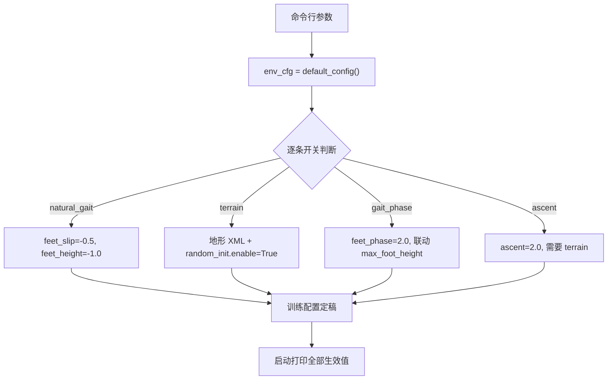
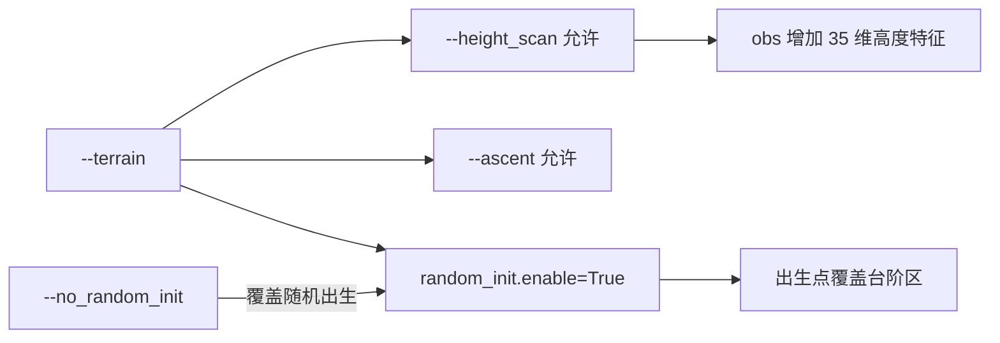
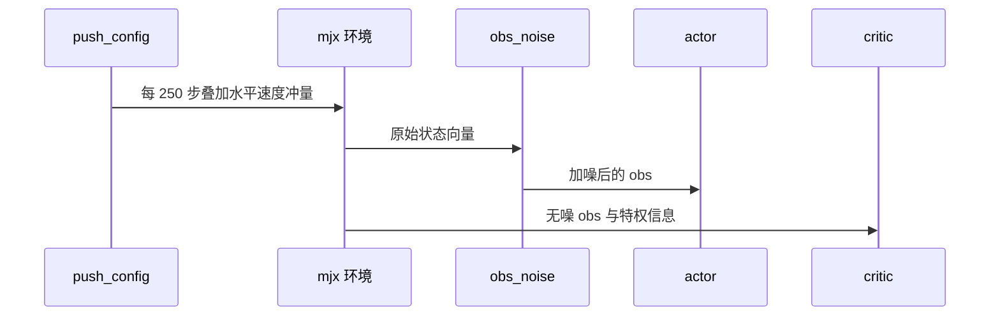

训练入口把“这次实验加了哪几项奖励”表达成一组命令行开关。开关本身只做一件事：在启动时改写 `env_cfg.reward_config` 的某几个字段。要复现一次实验，光记训练步数不够，必须把开关集合一起记下来。

开关之间不是彼此独立的关系。有的开关会自动打开另一个（`--fwd_turn` 打开指令采样），有的开关要求另一个已经打开（`--height_scan` 与 `--ascent` 都要求 `--terrain`），还有的开关会改动一个被别处分项使用的参数（`--gait_phase` 会改写抬脚目标高度）。忽略这些联动，就会出现“命令写了但实际没生效”或“生效了却和预期不同”的两种偏差。

覆盖按命令行顺序执行，先出现的开关把值定下去，后出现的只改其中两项；三组隐式联动与两类依赖前置都是这一事实的表现。

## 开关覆盖权重的执行顺序

开关到配置的写入集中在 `train/train_go1.py:415-651`。这段代码按版本顺序排列：先是指令条件化与观测开关（v11 到 v15），然后是 v16 的步态塑形、v17 的悬空惩罚、v19 的地形与鲁棒项、v20 的相位引导、v21 与 v23 的撞地与对称项。顺序有实际后果：后面的开关可以看到前面开关改过的值，例如 `--natural_gait` 先写 `feet_slip`，随后独立的 `--slip_penalty` 又能覆盖同一个字段（`:463-465`）。

覆盖采用“开关存在就赋值”的写法，每处赋值后面配一条打印。默认值留在环境配置里，开关只处理差异，这个分工让 `envs/go1_walk.py` 保持基准面，也让“某次运行到底改了什么”可以从日志回答。

## 三组隐式联动的开关

第一组是指令条件化：`--fwd_turn` 会先把 `--sample_cmd` 置真，再补上默认指令区间 `[0,0,-1]` 到 `[0.5,0,1]`（`train/train_go1.py:418-421`）。单独用 `--sample_cmd` 时需要自己给 `--cmd_low` 与 `--cmd_high`，否则采样区间取默认值。

第二组是步态项：`--dangle_penalty` 先把 `--natural_gait` 置真（`:443-444`），因为悬空惩罚依赖滑移惩罚与抬脚高度塑形作为前置。反过来不成立，打开 `--natural_gait` 不会启用悬空惩罚。

第三组是爬升项：`--base_height_w` 在写入权重之后会把 `--climb_reward` 置真（`:532-534`），保证后续判断生效；`--gait_phase` 打开相位奖励时，除非显式加 `--keep_foot_height`，否则会把 `max_foot_height` 改成 `gait_swing_height`（`:574-575`）。这一处联动在注释里被写成硬要求：相位奖励要求抬到 swing_height，抬脚高度项惩罚偏离 max_foot_height，两者不一致时策略被两个目标撕扯。

| 触发开关 | 联动结果 | 位置 |
| --- | --- | --- |
| `--fwd_turn` | 打开 `--sample_cmd`，补默认指令区间 | `train/train_go1.py:418-421` |
| `--dangle_penalty` | 打开 `--natural_gait` | `train/train_go1.py:443-444` |
| `--base_height_w` | 视同打开 `--climb_reward` | `train/train_go1.py:532-534` |
| `--gait_phase` | 改写 `max_foot_height` 跟随 `gait_swing_height` | `train/train_go1.py:574-575` |

## 地形与高度扫描的依赖前置

`--height_scan` 要求 `--terrain`，否则直接报错退出而不是静默降级（`train/train_go1.py:477-480`）。原因写在注释里：平地档没有高度场，采样器不初始化，35 维高度特征会恒为 0，等于白占观测维度。报错的设计意图是避免训出一个“以为有地形输入”的假对照。

`--ascent` 同样要求 `--terrain`（`:596-600`），理由更直接：平地上地形高度恒为零，`ascent` 项无信息。

`--terrain` 还会隐式打开随机出生（`:481-489`）。`reset` 默认把机器人放在原点，而地形生成在原点周围做了压平，8192 个环境会全部落在平地上，见不到台阶。需要调试时就加 `--no_random_init` 从原点出生做基线对照。

## 站桩套利的算术上界

`ascent` 是状态型奖励，站在台顶不动也持续收钱，所以权重不能用直觉定。注释给出一组实数：正常走路每步 +1.776，站着不动 +0.347，站台顶每步为 `0.347 + W × 0.30`，其中 0.30 m 是地形最大升高（`train/train_go1.py:611-621`）。代入三档权重得到的结果是 W=2 时 +0.947（走路的 53%，安全）、W=4 时 +1.547（88%，偏险）、W=8 时 +2.747（154%，站着比走着好，策略会退化）。

实验记录里的同一张表把 W=2 标成采用值，并注明走路与站着不动的分项均值都来自实测（`RLcontroller_go1_moreinformation/实验记录_Go1复现.md:4506-4515`）。两处数字一致，属于同一组标定结果在两份文档里的引用。

| 权重 W | 站台顶每步 | 相对走路 +1.776 | 判定 |
| --- | --- | --- | --- |
| 2 | +0.947 | 53% | 采用 |
| 4 | +1.547 | 88% | 偏险 |
| 8 | +2.747 | 154% | 会退化 |

v23 给 `ascent` 加了行进门控 `clip(|v_body|/gate, 0, 1)`，`gate=0.2`（`envs/go1_walk.py:205-209`）。静止时该项归零，站桩套利消失，权重才有提高空间。门控为 0 时退化成 v22 的行为。

## 依赖联动的三处封顶

负项封顶与门控解决的是同一类问题：某一项在特定行为下可以无限累积，压过其他所有项。三处封顶分别是 `body_contact_max`（`train/train_go1.py:656-657`）、`symmetry_cap=2.0`（`envs/go1_walk.py:213-215`）与 `ascent_cap=0.35`（`:202-204`）。封顶值都直接由量级估算给出：地形最高 0.30 m，就取 0.35 留余量；对称偏差是 EMA 量，取 2.0 保证它不会单独把总奖励压到截断线以下。

## 版本批次年表

分项是按版本逐项补上的，每一批修补的都是上一批暴露出来的漏洞。把开关按引入版本排列，可以看出每一批修补的都是上一批暴露出来的漏洞。

| 批次 | 开关 | 新增分项或改动 | 对应记录 |
| --- | --- | --- | --- |
| v16 | `--natural_gait` | `feet_slip` -0.5、`feet_height` -1.0、空距门限 0.2 与封顶 0.5 | 实验记录 12.3 到 12.4 |
| v17 | `--dangle_penalty` | `feet_dangle` -0.5、`air_time_limit` 0.8 | 实验记录 12.8 |
| v19 | `--terrain --height_scan --push --obs_noise` | 地形、随机出生、推力、观测噪声 | 实验记录 17.16 |
| v19 | `--climb_reward --soft_landing` | `base_height` -200、`feet_impact` -2.0 | 实验记录 17.16.2 到 17.16.4 |
| v20 | `--gait_phase` | `feet_phase` 2.0、`sigma` 0.02、抬脚 0.15 | 实验记录 19.8 |
| v21 | `--body_contact` | `body_contact` -150.0 | 实验记录 20 章 |
| v22 | `--ascent` | `ascent` 2.0、`ascent_cap` 0.35 | 实验记录 24.6 |
| v23 | `--symmetry` | `symmetry` -0.4、EMA 系数 0.01、封顶 2.0 | 实验记录 27 章 |

`--trunk_height_ref` 属实验性对照，不参与版本编号：它把 `base_height` 的参考面从 5 点均值换成躯干正下方，默认保持 `mean5` 以便 v22 成为单变量实验（`train/train_go1.py:624-634`）。

## 观测与鲁棒性开关的取值

地形与鲁棒性开关各自带一组配套参数，默认值集中在 `envs/go1_walk.py:344-398`。`--height_scan` 打开的是 7 乘 5 共 35 点的高度网格（`:349-372`）：前向范围 -0.3 到 0.9 m，侧向正负 0.4 m，前向分辨率高于侧向，因为台阶需要预判。特征是 `clip(躯干z - 地面h - base, ±clip_m) * scale`，其中 `base=0.28` 与奖励里的站高目标对齐，`clip_m=0.35` 大于地形总高差 0.30 m，保证正常行走时特征不饱和，`scale=5.0` 把米制差值变成与关节角可比的量。0.02 m 的地面高度噪声只加在 actor 的输入上。

`--terrain` 隐式打开的随机出生参数在 `:376-382`：xy 范围正负 5 m、随机朝向、出生高度为地面加 0.35 m、出生速度正负 0.3。`--push` 对应 `:384-388`：每 250 步（50 Hz 下 5 s）给基座叠加正负 0.5 m/s 的水平速度冲量。`--obs_noise` 对应 `:391-398`：线速度与角速度各 0.05、重力分量 0.02、关节位置 0.01 rad、关节速度 0.15 rad/s，同样只加在 actor 侧，critic 保持无噪。

`--tilt_deg` 改的是终止阈值（`:307-308`），默认两轴各 10 度，入口脚本会同时改横滚与俯仰并打印等效倾角（`train/train_go1.py:438-442`）。

| 开关 | 配套参数 | 默认值 | 位置 |
| --- | --- | --- | --- |
| `--height_scan` | 网格与特征参数 | 7×5、-0.3 到 0.9、正负 0.4、0.28、0.35、5.0、0.02 | `envs/go1_walk.py:349-372` |
| `--terrain` | 随机出生 | xy 正负 5.0、随机 yaw、z 偏移 0.35、速度 0.3 | `envs/go1_walk.py:376-382` |
| `--push` | 扰动间隔与幅度 | 250 步、0.5 m/s | `envs/go1_walk.py:384-388` |
| `--obs_noise` | 五路噪声 | 0.05、0.05、0.02、0.01、0.15 | `envs/go1_walk.py:391-398` |
| `--tilt_deg` | 终止倾角 | 10 度两轴 | `envs/go1_walk.py:307-308` |

还有一条与奖励无关但会影响结论的约束：换地形后不能从平地策略热启动。地形改变足端可达性与接触面，属换任务，v18 是在平地上训的，不能直接续训（`envs/go1_walk.py:342-343`，实验记录 9.2 节记录了热启动失败的经过）。

## 启动打印承担通路验证

每个开关生效后都会打印一行，这些行合并起来就是这次实验的配置摘要。v19 的一次 200K 步端到端冒烟把“开关生效”和“训练在走”一起验证：日志里有 `climb_reward` 与 `soft_landing` 的生效行，有观测维度 `state=83` 与 `privileged_state=154`，还有 `eval_reward` 从 0.313 升到 2.380、回合长度从 35.1 升到 52.8 的曲线（`RLcontroller_go1_moreinformation/实验记录_Go1复现.md:2490-2500`）。

这段流程的动机是另一次教训：开关写错时训练照常启动，奖励面缺项要到长跑结束才被发现。冒烟步数取 200K、环境数取 1024，成本可控，能看到奖励单调上升且无 NaN（`RLcontroller_go1_moreinformation/实验记录_Go1复现.md:2488-2500`）。同一节还记了一个入口脚本的问题：`argparse` 的 `help` 串里出现单个百分号会被当格式符，报 `ValueError`，必须写成两个百分号（`:2502-2504`）。

## 小结

### 核心概念

- 开关只改写 `env_cfg` 的字段，默认值住在环境配置里，日志是唯一可靠的生效证据。
- 联动分三类：自动打开别的开关、覆盖同一字段、改写被别处分项使用的参数。
- 依赖前置用报错表达，`--height_scan` 与 `--ascent` 都要求 `--terrain`。
- 状态型奖励要用反套利算术定权重，算术的输入是实测的每步分项均值。
- 封顶与门控防止单项在特定行为下无限累积，封顶值由量级估算给出。
- 长跑之前先跑短冒烟，确认每个开关的打印行与观测维度。

### 设计权衡

| 决策 | 选择 | 收益 | 代价 |
| --- | --- | --- | --- |
| 权重组织 | 默认值在环境，差异在开关 | 旧版本可逐位复现 | 命令变长，组合空间大 |
| 依赖检查 | 不满足直接报错 | 避免假对照 | 不能做“地形关闭但保留观测”的对照实验 |
| 状态型奖励 | 门控乘系数 | 静止时归零，可提高权重 | 门控阈值本身成为新参数 |
| 负项治理 | 单项封顶 | 总奖励不被压到 0 | 封顶值需要按量级估算维护 |
| 通路验证 | 200K 步冒烟 | 早期发现拼写与维度错误 | 每次改开关都要额外一段短跑 |

## 练习

### 基础题

1. 列出 `--terrain`、`--height_scan`、`--ascent` 三个开关的依赖关系，说明违反依赖时程序的行为。
2. 找出 `--natural_gait` 与 `--gait_phase` 各自改写的字段，判断两者同时打开时会不会互相覆盖。
3. 用 0.347 与 0.30 两个数重算 W=3 时站台顶每步奖励，并判断是否安全。

### 挑战题

1. 假设新增一项状态型奖励“保持站高”，给出它的反套利上界推导，并设计一个门控使权重可以取到更高。
2. `--gait_phased` 默认联动 `max_foot_height`，如果用 `--keep_foot_height` 关掉联动，预测训练中会出现什么现象，并说明用什么指标验证。
3. 设计一份开关组合，只做“奖励面消融”实验（每次去掉一项），写出冒烟命令与需要记录的日志行。

## 附：本页引用的路径

| 路径 | 用途 |
| --- | --- |
| `train/train_go1.py` | 开关定义、覆盖执行、联动与启动打印 |
| `envs/go1_walk.py` | 默认权重、封顶值与门控参数 |
| `RLcontroller_go1_moreinformation/实验记录_Go1复现.md` | 反套利算术、通路验证冒烟与入口脚本问题 |
