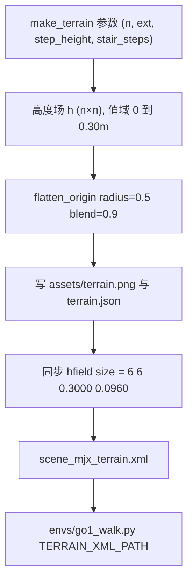
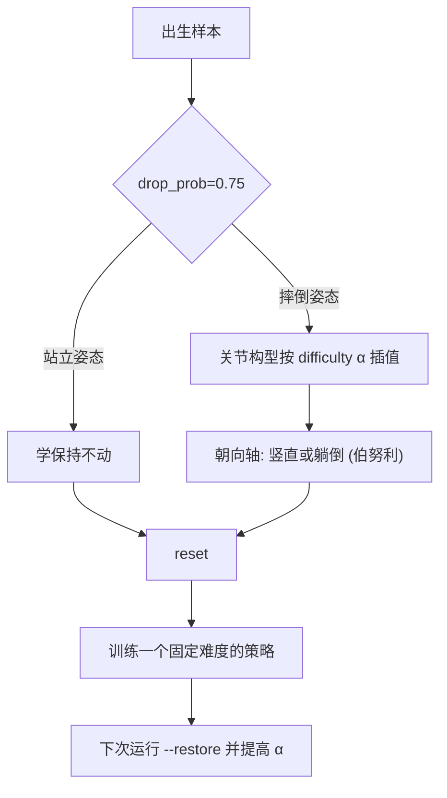
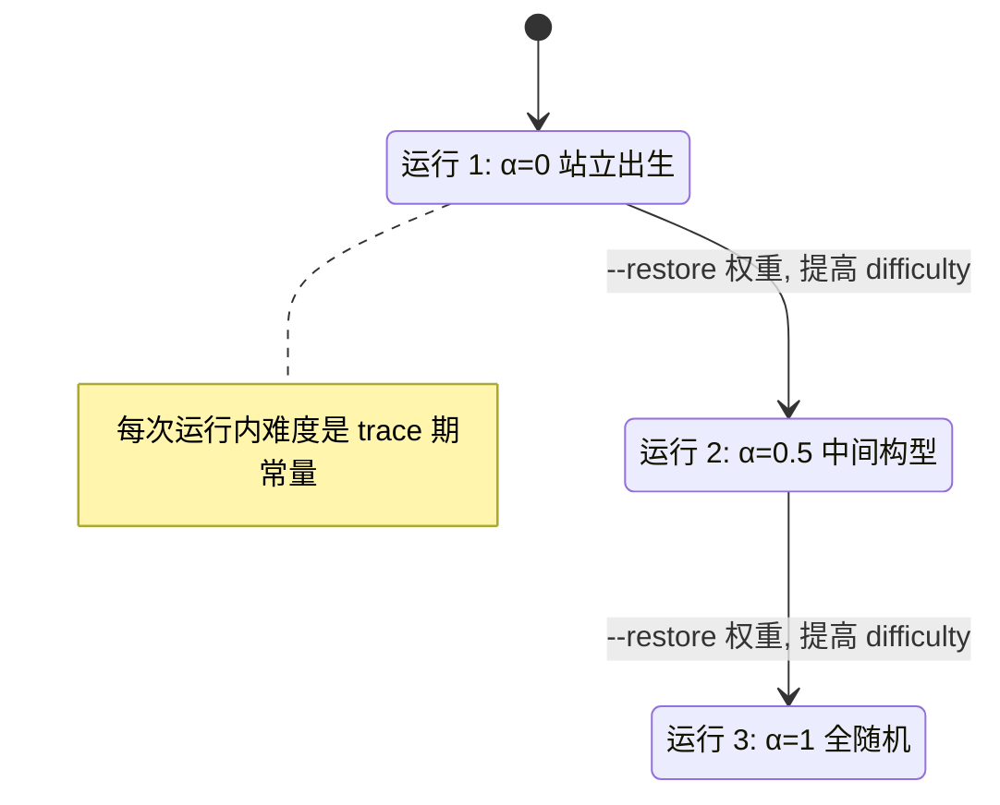

课程学习在这套工程里有两个完全不同的落点：行走任务把难度做进地形文件，起身任务把难度做进出生姿态。前者是静态的，一份 `terrain.png` 对应一档难度；后者是动态的，靠命令行参数给每一次运行选一个难度，训练完再续训下一档。

两种做法都不涉及“训练中途自动加难”。行走侧曾经讨论过出生半径从 1.5 m 逐步扩到 5 m、台阶从单级混到连续爬升这类方案，但都没有执行；起身侧试过在 `progress_fn` 里改难度，被编译器行为挡了回来，最后改成多次运行推进。把“打算做”和“已经做”分开写清楚，才能解释为什么这里的课程推进靠多次运行而不是自动加难。

下面先讲地形高度场从参数到文件的链路，再讲压平半径、分辨率与尺寸同步三个容易读错的取值，然后落到随机出生这个地形训练的前提，最后用起身任务的双轴课程说明多阶段推进的机制与优先级判断。

## 地形生成器的两组参数与总高差

高度场由 `sim/gen_terrain.py` 的 `make_terrain()` 生成，默认参数就是函数签名：

```python
def make_terrain(n=128, ext=6.0, bump_amp=0.05, sigma=2.0,
                 step_height=0.06, seed=0, n_steps=6, stairs=True,
                 flat_origin=True, stair_steps=5, n_staircases=2,
                 stair_pitch=0.55, stair_ramp=2, side_deg=30.0):
    """生成高度场 (米), 形状 (n,n), 值域 [0, ~step_height*stair_steps]。..."""
```

即网格 128 乘 128、半边长 6.0 m、起伏幅度 0.05、噪声尺度 2.0 格、单级台阶 0.06 m、阶梯 5 级、两条楼梯、梯距 0.55 m、踏步面缓坡 2 格、侧壁目标坡度 30 度。函数文档串给出的值域是 0 到 `step_height × stair_steps`，即 0 到 0.30 m。默认值写在签名里而不是全局常量，改默认值会直接影响生成结果。

参数在 2026-09-14 整体加过一档：起伏幅度从 0.02 提到 0.05，单级台阶从 0.04 提到 0.06，阶梯从“3 段等高平台”改成 5 级真爬升。旧实现的平台不爬升，机器人走上走下高度不变，测不出爬升能力。

踏步面缓坡的格数直接决定地形性质：2 格在 18.8 cm 长度内抬升 6 cm，约 17.7 度，接近真实楼梯；如果用 4 格，坡度降到约 9 度，就变成斜坡，失去阶梯的判别力。侧壁按 30 度目标坡度淡出，保证侧面是可走的缓坡而不是垂直墙。

| 参数 | 默认值 | 物理含义 | 位置 |
| --- | --- | --- | --- |
| `n` | 128 | 网格分辨率 | `sim/gen_terrain.py` |
| `ext` | 6.0 | 半边长，米 | `sim/gen_terrain.py` |
| `bump_amp` | 0.05 | 随机起伏幅度 | `sim/gen_terrain.py` |
| `sigma` | 2.0 | 噪声尺度，单位是格 | `sim/gen_terrain.py` |
| `step_height` | 0.06 | 单级台阶高，米 | `sim/gen_terrain.py` |
| `stair_steps` | 5 | 阶梯级数 | `sim/gen_terrain.py` |
| `n_staircases` | 2 | 楼梯条数，沿 x 与沿 y 各一 | `sim/gen_terrain.py` |
| `stair_pitch` | 0.55 | 梯距，米 | `sim/gen_terrain.py` |
| `stair_ramp` | 2 | 踏步面缓坡格数 | `sim/gen_terrain.py` |
| `side_deg` | 30.0 | 侧壁目标坡度，度 | `sim/gen_terrain.py` |

## 原点压平半径的取值链

`flatten_origin()` 的函数签名默认半径是 0.7、混合长度 1.2（`sim/gen_terrain.py`），但生成路径实际调用时传的是半径 0.5、混合 0.9，命令行参数的默认值也是 0.5 与 0.9。行走环境注释里写的“原点周围半径 0.5 m 的压平区”（`envs/go1_walk.py`）与训练入口注释里的“半径 0.5 m”（`train/train_go1.py`）都对应调用点，不是函数签名。读源码时只看签名默认值会把这一处判错。

压平的作用有两个层面。数值上，它保证原点高度为 0，让地形场景的 `geom` 高度偏移天然对齐，不需要额外标定（`models/go1/scene_mjx_terrain.xml`）。功能上，它给出了一块平整的出生区，但随机出生范围是正负 5 m，远远超出压平区，所以出生点大部分落在起伏与台阶上。

这里说的 `hfield` 是 MuJoCo 的高度场几何：一张二维高度图直接当路面用，比铺很多块几何体省算力，地形任务靠它把 0.30 m 的起伏与台阶塞进一个 `geom`。

## 分辨率、格距与每对接触上限

MuJoCo 对每个 `geom` 与高度场组合的接触点数量有上限，注释给出的数字是 50（`models/go1/scene_mjx_terrain.xml`）。分辨率太高会让格距接近足端尺寸，接触点被截断，反而失真。脚本默认取 `n=128`，对应格距约 9.4 cm，注释明确说 128 可以、更高的分辨率不行。

`sigma` 的单位是格数而不是米，函数文档串专门警告过这一点：

```python
"""...
注意 sigma 是**格数**单位: 换 n 时必须按比例调, 否则起伏尺度会变
(n=384 配 sigma=6 与 n=128 配 sigma=2 才是同一物理尺度)。
..."""
```

所以换 `n` 时 `sigma` 必须等比例改：`n=384` 配 `sigma=6` 才与 `n=128` 配 `sigma=2` 是同一物理尺度。这条约束在调分辨率时最容易漏。

## 高度场与 XML 尺寸的同步

生成的 PNG 与元数据由脚本写出，地形场景里的 `hfield` 尺寸必须跟着变。当前 `size` 是 `"6 6 0.3000 0.0960"`（`models/go1/scene_mjx_terrain.xml`），其中前两个数对应半边长 6 m，第三个数 0.3000 是生成时的最大高度（来自 `terrain.json`），第四个数 0.0960 是 `z` 方向偏移。注释写明尺寸与 `geom` 高度偏移必须成套标定，换地形后最大高度会变，`pos.z` 要复测。

当前配置的总高差是 0.30 m，注释注明是旧版的 3.7 倍。重新生成地形的命令是 `sim/gen_terrain.py`，它会自动同步 `size`。生成过程是确定性的：固定 `seed`，训练与可视化共用同一份 XML，保证两边看到的地形严格一致。



## 地形训练必须随机出生

`terrain` 默认关闭（`envs/go1_walk.py`），打开后环境改用 `models/go1/scene_mjx_terrain.xml`。训练入口在地形打开时会隐式打开随机出生（`train/train_go1.py`），理由在注释里写得很直白：`reset` 默认把机器人放原点，而原点周围是压平区，8192 个环境会全部落在平地上，见不到台阶，学不会爬梯。

出生参数的范围是 xy 正负 5 m、随机朝向、出生高度为地面加 0.35 m、出生速度正负 0.3（`envs/go1_walk.py`）。调试时可以加 `--no_random_init` 回到原点出生，入口脚本会把 `random_init.enable` 显式置假并打印（`train/train_go1.py`）。

换地形不能热启动。地形改变足端可达性与接触面，属换任务；v18 是在平地上训出来的，不能直接续训到地形场景（`envs/go1_walk.py`）。

## 尚未执行的地形课程候选

实验记录里出现过三次地形课程方案，都停留在建议状态。第一次提出把出生半径从 1.5 m 逐步扩到 5 m，或先用低台阶再上高台阶（`RLcontroller_go1_moreinformation/实验记录_Go1复现.md`）。第二次指出当时把 0.06 m 单级台阶与 0.30 m 连续爬升混在一起学，建议按难度拆开。第三次给了相反的判断：摔倒主要发生在平地，说明瓶颈是基础步态而不是地形难度，所以课程化的优先级应低于步态相关的改动。

这三次记录的时间顺序说明同一个方案会被新证据推翻，引用时要点明是哪一版的结论。当前工程里地形难度是单档的：一份固定 seed 生成的高度场，没有分级文件，也没有运行期切换难度的开关。

## 起身任务的两根课程轴

起身任务的难度做在出生姿态里。`envs/go1_getup.py` 的配置给出两根轴：第一根是出生难度 `difficulty`，取值 0 到 1，只插值关节构型；第二根是朝向随机程度，控制身体竖直出生的比例。`drop_prob=0.75` 决定摔倒姿态在出生样本中的占比，其余是站立出生，用来学“别乱动”。难度轴的作用可以写成一段示意：

```python
# 示意：难度 α 在"规范关节构型"与"全随机构型"之间插值
joints = (1.0 - alpha) * stand_joints + alpha * random_joints
# alpha=0 -> 站立出生（先学站住）；alpha=1 -> 全随机（公开配方）
```

为什么只插值关节而不是整体姿态、为什么朝向轴只能二选一，原因写在下一段。

第一根轴只插值关节，不是随手选的。注释记录了 v26 第一版的教训：如果按“站到躺”插值整体姿态，中间档的姿态一落地就被重力塌回地面，课程轴选错了；换成腿部构型之后才出现连续过渡。朝向轴不能插值，只能在站立与躺倒之间二选一，因为中间角度的出生姿态同样不稳定（`RLcontroller_go1_moreinformation/实验记录_Go1复现.md`）。

`envs/go1_getup_v2.py` 里还有一根对应的残差课程轴 `joint_alpha`，默认 1.0 表示公开配方原样全随机，取小值相当于 HumanUP 第一阶段的“规范姿态加弱正则”（`envs/go1_getup_v2.py`）。



## 课程只能靠多次运行推进

难度参数是每次运行的常量，不能在训练中途改。原因在 JIT 的编译行为：JAX 会把训练循环"即时编译"（JIT）成一张静态图，被编译进图里的常量叫 trace 期常量，运行期改它不会触发重编译、改了也不生效。曾经把课程写在 `progress_fn` 里、指望 `reset` 重编译，结果不生效。结论被记录为：课程只能靠多次运行加 `--restore`，每次运行一个固定难度（`RLcontroller_go1_moreinformation/实验记录_Go1复现.md`）。

入口脚本把这一点写进了参数说明：`--difficulty` 的注释直接写“课程用多次运行手动推进（配 `--restore` 续训），因为它是 trace 期常量”（`train/train_getup.py`）。朝向轴的参数说明同样给出两次运行的顺序：先朝向 0 再朝向 1。`--joint_alpha` 的说明也点明“课程用多次运行推进”。

每次运行的难度值会在启动时打印成一行 guard 信息（`train/train_getup.py`），续训时要把上一次的权重路径与新的难度值一起写进命令。



## 课程优先级的实测判断

课程排在哪一步做，用的是实测证据而不是直觉。记录里给出的判断链是：先确认摔倒位置，再决定要不要课程化。当时统计出摔倒主要发生在平地，于是把基础步态相关的改动排在前面，地形课程排在后面（`RLcontroller_go1_moreinformation/实验记录_Go1复现.md`）。

另一条相关记录否掉了“用出生高度做连续课程”的早期想法：出生姿态多样性改由两轴课程提供，单一高度轴取 0。这两条合起来说明课程设计要与失败模式对齐，难度轴选错了还不如不做。

## 小结

### 核心概念

- 行走侧的课程是静态地形：参数固定、seed 固定，一档难度一份 `terrain.png`。
- 压平半径 0.5 来自调用点，不是 `flatten_origin` 的签名默认值 0.7。
- `sigma` 以格为单位，换分辨率必须按比例改；格距还受每对接触点上限约束。
- 地形的 hfield 尺寸与 `geom` 高度偏移要成套标定，重新生成后需复测。
- 地形训练必须随机出生，否则 8192 个环境全落在原点压平区。
- 起身侧有两根课程轴：关节构型 α 与朝向二选一；难度是 trace 期常量。
- 多阶段推进靠多次运行加续训，运行期内不改难度。

### 设计权衡

| 决策 | 选择 | 收益 | 代价 |
| --- | --- | --- | --- |
| 难度载体 | 静态地形文件 | 训练与可视化共用同一份，可复现 | 无法在训练中途加难 |
| 出生范围 | xy 正负 5 m 随机 | 覆盖台阶区 | 压平区只服务原点基线 |
| 分辨率 | n=128 | 格距 9.4 cm，接触不失真 | 地形细节尺度受限 |
| 课程推进 | 多次运行加续训 | 与 JIT 编译行为一致 | 每次手动写命令，易漏难度值 |
| 课程优先级 | 按失败位置排序 | 资源投向真实瓶颈 | 需要先做诊断统计 |

## 练习

### 基础题

1. 从 `sim/gen_terrain.py` 出发，写出地形总高差的计算式，并说明为什么 `ascent_cap` 取 0.35。
2. 解释压平半径 0.5 与 `flatten_origin` 签名默认值 0.7 的关系，指出读源码时容易判错的位置。
3. 如果地形分辨率从 128 改成 256，说明 `sigma` 应取多少，并给出格距变化的估算。

### 挑战题

1. 设计一套三级地形课程文件（出生区、单级台阶、连续爬升），给出每级的生成参数与训练衔接方式。
2. 论证“课程化优先级低于基础步态改动”这一判断需要哪些统计量支撑，写出统计口径。
3. 假设要把难度改成运行期可变，说明在 JAX 与 MJX 下有哪些可行路径，以及各自的代价。

## 附：本页引用的路径

| 路径 | 用途 |
| --- | --- |
| `sim/gen_terrain.py` | 高度场生成、原点压平与元数据写出 |
| `models/go1/scene_mjx_terrain.xml` | hfield 尺寸、geom 偏移与分辨率约束 |
| `envs/go1_walk.py` | 地形开关、随机出生参数与热启动约束 |
| `envs/go1_getup.py` | 起身任务的双轴课程配置 |
| `envs/go1_getup_v2.py` | 残差课程轴 joint_alpha |
| `train/train_getup.py` | 难度参数入口与多次运行推进的说明 |
| `RLcontroller_go1_moreinformation/实验记录_Go1复现.md` | 地形课程建议、双轴课程定位与优先级判断 |
