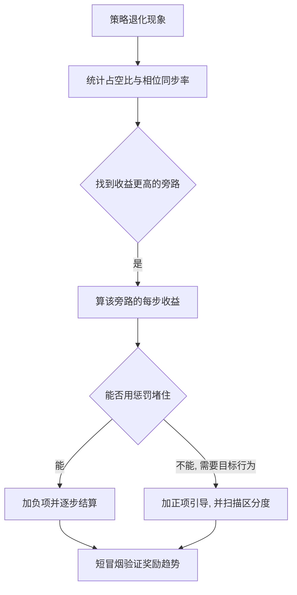
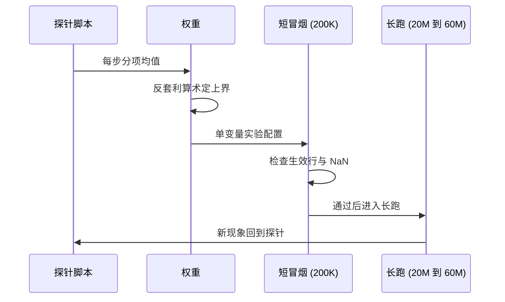

奖励设计的问题很少是“权重写错了”，多数情况是奖励面里存在一条收益更高的旁路。策略总能找到它：贴地滑行能拿满速度跟踪，吊着一条腿能躲开只在触地帧结算的惩罚，绕开楼梯与爬上去的收益完全相同。这些旁路都有一个共同特征，它们在原本的奖励公式里完全合法。

发现这类问题不能只读公式，还要把策略的实际行为拆成可测量的量：足端占空比、对角同步率、抬脚净空、每步分项均值。mjx-go1-getup 的版本记录里，每一版修补都先给出一个实测数字，再给出一个探针脚本；补丁写完之后还要用区分度扫描确认新奖励面真的能推动行为。

五类激励缺口的结论都来自实测，出处集中在实验记录里。引用探针脚本时要注意：不少脚本已经被删除，留下的结论在实验记录里，正文会标明哪些文件当前不存在。

## 滑行与贴地：跟踪奖励被滑移绕开

v10 到 v15 的步态是贴地滑行。速度跟踪项只关心基座速度，不关心足端怎么移动，于是“脚不动、靠摩擦力滑”与“脚迈出去推地”拿到的分一样多，而前者更容易稳定（`RLcontroller_go1_moreinformation/实验记录_Go1复现.md:781`）。权重表里 `feet_slip` 默认 0.0 的注释把这件事写得很直接：没有这一项时贴地滑行能拿满速度跟踪奖励，是 v10 到 v15 滑行步态的直接原因（`envs/go1_walk.py:129-131`）。

v16 的修补照搬了 playground 的配方（`RLcontroller_go1_moreinformation/实验记录_Go1复现.md:789`）：接触相足端速度平方惩罚 `feet_slip=-0.5`，摆动相抬脚高度塑形 `feet_height=-1.0`，两项在 `train/train_go1.py:446-456` 一起启用。修补效果用实测打滑量验收，记录里给的是“打滑消除”（`:846`）。

## 单腿吊挂：只在触地帧结算的漏洞

`feet_slip` 与 `feet_height` 都只在触地帧结算，一条永远不落地的腿同时躲开了两项惩罚。v16 之后出现的现象是 FL 足占空比 0.01、连续悬空 14.7 s（`RLcontroller_go1_moreinformation/实验记录_Go1复现.md:864`）。这不是参数调错，是结算时机决定的漏洞。

v17 的修补是加一项逐步结算的悬空惩罚 `feet_dangle=-0.5`，按 `clip(air_time - air_time_limit, ...)` 每步扣分，`air_time_limit` 取 0.8 s，是正常摆动 0.2 到 0.4 s 的两倍余量（`envs/go1_walk.py:136-140`、`:185-189`）。同一次修补还给空距奖励加了封顶 `air_time_max=0.5`：不封顶时“吊腿 10 s 再落地”能拿 +9.8，与正常步态每秒收益相当（`:179-181`）。

| 分项 | 结算时机 | 被绕开的方式 | 对应修补 |
| --- | --- | --- | --- |
| `feet_slip` | 触地帧 | 脚不落地 | v17 `feet_dangle` |
| `feet_height` | 摆动相 | 脚不抬起 | v20 改成摆动相均值结算 |
| `feet_airtime` | 触地帧 | 一次吊很久再落地 | `air_time_max` 封顶 |
| `feet_impact` | 落地帧（初版） | 不落地 | v20 改成净空低于阈值时结算 |
| `ascent` | 每步 | 站在台顶不动 | v23 行进门控 |

## 三足与前后成对：仅靠惩罚推不出步态

v19 的策略退化成“前腿占空比 13%、后腿 78%、对角同步 13%”，前腿基本吊着不落地（`RLcontroller_go1_moreinformation/实验记录_Go1复现.md:2812`、`:2844`）。机制被描述成“后腿独撑加前腿悬空”，并给出一个可解释的恶性激励假设：前腿悬空可以同时躲开接触相惩罚（`:2867`）。

这里的关键判断是，惩罚项只能排除坏行为，推不出目标行为。要得到对角 trot，需要显式的相位引导。这条判断直接导致 v20 引入 `feet_phase` 相位奖励（`envs/go1_walk.py:238-240`）。同一节记录还纠正了一个观察偏差：当时摔的地方在平地，不在台阶，走不快的原因是速度与稳定性的权衡崩了（`RLcontroller_go1_moreinformation/实验记录_Go1复现.md:2890`、`:2910`）。

## 相位奖励面过平：区分度只有 0.04

v20 的第一版相位奖励用了 playground 的 `sigma=0.1` 与 `swing_height=0.08`，在真实 rollout 里给分几乎为零，而且偏袒“不抬腿”（`RLcontroller_go1_moreinformation/实验记录_Go1复现.md:3155`、`:3170`）。量化后的三个参照点是：理想 trot 1.0000、四足全贴地不动 0.9583，只差 0.04（`envs/go1_walk.py:248-255`）。策略在 5M 步时确实朝“四足贴地不动”退化，前腿占空比 8.7%。

修补是把 `swing_height` 从 0.08 提到 0.15、`sigma` 从 0.1 收到 0.02，重新扫描得到 A 理想 1.0000、B 贴地 0.3371、C 全悬 0.1880，区分度 `gap=0.6629`（`:256-261`）。扫描用的探针 `sim/probe_v20_phase_flatness.py` 已删除，数值结论保留在实验记录里（`RLcontroller_go1_moreinformation/实验记录_Go1复现.md:3196`）。

## 绕开楼梯：奖励面缺少爬升项

v21 的策略放在楼梯脚下正对楼梯，走 2.0 m 却横向漂移 1.4 m 绕开，最大爬升只有 4.7 cm（`train/train_go1.py:607-608`）。原因是原奖励面没有任何一项随“站得更高”增加：`base_height` 是相对量，速度跟踪、相位、各项成本都与地形高度无关，于是绕开与爬上去收益完全相同，而绕行更容易（`:603-606`）。

v22 加了 `ascent`：每步奖励为 `W × clip(h_now - h_spawn, 0, 0.35)`，权重 2.0（`train/train_go1.py:588-602`）。用绝对地形高度差而不是躯干相对地面，是因为后者在地形上是常量，补不上缺口；下坡不扣分由 `feet_impact` 负责；上限 0.35 m 防止某个环境爬上天花板后靠一项吃满（`RLcontroller_go1_moreinformation/实验记录_Go1复现.md:4501-4504`）。

标定 `ascent` 权重用的是探针 `sim/probe_v22_reward_terms.py` 的实测每步均值：速度跟踪 +1.76、相位 +1.59、`base_height` -0.30（`train/train_go1.py:609-610`）。这几个数是后面反套利算术的输入。

## 站桩套利：状态型奖励的算术上界

`ascent` 是状态型奖励，站在台顶不动也持续收钱，所以权重不能靠扫参拍出来，要用算术定。走路每步 +1.776，站着不动 +0.347，站台顶每步是 `0.347 + W × 0.30`；代入 W=2 得 +0.947（走路的 53%），W=4 得 +1.547（88%），W=8 得 +2.747（154%，会退化）（`train/train_go1.py:611-621`、`RLcontroller_go1_moreinformation/实验记录_Go1复现.md:4506-4515`）。

v23 给这一项加了行进门控 `clip(|v_body|/0.2, 0, 1)`，静止时归零，套利路径消失（`envs/go1_walk.py:205-209`）。门控的思想可以推广：任何按状态持续给分的项，都要检查“保持该状态不动”的收益是否超过正常行为。

## 标定流程：探针、单变量与通路验证

三步流程在这份工程里反复出现。第一步是探针标定，先量出分项在真实 rollout 里的每步均值，再定权重；用过的探针包括 `sim/probe_v19_reward_scale.py`（量 `base_height` 的平方误差分布，已删除，结论见实验记录 `RLcontroller_go1_moreinformation/实验记录_Go1复现.md:2392`）、`sim/diag_v16_reward.py`（区分度验证，`:809`）、`sim/probe_v22_reward_terms.py`（分项均值，`train/train_go1.py:609`）。

第二步是单变量实验。v22 的注释专门说明 `base_height_ref` 保持 `mean5` 默认值，为的是让这一轮唯一变量是 `ascent`，否则 40M 步的改善无法归因（`envs/go1_walk.py:219-223`、`train/train_go1.py:624-634`）。

第三步是通路验证，用 200K 步、1024 环境的短跑确认每个开关的生效行、观测维度、奖励曲线与 NaN 状态（`RLcontroller_go1_moreinformation/实验记录_Go1复现.md:2488-2500`）。

## 平方项权重的实测纠正

v19 的 `base_height` 权重定标有过一次典型误估。第一版按线性直觉取 -20.0，并宣称偏差 3 cm 时惩罚 -1.8；实测公式是平方误差，-20.0 乘 0.03 的平方只有 -0.018，差了 20 倍（`RLcontroller_go1_moreinformation/实验记录_Go1复现.md:2394-2399`）。

探针 `sim/probe_v19_reward_scale.py` 用 512 环境乘 400 步量出分布：躯干相对高度均值 0.2590、标准差 0.0630、中位数 0.2761、95 分位 0.2889；相对目标 0.28 的偏差均值 0.0280 m、95 分位 0.2181 m；平方误差的中位数 1.9e-5，95 分位 0.0476，最大 0.0527（`:2401-2408`）。中位数与 95 分位相差约 2500 倍，分布极长尾，长尾由摔倒样本贡献。

按 95 分位量级选 -200.0，得到偏差 2 cm 惩罚 -0.08、5 cm 惩罚 -0.50、10 cm 惩罚 -2.00（`:2413-2419`）。排除 -2000 的理由是它给到每步均值 -8.83，是 v18 每步奖励 2.46 的 3.6 倍，会把总奖励压到截断线以下，PPO 失去梯度，正是 v1 到 v7 的失败模式（`:2421-2422`）。结论写在记录里：平方项的权重不能靠线性外推，必须实测分布。

| 偏差 | -200 权重下的惩罚 | 说明 |
| --- | --- | --- |
| 2 cm | -0.08 | 正常步态的抖动区间 |
| 5 cm | -0.50 | 明显塌腰 |
| 10 cm | -2.00 | 拖地或摔倒 |

## 总奖励归零占比的验证

总奖励的形式是 `clip(total, 0, 10000)`，下限 0 由 `reward_clip_min` 给出（`envs/go1_walk.py:68-73`）。任何负项一旦把总奖励压到 0，该步梯度为零，所以加权重项之前要量一下归零占比。探针 `sim/probe_v19_reward_total.py` 给出的对照是：基线每步总奖励 1.708、归零步数占比 7.2%、存活率 86.9%；加上 `base_height=-200` 后每步 1.635、归零占比 10.8%、存活率不变；再叠 `feet_impact=-2` 数字完全不变（`RLcontroller_go1_moreinformation/实验记录_Go1复现.md:2465-2472`）。

两项叠加没有进一步影响，原因是归零步都出现在已经摔倒的样本里，惩罚本来就被截断吸收。每步总奖励只降 4.3%，判定为权重合适（`:2471-2473`）。这套验证的口径可以复用：新增负项后同时看每步均值、归零占比与存活率，只看均值会漏掉长尾。

## 奖励依赖的内部状态必须可观测

相位奖励的目标轨迹 `rz(phi)` 随相位周期变化。策略如果看不到自己处在哪个相位，这条轨迹对它就是一个无法预测的时变目标，等价于在奖励里注入噪声，梯度方向随机，学不会。实测表现是奖励与行为的相关系数接近 0，修正办法是在 `_get_obs` 里加入相位编码（仅当相位奖励打开时）（`RLcontroller_go1_moreinformation/实验记录_Go1复现.md:3370-3382`）。

这条约束适用于所有依赖内部状态的奖励项：相位、时钟、课程等级。写奖励函数时容易默认“当然知道当前相位”，而 actor 的观测里未必有。检查办法是列出奖励函数读取的每一个状态量，逐个确认它是否出现在 actor 的观测向量里。

## 小结

### 核心概念

- 激励缺口是奖励面里的合法旁路，策略会优先找到它。
- 只在事件上结算的项可以被“不触发事件”的行为绕开，逐步结算是通用修补。
- 惩罚只能排除坏行为，目标步态需要正项引导。
- 正项要检查区分度，参照点之间差距过小就推不动行为。
- 状态型奖励要用算术上界定权重，必要时叠加行进门控。
- 标定流程是探针、单变量、通路验证三步，缺一步就会归因不清。

### 设计权衡

| 决策 | 选择 | 收益 | 代价 |
| --- | --- | --- | --- |
| 结算时机 | 逐步结算优先 | 无法通过不触发事件绕开 | 每步计算量增加 |
| 步态引导 | 相位奖励加抬脚联动 | 能把步态推回 trot | 两个目标必须同时改 |
| 权重来源 | 实测均值为输入 | 反套利算术有据可依 | 依赖探针脚本维护 |
| 实验组织 | 一次一个变量 | 结果可归因 | 长跑轮次变多 |
| 验证入口 | 200K 步短冒烟 | 早期发现配置问题 | 每次改配置都要补一段短跑 |

## 练习

### 基础题

1. 列出 `feet_slip`、`feet_height`、`feet_airtime` 三项的结算时机，说明哪一项能被“不落地”绕开。
2. 用 +1.776 与 +0.347 两个数复算 `ascent` 在 W=2 时的套利比例，并说明门控如何改变这个比例。
3. 解释 v20 第一版相位奖励为什么偏袒“不抬腿”，给出两个修正参数各自的作用。

### 挑战题

1. 为 `feet_impact` 设计结算时机，使之无法被“永不落地”绕开，并说明与 `feet_dangle` 的覆盖范围差异。
2. 设计一个探针，量出 `symmetry` 项在正常步态与不对称步态下的每步均值，写出需要的统计量与判据。
3. 假设新增一项“保持躯干高度”的状态型奖励，写出它的反套利上界推导与单变量验证方案。

## 附：本页引用的路径

| 路径 | 用途 |
| --- | --- |
| `envs/go1_walk.py` | 分项注释、结算时机与门控参数 |
| `train/train_go1.py` | 修补开关、标定注释与反套利算术 |
| `RLcontroller_go1_moreinformation/实验记录_Go1复现.md` | 五类缺口的实测数字与探针结论 |
