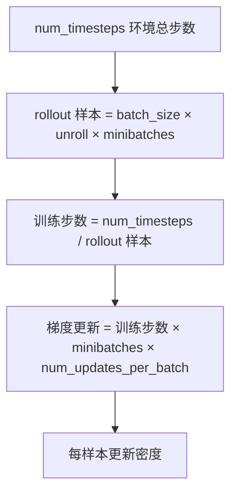
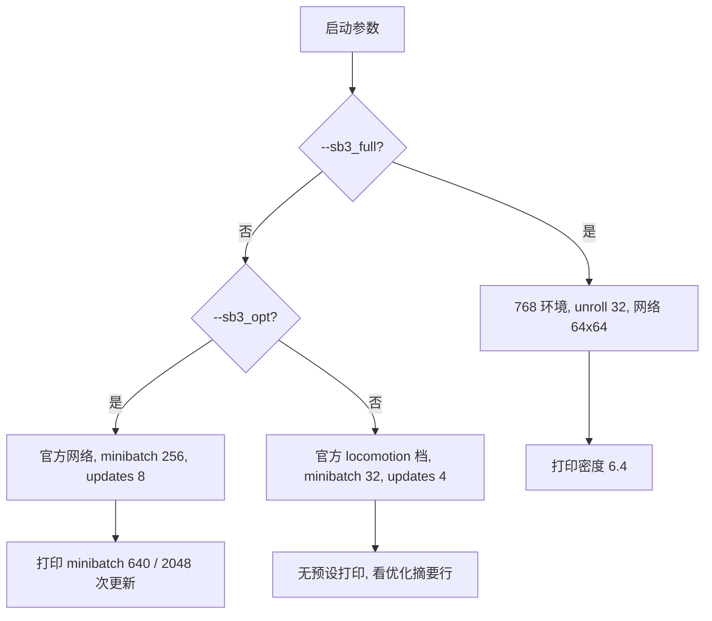

同一份环境代码，换一组 PPO 参数，收敛速度可以差两个数量级。这套工程在早期版本上正好验证了这一点：环境与网络都没动，只改优化制度的四个参数，训练就从“eval_reward 全程 0.000”变成能跑满回合。

问题出在两种框架对同一个名字的定义不同。brax 的 `batch_size` 指的是“每个 minibatch 的序列数”，一个 minibatch 的转移数要再乘 `unroll_length`；SB3 的 `batch_size` 直接就是 minibatch 的样本数。名字一样，语义差 32 倍。类似的换算还出现在训练预算上：brax 的 `num_timesteps` 是环境总步数，除以 rollout 长度才是训练步数。

换算账目立不起来，后面的分档差异就没法比较：三档预设的参数差异只有放进同一张账目里才看得出来，梯度更新密度与显存约束正是这张账目的两个出口。

## 训练步与环境步的换算账目

brax 里一个训练步（rollout）采集的样本数是 `batch_size × unroll_length × num_minibatches`。训练步数由总预算除以这个数得到。参考仓库的 5M 环境步对应 203 个训练步、约 78 万次梯度更新；v9 之前只给了 400K 环境步，等于 16 个训练步、约 6.1 万次更新，只有参考的十二分之一，所以 `eval_reward` 全程 0.000（`RLcontroller_go1_moreinformation/实验记录_Go1复现.md:168-173`）。

v10 的实际账目可以在验收对照里查到：训练 5,136,384 环境步、209 个 rollout、802,560 次梯度更新（`:317-323`）。这个数与参考仓库的 779,520 次处在同一量级，是“训练预算补齐”的直接证据。



## brax 的 batch_size 语义

v4 到 v8 用 `batch_size=64`，按 brax 语义是每个 minibatch 64 条序列，乘 `unroll=32` 得到 2048 条转移；SB3 的 minibatch 是 64 条样本，两者相差 32 倍，于是每样本的更新密度只有 SB3 的三十二分之一（`RLcontroller_go1_moreinformation/实验记录_Go1复现.md:159-162`）。

这个错误在磁盘上留下了可核对的痕迹：v4 到 v8 的 checkpoint 间隔是 786,432 步，等于 `64 × 32 × 384`，正好是参考 rollout 24,576 的 32 倍；v10 的间隔变成 270,336，等于 `11 × 24576`，恢复正确（`:164-166`）。从检查点目录的时间间隔反推 rollout 长度，是这类记账错误最直接的验证手段。

正确的映射写在源码注释里：`batch_size=2`（2 条序列乘 32 步等于 64 条，对应 SB3 的 minibatch）、`num_minibatches=384`、`num_updates_per_batch=10`，密度 6.4 样本每次更新，与 SB3 完全一致（`train/train_go1.py:329-336`）。

## 三档优化制度预设

入口脚本按开关分成三档，参数集中写在 `train/train_go1.py:318-399`。`--sb3_full` 完全对齐参考仓库，`--sb3_opt` 只对齐优化制度，两者都不加时用官方 locomotion 档。三档的差异如下：

| 参数 | sb3_full | sb3_opt | 默认档 |
| --- | --- | --- | --- |
| num_envs | 768 | 由 `--num_envs` 决定 | 8192 |
| unroll_length | 32 | 20 | 20 |
| batch_size | 2 | 由整除关系算出 | 由整除关系算出 |
| num_minibatches | 384 | 256 | 32 |
| num_updates_per_batch | 10 | 8 | 4 |
| entropy_cost | 0.0 | 0.0 | 1e-2 |
| discounting | 0.99 | 0.99 | 0.97 |
| clipping_epsilon | 0.2 | 0.3 | 0.3 |
| max_grad_norm | 0.5 | 1.0 | 1.0 |
| 网络隐藏层 | (64,64) | (512,256,128) 或 `--sb3_net` | (512,256,128) |
| normalize_observations | False | True | True |
| distribution_type | normal | tanh_normal | tanh_normal |

表里的三个默认档数字对应官方 locomotion 配置：8192 个并行环境、unroll 20、32 个 minibatch（`train/train_go1.py:367-370`）。这一档在 v1 上跑出过“GPU 反而更慢”的结果，原因在下一节。

## 梯度更新密度是收敛的主要变量

v1 用官方档跑了 59.5M 环境步，梯度更新只有 4.7 万次；参考仓库 5M 步有 78 万次。表格里的四项差距是：网络参数量 27 倍、更新次数少 94%、每样本更新密度差 200 倍、熵与折扣分别是 1e-2 对 0 与 0.97 对 0.99（`RLcontroller_go1_moreinformation/实验记录_Go1复现.md:226-233`）。

结论被记成一句可复用的话：PPO 收敛主要由梯度更新次数驱动，GPU 把采样吞吐放大了数百倍，但优化密度被稀释了两个数量级，缺的是消化能力，不是数据量（`:235-237`）。这条诊断在根因 4 里以另一个形式再次出现，说明它在这套栈上具有普遍性。

| 变量 | 参考 SB3 | v1 官方档 | 差距 |
| --- | --- | --- | --- |
| 网络参数量 | 约 1.5 万 | 约 42 万 | 27 倍 |
| 梯度更新次数 | 约 78 万 | 约 4.7 万 | 减少 94% |
| 每样本更新密度 | 6.4 样本一次 | 1280 样本一次 | 200 倍 |
| 熵 / 折扣 | 0 / 0.99 | 1e-2 / 0.97 | 探索大、视野短 |

## 三档预设的命令行与日志判别

三档预设分别对应一次实验的命令形态：

```bash
# 完全对齐参考仓库 (5M 环境步)
python -u -m train.train_go1 --sb3_full --num_timesteps 5000000 --logdir logs/walk_v9

# 只对齐优化制度, 网络与环境保持官方档
python -u -m train.train_go1 --sb3_opt --num_envs 8192 --num_timesteps 50000000 --logdir logs/walk_v2

# 官方 locomotion 档
python -u -m train.train_go1 --num_timesteps 100000000 --logdir logs/walk_v1
```

日志里能按打印行区分这三档。`--sb3_full` 会打印一行包含 minibatch 序列数、每步更新次数与密度，密度写的是 6.4（`train/train_go1.py:352-357`）。`--sb3_opt` 打印 minibatch 640 样本、每批 2048 次更新（`:364-365`）。不加两者的官方档没有预设打印，只能从后面的优化摘要行看 `layers`、`clip` 与 `grad_clip` 三个值（`:689-691`）。



预设之间不能混用。`--sb3_net` 单独出现时只换网络宽度，优化制度仍走官方档；它和 `--sb3_full` 的分支互斥，因为后者已经把网络、优化与环境规模一起换掉（`train/train_go1.py:358-380`）。

## 显存约束下的 GAE 窗口

`--sb3_full` 档保留了一个残余差异：GAE 窗口是 32，SB3 是 2048。注释给出的原因是 8GB 显存装不下 `768 × 2048` 的 rollout（`train/train_go1.py:327`）。这是硬件约束而非算法选择，记录时要写明，否则复现者会以为 32 也是对齐项。

窗口变短的代价是优势估计的偏差更大，对长周期任务的回报估计更噪。这套工程接受这个代价，因为梯度更新密度已经对齐，收敛速度的主要矛盾不在 GAE。

## 整除性与断言护栏

默认档的 `batch_size` 由 `num_envs // num_minibatches` 算出，源码在计算前加了一条断言：`num_envs` 必须能被 `num_minibatches` 整除（`train/train_go1.py:383-394`）。这条断言对应过一次真实回归：默认 `num_envs=8192` 配 `batch_size=64` 时，`64 × 32` 不被 8192 整除，brax 内部直接断言失败。注释把这件事写成“v9 加 batch_size 变量时引入的回归”，提醒改默认值时把三个数一起算。

## 学习率与熵的覆盖入口

学习率与熵系数可以在命令行覆盖：`--lr` 与 `--entropy` 分别对应默认的 3e-4 与三档算出的熵值，覆盖后会打印一行优化摘要（`train/train_go1.py:687-691`）。熵系数的帮助文本提到一个现象：收敛后的策略 `log_std` 往往被压得很低，此时熵项的作用主要是维持探索，取 0 与取 1e-2 是两种实验取向（`:163-165`）。

`ppo_params` 的组装在 `:710-736`，学习率与熵系数在最后一步取命令行覆盖值，其余字段按档位填好。这种“默认值加覆盖”的写法让日志里的优化摘要与实际训练参数一致，排查时以那行打印为准。

## 小结

### 核心概念

- brax 的 batch_size 是序列数，minibatch 转移数要乘 unroll_length。
- num_timesteps 是环境步数，训练步数等于它除以 rollout 样本数。
- checkpoint 间隔可以反推 rollout 长度，是记账错误最直接的证据。
- 收敛速度主要由每样本更新密度决定，与并行环境数不是正相关。
- sb3_full 档的 GAE 窗口 32 由 8GB 显存约束给出，不是对齐项。
- batch_size 由整除关系算出，改 num_envs 或 minibatches 时要一起验算。

### 设计权衡

| 决策 | 选择 | 收益 | 代价 |
| --- | --- | --- | --- |
| 优化制度 | 默认档偏密更新 | 收敛快 | rollout 短，GAE 偏差大 |
| 完全对齐 | sb3_full 用 768 环境 | 与参考逐项可比 | 并行度低，单步耗时长 |
| 预算表达 | 直接给 num_timesteps | 与参考统一口径 | 训练步数需要换算 |
| 超参覆盖 | 命令行只覆盖两个 | 日志可控 | 其余参数要改代码 |
| 显存取舍 | GAE 窗口压到 32 | 8GB 可跑 | 优势估计更噪 |

## 练习

### 基础题

1. 用 `batch_size=2`、`unroll=32`、`num_minibatches=384`、`num_updates_per_batch=10` 算出一次 rollout 的样本数与梯度更新次数。
2. 解释为什么 v4 到 v8 的 checkpoint 间隔是 786,432 步，并写出它与参考 rollout 的倍数关系。
3. 说明 `num_envs=8192` 配 `batch_size=64` 为什么会触发 brax 断言。

### 挑战题

1. 给定一次实验的 checkpoint 目录，写出从间隔反推 `unroll_length` 与 `num_minibatches` 的步骤。
2. 在 8GB 显存约束下，设计一组参数使 GAE 窗口尽量长而更新密度不变，说明需要牺牲哪个量。
3. 如果只能改一个超参把收敛速度提上去，说明选哪个并给出一条验证实验设计。

## 附：本页引用的路径

| 路径 | 用途 |
| --- | --- |
| `train/train_go1.py` | 三档预设、batch_size 换算、断言与优化摘要 |
| `RLcontroller_go1_moreinformation/实验记录_Go1复现.md` | 预算记账、v1 诊断与 v10 验收对照 |
