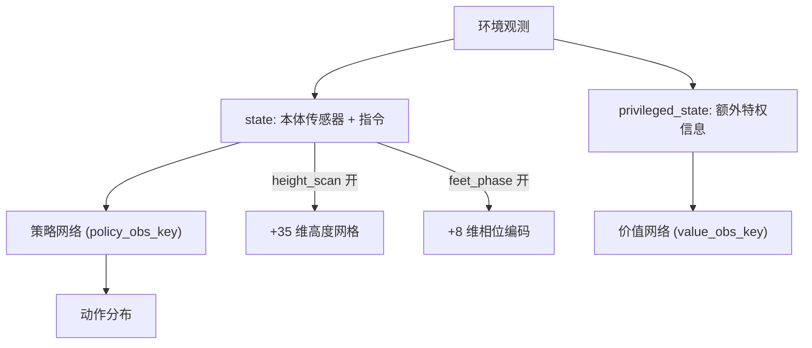
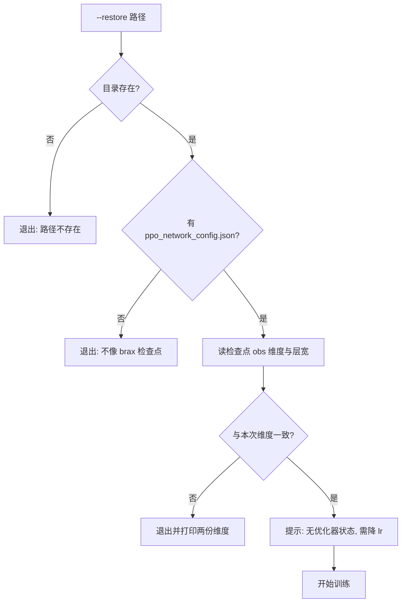

这套训练用的是单阶段非对称 actor-critic：一个策略只看本体传感器与指令，价值函数额外看特权信息。两者从同一份环境数据里取不同的键，网络宽度也是同一套参数。非对称结构不是两阶段蒸馏，两者的参数在同一轮 PPO 更新里训练。

网络相关的选项里，有三个容易被默认值带偏。brax 的激活函数默认是 swish 而不是 tanh；分布类型默认是 tanh_normal 而不是普通高斯；观测归一化在完全对齐档里是关的。这三项都不会报错，只会让结果对不上，其中激活函数传错还会在加载检查点后建出一个“能跑但输出错误”的网络。

观测键决定输入的语义，宽度、激活、分布与归一化只决定拟合能力与数值范围；顺序上先定前者，再调后者，续训校验则要同时覆盖两者。

## actor 与 critic 的观测键分离

`network_factory` 里有两个键：策略取 `state`，价值函数取 `privileged_state`。维度自检就写在这两个键旁边（`train/train_go1.py`）：

```python
_n_scan = env_cfg.height_scan.nx * env_cfg.height_scan.ny if _probe else 0
# v20: 相位 (cos,sin) x 4 足 = 8 维, 仅在开相位奖励时进 obs
_n_phase = 8 if env_cfg.reward_config.scales.get("feet_phase", 0.0) != 0.0 else 0
print(f"预期 obs 维度: state={48 + _n_scan + _n_phase}  "
      f"privileged_state={119 + _n_scan + _n_phase}"
      f"{'  (含相位 8 维)' if _n_phase else ''}")
```

基础维度是策略 48 维、价值 119 维；打开高度扫描后两边各加 35 维（7 乘 5 网格），打开相位奖励后各加 8 维（四足的 cos 与 sin）。`scales.get("feet_phase", 0.0) != 0.0` 读的是"相位奖励是否开启"——相位维度只在打开它时才进观测，就是这一行决定的。

v19 的启动日志把这两个数打印成 `state=83` 与 `privileged_state=154`，正好是 48 加 35 与 119 加 35（`RLcontroller_go1_moreinformation/实验记录_Go1复现.md`）。这类打印行的作用是让“环境配置”和“网络输入维度”对得上，改环境后第一件事就是核对它。



## 三档网络宽度与参数量的对照

完全对齐档用 (64,64) 两层网络，参数量约 1.5 万，与 SB3 的 MlpPolicy 同量级；官方档用 (512,256,128)，参数量约 42 万，是参考的 27 倍（`RLcontroller_go1_moreinformation/实验记录_Go1复现.md`）。`--sb3_net` 把宽度换成 (64,64) 而不改优化制度（`train/train_go1.py`）。

策略头是 tanh_normal 时输出均值与对数标准差两组，24 维控制量对应 48 个输出，加上共享层后总参数量约 2 万，仍与参考同量级。`--layers` 可以覆盖隐藏层宽度，覆盖时策略与价值用同一组。

| 档位 | 隐藏层 | 参数量量级 | 说明 |
| --- | --- | --- | --- |
| sb3_full | (64,64) | 约 1.5 万 | 对齐 SB3 MlpPolicy |
| sb3_net | (64,64) | 约 2 万 | 仅换网络，优化制度不变 |
| 官方档 | (512,256,128) | 约 42 万 | 参考仓库的 27 倍 |

## 激活函数必须显式传参

brax 的 `network_factory` 要求激活是一个函数而不是字符串。完全对齐档传 `jax.nn.tanh`，官方档传 `jax.nn.silu`：

```python
# 完全对齐档
activation = jax.nn.tanh
# 官方档
activation = jax.nn.silu
```

`jax.nn.tanh` 是函数对象本身，brax 会直接调用它；写成字符串 `"tanh"` 会 `TypeError`。

不传激活时 brax 用默认的 swish。加载检查点手动建网络时如果不显式指定，会建出一个能加载、能推理、但输出完全错误的网络；记录里把这类现象归到“换了 checkpoint 结果就变”的来源，并要求手动建网时同时传 `activation=jax.nn.tanh` 与 `distribution_type="normal"`（`RLcontroller_go1_moreinformation/实验记录_Go1复现.md`）。

## 分布类型与策略头结构

分布类型只有两个取值：完全对齐档用 `normal`，因为 SB3 的高斯不做 squash；官方档用 `tanh_normal`，把动作压缩到有界区间（`train/train_go1.py`）。两者的差别不在采样，而在动作边界的处理方式，切换时策略头的输出维度不变。

分布类型与激活一样属于“不报错但影响结果”的选项，实验记录要求两者在加载与训练两侧保持一致。

## 观测归一化的取舍与 NaN 的关系

`normalize_observations` 在完全对齐档是关闭的，在官方档是打开的（`train/train_go1.py`）。它对应 SB3 的 `VecNormalize`，在参考仓库里是缺失件。

归一化与数值稳定性的关系被一次对照实验否掉了因果推断：v6 用硬接触加归一化跑了 7.9M 步无 NaN，v7 同样配置加修正终止后在 6.29M 步出现 NaN，v10 用硬接触、不归一化、njmax 256 跑了 5.14M 步无 NaN（`RLcontroller_go1_moreinformation/实验记录_Go1复现.md`）。结论是 NaN 的出现与摔倒姿态的随机性有关，归一化既不必要也不充分，根因在求解器与护栏字段。

## 观测维度校验与续训守卫

续训前会先读检查点目录里的 `ppo_network_config.json`，取出其中记录的观测维度与本次训练的维度对比，不一致就直接退出并打印两份维度：

```python
cfg = os.path.join(r, "ppo_network_config.json")
if not os.path.isfile(cfg):
    raise SystemExit(
        f"--restore 不像一个 brax 检查点 (缺 ppo_network_config.json): {r}")
with open(cfg) as f:
    rc = json.load(f)
obs = rc.get("observation_size", {})
got_state = (obs.get("state") or {}).get("shape")
got_priv = (obs.get("privileged_state") or {}).get("shape")
...
if mism:
    raise SystemExit(
        "--restore 的 obs 维度与本次训练不一致, 无法恢复:\n  "
        + "\n  ".join(mism)
        + "\n(维度不一致说明环境配置与产出该检查点的训练不同)")
```

守卫在环境加载之前执行，避免拒绝时已经占用 GPU。

守卫还会打印一条重要提醒：

```python
print("  注意: brax checkpoint **不含优化器状态与步数** -> Adam 动量从零"
      "重建, num_steps 从 0 记。这是续训必须降 lr 的原因 (§9.2/§22)")
if step_offset:
    print(f"  step_offset={step_offset} (仅日志显示累计步数, 不改训练语义)")
```

brax 的检查点不含优化器状态与步数，续训时 Adam 动量从零重建、`num_steps` 从 0 重新计数，所以续训需要降学习率。`step_offset` 只影响日志里显示的累计步数，不改变训练语义。



## 观测噪声与特权信息的可见性差异

噪声只加在策略侧的观测上，价值函数保持无噪。`obs_noise` 的五路幅值分别作用于线速度、角速度、重力分量、关节位置与关节速度，入口开关为 `--obs_noise`（`train/train_go1.py`，参数见 `envs/go1_walk.py`）。高度扫描的 0.02 m 噪声同样只进策略侧（`envs/go1_walk.py`）。

这条不对称是有意的：价值函数的任务是估计回报，输入越干净越好；策略要面对带噪的传感器，才能在部署时不依赖精确读数。`--scan_noise` 可以单独覆盖高度噪声的幅值（`train/train_go1.py`）。

| 选项 | 作用侧 | 默认 | 开关 |
| --- | --- | --- | --- |
| 五路观测噪声 | 仅策略 | 关闭 | `--obs_noise` |
| 高度扫描噪声 | 仅策略 | 0.02 m | `--scan_noise` |
| 特权信息 | 仅价值函数 | 始终启用 | 由观测键决定 |
| 观测归一化 | 策略与价值 | 按档位 | `--norm_obs` 可强制打开 |

## 观测改动后的核对清单

改观测结构会影响奖励函数的可学性与续训兼容性，按顺序检查四项：启动日志的维度打印是否与预期一致；`ppo_network_config.json` 里的维度是否与本次训练一致；奖励函数读取的状态量是否都在策略观测里；噪声项是否只落在策略侧。

第三项来自一次真实故障：相位奖励的目标轨迹随相位周期变化，策略看不到相位时等价于给奖励加噪声，实测奖励与行为的相关系数接近 0，修正办法是在 `_get_obs` 里加入相位 cos 与 sin（`RLcontroller_go1_moreinformation/实验记录_Go1复现.md`）。这也是相位维度只在打开相位奖励时才进观测的原因（`train/train_go1.py`）。

## 层宽与 rollout 长度的显存取舍

完全对齐档用 768 个并行环境与 unroll 32，一次 rollout 是 24,576 条转移，正好复刻 SB3 的 `n_envs × n_steps`；注释指出 GAE 窗口只能用 32，因为 8GB 显存装不下 `768 × 2048`（`train/train_go1.py`）。官方档用 8192 个环境与 unroll 20，按参数推算一次 rollout 是 163,840 条转移，是前者的六倍多；它能跑起来的原因是网络小、GAE 窗口短，显存主要被并行环境数与 rollout 长度占用。

这三项在 8GB 卡上互相牵制：环境数决定并行采样吞吐，rollout 长度决定优势估计质量，层宽决定每秒能跑多少步。源码里给出的取舍是先保证更新密度对齐，再压缩 GAE 窗口。换卡或换层宽时，这三个数要一起重算。

| 档位 | 并行环境 | unroll | rollout 转移数 | 隐藏层 |
| --- | --- | --- | --- | --- |
| sb3_full | 768 | 32 | 24,576 | (64,64) |
| 官方档 | 8192 | 20 | 163,840 | (512,256,128) |
| 官方档加 `--sb3_net` | 8192 | 20 | 163,840 | (64,64) |

上表第三行的 rollout 长度与官方档相同，只是网络换小。若显存不足，可选的调整顺序是先降并行环境数、再降层宽、最后才动 unroll，因为 unroll 直接决定 GAE 偏差（属按参数关系给出的建议，未在本工程实测）。

## 参数覆盖与评估环境数

入口脚本把评估环境数固定为 128（`train/train_go1.py`），与训练环境数分开，评估结果因此不受并行度变化影响。检查点保存路径取 `logdir/checkpoints`，日志目录会先转成绝对路径：

```python
logdir = args.logdir or os.path.join(LOG_DIR, "walk")
# orbax 保存要求绝对路径 (相对路径在首次 checkpoint 时抛
# "Checkpoint path should be absolute")
logdir = os.path.abspath(logdir)
ckpt_path = os.path.join(logdir, "checkpoints")
```

orbax 是 JAX 生态里的检查点库，它要求保存路径是绝对路径；`os.path.abspath` 把相对路径补成绝对路径后，`args.logdir` 传什么都不会在首次保存时才报错。

`logdir` 默认落在 `logs/walk`；续训时 `--restore` 与 `--logdir` 可以指向不同目录，方便把不同难度的阶段产物分开归档。

## 小结

### 核心概念

- 策略与价值函数用两个观测键，基础维度 48 与 119，加扫描与相位后同步增长。
- 网络宽度分三档，参数量差 27 倍，换网络与换优化制度是两件事。
- 激活函数必须传函数对象，不传会用 brax 默认的 swish。
- 分布类型 normal 与 tanh_normal 对应有无动作压缩。
- 观测归一化与 NaN 无因果关系，根因在求解器与护栏。
- 续训守卫比对观测维度，并提醒检查点不含优化器状态。

### 设计权衡

| 决策 | 选择 | 收益 | 代价 |
| --- | --- | --- | --- |
| 观测结构 | 策略与价值分键 | 价值函数可用特权信息 | 两份维度都要校验 |
| 网络宽度 | 三档可选 | 能复现参考也能自研 | 换档要重训 |
| 激活与分布 | 显式传参 | 与参考逐项可比 | 加载代码要同步传 |
| 归一化 | 完全对齐档关闭 | 与 SB3 对齐 | 官方档需要打开 |
| 续训守卫 | 环境加载前检查 | 不占 GPU 就拒绝 | 每次续训多一次读文件 |

## 练习

### 基础题

1. 算出打开高度扫描与相位奖励后，策略与价值函数的观测维度各是多少。
2. 说明加载检查点手动建网络时必须传哪两个参数，并给出传错时的现象。
3. 解释 v6、v7、v10 三次实验为什么能排除“归一化导致 NaN”的推断。

### 挑战题

1. 设计一个续训守卫，除了观测维度外再校验网络层宽与分布类型，写出需要读的字段。
2. 在 8GB 显存下，评估把价值网络宽度提高一档对训练吞吐的影响需要记录哪些量。
3. 如果要在保持参数量不变的前提下增加特权信息的使用效率，说明可以改哪一层并给出验证方案。

## 附：本页引用的路径

| 路径 | 用途 |
| --- | --- |
| `train/train_go1.py` | 观测键、网络宽度、激活与分布、续训守卫 |
| `RLcontroller_go1_moreinformation/实验记录_Go1复现.md` | 参数量对照、加载器问题与 NaN 对照实验 |
