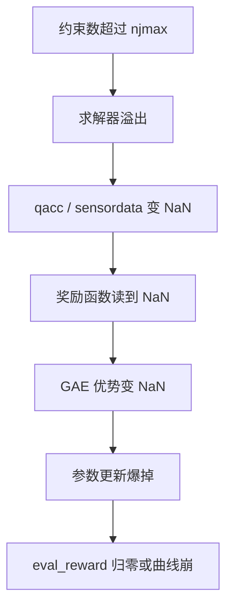
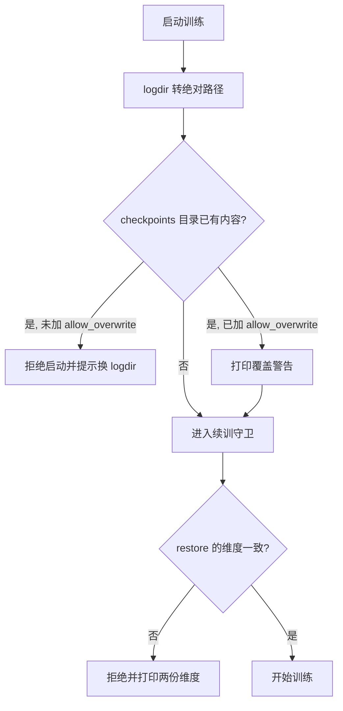
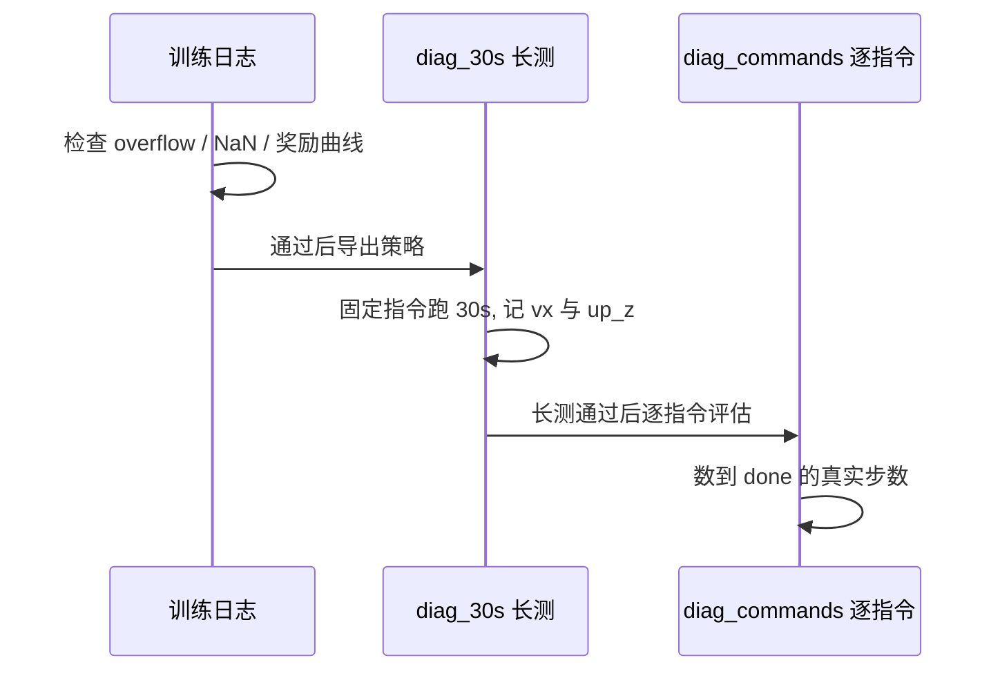

训练中的 NaN 很少是“梯度算错了”，多数是物理求解器在约束溢出之后把 NaN 写进了状态量，再顺着奖励进入优势估计，最后把参数打爆。这套工程在 v5、v7、v9 上崩过三次，直到 v10 才把根因和护栏一起补齐。

与 NaN 同级的问题还有检查点安全。brax 保存检查点时按步数命名目录，续训的步数从 0 重新计数，如果日志目录指向上一次训练，新检查点会静默覆盖旧证据。v22 之前没有任何闸门，这件事被写进了守卫函数的文档串。

总奖励截断与 njmax 溢出是数值链条上的两个入口，问题先以 NaN 的形式暴露，再沿求解器参数与日志键名散开；检查点闸门与加载器一致性决定失败时还能不能回到上一份可用参数。

## 总奖励截断与梯度归零

总奖励的形式是 `clip(total, 0, 10000)`，下限由 `reward_clip_min` 给出，行走任务的默认值是 0.0（`envs/go1_walk.py`）。一旦某个负项把总奖励压到 0，该步梯度为零；连续多步归零就等于这段轨迹没有学习信号，这正是 v1 到 v7 “eval_reward 全程 0.000”的形态之一。

验证口径不能只看均值。v19 的对照给出三项：基线每步总奖励 1.708、归零步数占比 7.2%、存活率 86.9%；加上 `base_height=-200` 后每步 1.635、归零占比 10.8%、存活率不变；再叠 `feet_impact=-2` 数字完全不变（`RLcontroller_go1_moreinformation/实验记录_Go1复现.md`）。归零占比上升而存活率不变，说明新增负项只作用在已经摔倒的样本上，被截断吸收。

| 配置 | 每步总奖励 | 归零步数占比 | 存活率 |
| --- | --- | --- | --- |
| 基线 | 1.708 | 7.2% | 86.9% |
| 加 `base_height=-200` | 1.635 | 10.8% | 86.9% |
| 再叠 `feet_impact=-2` | 1.635 | 10.8% | 86.9% |

## 溢出写到物理量之后的链条

NaN 的产生链条被拆成四步：约束数量超过 `njmax` 引发溢出，求解器把 NaN 写进 `qacc` 与 `sensordata`，奖励函数读取这些量后得到 NaN，NaN 沿 GAE 传播把优势估计污染，参数一次更新就被打爆（`RLcontroller_go1_moreinformation/实验记录_Go1复现.md`）。

早期判断“warp 会自动丢弃溢出约束，不影响站立测试”被证伪：溢出确实会写坏物理量。这条经验改变了护栏的位置，从“只在日志里告警”改成“在奖励计算前检查有限性”。



## njmax 与护栏字段的配合

单靠把 `njmax` 调大不够，还要覆盖所有被下游读取的字段。v8 加的护栏只回填了 `qpos` 与 `qvel`，而奖励还读 `qacc`、`qfrc_actuator`、`sensordata`，观测还读 `site_xmat` 与 `actuator_force`，护栏因此没有挡住（`RLcontroller_go1_moreinformation/实验记录_Go1复现.md`）。

v10 的做法是三件一起做：`njmax` 提到 256、护栏覆盖全部被读字段、奖励里加有限性检查。结果是 5.14M 步全程 0 次 `nefc overflow`、0 次 NaN。护栏字段的清单可以按“奖励函数与观测函数各读了哪些物理量”反推，这是比调大上限更可靠的收尾方式。

| 版本 | 关键改动 | 训练步数 | NaN 情况 |
| --- | --- | --- | --- |
| v5 | 硬接触 | 约 15M | 4.72M 起 NaN |
| v6 | 加观测归一化 | 7.9M | 无 NaN |
| v7 | 修正终止语义 | 7.9M | 6.29M 起 NaN |
| v8 | 加护栏（只回填 qpos/qvel） | 1.57M | 手动停 |
| v9 | 修 batch_size，预算 400K | 246K | 147K 起 NaN |
| v10 | njmax 256 + 全字段护栏 + 奖励 finite 检查 | 5.14M | 无 NaN |

## 求解器迭代次数与接触模型

物理求解参数就写在环境配置里（`envs/go1_walk.py`）：

```python
solver_iterations=2,      # warp 后端软接触收敛实测值 (ANYmal v28 诊断)
solver_ls_iterations=5,
foot_soft_contact=True,   # 足端软接触 (MJX 迭代求解器下硬接触不收敛)
...
hard_contact_iters=20,
hard_contact_ls_iters=10,
```

`solver_iterations` 是求解器每次迭代的上限，`solver_ls_iterations` 是线搜索的迭代次数；这两个值与"软接触还是硬接触"配套。这些值在初始化时被写进 MuJoCo 的 `opt`（求解器选项结构体），硬接触开关由 `--hard_contact` 打开并把足端接触模型换回 XML 原样（`train/train_go1.py`）。

软接触与硬接触在 MJX 迭代求解器下的收敛性不同：软接触是为 warp 后端收敛选的值，硬接触配 Newton 迭代是参考仓库的语义。数值稳定性的排查顺序是先看 `nefc overflow` 告警，再看求解器迭代，最后才怀疑梯度。

## 日志里的 loss=nan 是键名问题

v10 的日志里出现过 `loss=nan`，排查结论是取值键名不对：brax 的损失键没有 `losses/` 前缀，取不到时返回 NaN，与训练本身无关，v10 全程没有真实 NaN（`RLcontroller_go1_moreinformation/实验记录_Go1复现.md`）。取值逻辑写成示意就是：

```python
# 示意：指标读取对缺失键返回 NaN，缺失与真实 NaN 在日志里看起来一样
def metric(metrics, key, default=float("nan")):
    return float(metrics.get(key, default))
```

所以看到 `nan` 先确认键名是否真的存在，再怀疑梯度。

这件事的处理方式是修训练脚本的取值函数，并把“日志里的 NaN 先确认键名”写成排查步骤。指标读取函数对缺失键返回 NaN 的实现是 `train/train_go1.py`，它让缺失与真实 NaN 在前端看起来一样。

## 检查点覆盖闸门与绝对路径

续训时步数从 0 重新计数，新检查点会沿用 5M、10M 这套名字；如果日志目录指向上一次训练，同名目录会被强制覆盖。启动前的闸门检查 `logdir/checkpoints` 是否已有内容：

```python
def _check_ckpt_overwrite(ckpt_path, allow_overwrite):
  """拒绝往已有检查点的目录写 (brax 的 save 是 force 覆盖)。..."""
  if not (os.path.isdir(ckpt_path) and os.listdir(ckpt_path)):
    return
  existing = sorted(os.listdir(ckpt_path))
  if not allow_overwrite:
    raise SystemExit(
        f"拒绝启动: {ckpt_path} 已有 {len(existing)} 个检查点 ...")
  print(f"警告: --allow_overwrite 已开, 将覆盖 {ckpt_path} 下 "
        f"{len(existing)} 个同名检查点目录")
```

`os.path.isdir` 判断目录是否存在、`os.listdir` 读出目录内容；"目录存在且有内容"时默认 `raise SystemExit` 拒绝启动，只有显式加 `--allow_overwrite` 才打印警告继续。

另一条硬性要求是日志目录必须是绝对路径，因为 orbax 在保存检查点时会拒绝相对路径；入口脚本先做 `os.path.abspath` 再建目录（`train/train_go1.py`）。



## 30 秒长测作为稳定性验收

训练日志只能说明"没崩"，不能说明"站得住"。稳定性验收用的是固定指令下的 30 秒长测：`sim/diag_30s.py` 加载策略文件或检查点目录，加 `--hard_contact` 用参考物理跑 30 秒，输出实测速度、姿态与是否摔倒（`RLcontroller_go1_moreinformation/实验记录_Go1复现.md`）。

v10 的记录是 `vx=+0.492`、`up_z=1.00`、30 秒未摔，两个加载路径（策略文件与检查点目录）给出同一结果。验收摘要把"0 次 `nefc overflow`、0 次 NaN"与长测结果并列，说明数值稳定性与行为稳定性是两项独立验收。



## 手动终止的判据

不是所有失败都会自己崩。v8 在 1.57M 步被手动停掉，原因是 `eval_reward` 长期停在 0.001 附近而 `ep_len` 只有 25 左右，继续跑只是烧时间（`RLcontroller_go1_moreinformation/实验记录_Go1复现.md`）。v9 在 246K 步出现 NaN，间隔是 `49152`，等于 `2 × 24576`，说明 `batch_size` 已经改对、预算仍然不足。

这里 `ep_len` 指回合实际持续的步数，它与 `episode_length`（上限 750）之间的差距，就是"策略多久摔一次"的直接读数。

手动终止的判据可以归一成三条：奖励长时间不涨、回合长度长期不增、出现不可恢复的 NaN 或溢出。三条都写在每次运行的启动打印与日志里，不需要额外工具。

## 加载器与激活分布的一致性

手动加载检查点建网络时，必须显式传 `activation=jax.nn.tanh` 与 `distribution_type="normal"`。不传会用 brax 默认的 swish，建出一个能加载但输出错误的网络；记录把这类现象归为“换了 checkpoint 结果就变”的来源（`RLcontroller_go1_moreinformation/实验记录_Go1复现.md`）。检查点里的 `ppo_network_config.json` 记录了层宽与观测维度，但不保证加载代码会按它传激活与分布，所以这一步要人工核对。

## 证伪过的两条稳定性解释

记录里明确否掉两条推断。第一条是“v5 的 NaN 因为缺 SB3 的 `VecNormalize`”，被 v10 “不归一化、5.14M 步无 NaN”否掉。第二条是“`nefc overflow` 只是警告，warp 会丢弃溢出约束”，被“溢出会写坏 `qacc` 与 `sensordata`”否掉。两条真因分别是归一化无关的随机摔倒姿态，以及 `njmax` 偏小加护栏字段不全（`RLcontroller_go1_moreinformation/实验记录_Go1复现.md`）。

把被否掉的解释留在文档里，可以避免下一轮用同样的思路浪费 GPU 时间。

## 小结

### 核心概念

- 总奖励下限为 0，负项压过正项会让该步梯度归零。
- NaN 链条是溢出、物理量污染、奖励污染、优势污染、参数爆掉五步。
- njmax 必须与护栏字段清单一起改，护栏要覆盖奖励与观测读取的每个物理量。
- 求解器迭代次数与接触模型决定溢出发生频率，属排查的第一站。
- 检查点闸门防覆盖，绝对路径是 orbax 的硬要求。
- 加载检查点要显式传激活与分布类型，否则网络输出错误。

### 设计权衡

| 决策 | 选择 | 收益 | 代价 |
| --- | --- | --- | --- |
| 奖励下限 | 行走任务取 0 | 与 SB3 语义一致 | 负项过多即无梯度 |
| 护栏位置 | 奖励计算前检查有限性 | 阻断 NaN 传播 | 每步多一次判据 |
| njmax | 提到 256 | 实测 0 次溢出 | 每步接触计算量增加 |
| 检查点保护 | 默认拒绝覆盖 | 不会毁掉旧证据 | 续训需要换目录 |
| 指标缺失 | 返回 NaN | 代码简单 | 掩盖真实 NaN |

## 练习

### 基础题

1. 写出 NaN 从约束溢出到参数爆掉的五步链条，指出护栏可以插在哪两步。
2. 列出 v8 护栏漏掉的字段，并说明奖励与观测各自读取它们的用途。
3. 说明 `loss=nan` 与真实 NaN 的区分方法。

### 挑战题

1. 设计一个检查点归档流程，使续训、评估与不同难度阶段互不覆盖，写出目录结构与闸门改动。
2. 给定一次训练曲线中出现 NaN，写出从 `nefc overflow` 到优化器的排查顺序与每一步的判据。
3. 论证把 `njmax` 从 64 提到 256 的代价与收益，给出定量估算所需的量。

## 附：本页引用的路径

| 路径 | 用途 |
| --- | --- |
| `envs/go1_walk.py` | 奖励截断、求解器迭代与接触模型参数 |
| `train/train_go1.py` | 检查点闸门、续训守卫、指标读取与日志路径 |
| `RLcontroller_go1_moreinformation/实验记录_Go1复现.md` | NaN 根因、版本对照与证伪记录 |
