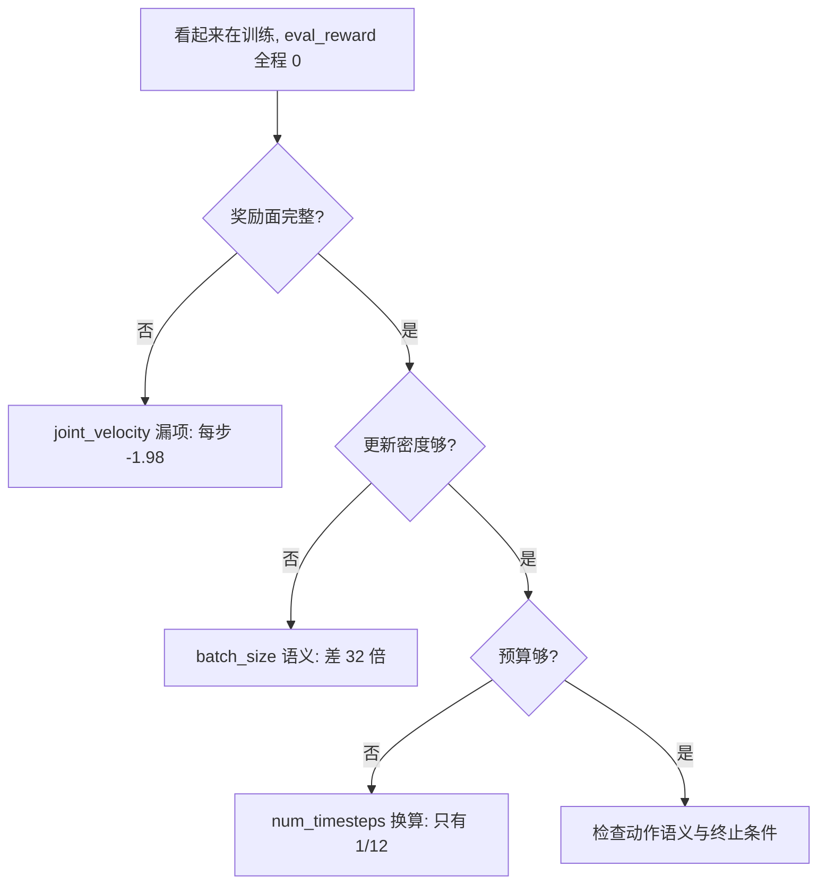
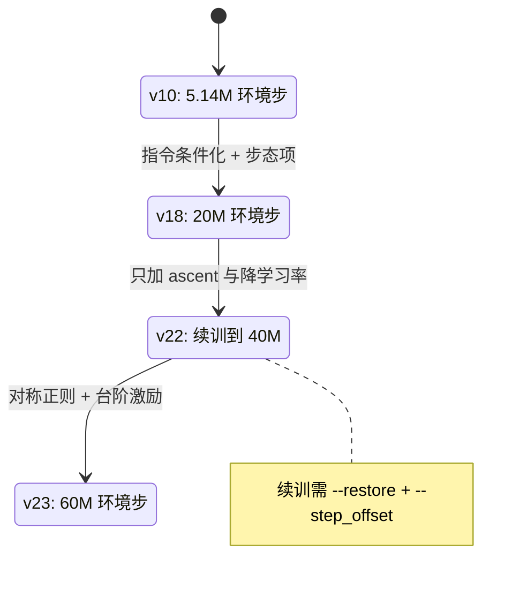

超参实验里最贵的错误是记错账；选错值的代价通常小得多。这套工程早期把“5M 环境步”当成三件事的合集：奖励面缺项、brax 的 batch_size 语义、num_timesteps 的换算。三处各自看起来都只是细节，合起来让训练预算名不副实，浪费了从 v4 到 v9 的六轮实验。

另一类问题是拿错了验收指标。多方向任务里 brax 评估给出的回合长度与真实步数差五倍，原因在自动重置包装器不重置环境信息。如果按这个指标判断策略好坏，会得出与实测相反的结论。

记账错误、分档与实际生效值的差异、续训学习率这三件事常同时出现，评估口径与基线排名只有在这三件事定下来之后才有意义。

## 三项记账错误合起来让 5M 名不副实

第一项是奖励面漏项。参考仓库算出了 `joint_velocity_cost` 但求和时漏加，我们照着完整列表实现，该项在随机策略下每步 -1.98，是最大的单项成本；配合总奖励下限 `max(0, ·)`，正奖励区间被大幅收窄，把权重置 0 之后奖励地形才与参考一致（`RLcontroller_go1_moreinformation/实验记录_Go1复现.md:153-157`）。

第二项是 `batch_size` 语义，v4 到 v8 每个 minibatch 装了 2048 条转移，是 SB3 的 32 倍，更新密度只有参考的三十二分之一（`:159-162`）。第三项是 `num_timesteps` 换算，v9 只给 400K 环境步，等于 16 个训练步，只有参考的十二分之一，`eval_reward` 自然全程 0.000（`:168-173`）。

三项叠加的表现是“奖励恒为 0 且训练看起来在跑”，这一点在证伪表里被专门澄清：下限机制确实存在，但 v1 到 v7 的恒零是动作语义错误、漏项与预算记错三者叠加的结果（`:395-396`）。

## 磁盘上的记账证据

记账错误可以从检查点目录反推。v4 到 v8 的间隔是 786,432 步，等于 `batch_size(64) × unroll(32) × num_minibatches(384)`，是参考 rollout 24,576 的 32 倍；v9 改成 `batch_size=2` 之后间隔变成 49,152，等于 `2 × 24576`，说明语义已改对；v10 的间隔是 270,336，等于 `11 × 24576`（`RLcontroller_go1_moreinformation/实验记录_Go1复现.md:164-166`、`:210`）。

| 版本 | checkpoint 间隔 | 与参考 rollout 的关系 | 判定 |
| --- | --- | --- | --- |
| v4 到 v8 | 786,432 | 32 倍 | batch_size 语义错误 |
| v9 | 49,152 | 2 倍 | 语义已改对，预算不足 |
| v10 | 270,336 | 11 倍 | 恢复正确 |

## 分档默认值与实际生效值的差异

分档只给默认值，命令行覆盖会让“实际生效”与“分档默认”不同。v18 的命令加了 `--layers 128,128`，覆盖了 sb3_full 分支里的 (64,64)，实际网络是两层 128 宽；记录里为此单独列了一张“实际生效超参”表（`RLcontroller_go1_moreinformation/实验记录_Go1复现.md:1696-1718`）。

| 项 | v18 实际值 | 来源 |
| --- | --- | --- |
| 网络 | actor 与 critic 各 (128,128) | `--layers` 覆盖 |
| 激活 / 分布 | tanh / normal | sb3_full |
| 学习率 | 3e-4 | 默认 |
| PPO clip / grad_clip | 0.2 / 0.5 | sb3_full |
| entropy / discount | 0.0 / 0.99 | sb3_full |
| 观测归一化 | 关 | 未启用 `--norm_obs` |
| rollout | 768 × 32 = 24,576 | sb3_full |
| minibatch | 2 序列 × 32 步 = 64 条 | sb3_full |

同一节还给了一组实测参数量：观测 48 维时 actor 24,344 个参数、critic 22,913；观测涨到 83 维与 154 维后分别是 28,824 与 27,393（`:1722-1727`）。维度增加没有显著改变网络容量，这是“观测加宽不必同时加网络”的定量依据。

## 预算档位的推进

训练预算从 5M 提到 20M、40M、60M，每一步都由一次失败支撑。v10 在 5.14M 步达成 30 秒不摔（`RLcontroller_go1_moreinformation/实验记录_Go1复现.md:317-337`）；v18 用 20M 步证实“缺预算”的判断（`:910`）；v22 从 v21 续训到 40M 并加入爬升激励（`:4383`、`:4605`）；v23 在对称正则之后跑到 60M（`:4726`，检查点目录 `data/v23_60M_checks/`）。训练入口的默认预算是 100M 步（`train/train_go1.py:104`），与参考仓库 locomotion 档一致。

| 版本 | 预算 | 主要变量 | 结果判断 |
| --- | --- | --- | --- |
| v10 | 5.14M | 硬接触 + 护栏 + njmax | 30 秒不摔 |
| v18 | 20M | 指令条件化 + 步态项 | 证实缺预算 |
| v22 | 续训到 40M | 只加 `ascent` 与降学习率 | 爬升改善 |
| v23 | 60M | 对称正则 + 台阶激励 | 见实验记录 28 章 |

## 行走与起身两个入口的默认预算

两个训练入口的默认超参可以并排看。行走入口的默认预算是 100M 环境步、8192 环境、回合 750 步、评估 20 次（`train/train_go1.py:104-107`）；起身入口是 50M 环境步、768 环境、回合 300 步、评估 20 次，学习率 3e-4、熵 0、折扣 0.99、clip 0.2、梯度裁剪 0.5、网络 (128,128)（`train/train_getup.py:113-137`）。

起身入口的默认规模更小，原因是它的环境本身是单任务、单姿态的，768 个并行环境已经覆盖出生姿态的多样性；行走任务的指令条件化需要更大的并行度。两个入口的折扣都取 0.99，熵在起身侧默认 0，与“先发现动作再谈探索”的判断一致。

| 项 | 行走入口 | 起身入口 |
| --- | --- | --- |
| num_timesteps | 100M | 50M |
| num_envs | 8192 | 768 |
| episode_length | 750 | 300 |
| learning_rate | 3e-4 | 3e-4 |
| entropy | 1e-2（默认档） | 0.0 |
| discounting | 0.97（默认档） | 0.99 |
| 网络 | (512,256,128) | (128,128) |

两张表的差异不代表两个任务用两套算法，而是两个入口各自把“参考配方”写成了默认值。

## 续训必须降学习率

续训时检查点不含优化器状态，Adam 动量从零重建、步数从 0 重新计数，所以续训需要更低的学习率（`train/train_go1.py:96-97`）。v22 的命令把学习率从 3e-4 降到 1e-4，并用 `--step_offset 20054016` 保持日志里的累计步数与实际进度一致（`RLcontroller_go1_moreinformation/实验记录_Go1复现.md:4537-4554`）。

`step_offset` 只影响日志显示，不改训练语义，这一条在守卫打印里写得很清楚（`train/train_go1.py:98-99`）。同一条命令里 `--restore` 指向 v21 的那一份检查点目录，而不是 logs 根目录，避免加载到错误的步数档。

## 评估指标在这套栈里不可信

brax 评估报出的回合长度是 652 到 733，看起来几乎跑满；直接数“走到终止用了几步”得到 124 到 152，跑满率为 0，两者差五倍。原因是 `BraxAutoResetWrapper(full_reset=False)` 只重置数据与观测，不重置环境信息，`EpisodeWrapper` 维护的步数在终止后不清零，评估里的回合长度主要反映 750 步的截断计数（`RLcontroller_go1_moreinformation/实验记录_Go1复现.md:518-532`）。

结论是会频繁终止的任务不能用 `eval/avg_episode_length` 判断好坏，要用逐指令评估工具直接跑到终止去数。v10 的回合长度恰好正确，因为它确实能跑满 750 步，这一点由 30 秒长测与逐指令评估双重确认（`:531-532`）。

## 关键帧基线与学习型策略的排名

起身任务的排名给出了一个反直觉结果：非学习的关键帧状态机实用成功率 20.1% 到 28.1%，模仿学习 5.1% 到 7.4%，模仿加 PPO 与纯 PPO 都是 0%（`RLcontroller_go1_moreinformation/实验记录_Go1复现.md:5604-5612`）。这说明在该任务上训练步数不是瓶颈，奖励与判据的对齐才是。

同一节给出的下一步里，前三条都指向奖励与判据的对齐，第四条才是“微调阶段改用更强的 KL 或信任域约束、或改走 DAgger 用关键帧当专家在策略访问到的状态上打标签”（`:5595-5602`）。把预算与算法调整排在奖励对齐之后，是这份记录里反复出现的优先级。

## 已证伪的假设

| 曾经的假设 | 实际情况 |
| --- | --- |
| 硬接触在 MJX 上不收敛 | 伪命题，软接触才是不收敛的那个 |
| `eval_reward=0` 是早期正常现象 | 部分错，恒零是动作语义、漏项与预算三者叠加 |
| NaN 由缺观测归一化引起 | 错，v10 不归一化也无 NaN |
| `nefc overflow` 只是警告 | 错，会写坏物理量并导致 NaN |
| `njmax=64` 够用 | 错，摔倒自碰撞需要更大上限 |

这张表对应记录里第 8 节，来源是逐条实测（`RLcontroller_go1_moreinformation/实验记录_Go1复现.md:391-400`）。

## 小结

### 核心概念

- 预算记账要同时看奖励面完整性、batch_size 语义与 num_timesteps 换算。
- checkpoint 间隔可以反推 rollout 长度，是记账最硬的证据。
- 命令行覆盖会让实际生效值偏离分档默认，实验记录要写实际生效表。
- 续训检查点不含优化器状态，必须降学习率并用 step_offset 对齐日志。
- 会频繁终止的任务不能看 brax 的回合长度指标。
- 关键帧基线在这套任务上强于纯 PPO，瓶颈在奖励与判据对齐。

### 设计权衡

| 决策 | 选择 | 收益 | 代价 |
| --- | --- | --- | --- |
| 预算推进 | 5M 到 60M 逐档 | 每档有明确结论 | 长跑占用 GPU 时间长 |
| 超参记录 | 写实际生效表 | 换人复现不走样 | 每次实验多一份核对工作 |
| 续训策略 | 降学习率并续跑 | 省下从头训练的成本 | 无优化器状态，前期会回退 |
| 评估口径 | 逐指令跑到终止 | 与行为一致 | 需要额外工具 |
| 优先级 | 奖励对齐先于调参 | 不浪费预算在错的奖励上 | 需要先做诊断 |

## 练习

### 基础题

1. 用 v18 的命令行说明 `--layers 128,128` 覆盖了哪个分档的默认值。
2. 写出从 checkpoint 间隔 786,432 反推 batch_size 语义错误的计算过程。
3. 解释为什么续训要降学习率，并指出 `step_offset` 的作用范围。

### 挑战题

1. 设计一张“实际生效超参表”的字段清单，使其能覆盖分档默认、命令行覆盖与环境配置三类来源。
2. 给定一份 brax 评估日志，写出用逐指令评估交叉验证回合长度的流程。
3. 论证“奖励与判据对齐优先于算法与预算调整”需要哪些证据，并设计一个能推翻它的实验。

## 附：本页引用的路径

| 路径 | 用途 |
| --- | --- |
| `train/train_go1.py` | 预算默认值、续训提示与 step_offset 语义 |
| `RLcontroller_go1_moreinformation/实验记录_Go1复现.md` | 记账错误、实际生效超参、预算档位与证伪表 |
| `data/v23_60M_checks/` | 60M 档的检查点与日志 |
