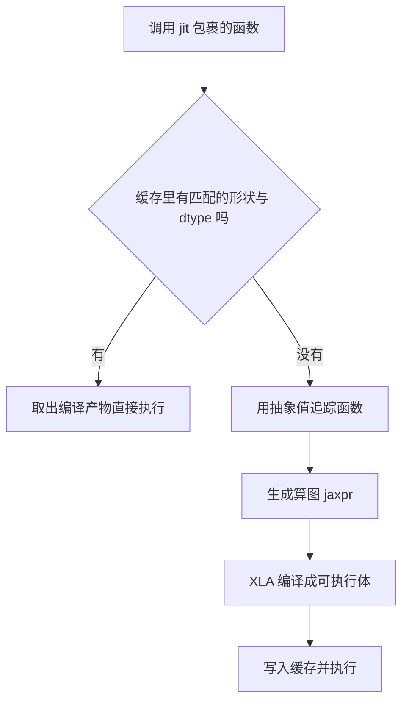
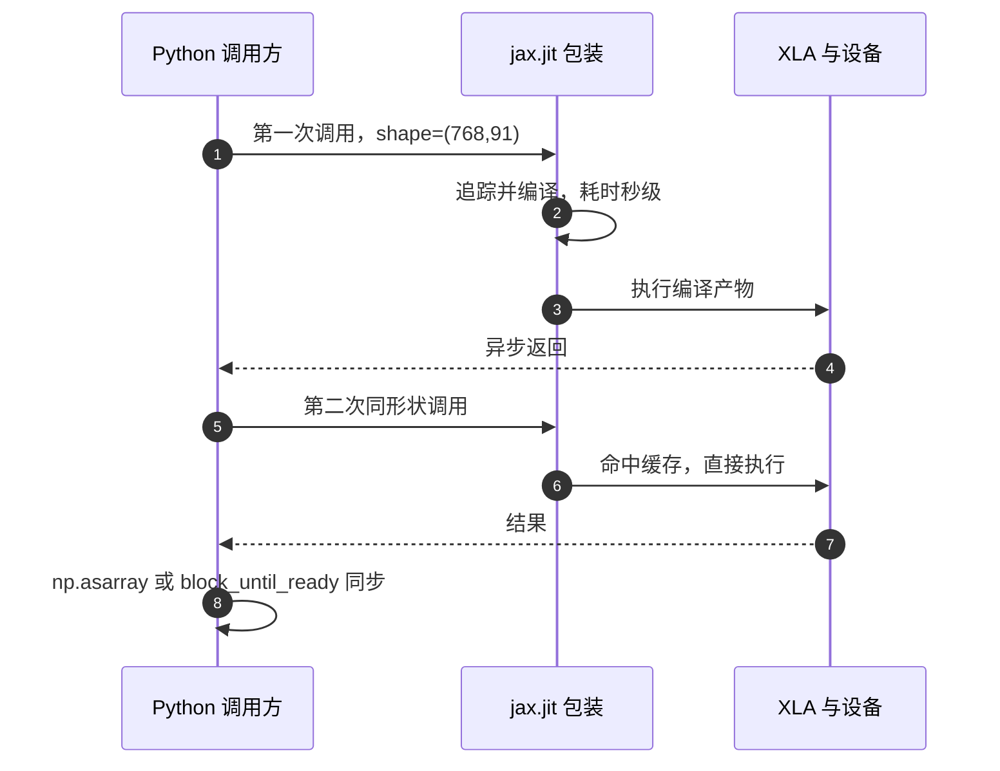

# jit 追踪与缓存

JAX 默认按算子逐个派发，一个 12 维动作的小网络前向在 Python 侧要分派几十次，每帧的固定开销远大于计算本身。mjx-go1-getup 的训练侧从来看不到这个开销，因为策略前向被 brax 包在 `jax.lax.scan` 与 `vmap` 里整体编译；只有交互式观察器那种每帧直接调用一次的写法才需要显式 `jax.jit`（`docs/viewer-guide.md:51-80` 记录了这两侧的差异）。

这里按三层来写：先说明 jit 到底省掉了什么，再拆开追踪与编译缓存的机制、列出会触发重新编译的几类改动，然后逐个核对本仓库的落点，最后说明为什么观察器里的随机键必须固定成常量、以及一个在 trace 期被读成常量的课程旋钮为什么改不动。

> 本页对象是 `jax.jit` 在 mjx-go1-getup 里的实际用法与约束，涉及 `train/`、`sim/`、`envs/` 三个目录；行号按当前检出，全部与源码核对过。

## 1. 逐算子派发与一次编译的差距

eager 模式下每个算子单独派发，Python 侧串行等待；`jax.jit` 把函数先在抽象值上跑一遍，记录算子图，交给 XLA 编译成一个可执行体，之后形状与 dtype 相同的调用直接执行编译产物，不再经过 Python 派发。

| 写法 | 每次调用做的事 | 本项目实测 |
| --- | --- | --- |
| eager | 每个算子单独派发，Python 侧串行 | 策略前向 10.97 ms（128×128，obs 91 维） |
| `jax.jit` | 命中缓存后一次 kernel launch | 策略前向 0.08 ms |
| eager 逐条画扫描点 | 每帧上百次 tiny kernel launch | 51.6 ms / 315.8 ms（两次独立测量） |
| jit 成一个 kernel | 一次 launch | 0.32 ms / 6.28 ms |

两组数字的差距都在两个数量级以上。扫描点那一组两次测量差了六倍，原因是扫描点数不同，但无论哪一次，编译之后都落在毫秒以下。

两组数字的测量条件也不同：策略前向那一组在 128 个环境、obs 91 维下测，扫描点那一组与批量无关。比较编译收益时要把批量与观测维度一起写清楚，否则同一个函数的两个数字无法判断是编译带来的还是输入规模带来的。

jit 只负责把单次调用编译快，不负责批量。把 N 个环境塞进一次调用是 vmap 的事，本仓库的批量脚本统一写成 `jax.jit(jax.vmap(f))`，见第 2 篇。

## 2. 追踪一次、编译一次，缓存键由三样东西组成

追踪（trace）用抽象值替换真实数组，只关心形状与 dtype。Python 里的 `if`、循环、`config` 字段读取都在追踪时求值一次，结果写进算图，于是这些值成为编译期常量。

编译缓存的键由三部分组成：

1. 被追踪函数的身份，即同一个 `jit` 包装对象；
2. 每个数组参数的形状与 dtype；
3. `static_argnums` 指定位置上的值。

三者之一改变就会重新追踪并编译。闭包里的 Python 对象不参与缓存键，`cfg` 在 trace 时读到的字段就是那一刻的值，之后再改对象字段不会反映到已编译的图里。本仓库没有使用 `static_argnums`：所有会变的量要么是数组参数，要么在 trace 时被读成常量。

抽象值的具体含义是：数组被替换成一个只有形状与 dtype 的占位对象，数值未知。追踪器只保证形状合法，所以任何依赖具体数值的 Python 分支在 trace 时都无法按真实数据取值。这是配置字段必须在 trace 前定好的原因，也是环境里所有按步推进的状态都要写成 jax 数组而不是 Python 变量的原因。



调试重编问题时，JAX 提供 `jax.log_compiles(True)` 与 `jax.debug_info()` 这类开关，本仓库没有使用；需要在本地排查时可用它们打印每次编译，判断是哪个调用点在反复触发。这类开关只影响日志，不改变计算。

## 3. 哪些改动会触发重新编译

常见的重编触发条件：

- 环境开关改了 obs 维度，例如 `height_scan` 或相位特征被打开；
- 批量大小变了，评估用 128 环境、训练用 768 环境，前向各有一份编译产物（属推断，按 JAX 缓存键规则）；
- 每次调用传入不同的 rng key；
- 数组 dtype 改变，例如混入 float64。

四类触发条件里，前三类在训练脚本里都会出现，第四类通常来自配置错误。排查时先把配置固定，再观察同一个形状的调用是否稳定命中。

第一类是配置层面的改动，编译次数有限，代价只是第一次慢。第三类最隐蔽：`jit` 函数本身不会因为 key 的数值不同而重编，引起重编的是把 key 当作 Python 常量参与形状推导、或者在不同分支里构造不同结构的数组；本仓库观察器把 key 固定成常量正是为了避开这条边界。

编译与执行都是异步的：调用返回时设备上的工作可能尚未结束。要测真实耗时，必须在计时点前加一次同步，例如 `jax.block_until_ready` 或 `np.asarray`。第 4 篇会说明首帧还叠加了显存分配与图捕获，不能把首帧当作稳态。

`donate_argnums=0` 让输出复用输入缓冲区，省一次分配，代价是输入数组之后不可再用。它同时固定了每次调用的缓冲区地址，这一点在第 4 篇里对 warp 的 CUDA graph 缓存是关键。

## 4. 观察器：三处按帧调用各自 jit

`sim/watch_v20_fast.py:342-347` 把三处按帧调用的函数分别编译：

```python
_dummy_rng = jp.zeros((2,), dtype=jp.uint32)
act_jit = jax.jit(lambda obs: policy(obs, _dummy_rng)[0])
reset_jit = jax.jit(env.reset)
step_jit = jax.jit(env.step, donate_argnums=0)
```

策略的随机键被固定成 `_dummy_rng` 常量（`sim/watch_v20_fast.py:344-345`）。策略是 `deterministic=True` 的推理，不需要真随机；若每帧传入不同 key，形状与 dtype 虽不变，但把 key 当常量的写法会失效，缓存不命中并反复编译。这里体现的规则是：推理用的 key 一律固定，只有训练采样才需要真的推进随机流。

`sim/view_go1.py:546-549` 是同一写法，注释写明 `donate_argnums=0` 把单步从 25.9 ms 压到 14.8 ms。起身状态机的 `gk.fsm_step` 单独 jit（`sim/view_go1.py:556`），getup_v2 的 42 维单帧组装也单独 jit（`sim/view_go1.py:594-606`），理由是逐条 eager 调用每帧要发起多次 kernel launch。

三处编译的调用频率不同：`act_jit` 与 `step_jit` 每帧一次，`reset_jit` 只在重置时调用。调用频率低的函数即使不 jit 也未必致命，但本仓库统一处理，避免以后把某处挪进热路径时忘记编译。

扫描点可视化是一条更强的判据。`sim/watch_v20_fast.py:384-395` 与 `sim/view_go1.py:710-723` 把「采样点坐标 + 地面高 + 高度特征」合成一个 `@jax.jit` 函数，实测 51.6 ms 降到 0.32 ms（`docs/viewer-guide.md:120-136`）。这一处最能说明问题：函数体没变，只是从逐条调用改成编译成一个 kernel。



## 5. 其余落点：探针、评估与姿态池

`sim/eval_stairs.py:77-93` 除了 reset 与 step，还把 `place`（把批量环境摆到台阶的指定位置）单独编译成 `jax.jit(jax.vmap(place))`。`sim/make_getup_posepool.py:57-63` 只 jit reset，用来批量采样摔倒姿态池。`sim/probe_handover.py:250-266` 对 `first_act` 与 `step_set` 各自 jit；`sim/probe_handover.py:748` 在函数内部用 `@jax.jit` 装饰局部函数 `one`。这些落点对应同一条规则：按帧或按批调用的纯函数都要编译，包括只跑一次的探针主循环。

批量脚本统一写成 `jax.jit(jax.vmap(env.reset))` 的形式，见 `sim/probe_getup_v2.py:77-79`、`sim/eval_getup.py:135-144`、`sim/probe_nefc.py:49-51`。vmap 本身在第 2 篇展开，这里只记 jit 包在外层。

评估与训练的批量不同，前向各有一份编译产物，这属于正常行为：`train/train_getup.py:115` 的评估环境数默认 128，`train/train_getup.py:118` 的训练环境数默认 768，两个形状的缓存互不覆盖。

## 6. 训练侧：trace 期常量决定课程推进方式

`envs/go1_getup.py:94-100` 的 `difficulty` 是 trace 期常量。注释与 `train/train_getup.py:164-169` 的 `--difficulty` 帮助都说明：编译缓存命中时改它不会重编，运行中推进难度无效，课程只能靠多次运行加 `--restore`。这个判断来自 `sim/probe_reset_cost.py` 的实测，但该脚本已不在当前检出（待确认）。

一旦某个字段在 trace 时被读成常量，训练循环里改它就只在 Python 侧改了一个没人再读的对象。要推进课程，只能改参数后重新启动进程，让新的常量进入新的编译产物。

`train/train_getup.py:399-401` 的 dry_run 用 `jax.random.PRNGKey(0)` 初始化网络，只做形状自检，不调用 `ppo.train`。这是在不触发训练编译的前提下验证网络输入层的方式。

`--dry_run` 只建环境与网络，不进入 `ppo.train`，所以它不会产生 rollout 与更新循环的编译产物。用它验证维度是安全的；反过来，把它当作性能基准时，测到的只是初始化时间。

`train/train_go1.py:677` 的注释记录了一个相关事实：网络输入层形状由环境自动推断，brax 在 `mjx_env.py` 里用 `jax.eval_shape(reset)` 走一遍追踪而不执行计算。改了 `height_scan` 这类会改 obs 维度的开关，网络形状随之改变，不需要手改。这条与本节的主题相通：`eval_shape` 只追踪、不执行，所以它得到的形状就是追踪器眼里的形状。

## 7. 首帧慢与反复重编的区分

两种现象都表现为耗时尖峰，判别方式看尖峰的形状。首帧慢是单调的：主循环前面的若干帧耗时偏高，之后回落到稳态，不会再次升高；反复重编是周期性的，每次调用点走到不同的形状或分支就再出现一次尖峰。`sim/view_go1.py:764-774` 的预热把前者提前结清；`sim/watch_v20_fast.py:449-452` 每帧重建 command 数组则属于后者的诱因，地址变化会让图缓存失效。

| 形态 | 表现 | 处理 |
| --- | --- | --- |
| 首次编译 | 第一次调用耗时数十秒到秒级 | 预热一次，之后复用 |
| 首帧分配与图捕获 | 主循环前几百帧偏高 | 主循环前用相同调用序列预热 |
| 反复重编 | 耗时尖峰周期性出现 | 检查形状、dtype 与传入的常量 |

若尖峰只在某一次配置改动之后出现，并且之后再也不回落，说明那次改动进了缓存键（形状、dtype 或静态参数）。此时应当固定配置后重启进程，而不是在运行中反复切换：每次切换都要付一次编译代价，训练循环里还会把这段代价摊进吞吐统计。

## 8. 与缓存相关的故障现象

| 现象 | 原因 | 对应位置 |
| --- | --- | --- |
| 单帧多花约 11 ms，帧率腰斩 | 每帧 eager 调策略 | `sim/watch_v20_fast.py:343` |
| 缓存不命中，反复编译 | 每次传不同 rng | `sim/watch_v20_fast.py:344-345` |
| 日志显示难度变了，环境其实没变 | 运行中改 trace 期常量 | `envs/go1_getup.py:97-99` |
| 头几百帧 step 数百毫秒，之后自行恢复 | 未预热就进主循环 | `sim/view_go1.py:764-774` |
| 报 `Array has been deleted` | 复用被捐赠的数组 | `sim/watch_v20_fast.py:449-452` |
| 测到的是派发时间，不是帧耗时 | 在设备同步前计时 | `sim/watch_v20_fast.py:455-458` |
| jit 前就失败，报 `ScopeParamShapeError` | obs 维度与策略不符 | `docs/viewer-guide.md:295-297` |
| 注释写留 60%，代码写 0.45 | 注释与代码不一致 | `train/train_getup.py:38-42` |

## 9. 小结

### 核心概念

- `jax.jit` 追踪一次、编译一次，之后按形状、dtype 与静态参数命中原物。
- trace 期读到的 Python 常量会冻进算图，运行中修改不生效，`difficulty` 就属于这一类。
- 观察器里凡按帧调用的 JAX 函数都要 jit，并把 rng 固定成常量。
- `donate_argnums=0` 省分配并固定缓冲区地址，代价是输入不可复用。
- 计时必须在设备同步之后，否则测到的是派发速度。
- 批量大小属于缓存键，评估与训练各编译一份属正常现象。

### 设计权衡

| 取法 | 适用侧 | 代价 |
| --- | --- | --- |
| 整段 jit（brax 内部扫描） | 训练 | 首次编译数十秒，换来稳定地址与高吞吐 |
| 逐帧 jit 加常量 rng | 观察器 | 首帧编译，预热后稳定 |
| 逐条 eager 调用 | 只用一次的小脚本 | 调用次数一多就退化，观察器不可用 |

## 10. 练习

基础题

1. 写出 `jax.jit` 编译缓存键的三个组成部分，并说明把策略的 rng 从常量改成每帧新 key 会不会改变缓存键。
2. 扫描点可视化从 51.6 ms 降到 0.32 ms，说明这一段省掉的主要开销是什么。
3. 说明 `donate_argnums=0` 的两个后果，并指出观察器里哪一行代码因此必须每帧重建数组。

挑战题

4. `difficulty` 在 trace 期被读成常量。设计一种不需要改框架、就能在单次训练里推进课程的方案，写出需要改动的文件和验证方法。
5. 用 `jax.eval_shape(reset)` 推断网络输入层形状。说明它与完整执行一次 `reset` 的差别，以及为什么它不会触发物理计算。

6. 给出一种只用计时数据区分“首次编译”与“每帧重编”的方法，写出采样点、判据与需要的对照。

## 附：本页引用的路径

| 路径 | 用途 |
| --- | --- |
| mjx-go1-getup/ | 仓库根目录，文中相对路径均相对它 |
| `sim/watch_v20_fast.py` | 观察器的 jit 组合、常量 rng 与预热 |
| `sim/view_go1.py` | 调度器与 getup 相关的 jit |
| `envs/go1_getup.py` | trace 期常量 difficulty 的定义 |
| `train/train_getup.py` | dry_run 与课程旋钮 |
| `train/train_go1.py` | eval_shape 推断 obs 维度的记录 |
| `docs/viewer-guide.md` | jit 收益与等价性判据的实测 |
