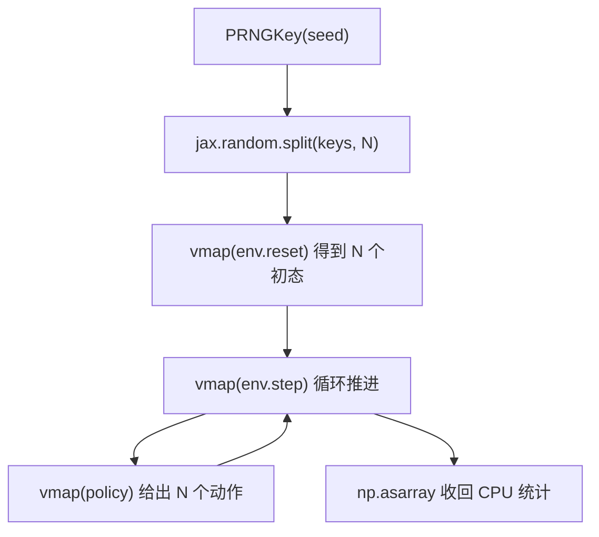
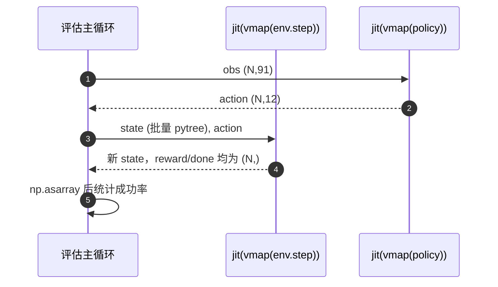

# vmap 批量环境与策略

环境与策略都按单环境、单样本写，批量靠 `jax.vmap` 自动展开。它把一个函数沿参数的前导轴复制 N 份，N 份共享同一张算图，在设备上并行执行。Python 侧的 `for` 循环做不到这一点：每次迭代都要重新派发一遍算子，N 个环境就是 N 次派发。

> 本页对象是 `jax.vmap` 在 mjx-go1-getup 的评估与探针脚本里的用法；行号按当前检出核对，策略与环境的批量规模取自各脚本的命令行默认值。

## 1. 四种批量写法的代价

| 写法 | 代码形态 | 每次调用代价 | 本仓库 |
| --- | --- | --- | --- |
| Python 循环 | `for i in range(N): reset(key_i)` | N 次派发，逐环境串行 | 未使用 |
| 手工堆叠 | 自己把状态拼成 (N, ...) | 易错，需手写每处 broadcast | 未使用 |
| `jax.vmap` | 单环境函数原样，只加一层包装 | 一次派发覆盖 N 份 | 全部批量脚本 |
| 未包 jit 的 `jax.vmap` | 同上，但没有外层编译 | 每次调用重新追踪 | 只用于调用次数极少的几处 |

vmap 只改变形状，不改变数学。单环境函数里没有写 batch 维度，vmap 负责把它补上。这条性质带来一个直接好处：环境代码可以按"一个机器人"来写，物理参数、奖励、终止判据都不用关心 N。

| 写法 | 数学语义 | 编译时机 |
| --- | --- | --- |
| `for` 循环 | 逐环境独立 | 不编译 |
| 手工堆叠 | 逐元素独立 | 依赖手写实现 |
| `jit(vmap(f))` | 一次性展开 N 份 | 整个批量函数编译成一份 |
| `vmap(jit(f))` | 单样本编译后沿轴复制 | 单样本一份，外层再展开 |

后两种在数学上等价，本仓库统一用前者，因为批量大小固定时只编译一份。

## 2. in_axes、pytree 与随机键分发

`vmap` 的默认 `in_axes=0`：参数的第一个轴是批量轴。环境的两个接口正好适配：

- `reset(rng)` 的 `rng` 是形状 `(2,)` 的 key，批量后传入 `(N,2)`；
- `step(state, action)` 的 `state` 是 pytree，`action` 形状 `(12,)`，批量后分别是带批量轴的 pytree 与 `(N,12)`。

`vmap` 对 pytree 的每个叶子沿 `in_axes` 展开，所以环境状态里所有与该环境相关的字段（`data`、`obs`、`info`、`reward`、`done`）都自然带上批量维。这也是环境状态必须写成 pytree 而不是 Python 对象的原因之一：vmap 需要能遍历它。

随机键必须自己分发：

```python
keys = jax.random.split(jax.random.PRNGKey(seed), N)
st = reset(keys)
```

若把同一个 key 传给 N 个环境，所有环境的出生姿态完全相同，批量探针就失去意义（`sim/eval_getup.py` 就是这一行的落点）。key 的形状 `(N,2)` 与单环境 `(2,)` 的关系正好对应 `in_axes=0` 的约定。

策略推理的标准写法是 `jax.vmap(lambda o: policy(o, dummy)[0])`：`dummy` 是常量 key，作为闭包而不是批量参数（`sim/eval_getup.py`）。若直接写 `jax.vmap(policy)`，vmap 会试图对参数与 key 一起展开，形状对不上。

`out_axes` 默认也是 0，批量函数的返回值第一维就是环境编号；本仓库没有改过 `out_axes`。



## 3. 组合顺序与编译缓存

组合顺序上，本仓库统一用 `jax.jit(jax.vmap(f))`：先 vmap 出批量函数，再整体编译一次。反过来 `jax.vmap(jax.jit(f))` 是先编译单样本再沿批量轴复制，对同构计算也能跑，但本仓库没有这样写。

批量大小 N 是编译期形状的一部分。改成另一个 N 会触发重新编译，这一点与第 1 篇的缓存键规则一致：形状参与缓存键。评估用 128 环境、训练用 768 环境，两者的策略前向各有一份编译产物（`train/train_getup.py` 的评估默认与训练默认不是同一个数）。

缓存命中的前提是同一份批量函数对象。若在循环里每次重新构造 `jax.jit(jax.vmap(f))`，每次都是新的 jit 对象，缓存不会命中。批量脚本因此把编译好的函数提前放在循环外。

## 4. 评估脚本的统一骨架

`sim/eval_getup.py` 是最完整的一处：

```python
reset = jax.jit(jax.vmap(env.reset))
step = jax.jit(jax.vmap(env.step))
act_fn = jax.jit(jax.vmap(lambda o: policy(o, dummy)[0]))
st = reset(jax.random.split(jax.random.PRNGKey(args.seed), N))
st = jax.block_until_ready(st)
```

`sim/eval_getup.py` 的三行分别对应 reset、step 与策略前向；`sim/eval_getup.py` 是编译点。`sim/eval_walk.py`、`sim/eval_stairs.py` 是同一形状。

`sim/eval_stairs.py` 还额外把 `place` 编译成 `jax.jit(jax.vmap(place))`，用来把每个环境摆到台阶的指定朝向与位置；`place` 内部直接构造 `qpos` 并调用 `env._get_obs`，所以必须作为纯函数交给 vmap，环境对象本身不能当参数（`sim/eval_stairs.py`）。



## 5. 探针脚本与姿态池

`sim/probe_nefc.py` 先用 vmap 建 `N` 个环境，再用 `jax.jit(jax.vmap(lambda o: pol(o, dummy)[0]))` 给出策略动作；没给策略时用 `jax.random.normal(kk, (N, env.action_size))` 直接采样动作（`sim/probe_nefc.py`）。

`sim/probe_getup_v2.py`、`sim/probe_handover.py` 与 `sim/probe_handover.py`、`sim/probe_standability.py` 都是同类骨架。循环形状一致：批量 reset 拿初态，批量策略给动作，批量 step 推进，统计全部在 CPU 侧用 `np.asarray` 完成。

`sim/probe_handover.py` 把多个辅助函数一起 vmap：`terrain_height`、`get_gyro`、`get_gravity` 各包一层，再与 reset/step 组合。辅助函数返回的数组形状不同，vmap 会按每个函数的返回结构分别展开，所以它们各自包一层而不是拼成一个函数。

`sim/make_getup_posepool.py` 只用 `jax.jit(jax.vmap(env.reset))`，按批次采样摔倒姿态并写进姿态池。姿态池采样不需要 step，是"只批量 reset"的典型用例。

批量规模的来源：`train/train_getup.py` 的评估环境数默认 128，`train/train_go1.py` 固定 128；探针用 `--envs` 覆盖，常见 256。训练 rollout 的 768 与 8192 由 brax 内部再包一层 vmap，骨架与探针一致。


## 6. 批量规模怎么取

| 批量规模 | 用在哪 | 代价 |
| --- | --- | --- |
| 32 | `sim/eval_stairs.py` 台阶评估 | 显存小，统计噪声大 |
| 256 | `sim/eval_getup.py` 起身评估与探针 | 统计较稳，单轮秒级 |
| 512 | `sim/eval_walk.py` 走路评估 | 吞吐与显存折中 |
| 768 | `sim/probe_nefc.py` NaN 探针 | 接触统计充分，显存占用大 |
| 2048 | `sim/make_getup_posepool.py` 姿态池采样 | 一轮样本多，采样时间更长 |

规模取值的依据是统计量需要多少样本，而不是显存剩多少。评估成功率时 128 到 256 够用，接触与约束统计（`nefc`、NaN 计数）需要更大的批量才能覆盖极端姿态，姿态池采样则偏向一次多采、少轮次。

## 7. 两处未包 jit 的例外

`sim/probe_handover.py` 的 reset 与 step 用了未包 jit 的 `jax.vmap`，没有外层 jit。这在此处可用是因为该段只跑固定的少数几步。反例是主循环里按帧调用：`docs/status.md` 记录，eager 的 `jax.vmap(env.step)` 每帧都会重新追踪与编译，一个探针跑 500 s 都跑不完。

`sim/eval_walk.py` 与 `sim/eval_walk.py` 对 `env.terrain_height` 也用了未包 jit 的 `jax.vmap`，因为它在评估里只调用几次、返回小数组，不构成每步开销。

`sim/getup_keyframe.py` 的注释写明 `init_fsm` 返回的状态机初态可被 `jax.vmap` 批量展开：状态机的每个字段都是 jax 数组，符合 vmap 对 pytree 的要求。这是"能不能批量"的判据：字段里只要有一个 Python 容器或不可遍历对象，vmap 就会在追踪时报错。

## 8. 批量相关的故障现象

| 现象 | 原因 | 对应位置 |
| --- | --- | --- |
| 每帧重新追踪编译，探针跑不完 | 主循环里用未包 jit 的 vmap | `docs/status.md` |
| N 个环境出生姿态完全相同 | key 没有 split | `sim/eval_getup.py` |
| 追踪报错，环境不是数组 | 把环境对象当 vmap 参数 | `sim/eval_stairs.py` 用闭包 |
| 形状不匹配或结果只对一个环境生效 | 某个叶子缺批量轴 | `sim/probe_handover.py` |
| 传入 (N,...) 却按单样本解释 | 单环境函数与批量混用 | `sim/eval_getup.py` |
| 首次调用重新编译 | 改 N 后不复用缓存 | `sim/eval_getup.py` |
| 形状对不上，追踪失败 | 把常量 key 当 vmap 参数 | `sim/eval_getup.py` 用 lambda 包裹 |

## 9. 小结

### 核心概念

- `vmap` 把单环境函数沿前导轴复制 N 份，共享一张算图。
- step 返回的 state 仍是批量 pytree，下一轮直接喂回 step。
- 环境状态是 pytree，vmap 对每个叶子展开，批量维自动补齐。
- 随机键用 `jax.random.split` 分发，一个环境一个 key。
- 组合顺序统一为 `jax.jit(jax.vmap(f))`，批量大小是编译期形状。
- 未包 jit 的 vmap 只在调用次数极少时可以接受，主循环里必须包 jit。
- 批量规模按统计量需要取，不是按显存剩多少取。

### 设计权衡

| 取舍 | 选法 | 代价 |
| --- | --- | --- |
| 批量规模 | 评估 128 到 256，探针 768 | 大批量统计稳，显存与单轮时间上升 |
| 组合顺序 | `jit(vmap(f))` | 改 N 要重编，换来一份批量算图 |
| 辅助函数是否合并 | 各自 vmap | 代码清晰，编译产物多几份 |

## 10. 练习

基础题

1. 写出把单环境 `env.reset` 与 `env.step` 批量到 256 个环境的 jit 与 vmap 骨架，说明随机键从哪来、批量大小改变后会发生什么。
2. 说明 `in_axes=0` 对 `state` 这个 pytree 的含义，以及为什么 `action` 的批量形状是 `(N,12)`。
3. 解释为什么策略前向要写成 `jax.vmap(lambda o: policy(o, dummy)[0])`，而把 `dummy` 直接当参数会失败。

挑战题

4. `sim/probe_handover.py` 的 vmap 没有包 jit。写出这段代码可用的条件，以及把它挪进每帧主循环后会发生什么，并给出验证方式。
5. 同一份环境的批量函数先后用 128 与 768 调用。说明编译缓存的行为、两次调用各自的产物，以及怎样复现"评估与训练各编译一份"这一现象。

## 附：本页引用的路径

| 路径 | 用途 |
| --- | --- |
| mjx-go1-getup/ | 仓库根目录，文中相对路径均相对它 |
| `sim/eval_getup.py` | 评估骨架与 key 分发 |
| `sim/eval_stairs.py` | vmap 与 place 的组合 |
| `sim/probe_nefc.py` | 批量 step 与随机动作 |
| `sim/probe_handover.py` | 多辅助函数 vmap，及未包 jit 的 vmap 例外 |
| `sim/make_getup_posepool.py` | 批量 reset 采样姿态池 |
| `docs/status.md` | eager vmap 重编的实测记录 |
