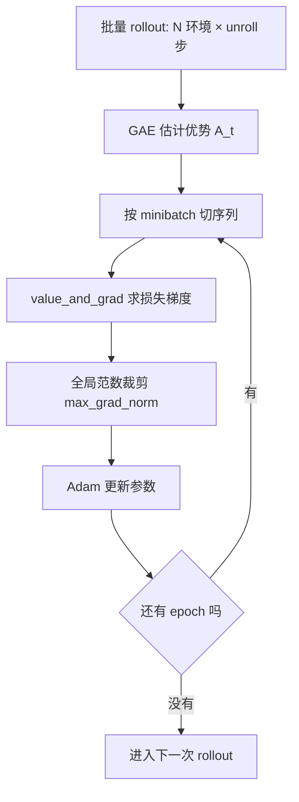
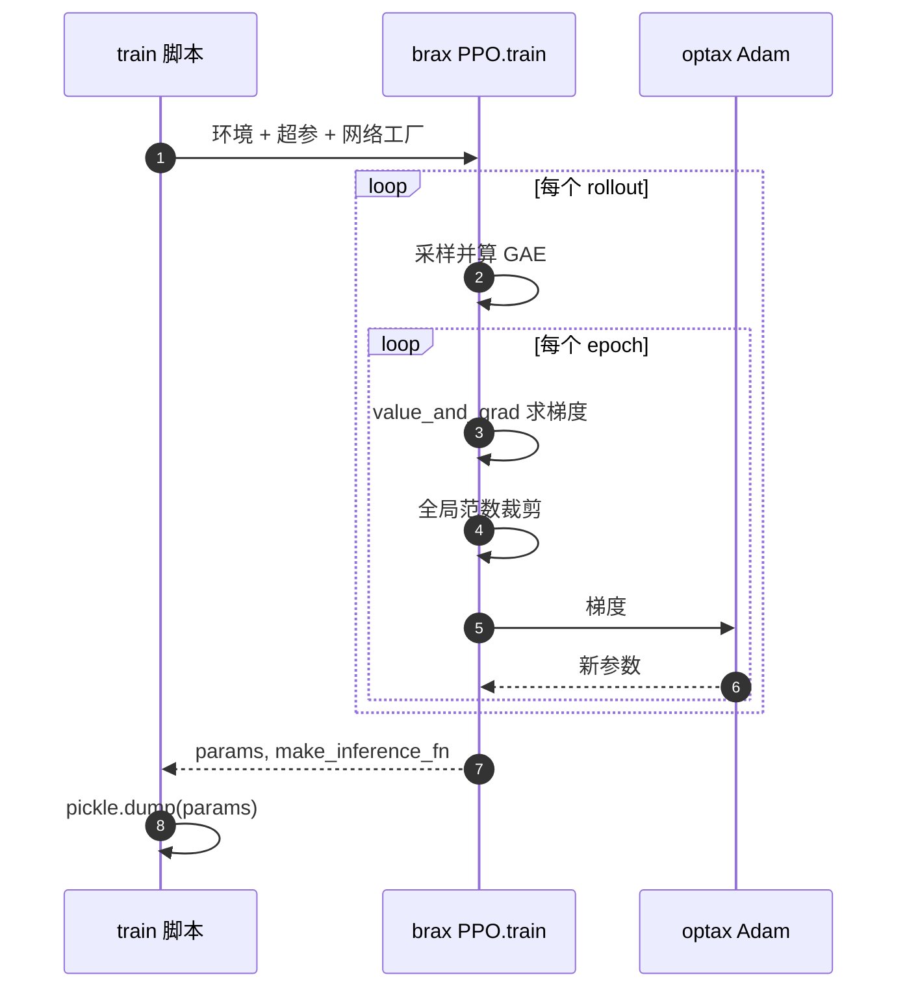

# grad 梯度与 PPO 更新

反向模式自动微分把标量损失的梯度一次算出来，代价约等于一次前向。强化学习里损失是策略与价值网络的函数，mjx-go1-getup 不自己写这段，而是把环境与超参交给 brax。仓库内没有任何一处直接调用 `jax.grad`，这一点由全仓库 grep 核对，梯度路径全部落在 brax 的 PPO 训练函数内部。

> 本页对象是梯度计算在 mjx-go1-getup 里的归属与映射；仓库内没有任何一处直接调用 `jax.grad`，梯度路径全部落在 brax 的 PPO 训练函数内部。

## 1. 梯度在哪一层

| 层 | 谁负责 | 本仓库对应 |
| --- | --- | --- |
| 损失与梯度 | brax PPO 训练函数 | `ppo.train` 调用点 |
| 优化器与更新步 | brax 内部（optax Adam） | 只通过 `learning_rate` 等超参进入 |
| 策略前向 | 编译后的网络 | `sim/common.py` 加载权重重建 |

标注：brax 0.14.2 的内部实现没有在本机逐行打开，下文的损失与优化器形态按该版本的公开接口与依赖清单描述（未实测）。

`train/train_go1.py:22-27` 引入 `jax`、brax 的 PPO 网络与 `train`；`train/train_getup.py:44-48` 相同，并且多引了 `ml_collections` 与 playground 的 `locomotion`。两个入口都不构造损失函数，只把环境与配置交给 `ppo.train`。

想在本地核对这一点，直接在仓库根跑 `grep -rn "jax.grad" .` 与 `grep -rn "value_and_grad" .`，两处都不会命中训练代码。这意味着任何涉及"损失怎么来的"的问题，改本仓库没有用，必须去看 brax 的实现或调 brax 的日志。

## 2. 裁剪代理目标与 GAE

PPO 用裁剪后的代理目标做梯度上升。记概率比 $r_t(\theta)=\pi_\theta(a_t\mid s_t)/\pi_{\theta_{old}}(a_t\mid s_t)$、优势 $A_t$、裁剪系数 $\epsilon$：

$$L^{clip}(\theta)=\mathbb{E}_t\left[\min\left(r_t(\theta)A_t,\ \mathrm{clip}(r_t(\theta),1-\epsilon,1+\epsilon)A_t\right)\right]$$

两个入口都取 $\epsilon=0.2$，对应概率比的允许区间 $[0.8, 1.2]$，也就是一次更新最多让某个动作的概率变化 20%。

取 min 的作用是：当优势为正时，策略更新收益超过 $1+\epsilon$ 就不再给梯度；优势为负时对称地卡在 $1-\epsilon$。这条限制让一次 rollout 里的数据可以被重复用几个 epoch，而不会把策略推离旧分布太远。

优势用 GAE 估计，先算每一步的时序差分残差 $\delta_t=r_t+\gamma V(s_{t+1})-V(s_t)$：

$$A_t=\sum_{l=0}^{T-t-1}(\gamma\lambda)^l\,\delta_{t+l}$$

$\lambda$ 控制偏差与方差的折中：$\lambda=0$ 时 $A_t=\delta_t$，方差小但偏差大；$\lambda=1$ 时是完整回报减去基线。GAE 的求和沿时间反向进行，写成编译后的扫描，这也是训练侧看不到显式循环的原因。

## 3. 全局范数裁剪与 Adam

一次更新是：算 $g=\nabla_\theta L$，按全局范数裁剪，再交给 Adam。

$$g\leftarrow g\cdot\min\left(1,\frac{c}{\lVert g\rVert_2}\right)$$

$c$ 就是 `max_grad_norm`，两个入口都取 0.5。裁剪的作用是限制单次更新的幅度：梯度范数小于 0.5 时不改动，大于 0.5 时按比例缩小到 0.5。它与学习率是两个独立的量，一个限制方向上的步长上限，一个限制沿方向的缩放。

`clipping_epsilon=0.2` 与 `max_grad_norm=0.5` 作用于两个不同的环节：前者限制概率比能离开旧策略多远（信任域），后者限制参数更新的绝对幅度。`entropy_cost=0.0` 表示不加熵正则，探索完全由动作分布自身与课程设置决定。

Adam 维护一阶与二阶动量，用每个参数自身的梯度尺度归一化。这也是为什么续训时优化器状态不能丢：动量从零重建后，前几步的更新幅度与训练末期不在同一量级。

## 4. 批量账目：batch_size 是序列数

brax 的批量账目按序列记。设 `batch_size` 为每个 minibatch 的序列数、`unroll_length` 为每条序列的步数，则一个 minibatch 的转移数是：

$$N_{\text{trans}} = batch\_size \times unroll\_length$$

一个 rollout 的梯度更新次数是 `num_minibatches × num_updates_per_batch`。

`train/train_go1.py:318-357` 的 `sb3_full` 分支把 brax 参数映射到 SB3 默认：768 环境 × unroll 32 = 24576 条 rollout，`batch_size=2`（2 序列 × 32 步 = 64 条转移），`num_minibatches=384`，`num_updates_per_batch=10`。注释 `train/train_go1.py:329-336` 明确记录了 `batch_size` 的语义是序列数而不是转移数，早期按转移数理解导致每样本更新密度低了 32 倍。

把这条差值算出来：若把 `batch_size=2` 当成"每批 2 条转移"，实际每批是 64 条转移，两者相差 `unroll_length` 倍。同样的 `num_minibatches` 下，真实更新次数是误读时的 1/32，样本效率差出一个数量级。

`train/train_go1.py:383-392` 与 `train/train_getup.py:332-333` 都有整除断言：`num_envs` 必须能被 `num_minibatches` 整除，否则 brax 直接失败。走路入口默认 `num_envs=8192` 与 `num_minibatches=32` 满足（`train/train_go1.py:390-391`），若手改成 64 就会触发断言。

时间维的展开同样由 brax 内部完成：rollout 与 epoch 循环都写成可编译的扫描，梯度在反向扫描里累计。训练的内存峰值因此由激活值与接触数组一起决定，unroll 长度直接相关（按架构推断，未逐行核对 brax 实现）。

## 5. 超参从训练脚本到 brax 的映射

超参在 `train/train_go1.py:710-736` 组装成 `config_dict`，其中与梯度直接相关的字段：

| 字段 | 走路默认（v9 档） | 起身默认 | 作用 |
| --- | --- | --- | --- |
| `learning_rate` | 3e-4 | 3e-4 | Adam 步长 |
| `entropy_cost` | 0.0 | 0.0 | 熵正则系数 |
| `max_grad_norm` | 0.5 | 0.5 | 全局范数裁剪阈值 |
| `clipping_epsilon` | 0.2 | 0.2 | 代理目标裁剪 |
| `discounting` | 0.99 | 0.99 | $\gamma$ |
| `num_updates_per_batch` | 10 | 10 | 每个 rollout 的 epoch 数 |

`train/train_getup.py:342-367` 的 config 与 `train/train_go1.py:710-736` 同构。起身入口把 `reward_scaling` 固定为 1.0，并显式关闭观测归一化，这两项不直接进梯度，但会改变损失量级与梯度尺度。观测归一化打开时，观测被在线标准化，同一份奖励对应的梯度尺度会随之改变；关闭它是为了与走路任务的奖励口径可比。

`discounting=0.99` 配合 `ctrl_dt=0.02`，有效视野的半衰期约为 $\ln 0.5 / \ln 0.99 \approx 69$ 步，也就是 1.4 s。这个量与 `unroll_length=32` 相比短一些，说明单条序列内的回报折扣覆盖完整，跨序列的引导由价值网络承担。

## 6. 检查点里没有优化器状态

`train/train_getup.py:178-180` 与 `train/train_go1.py:96-97` 都写明：brax 检查点不含优化器状态与步数，续训时 Adam 动量从零重建、步数从 0 计数。这是续训必须降 `lr` 的直接原因（`train/train_go1.py:160-162`）。

`train/train_getup.py:174-180` 还把两种起步方式分开：`--restore` 读检查点，`--init_pkl` 喂初始参数。前者恢复网络权重，后者提供监督学习得到的初始权重，两者的语义不同，混用会让"续训"变成"从旧参数冷启动"，而优化器状态在两种情况下都从零开始。

## 7. 梯度为零的失败模式

奖励里负项过大时总奖励会被裁剪到 0，梯度随之归零。`train/train_go1.py:673-674` 记录 `body_contact` 的上限就是为避免这一点；`train/train_go1.py:527-529` 记录 `base_height` 权重取 -2000 会把每步奖励打到 0，正是 v1 到 v7 的失败模式。

`envs/go1_walk.py:1376` 记录了另一次核查：沿楼梯上升时的“额外惩罚对高度”相关性只有 +0.13，没有系统方向，排除了某项惩罚定向压爬升的猜想。这条的意义在于：梯度不动的第一嫌疑是奖励被裁剪，但在改代码之前应当先用探针把相关性量出来。

## 8. 权重加载与网络重建

`sim/common.py:65-92` 从 pkl 或 orbax 目录读取参数，用第一层 `kernel` 的形状反推 obs 维度与网络层数，再重建网络并生成确定性推理函数。这解释了训练保存的 `params` 里有什么、没有什么：只有网络参数，没有优化器状态。

从 pkl 与从 orbax 目录读取是两条不同的代码路径，前者是 pickle 的参数字典，后者是 orbax 检查点目录；两条路都会走到同一个形状反推逻辑，得到的网络结构也应当一致。

反推输入层形状依赖网络第一层的结构：`kernel` 的第一维等于 obs 维度，其余维度决定隐藏层。若换了一个第一层形状不同的网络，重建会得到另一套维度，加载时与环境的观测维度对不上就会报错。

## 9. 梯度相关的故障现象

| 现象 | 原因 | 对应位置 |
| --- | --- | --- |
| 续训立刻发散，需降 lr | 以为续训保留 Adam 动量 | `train/train_go1.py:96-97` |
| 每样本更新密度低约 32 倍 | 把 batch_size 当转移数 | `train/train_go1.py:329-336` |
| brax 整除断言失败 | num_envs 不能被 num_minibatches 整除 | `train/train_go1.py:390-391` |
| 总奖励裁剪到 0，梯度归零 | 奖励负项过大 | `train/train_go1.py:673-674` |
| 收敛好的策略被 Adam 步长推走 | 微调时沿用大 lr | `train/train_go1.py:160-162` |
| 一个恢复检查点，一个喂初始参数 | 把 restore 与 init_pkl 混用 | `train/train_getup.py:174-180` |
| 找不到 jax.grad 调用点，需进 brax | 本仓库不写损失 | 全仓库 grep 结果 |

## 10. 小结

### 核心概念

- 本仓库不直接调用 `jax.grad`，梯度路径封在 brax PPO 内部。
- 损失是裁剪后的代理目标，优势用 GAE，更新前做全局范数裁剪。
- brax 的 `batch_size` 是序列数，minibatch 转移数要乘 `unroll_length`。
- 检查点只存网络参数，不含优化器状态与步数，续训时 Adam 动量重建。
- 奖励被裁剪到 0 会让梯度整体归零。
- 全局范数裁剪的阈值是 `max_grad_norm`，与学习率是两个独立的量。
- epoch 数与 minibatch 数共同决定一次 rollout 的更新次数。

### 设计权衡

| 取舍 | 选法 | 代价 |
| --- | --- | --- |
| 起步方式 | 冷启动随机初始化 | 需要更长探索，课程要求高 |
| warm-start | `--init_pkl` 喂 BC 权重 | 可能被 PPO 推离监督分布 |
| 续训 | `--restore` 读检查点 | Adam 动量重建，必须降 lr |
| 更新密度 | batch_size 按序列数配 | 配置项语义反直觉，误读代价大 |

## 11. 练习

基础题

1. 写出裁剪代理目标的公式，说明 min 的两路分支分别在优势为正和为负时起作用。
2. 写出 GAE 的递推形式，并说明 $\lambda=0$ 与 $\lambda=1$ 时 $A_t$ 分别退化成什么。
3. `batch_size=2`、`unroll_length=32`，算出一个 minibatch 的转移数，并说明把它误读成 2 条转移会让每样本更新密度差多少倍。

挑战题

4. 续训时 Adam 动量从零重建。设计一组对照实验，判断续训初期发散是学习率过高还是动量重建导致；写出自变量、观察指标与需要的检查点。
5. `discounting=0.99`、`ctrl_dt=0.02`、`unroll_length=32`。算出折扣的有效视野步数与秒数，并说明它与 unroll 长度的关系对价值网络提出的要求。

6. `clipping_epsilon` 与 `max_grad_norm` 分别限制什么。说明把两者同时调大可能出现什么行为，并给出应当观察的指标。

## 附：本页引用的路径

| 路径 | 用途 |
| --- | --- |
| mjx-go1-getup/ | 仓库根目录，文中相对路径均相对它 |
| `train/train_go1.py` | PPO 超参、批量账目、恢复自检 |
| `train/train_getup.py` | 起身入口的超参与 warm-start |
| `sim/common.py` | 从参数重建网络与推理函数 |
| `envs/go1_walk.py` | 奖励面与梯度方向的记录 |
| `requirements.txt` | brax、optax、flax 版本锁定 |
