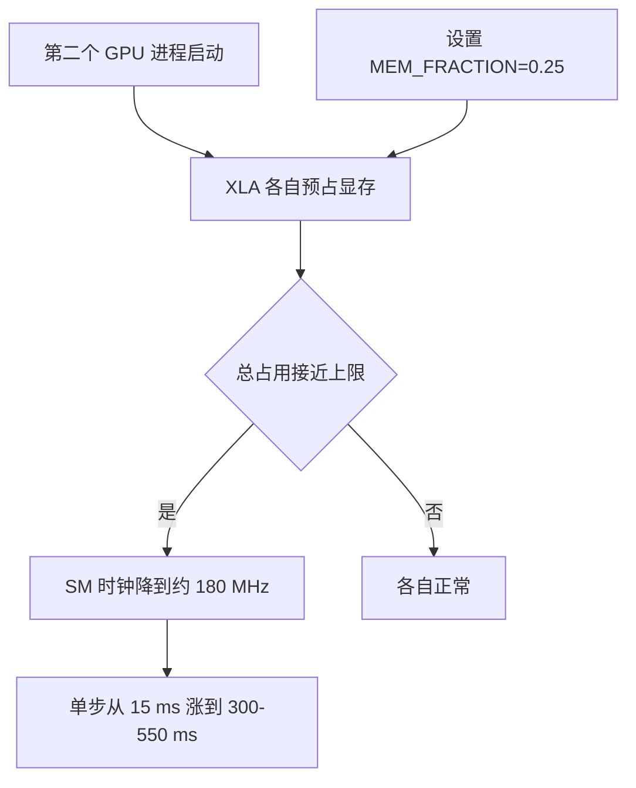
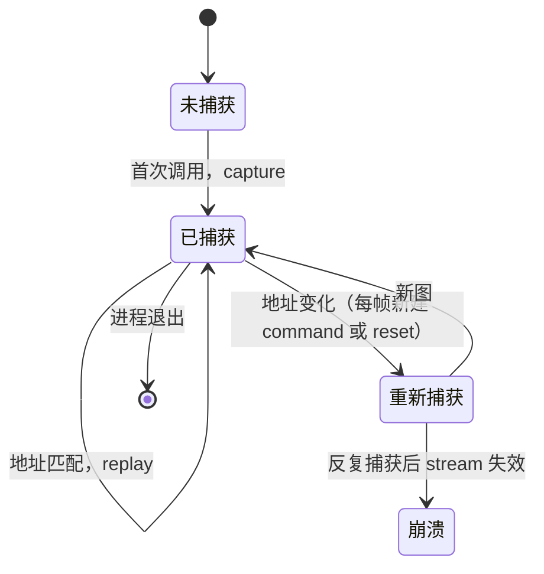

# 编译产物与显存图缓存

jit 与 vmap 编译之后，设备侧至少留下三样东西：XLA 可执行体、XLA 显存池、以及 warp 后端的 CUDA graph。三者的约束互不相同，也都随进程生命周期存在。观察器与训练脚本对它们的取舍不同，原因是同一份代码在两侧的调用模式不同：训练批量大、缓冲区地址稳定；观察器每帧新建数组、还按 R 重置。

> 本页对象是 jit 与 vmap 在设备侧留下的产物及约束，行号取自 mjx-go1-getup 的训练入口、观察器与环境配置，性能数字取自仓库内 docs 与源码注释的实测记录。

## 1. 编译后在设备侧留下三类产物

| 产物 | 由什么决定 | 约束 | 本仓库对策 |
| --- | --- | --- | --- |
| XLA 可执行体 | 形状、dtype、trace 期常量 | 形状改了要重编 | 见第 1 篇 |
| XLA 显存池 | 进程启动时的预占比例 | 预占过多会让并发的第二个进程饿死 | 按用途设 `XLA_PYTHON_CLIENT_MEM_FRACTION` |
| warp CUDA graph | 缓冲区地址 | 地址每帧变就反复重新捕获，最终崩溃 | 训练保持 WARP，观察器用 WARP_STAGED |

三者的命名分别对应编译、分配与缓存三个阶段，按这个顺序看耗时剖面就能判断首帧的开销落在哪一段。

三类产物彼此不独立：可执行体在第一次运行时才触发显存分配与图捕获，首帧耗时里同时包含编译、分配与捕获三块。观察器的预热就是在主循环之前把这些一次性开销结清。

三者的生命周期也不同：可执行体与 CUDA graph 属于进程内的缓存，退出即消失；显存池是进程级的预留，只要进程活着就一直占着。这解释了一个常见困惑：同一个脚本重启后显存占用模式会变，而改动配置并不会释放已经预占的显存。

区分这三者有一个实际用处：同样表现为"第一次调用慢"，可执行体重编要改配置或形状，显存池要改进程级环境变量，图捕获要改缓冲区地址的稳定性。三者的修法完全不同。

## 2. 显存预占：比例必须在 import jax 之前

XLA 默认在第一次用到设备时预占约 75% 显存。8 GiB 卡上单进程约 6 GiB，一旦出现第二个 GPU 进程（旧窗口没关、并发的训练或评估），显存打满，SM 时钟掉到约 180 MHz，单步从十几毫秒涨到数百毫秒。

| 场景 | 显存 | clocks.sm | 帧耗时 | fps |
| --- | --- | --- | --- | --- |
| 单进程 | 未打满 | 1500+ MHz | 15.7 ms | 63.7 |
| 双进程，默认预占 | 7674 / 8192 MiB | 180 MHz | 306.9 ms | 3.3 |
| 双进程，比例 0.25 | 未打满 | 正常 | 27.1 ms | 36.9 |

两个并发进程通常只有一个被挤慢，另一个仍有约 30 fps，所以症状表现为某一个查看器异常低帧率。判别顺序是先看 `nvidia-smi` 的进程与显存，再怀疑代码（`docs/viewer-guide.md` 有完整的排查记录）。

比例必须在 `import jax` 之前设。设置方式是 `os.environ.setdefault`，允许命令行覆盖；用 setdefault 而不是直接赋值，是为了让外部传进来的值优先。这条顺序要求来自 XLA 的初始化时机：设备在第一次被引用时就完成显存池分配，之后再改环境变量没有作用。

## 3. CUDA graph 按地址缓存

warp 后端把仿真 kernel 包成 CUDA graph。默认 `graph_mode=WARP` 的语义是按缓冲区地址缓存图：地址不变就重放，地址变了就重新捕获。观察器每帧新建 `command` 数组并周期性 `reset`，地址持续变化，反复捕获到几千帧后崩在 `unknown stream`。

`donate_argnums=0` 让输出复用输入缓冲区，地址稳定，图缓存能命中。这解释了训练侧与观察器侧的同源需求：训练本来就稳定，观察器要靠捐赠或 WARP_STAGED 达到稳定。

`WARP_STAGED` 用一个 staging buffer 承载输入，再在图内做一次 memcpy，因此不依赖输入地址固定，代价是一次额外拷贝。`WARP_STAGED_EX` 是更保守的变体，实测 57.3 ms。`NONE` 不捕获图，每步直接派发，139.0 ms。

| graph_mode | 步时 | 稳定性 | 适用 |
| --- | --- | --- | --- |
| NONE | 139.0 ms | 不崩 | 只做对照 |
| WARP（默认） | 185.5 ms | 地址稳定时命中 | 训练 |
| WARP_STAGED | 16.3 ms | 不崩 | 交互式观察器 |
| WARP_STAGED_EX | 57.3 ms | 不崩 | 备用 |

## 4. donate_argnums 与每帧重建

`sim/view_go1.py` 与 `sim/watch_v20_fast.py` 对 `step` 用 `donate_argnums=0`，`sim/eval_stairs.py` 在 vmap 外同样捐赠。代价是输入数组不可复用：`sim/watch_v20_fast.py` 每帧重建 3 维 `command` 数组，注释说明复用会被判为已删除。

`donate` 在 vmap 之外与之内都可以用，作用范围都是被包装函数的那一个位置参数。`sim/eval_stairs.py` 是在 vmap 外层捐赠，`sim/view_go1.py` 是同一层。两种写法都要保证调用方不再引用被捐赠的数组。

捐赠与地址稳定是一对权衡：不捐赠则每次调用可能分到不同地址，图缓存命中率下降；捐赠则缓冲区地址固定，但原数组被交出去。观察器的选择是捐赠并对每帧新建的输入数组重建，把地址固定的收益留在被反复调用的 `step` 上。

## 5. 接触与约束容量改的是物理

`naconmax` 是全体 world 共享的接触槽总数，不是每环境配额。把它调小能省内存并让单步略快，但会改变求解器里的求和与排序顺序，从第一步起结果就分叉：65536 降到 2048 的第一步偏差 1.67e-3，降到 512 是 7.81e-3，后期混沌放大到 0.5 至 0.88 m（`docs/viewer-guide.md`）。观察器必须复现训练物理，因此不能为了速度改它。

另一组容量是约束预算。`docs/status.md` 记录 `njmax=256` 在 hfield 摔倒时单 world 的 `nefc` 要约 1300，会触发溢出告警，建议改成 2048。约束容量偏小的表现是接触精度下降与告警，不是变慢。

峰值 3700 这个数字是 768 环境下的实测值，与默认容量 65536 相差一个数量级以上，所以默认值有大余量。余量的意义是避免 overflow 告警，而不是性能指标：把容量调到刚好覆盖峰值不会更快，只会更容易触发边界。

这两组容量与显存池的区别在于：显存池只影响资源分配，容量参数会改变数值结果。把容量参数当性能旋钮是这类问题里最容易误判的一类。

## 6. 预热把首帧开销提前结清

graph 捕获与显存分配都发生在首次调用。`sim/view_go1.py` 在开窗口之前用与主循环相同的调用序列跑若干帧，并对扫描可视化调用 `jax.block_until_ready`；`sim/watch_v20_fast.py` 同样先对扫描函数做一次阻塞调用。没有预热时，窗口刚出现的头几百帧 `step` 可达 373 ms，之后自行恢复到 52 ms。

| 阶段 | step 耗时 | 说明 |
| --- | --- | --- |
| 无预热时头几百帧 | 373 ms | 捕获与分配尚未结清 |
| 自行恢复后 | 52 ms | 图已捕获，地址稳定 |

预热必须走与主循环相同的调用序列与相同的形状。若预热只调用了一个简化版函数，主循环里另一条路径上的 kernel 仍会在第一次遇到时触发捕获，表现为"预热过了还是首帧慢"。

## 7. 各类脚本的实际取值

### 7.1 显存比例

`train/train_getup.py` 把比例设成 0.45，注释解释为给 warp 的 CUDA graph 池留空间；注释里又写“给 XLA 留 60%”，与代码的 0.45 不一致，按代码为准（含义待确认）。

`sim/view_go1.py` 与 `sim/watch_v20_fast.py` 都设 0.25，后者在 `sim/watch_v20_fast.py` 记下了单进程与双进程的对比。评估与探针用更宽的档：`sim/eval_getup.py` 为 0.30，`sim/eval_stairs.py` 为 0.25，`sim/eval_walk.py` 为 0.3，`sim/probe_nefc.py` 为 0.45，`sim/probe_getup_v2.py` 与 `sim/make_getup_posepool.py` 为 0.40。

`train/train_go1.py` 全文件没有设置这个变量（grep 核对），因此走路训练沿用 XLA 默认的约 75%。这与起身入口的 0.45 不一致，属当前检出的实际状态。

### 7.2 graph_mode

`envs/go1_walk.py` 定义 `graph_mode` 字段并列出五种模式的实测；`envs/go1_walk.py` 是 NONE 的 139.0 ms 那一行，`envs/go1_walk.py` 在 `impl="warp"` 时把字符串映射成 `GraphMode` 再交给 `mjx.put_model`。观察器 `sim/watch_v20_fast.py` 与 `sim/view_go1.py` 显式设成 `WARP_STAGED`；`sim/eval_stairs.py` 也设成 `WARP_STAGED`。训练入口 `train/train_getup.py` 的默认是 `WARP`，帮助文字写明训练侧要地址稳定。

### 7.3 接触与约束预算

`train/train_getup.py` 记录 `naconmax` 的语义与实测峰值：768 环境峰值约 3700，默认 8×8192=65536 有余量；调小不掉时间，只省内存。`sim/make_getup_posepool.py` 按 `max(8*8192, 64*envs)` 设容量。`docs/status.md` 明确一个进程只建一个环境，两个环境同进程会撞 warp 的地址缓存。

## 8. 一进程一环境

warp 的 CUDA graph 按地址缓存，同一进程里先后建两个同规模环境时，后一个会命中前一个的图，两个环境互相串味（`docs/status.md`）。这条约束影响对照实验的设计：想比较两套配置，必须开两个进程各建一个环境，而不是在同一进程里先后建两个。

两个进程同时又要控制显存，这正是预占比例必须按用途下调的原因。观察器 0.25、评估 0.3 到 0.45 这些档位，共同目标是让两个进程都能拿到足够显存而不触发降频。

## 9. 显存与图缓存相关的故障现象

| 现象 | 原因 | 对应位置 |
| --- | --- | --- |
| 比例设了不生效，仍按默认预占 | 在 import jax 之后才设 | `train/train_getup.py` |
| 单进程 63.7 fps 变成 3.3 fps | 旧查看器进程没退 | `docs/viewer-guide.md` |
| 跑几千帧后报 unknown stream | 观察器沿用 WARP | `envs/go1_walk.py` |
| 不崩但单步约 139 ms | 观察器用 NONE | `envs/go1_walk.py` |
| 第一步就分叉，物理不等价 | 调小 naconmax 求快 | `docs/viewer-guide.md` |
| 两个环境互相串味 | 一个进程建两个环境 | `docs/status.md` |
| nefc 溢出告警，接触精度下降 | njmax 偏小 | `docs/status.md` |
| Array has been deleted | 复用被捐赠的 command 数组 | `sim/watch_v20_fast.py` |
| 漏掉的 kernel 不预热，首帧仍慢 | 预热走了简化版函数 | `sim/view_go1.py` |
| 把捕获与分配算成稳态耗时 | 首帧就下结论 | `sim/watch_v20_fast.py` |

## 10. 小结

### 核心概念

- 编译在设备侧留下可执行体、显存池与 CUDA graph 三类产物，修法各不相同。
- 显存比例必须在 `import jax` 之前设置，观察器与评估用 0.25 到 0.45。
- WARP 按缓冲区地址缓存图，地址稳定才命中；观察器用 WARP_STAGED。
- `donate_argnums=0` 固定地址，代价是输入数组不可复用。
- 显存预占比例是进程级设置，同一进程内无法切换。
- 首帧包含编译、分配与图捕获，主循环前要用相同调用序列预热。
- 两个并发进程通常只有一个被显存挤慢。
- 接触容量 `naconmax` 与约束容量 `njmax` 会改变物理或触发溢出，不能当纯性能旋钮。

### 设计权衡

| 取舍 | 选法 | 代价 |
| --- | --- | --- |
| graph_mode 训练侧 | WARP | 依赖地址稳定，换观察器模式即失效 |
| graph_mode 观察器 | WARP_STAGED | 一次额外拷贝，换来不崩与 16.3 ms |
| 显存比例 | 训练 0.45，观察器 0.25 | 比例小则单进程吞吐略降，但能并发 |
| 接触容量 | 保持默认 65536 | 多占内存，换物理与训练一致 |

## 11. 练习

基础题

1. 写出设备侧三类产物的名称、各自的约束，以及修改它们分别要动什么。
2. 说明 `XLA_PYTHON_CLIENT_MEM_FRACTION` 为什么必须在 `import jax` 之前设置。
3. 双进程默认预占时单步从 15.7 ms 涨到 306.9 ms。说明 `clocks.sm` 这一列的诊断价值，以及比例设成 0.25 后的帧耗时。

挑战题

4. 一台 8 GiB 显卡要在同一台机器上同时跑训练和一个交互式查看器。写出两份进程各自的配置清单（显存比例、`graph_mode`、环境数或批量），预测并发后两者的单步耗时量级。
5. 解释为什么不能把 `naconmax` 从 65536 降到 512 来换速度，并给出一个既能省内存又不改变物理的替代做法。

6. 说明“一进程一环境”这条约束的成因，以及违反它时对照实验会得出什么错误结论。

7. 说明 `os.environ.setdefault` 与直接赋值的差别，以及为什么脚本用前者设置显存比例。

## 附：本页引用的路径

| 路径 | 用途 |
| --- | --- |
| mjx-go1-getup/ | 仓库根目录，文中相对路径均相对它 |
| `train/train_getup.py` | 显存比例、graph_mode、naconmax |
| `train/train_go1.py` | 未设显存比例的对照 |
| `envs/go1_walk.py` | graph_mode 定义与五种模式实测 |
| `sim/view_go1.py` | 观察器的 donate 与 WARP_STAGED |
| `sim/watch_v20_fast.py` | 显存预占与每帧重建 command |
| `docs/status.md` | njmax 与一进程一环境 |
| `docs/viewer-guide.md` | 显存与 CUDA graph 的完整实测 |
