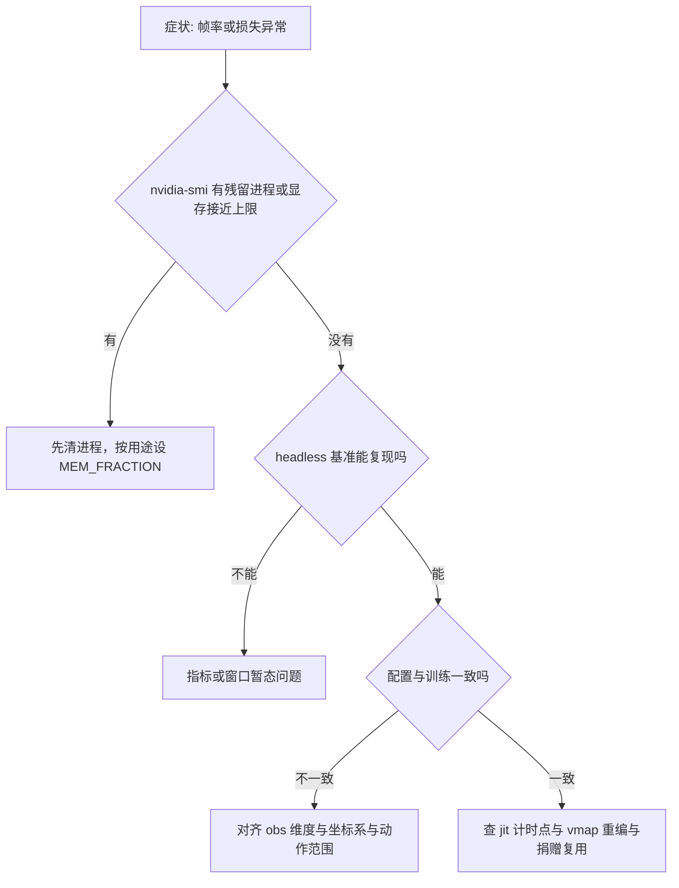
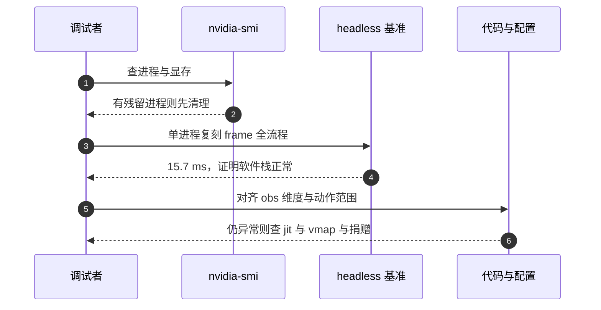

# 易错点与调试

jit、vmap、grad 三类问题的表象不同：jit 问题表现为首帧慢或反复重编，vmap 问题表现为重编或批量结果相同，grad 问题表现为损失不降或数值异常。三者的共同点是都可以先用一个能出数的基准把范围缩小，而不是直接读代码。

这里把排查顺序固定成四步，每步都要求有能出数的证据；再把三条最容易误判的机制写清楚：计时为什么必须在设备同步之后、累计 fps 为什么会被编译摊薄、同进程里为什么不能先后建两个环境。然后列出仓库里可用的探针、观察器的四道正确性闸门，最后给出交付前要 grep 的四个配置。

> 本页汇总 jit、vmap、grad 在本仓库暴露过的错误与排查方法，行号取自源码与仓库内 docs，练习答案都能在 mjx-go1-getup 的脚本与文档里找到依据。

## 1. 四步排查顺序

| 顺序 | 查什么 | 依据 |
| --- | --- | --- |
| 1 | 进程外：残留 GPU 进程、显存占用、时钟 | `nvidia-smi` 的进程与 `clocks.sm` |
| 2 | 指标本身是否代表目标场景 | headless 基准对比窗口内耗时 |
| 3 | 配置与档位是否与训练一致 | obs 维度、命令坐标系、动作范围 |
| 4 | 代码：jit、vmap、计时点、捐赠 | 源码行号 |

顺序的依据是排查成本与影响面：进程外因素一次 `nvidia-smi` 就能排除，且它的症状会伪装成代码慢；指标口径问题会影响后面所有结论；配置不一致会让同一份代码在两处表现不同；代码问题放最后，因为定位它需要前三步都确认过。

这四步里只有第 4 步需要读源码，前三步都可以用现成命令完成。把便宜的检查放在前面，是为了避免在读代码上花掉大量时间之后才发现问题在进程外。

四步之间还有一个回退关系：任何一步发现异常并修好以后，都要回到第 2 步重新确认指标，而不是直接判定问题解决。修改显存比例这类环境变量的例子最典型：进程外因素变了以后，之前测到的帧耗时全部作废。




## 2. 计时必须落在同步点之后

JAX 调用异步返回，计时点要放在 `np.asarray` 或 `jax.block_until_ready` 之后，否则测到的是派发速度。`sim/watch_v20_fast.py:455-458` 把 `t_step` 结算在 `np.asarray(state.data.qpos)` 之后，就是这条。

`sim/watch_v20_fast.py:455-458` 处把 `t_step` 与拷贝、同步分开记，分项之和才对得上单帧耗时。只记总分时无法判断瓶颈在计算、拷贝还是设备同步。

异步执行的代价在单步上可能不明显，在批量子步上会累积：一次 `step` 内部有多个 kernel，若只计时派发，测到的数值与 GPU 上真实耗时相差几倍。判断自己有没有踩到这条的办法是看数据是否稳定得反常：派发时间几乎不随计算量变化。

## 3. 累计 fps 会被编译摊薄

若记 `fps = num_steps / (now - t0)`，而 `t0` 取在 `ppo.train` 之前，那么编译的数十秒会整块摊进 fps。分段 fps 才是稳态值：

$$\text{fps}_{seg}=\frac{num\_envs\times unroll\_length\times \Delta it}{\Delta t}$$

`train/train_getup.py:410-424` 增加 `seg=...` 与 `ms/it`，就是为了隔离编译项。`docs/experiment-log.md:5234-5249` 记录了这个失真曾把 3470 fps 读成 900 到 1650 fps。

这个公式把环境数、unroll 长度与迭代数都乘上再除以时间，所以它给出的量与环境规模无关，适合跨配置比较。累计 fps 则把进程启动、编译、采样、更新全部混在一起，只适合做"整个脚本跑了多久"的粗略估计。

## 4. 对照实验的最小单元

warp 的 CUDA graph 按地址缓存，同一进程里先后建两个同规模环境会让后一个命中前一个的图，现象是"换个进程跑就正常"。`docs/status.md:195-196` 与 `docs/viewer-guide.md:474-482` 给的规则是一个进程只建一个环境，对照实验用两个进程。

两个进程还要避免互相挤显存，所以每个进程的预占比例都要下调（`train/train_getup.py:38-42`、`sim/view_go1.py:56` 这类设置）。单变量原则在这里有两个含义：一次只改一个配置，以及一次只在一个进程里改。



## 5. 能出数的探针

`sim/probe_nefc.py` 扫 `njmax` 与 `naconmax`，统计每个环境出现 NaN 的步数；`sim/probe_standability.py` 用常量关节目标扫站立能力；`sim/probe_handover.py` 按 stage 复现交还与真摔倒。这些脚本都用 `jax.jit(jax.vmap(...))` 包住主循环，本身也是第 2 篇的样例。

探针的另一个用处是做回归：改动提交之前把同一组探针跑一遍，输出与改动前逐项对比。三个探针的输出都是计数与分布，不依赖随机种子的极端取值，适合作回归基线。

这些探针的共同点是先把问题量化再改代码：探针输出计数与分布，训练日志只给聚合奖励。改动前后各跑一次同一探针，才能判断是不是代码生效。只用训练曲线做判据时，一次改动的效果会被随机性与课程进度掩盖。

## 6. 观察器的正确性闸门

`docs/viewer-guide.md:372-391` 给出四道检查：策略 obs 与环境 obs 同维、自绘几何与 `env.height_scan_features` 逐位一致、策略真的在走、jit 与 eager 的动作偏差小于 1e-5。

最后一条特别指出不能用 `qpos` 比等价性（`docs/viewer-guide.md:389`）：一步物理会把 1e-7 的动作差混沌放大成米级，用位置比会把正确的实现判成错误。等价性应当比动作，物理等价性只看第一步是否分叉，这一条与第 4 篇的接触容量结论是同一个道理。

四道检查里前两道是静态的（维度、几何），后两道是动态的（行为、等价性）。静态检查可以在加载策略时一次做完并写成断言，动态检查需要跑少量步数后比较动作。

维度一致性还有一处独立的记录：`docs/viewer-guide.md:295-297` 记录观测维度与训练不一致时报 `ScopeParamShapeError`，`docs/viewer-guide.md:303-305` 记录靠记忆配开关而不写维度断言的后果。两处合起来说明维度检查应当在加载策略时就失败，而不是等跑到某一步才发现。

## 7. 交付前 grep 四个配置

`docs/viewer-guide.md:448-449` 要求交付前确认 `graph_mode`、`XLA_PYTHON_CLIENT_MEM_FRACTION`、`GALLIUM_DRIVER`、`LP_NUM_THREADS` 四处都写对。仓库里两次回归都是文档写了、脚本漏了。

```bash
# 交付前在仓库根逐项确认
grep -rn "graph_mode" sim/ train/ | grep -v "WARP_STAGED"
grep -rn "XLA_PYTHON_CLIENT_MEM_FRACTION" sim/ train/
grep -rn "GALLIUM_DRIVER\|LP_NUM_THREADS" sim/ train/
```

grep 输出为空才是正常结果；若有命中，先判断它是文档里的说明还是实际生效的赋值，再决定是否修改。

这类检查的成本极低，但因为改动分散在多个脚本里，靠记忆很容易漏。把它写成一条可以重复执行的命令，比在提交说明里提醒更可靠。

## 8. 三类问题的表象对照

| 类别 | 典型表象 | 首先检查 | 常见修法 |
| --- | --- | --- | --- |
| jit | 首帧慢，或耗时尖峰周期性出现 | 调用频率与传入的 rng | 补 jit，把推理 rng 固定成常量 |
| vmap | 反复重编，或批量结果完全相同 | key 是否 split、外层是否有 jit | split 出 N 个 key，外层补 jit |
| grad | 损失不降、总奖励恒 0、续训发散 | 奖励是否被裁剪，lr 与检查点来源 | 放开奖励下限，续训降 lr |

这张表只是缩小范围用的，三类的根因可能重叠：vmap 的重编最终也表现为 jit 的耗时尖峰，grad 的梯度归零可能来自奖励面而不是优化器。确认根因仍然要靠第 1 节的四步顺序。

## 9. 排查清单

| 现象 | 原因 | 对应位置 |
| --- | --- | --- |
| 每帧重编，探针跑不完 | 主循环里用未包 jit 的 vmap | `docs/status.md:202-203` |
| 策略前向反复重编 | 每帧传不同 rng | `sim/watch_v20_fast.py:344-345` |
| 日志变了，环境没变 | 运行中改 trace 期常量 | `envs/go1_getup.py:97-99` |
| 测到派发时间 | 在同步前计时 | `sim/watch_v20_fast.py:455-458` |
| 编译被摊进结果 | 用累计 fps 判断快慢 | `train/train_getup.py:410-424` |
| Array has been deleted | 复用被捐赠的数组 | `sim/watch_v20_fast.py:449-452` |
| 几千帧后 unknown stream | 观察器沿用 WARP | `envs/go1_walk.py:320-339` |
| 仍按默认预占 | 显存比例设晚了 | `train/train_getup.py:38-42` |
| 两环境互相串味 | 一个进程建两个环境 | `docs/status.md:195-196` |
| 第一步就分叉 | 调小 naconmax | `docs/viewer-guide.md:416-430` |
| 续训立刻发散 | 以为保留 Adam 动量 | `train/train_go1.py:96-97` |
| 梯度归零，损失不动 | 总奖励被裁剪到 0 | `train/train_go1.py:673-674` |
| 用 qpos 判 jit 等价会误判 | 混沌放大 | `docs/viewer-guide.md:389` |
| 报 ScopeParamShapeError | obs 维度与训练不一致 | `docs/viewer-guide.md:295-297` |
| 漏掉的 kernel 未预热 | 预热走了简化版函数 | `sim/view_go1.py:764-774` |
| 靠记忆配开关 | 维度断言缺失 | `docs/viewer-guide.md:303-305` |
| 无法判断瓶颈在哪一项 | 只看 fps 不看分项 | `docs/viewer-guide.md:367-368` |

## 10. 小结

### 核心概念

- 先排进程外干扰，再查指标，最后读代码。
- 计时点在设备同步之后，训练看分段 fps，不看累计 fps。
- 对照实验一个进程只建一个环境，变量一次只改一个。
- jit 等价性用动作判，不用 qpos 判；物理等价性看第一步是否分叉。
- obs 维度、坐标系数值、动作范围三项要与训练逐项对齐。
- 探针输出计数与分布，改动前后各跑一次再下结论。

### 设计权衡

| 取舍 | 选法 | 代价 |
| --- | --- | --- |
| 对照方式 | 两个进程各建一个环境 | 显存需限比例，启动慢 |
| 判据 | 探针计数与动作偏差 | 需要额外脚本，但结论可复现 |
| 交付检查 | 一条可重复的 grep 命令 | 每次交付都要跑，换来不漏配置 |

## 11. 练习

### 基础题

1. 写出把单环境 `env.reset` 与 `env.step` 批量到 256 个环境的 jit 与 vmap 骨架，说明随机键从哪来、批量大小改变后会发生什么。

2. 运行 `train/train_getup.py` 时在 `progress_fn` 里修改 `difficulty` 为什么无效，给出两种能实际推进课程的做法，并写出各自需要的关键参数。

3. 查看器单帧从 15 ms 涨到 300 ms，而 `copy`、`sync`、`scan` 分项都正常。按调试顺序写出前两步要执行的命令与要看的字段。

### 挑战题

4. 一台 8 GiB 显卡要在同一台机器上同时跑训练和一个交互式查看器。写出两份进程各自的配置清单（显存比例、`graph_mode`、环境数或批量），预测并发后两者的单步耗时量级，并解释为什么不能把 `naconmax` 从 65536 降到 512 来换速度。

5. 用累计 fps 与分段 fps 分别评估同一次训练的吞吐，说明两者的差别来自哪几段开销，并设计一个实验把编译项从分段 fps 里进一步剥离。

6. 说明为什么 `docs/viewer-guide.md:389` 要求用动作而不是 `qpos` 判 jit 等价性，并给出一个会因此被误判的具体场景。

7. 写出三类问题（jit、vmap、grad）各一个"看起来像另一类"的实例，并说明用哪一步排查可以区分。

8. 说明为什么分项计时（step、copy、sync）比只记单帧总耗时更容易定位瓶颈，并给出两个会导致分项之和对不上总耗时的原因。

### 附：本页引用的路径

| 路径 | 用途 |
| --- | --- |
| mjx-go1-getup/ | 仓库根目录，文中相对路径均相对它 |
| `sim/probe_nefc.py` | NaN 与接触容量探针 |
| `sim/probe_handover.py` | 交还与真摔倒探针 |
| `sim/watch_v20_fast.py` | 计时点、捐赠与显存设置 |
| `train/train_getup.py` | 分段计时与显存比例 |
| `train/train_go1.py` | 续训与奖励截断的记录 |
| `envs/go1_walk.py` | graph_mode 定义 |
| `docs/status.md` | 一进程一环境与 njmax |
| `docs/viewer-guide.md` | 排查顺序与正确性闸门 |
