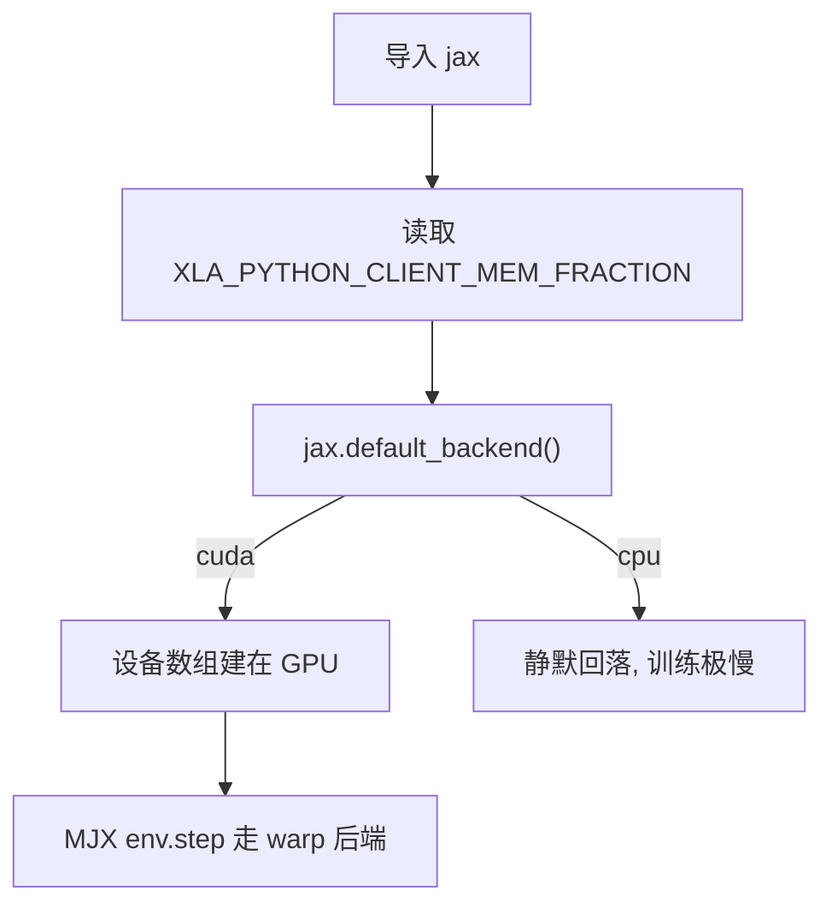
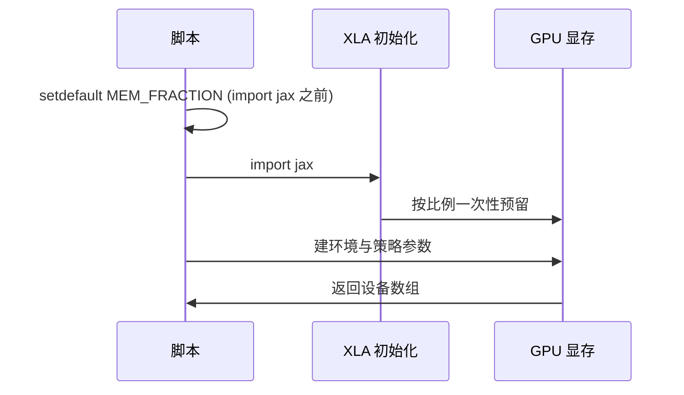

这套工程的所有物理与策略计算都跑在 GPU 上，CPU 只负责把状态搬出来渲染或打印。设备侧一旦配错，症状往往是“能跑但很慢”或“跑到一半分配失败”，而不是立刻报错。把设备与数组的建立方式先讲清楚，后面的显存预留、缓冲区捐赠和地址稳定性才有着力点。

依赖组合是锁定的：仓库用 `requirements.txt` 固定版本，开发环境是 Python 3.14 加 JAX 0.7.2、MuJoCo 3.12、Brax 0.14.2、warp-lang 1.16，硬件是单卡 RTX 5060 Laptop 8 GiB，系统是 WSL2（`README.md:57-59`、`docs/status.md:195-197`）。版本不锁定时 JAX 与 warp 的接口变化会让 MJX 后端直接不可用，所以这份清单同时是复现前提。

下面的顺序是依赖与后端、设备数组的放置、MJX 数据对象的驻留、跨设备搬运的代价，最后给出环境变量的位置要求。

## 1. 依赖清单里与设备相关的条目

`requirements.txt` 里与设备直接相关的包是 `jax`、`jaxlib`、`mujoco`、`mujoco-mjx`、`warp-lang`、`brax`、`playground`，其余是网络与训练基础设施（`flax`、`optax`、`orbax-checkpoint`、`ml_collections`）以及查看器要用到的 `pillow` 与 `pynput`。

文件头注明了 GPU 安装方式：用 `pip install -r requirements.txt --extra-index-url https://pypi.nvidia.com`，或改用官方 CUDA 轮子 `jax[cuda12]==0.7.2`（`requirements.txt:1-10`）。两种装法给出同一个 JAX 版本，区别只在 nvidia 运行时包由谁提供。

| 包 | 版本 | 与设备的关系 |
| --- | --- | --- |
| jax / jaxlib | 0.7.2 / 0.7.2 | 数组与编译入口 |
| mujoco / mujoco-mjx | 3.12.0 / 3.12.0 | 物理与 MJX 后端 |
| warp-lang | 1.16.0 | MJX 的 warp 后端与 CUDA graph |
| brax | 0.14.2 | PPO 训练循环 |
| playground | 0.2.0 | 环境封装与自动重置 |
| orbax-checkpoint | 0.12.4 | 检查点保存 |

## 2. 后端选择与打印位置

两个训练入口在启动时都打印一次后端名：`print("backend:", jax.default_backend())`（`train/train_go1.py:307`、`train/train_getup.py:208`）。这一行的作用是确认拿到的是 CUDA 而不是 CPU。JAX 在没有可用 GPU 时会静默回落到 CPU，训练仍然能跑，只是慢几个数量级，所以启动日志里的这一行必须核对。

MJX 侧的后端由环境配置里的 `graph_mode` 与求解器参数决定：warp 后端负责物理，CUDA graph 的捕获与缓存由 warp 管理。训练脚本不直接切换后端，只通过配置与开关影响它。

## 3. 设备数组的建立与放置

环境状态、观测与参数都是设备数组。脚本侧常见的建立方式是 `jp.asarray(np.asarray(x), jp.float32)`，例如查看器把初始关节角转成设备数组再传给环境（`sim/view_go1.py:555`）。这类转换只在启动或重置时执行，代价可以忽略。

需要控制的是循环里的搬运方向。跨设备同步的判据是 `np.asarray(...)` 调用，它会阻塞到结果可用；计时点必须放在这一句之后，否则测到的是“派发完成”而不是“计算完成”（`docs/viewer-guide.md:440`）。这条规则适用于所有按帧计时的脚本。

| 操作 | 方向 | 代价 | 使用场景 |
| --- | --- | --- | --- |
| `jp.asarray` | 主机到设备 | 一次拷贝 | 启动、重置、加载策略 |
| `np.asarray` | 设备到主机 | 同步阻塞 | 渲染、打印、写日志 |
| `jax.jit(env.step)` | 设备内 | 编译一次 | 训练与查看器主循环 |
| `device_put` | 主机到设备 | 一次拷贝 | 显式放置常量 |

## 4. MJX 数据对象在设备上的驻留

MJX 的 `Data` 对象包含全部物理状态，其中接触数组的容量由 `naconmax` 决定，本工程取 65536。整对象搬运的开销远大于只搬姿态：查看器早期用 `mjx.get_data` 加 `mj_copyData` 把整个 `Data` 搬到主机，单帧 1.13 ms；改成只拷 `qpos` 与 `qvel` 再在 CPU 上做 `mj_forward` 之后降到 0.02 ms（`sim/view_go1.py:11-12`）。

这处的差额来自“搬什么”而不是“搬多快”：接触数组占 `Data` 的绝大部分，而渲染只需要姿态。设备侧的通用做法是把“设备内计算”与“主机侧使用”分开，主机侧只取必需字段。

## 5. 跨设备搬运的时机选择

查看器把策略推理、物理步进与渲染分项计时，用于判断瓶颈落在哪一段（`sim/view_go1.py:15`）。分项计时的前提是每段都在正确的同步点结束，否则三段之和会小于整帧时间，看不出开销落在哪一段。

训练循环里没有每帧搬运，观测与奖励都在设备上计算，只有日志与评估才回主机。评估脚本把 128 个环境批量跑完后一次性取回指标，这是搬运次数最少的结构。

## 6. 环境变量必须放在导入之前

`XLA_PYTHON_CLIENT_MEM_FRACTION` 必须在 `import jax` 之前设置，因为 XLA 在初始化时就按该比例一次性预留显存；导入之后再改已经无效（`docs/status.md:199`）。脚本里的写法统一是 `os.environ.setdefault(...)`，放在文件顶部、JAX 导入之前（`sim/view_go1.py:56`、`train/train_getup.py:42`）。

同一位置还要放 `GALLIUM_DRIVER` 与 `LP_NUM_THREADS`：前者影响 WSL 下的软件渲染路径，后者影响 CPU 侧线程数，README 把它们与显存比例并列成三个需要留意的环境变量（`README.md:58-59`）。

## 7. 设备组合的验证顺序

换机器或重建虚拟环境后，按四步验证：启动日志里的后端名是 `cuda`；`nvidia-smi` 能看到本进程占用显存；跑一次短训练确认 fps 与文档同量级（起身 v2 实测 22k 到 25k fps，40M 步约 30 分钟）；查看器能开窗且帧率正常（`docs/status.md:198`）。

四步里任何一步失败都不必先读代码，先看设备与显存占用。这条顺序在查看器排障一节里有完整案例。

## 8. 训练与查看器的设备使用差异

同一套环境类在训练与查看器里的设备用法不同。训练侧一次建 8192 个环境，全部状态驻留设备，整个 rollout 期间不做主机搬运，只有评估与日志回主机；查看器侧只建一个环境，每帧把 `qpos` 与 `qvel` 搬到主机做运动学与渲染，再回设备继续步进（`sim/view_go1.py:11-12`、`docs/viewer-guide.md:440`）。

两端对 `graph_mode` 的敏感度也不同：训练侧的图缓存由 warp 按缓冲区地址管理，查看器侧还要额外保证每帧传入的形状与地址稳定，否则会反复重新捕获。设备用法上的这个差异是“同一段代码在查看器里比训练慢”的常见来源。

| 维度 | 训练侧 | 查看器侧 |
| --- | --- | --- |
| 环境数量 | 8192 | 1 |
| 每帧主机搬运 | 无 | qpos / qvel |
| 设备同步点 | 评估与日志 | 每帧渲染 |
| 对图缓存敏感度 | 中 | 高 |

还有一个约束同时约束两端：一个进程只建一个环境。两个环境同进程会撞上 warp 的 CUDA graph 地址缓存，后建的环境在步进时可能命中前一个的捕获图（`docs/status.md:195-196`）。查看器受此约束最直接，对照实验因此必须用两个进程（`docs/viewer-guide.md:480-482`）。

## 9. 小结

### 核心概念

- 依赖版本锁定在 requirements.txt，设备相关的是 jax、mujoco-mjx、warp-lang 与 brax。
- 两个训练入口都会打印 jax.default_backend()，用这一行确认没有回落到 CPU。
- 设备数组只在启动、重置与加载策略时建立，循环里避免每帧搬运。
- MJX 的 Data 含 65536 容量的接触数组，渲染只需要 qpos 与 qvel。
- XLA_PYTHON_CLIENT_MEM_FRACTION 必须在 import jax 之前设置。
- 换机器后的验证顺序是后端名、显存占用、fps、查看器帧率。

### 设计权衡

| 决策 | 选择 | 收益 | 代价 |
| --- | --- | --- | --- |
| 依赖管理 | 锁死版本 | 复现稳定 | 升级需要整体验证 |
| 后端打印 | 每次启动一行 | 回落 CPU 立刻可见 | 无 |
| 搬运策略 | 只取必需字段 | 单帧 1.13ms 降到 0.02ms | 需要自己拼 CPU 侧状态 |
| 环境变量 | setdefault 在文件顶部 | 不覆盖用户显式设置 | 位置容易写错 |

## 10. 练习

### 基础题

1. 写出后端验证的四步，并说明每一步失败时的第一反应。
2. 解释为什么计时点必须放在 np.asarray 之后。
3. 说明 MJX Data 里占空间最大的字段是什么，以及渲染为什么不需要搬它。

### 挑战题

1. 设计一个脚本，在启动时打印后端、设备数、显存占用与预留比例，用于换机验证。
2. 给定一次“训练很慢但没有报错”的现象，写出区分 CPU 回落与显存争用的判据。
3. 论证把渲染搬运从整 Data 改为 qpos/qvel 的物理等价性需要哪些验证。

## 附：本页引用的路径

| 路径 | 用途 |
| --- | --- |
| `requirements.txt` | 依赖版本与 GPU 安装说明 |
| `README.md` | 开发环境与三个环境变量 |
| `docs/status.md` | 环境与性能事实 |
| `docs/viewer-guide.md` | 计时点与搬运口径 |
| `sim/view_go1.py` | 设备数组建立与搬运实现 |
