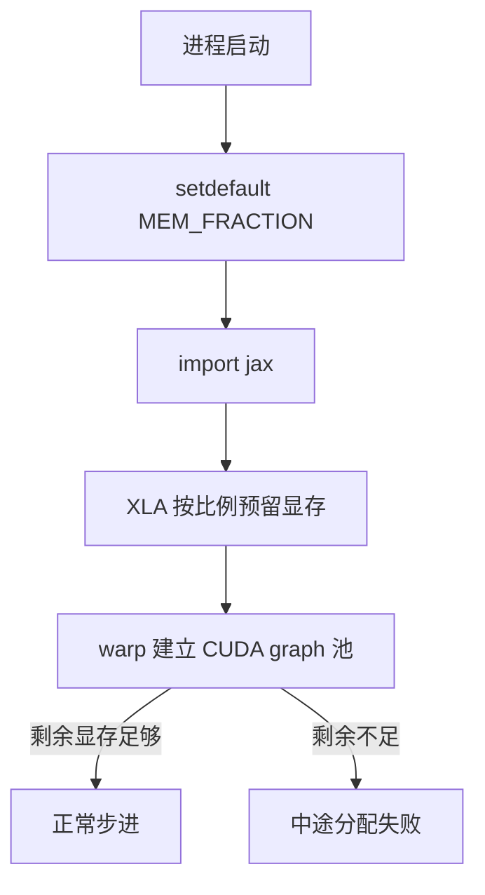
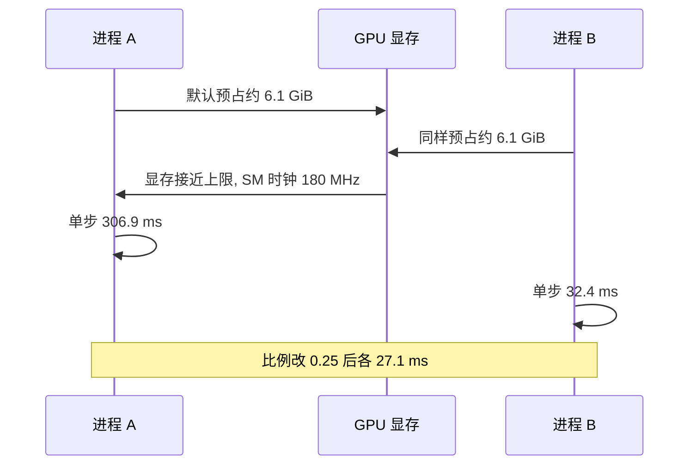

JAX 在初始化时会按比例一次性把显存预留下来，这笔预留对 XLA 自己够用，却会把同一张卡上另一个用户挤出去。MJX 的 warp 后端需要自己的一块显存池来放 CUDA graph，池子不够时不会优雅降级，而是在跑到中途抛一个分配失败。这个比例因此成了这套工程里最容易配错、症状又最不像配置问题的参数。

8 GiB 的笔记本卡上，两笔账必须同时装下：XLA 的预留与 warp 的图池。默认预留在 8 GiB 卡上约占 6.1 GiB，剩下的空间不足以支撑反复重置的图池，训练会在 1.5M 步附近崩掉（`train/train_getup.py:38-41`）。

这个比例只能有一个全局取值，因为显存是进程级资源：XLA 预留与 warp 图池用的是同一张卡，双方都无法在运行途中把自己的份额让出去。按脚本各设一个比例不会缓解争用，只会让“哪个脚本先启动”决定谁能跑。

## 1. 一次性预占的机制

`XLA_PYTHON_CLIENT_MEM_FRACTION` 在 JAX 初始化时被读一次，XLA 随即按这个比例预留显存；导入 JAX 之后再设置无效（`docs/status.md:199`）。脚本里的统一写法是 `os.environ.setdefault` 放在文件顶部，JAX 导入之前，例如 `train/train_getup.py:38-42` 与 `sim/view_go1.py:56`。

用 `setdefault` 而不是直接赋值，是为了不覆盖用户在命令行显式导出的值，方便临时做比例对照实验。

## 2. 8 GiB 卡上的两笔账

默认预留比例约 75%，在 8 GiB 卡上约 6.1 GiB 归 XLA，留给 warp 图池的只有约 2 GiB（`train/train_getup.py:39`）。起身训练里 `--num_resets_per_eval` 大于 0 时会反复调用重置，每次重置都可能触发新的图捕获，池子被逐步吃满，跑到 1.5M 步时出现 `Failed to allocate 83MB on device 'cuda:0'` 并直接退出（`:40-41`）。

把比例降到 0.45 之后同一配置可以跑完，注释给出的说法是“给 XLA 留 60% 就没事了”（`:41-42`）。这句与代码里的 0.45 是同一件事的口语化表达，实际生效值是代码里的 0.45。

| 项 | 默认预留 | 改为 0.45 |
| --- | --- | --- |
| XLA 预留（8 GiB） | 约 6.1 GiB | 约 3.6 GiB |
| warp 图池可用 | 约 2 GiB | 约 4.4 GiB |
| 结果 | 1.5M 步分配失败 | 可以跑完 |

## 3. 分配失败的症状与修复

这类失败有三个特征：不在启动时报错，而是在训练中途；报的是具体字节数的分配失败；重跑会在不同的步数附近再次出现（由池子碎片与重置次数决定）。处理顺序是先确认没有残留进程占卡，再把比例降一档重跑，最后才怀疑环境配置。

修复只改一个数：把 `XLA_PYTHON_CLIENT_MEM_FRACTION` 调到 0.40 到 0.45。降到太低会让 XLA 在初始化时就失败，所以这个值有下界。

## 4. 各脚本的比例取值

仓库内脚本的取值范围是 0.25 到 0.55：查看器与楼梯评估取 0.25，行走与起身评估、可站性探针取 0.30，姿态池与起身探针取 0.40，`nefc` 探针取 0.45，起身训练脚本取 0.45（`sim/view_go1.py:56`、`sim/eval_stairs.py:21`、`sim/eval_walk.py:27`、`sim/eval_getup.py:19`、`sim/probe_standability.py:17`、`sim/make_getup_posepool.py:24`、`sim/probe_getup_v2.py:7`、`sim/probe_nefc.py:17`、`sim/probe_handover.py:34`、`train/train_getup.py:42`）。

| 比例 | 使用方 | 说明 |
| --- | --- | --- |
| 0.25 | 查看器、楼梯评估 | 需要与另一个进程共存 |
| 0.30 | 行走与起身评估、可站性探针 | 单进程评估 |
| 0.40 | 姿态池、起身探针 | 批量重置 |
| 0.45 | 起身训练、`nefc` 探针 | 训练侧给图池留空间 |

行走训练侧的口径存在一处不一致：查看器指南写“训练侧用 0.80”，而实验记录里的行走训练命令确实显式导出 0.80（`docs/viewer-guide.md:257`、`docs/experiment-log.md:358-367`）；但行走训练脚本本身没有设置这个变量，起身训练脚本设的是 0.45（`train/train_go1.py:307`、`train/train_getup.py:42`）。以脚本为准，行走训练在不显式导出的情况下走 JAX 默认比例。

## 5. 双进程争用与时钟塌陷

两个进程同时预占时，显存被推到 7674 / 8192 MiB，GPU 的 SM 时钟从 1500 MHz 以上掉到 180 MHz，被挤死的那一个进程单步耗时暴涨到 306.9 ms，另一个仍有 32.4 ms（`docs/viewer-guide.md:241-245`）。把比例改成 0.25 之后，两个进程各 27.1 ms，帧率 36.9，与单进程的 15.7 ms / 63.7 fps 相比只是线性分摊（`:245-256`）。

关键现象是通常只有一个进程被饿死，另一个还能跑，所以症状表现为“这个查看器莫名只有 3fps”，容易被误判成代码问题（`:247-248`）。查看器脚本头部把这件事写成了注释，并标明与 CUDA graph、地形、策略都无关（`sim/watch_v20_fast.py:60-65`）。

## 6. 漏设为什么难发现

查看器指南记录的回归案例给了三条原因：仓库 21 个仿真脚本里有 19 个都设了这个比例，只有 `view_go1.py` 与 `watch_v20_fast.py` 漏了，属于少数派漏项；文档里关于帧率的结论仍然正确，是“文档对、脚本错”；前两轮排查分别误判成 `graph_mode` 与“物理变慢”（`docs/viewer-guide.md:269-277`）。

定位靠两步：先在无窗口模式下跑一个复刻主循环的基准，单进程 15.7 ms 说明软件栈没问题；再用双进程并发 A/B 复现 306.9 ms，并用 0.25 反证回 27 ms（`:277-281`）。这两步把“进程内”因素先排除，再去找“进程外”的争用（`:283-284`）。

## 7. nvidia-smi 判据

判别顺序是先看显存与进程，再看代码：`nvidia-smi --query-compute-apps=pid,used_memory --format=csv` 查每个进程的占用，`nvidia-smi --query-gpu=memory.used,pstate,clocks.sm --format=csv` 查总量与时钟（`docs/viewer-guide.md:259-264`）。`memory.used` 接近上限、`clocks.sm` 低于 200 MHz 是显存打满的指纹。

做 A/B 之前要先确认旧进程退干净，否则会把自己的对照实验变成三方争用（`:267`）。

## 8. 与一进程多环境的关系

显存争用还有一条进程内版本：同一个进程里建两个环境会各自申请图池，同时命中地址缓存冲突的风险（`docs/status.md:195-196`）。查看器与对照实验的规则都是一个进程只建一个环境，两个环境用两个进程，`sim/probe_handover.py` 就是按这个前提写的（`sim/probe_handover.py:19`）。

## 9. 比例的确定方法

取值可以按“同卡要跑几个进程”来定：只跑一个训练进程时给到 0.45，跑一个查看器且不并发时 0.25 到 0.40 都可以，两个进程同时跑就都取 0.25。确定下界的办法是从 0.45 逐步下调，观察启动时 XLA 是否报初始化失败——报错说明比例给小了，能启动且训练中途不再出现分配失败说明够用。

| 并发情形 | 建议取值 | 观察点 |
| --- | --- | --- |
| 单训练进程 | 0.45 | 1.5M 步附近无分配失败 |
| 单评估进程 | 0.30 | 批量重置不崩 |
| 查看器加另一进程 | 各 0.25 | 帧耗时接近单进程 |

比例确定之后不要写在文档里就算完，它必须出现在脚本顶部。查看器指南把这一点列进了交付清单：交付前 grep 四个关键配置，`XLA_PYTHON_CLIENT_MEM_FRACTION` 是其中之一，原因是本项目两次回归都属于“文档写了、代码没有”（`docs/viewer-guide.md:448-449`）。

## 10. 小结

### 核心概念

- 比例在 JAX 初始化时读一次，必须在 import jax 之前设置。
- 8 GiB 卡上默认预留约 6.1 GiB，warp 图池只剩约 2 GiB。
- 训练中途的分配失败通常来自图池不足，降比例即可恢复。
- 仓库脚本取值集中在 0.25 到 0.45，查看器取最小。
- 双进程默认预占会把 SM 时钟压到 180 MHz，只有一个进程被饿死。
- 判据是 memory.used 接近上限加 clocks.sm 低于 200 MHz。

### 设计权衡

| 决策 | 选择 | 收益 | 代价 |
| --- | --- | --- | --- |
| 占比写法 | setdefault | 不覆盖用户设置 | 漏设时静默走默认 |
| 查看器比例 | 0.25 | 可与另一进程共存 | XLA 可用显存变小 |
| 训练比例 | 0.45 | 图池够用 | XLA 预留偏小 |
| 排查顺序 | 先设备后代码 | 少走弯路 | 需要会读 nvidia-smi |

## 11. 练习

### 基础题

1. 说明为什么环境变量必须在 import jax 之前设置，并指出验证位置。
2. 算一下 8 GiB 卡在默认比例与 0.45 下留给 warp 的显存各是多少。
3. 写出显存打满的两个判据及其对应的 nvidia-smi 命令。

### 挑战题

1. 设计一个自动诊断脚本，在启动时判断“同卡是否已有其他 XLA 进程”，并给出建议比例。
2. 给定一次“查看器 3fps”的现象，写出从进程外争用到进程内因素的完整排查步骤。
3. 论证把训练比例从 0.45 继续下调到 0.30 的风险，并给出确定安全下界的实验方法。

## 附：本页引用的路径

| 路径 | 用途 |
| --- | --- |
| `train/train_getup.py` | 预占比例的注释与取值、分配失败案例 |
| `sim/view_go1.py` | 查看器比例取值 |
| `sim/watch_v20_fast.py` | 双进程争用的注释记录 |
| `docs/viewer-guide.md` | 争用对照表、排查顺序与回归案例 |
| `docs/status.md` | 环境事实与一进程一环境约束 |
| `docs/experiment-log.md` | 行走训练命令中的比例导出 |
