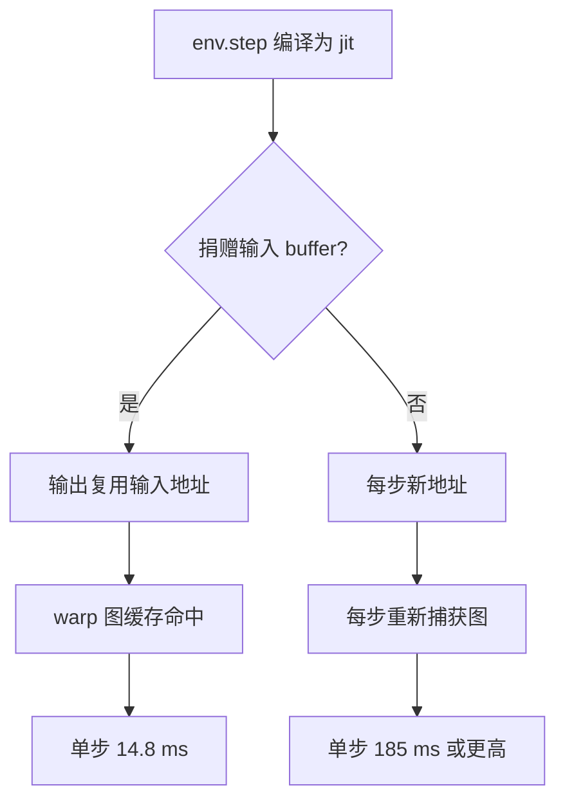
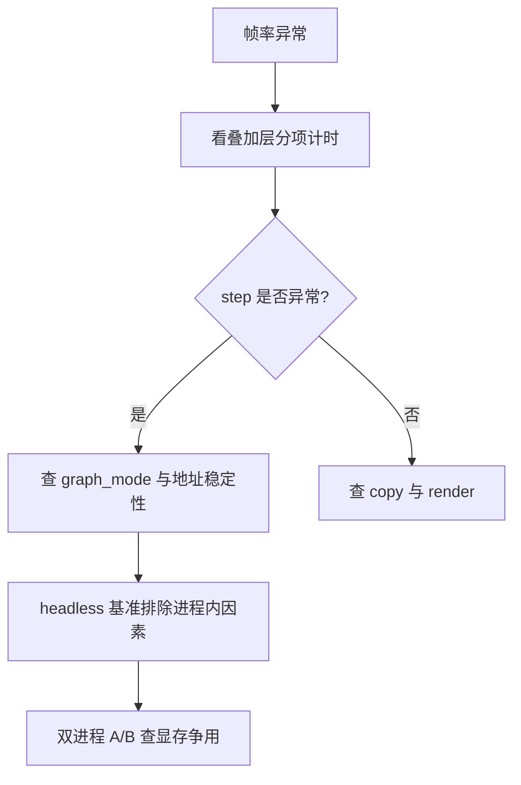

warp 后端把 MJX 的物理 kernel 包成 CUDA graph 来省派发开销，而缓存图的键是缓冲区地址。地址稳定时图只捕获一次，之后每步都是直接执行；地址每帧都变时，缓存全失效，每帧重新捕获，跑几千帧后还会崩在 `Warp error: unknown stream`。

让地址稳定的手段是缓冲区捐赠：`jax.jit(env.step, donate_argnums=0)` 让输出复用输入 buffer，输入用完即弃（`sim/view_go1.py`）。这一项在查看器里的收益最大：单步从 25.9 ms 降到 14.8 ms，端到端每帧从 43.3 ms 降到 13.4 ms。

与捐赠配套的另一半是 `graph_mode` 的选择。训练侧地址固定，用默认的 `WARP` 就够；查看器每帧新建指令数组、按 R 键重置状态，地址会变，必须显式改成分级模式。

## 1. 捐赠的语义与安全前提

捐赠的语义是“这个输入在调用后不再被使用，可以把它占用的 buffer 直接给输出”。查看器的注释写明依据：`state` 用完即弃，捐赠安全（`sim/view_go1.py`）。训练侧同样适用，因为状态在每步之后都被整体替换。

前提是同一份数组不能在被捐赠后又读取。指南给出的副作用是：捐赠开启时，循环里复用的固定数组会被 JAX 判为 `Array has been deleted`，处理方式是每帧重建（三维数组开销可忽略）或干脆不捐赠（`docs/viewer-guide.md`）。

| 写法 | 地址行为 | 图缓存 | 适用场景 |
| --- | --- | --- | --- |
| 不捐赠 | 每步新分配 | 频繁失效 | 调试 |
| `donate_argnums=0` | 复用输入 buffer | 命中 | 训练与查看器主循环 |

## 2. 地址稳定与图缓存命中

实测链条是：捐赠让输出复用输入 buffer，地址稳定后 warp 的 CUDA graph 缓存命中，这是帧率提升里占比最大的一项（`sim/view_go1.py`）。数字是单步 25.9 ms 到 14.8 ms，端到端每帧 43.3 ms 到 13.4 ms，上限从 23 fps 提到 75 fps，实时节流下稳定在 50 fps。

## 3. 关掉捕获不是出路

既然地址变动会导致重新捕获，一个自然的想法是关掉捕获。实测否掉了它：不 capture 反而每步 131 ms，只有 8 fps（`sim/view_go1.py`）。指南的模拟循环里 `NONE` 是 139.0 ms，同样落在“稳但慢”的区间（`docs/viewer-guide.md`）。原因是每次步进要逐个派发 kernel，省下的捕获开销远小于失去的图执行收益。

## 4. 四种 graph_mode 的实测对照

对照在模拟观测循环里各跑 3000 帧（`docs/viewer-guide.md`）：

| graph_mode | 步时 | 结果 |
| --- | --- | --- |
| NONE | 139.0 ms | 不崩但慢 |
| JAX | 预热即崩 | `CUDA_ERROR_NOT_SUPPORTED` |
| WARP（默认） | 185.5 ms | 探针下不崩，真实窗口几千帧后崩 |
| WARP_STAGED | 16.3 ms | 不崩 |
| WARP_STAGED_EX | 57.3 ms | 不崩 |

结论是观测脚本用 `WARP_STAGED`，训练保持默认。环境配置里因此保留 `graph_mode` 字段让两种用法各取所需，而不是为了观测去改训练配置。查看器的默认值就是 `WARP_STAGED`，帮助文本记录了 `WARP` 模式在用户实测的第 2125 帧崩掉（`sim/view_go1.py`）。

## 5. 环境配置里的落地方式

环境配置的默认值是 `graph_mode=None`，表示走 MJX 默认；初始化时若 `impl` 是 warp 且该字段非空，就把字符串转成 `GraphMode` 枚举传下去（`envs/go1_walk.py`）。配置注释里并列了 185 ms 与 16.3 ms 的对照，并注明交互式查看器应设 `WARP_STAGED`。

这种“环境不动、调用方决定”的设计让同一份环境类既服务训练也服务观测。代价是每个观测脚本都必须自己设这一行，漏设不会报错。

## 6. 地址为什么会每帧变化

查看器每帧新建指令数组，按 R 键重置会整体替换状态，两者都会换地址（`sim/view_go1.py`）。`watch_v20_fast.py` 的最终交付版漏掉了设置这一行，表现为每帧重新捕获、单步 302 ms 只有 3 fps，跑几千帧后崩掉（`sim/watch_v20_fast.py`）。

指南把这条列成“交付前 grep 一遍，别信文档”，并给出一条检查命令 `grep -n 'graph_mode' sim/*.py`，要求每个查看器都有一处设置为 `WARP_STAGED`（`docs/viewer-guide.md`）。

## 7. 与图缓存无关的两项帧率优化

帧率提升不只来自图缓存。查看器早期把整个 `Data` 搬到主机（含 65536 容量的接触数组），单帧 1.13 ms；改成只拷 `qpos` 与 `qvel` 并在 CPU 上做 `mj_forward` 之后降到 0.02 ms（`sim/view_go1.py`）。搬运的对象不在图缓存范围内，但它与图缓存共用“地址”这个关键词：设备到主机的拷贝同样要避免整对象搬运。

第三项是无条件睡眠。原来的节流写法把 `time.sleep(env.dt)` 直接叠加在帧耗时之后，与帧本身多快无关地再加 20 ms；改成“距下一帧还差多少补多少”后，快时不超频、慢时不叠加。三项合起来才是 50 fps 的稳定表现。

## 8. 预热与首帧编译

图捕获发生在首次执行，预热的作用是把捕获与编译开销挪到开窗口之前，并让捕获在同一个主循环函数里完成（`docs/viewer-guide.md`）。预热不能随便加次数：帮助文本记录过一次实验，为了跑掉启动暂态把预热帧数设到 250，结果反而更慢且不恢复，因此默认关闭（`sim/view_go1.py`）。

另一条相关事实是 eager 的 `jax.vmap(env.step)` 每帧都会重新 trace 与编译，实测一个探针跑了 500 秒都没结束，循环里必须用 `jax.jit(jax.vmap(...))`（`docs/status.md`）。这一条与图缓存同源：每次重新 trace 都会换地址，缓存自然失效。

## 9. 与一进程多环境的关系

地址缓存还有一条跨环境的版本：同一进程里先后建两个环境（接触规模相同）时，后一个的步进可能命中前一个的捕获图，现象是“地形里动作完全不动”或“平地里莫名翻身”，换个进程跑就正常（`docs/viewer-guide.md`）。规则是一个进程只建一个环境，这既避免缓冲区串味也避免图串味。

## 10. 交付前的检查项

查看器指南的交付清单里与缓存有关的三条是：策略前向必须 jit；`graph_mode` 必须是 `WARP_STAGED`；循环里每个按帧调用的 JAX 函数都要 jit 成一个 kernel（`docs/viewer-guide.md`）。再加上显存比例与一个进程一个环境，构成五项硬约束。

## 11. 观察与复现手段

判断“慢”落在哪一段，靠的是分项计时。查看器的叠加层同时显示帧率与 step、copy、render 三段的耗时，方便继续定位瓶颈（`sim/view_go1.py`）。只看总帧率无法区分是图缓存失效还是渲染变重。

复现图缓存问题时，两条基准最有用：无窗口 headless 基准复刻主循环全流程，单进程 15.7 ms 说明软件栈正常（`docs/viewer-guide.md`）；双进程并发 A/B 复现 306.9 ms，再用显存比例反证回 27 ms。做对照时要注意“看第 1 步是否分叉”，后期差异可能是混沌放大，不能当证据。

| 手段 | 观察量 | 用途 |
| --- | --- | --- |
| 叠加层分项计时 | step / copy / render | 定位瓶颈段落 |
| headless 基准 | 单进程帧耗时 | 排除进程内因素 |
| 双进程 A/B | 两进程帧耗时 | 复现进程外争用 |
| 逐帧对比 | 第 1 步是否分叉 | 判断是否为确定性差异 |

## 12. 小结

### 核心概念

- warp 的 CUDA graph 按缓冲区地址缓存，地址稳定才命中。
- donate_argnums=0 让输出复用输入 buffer，是帧率提升最大的一项。
- 关闭捕获（graph_mode=NONE）会掉到 139 ms 每步，不是替代方案。
- 观测脚本用 WARP_STAGED，训练保持默认 WARP。
- 每帧新建数组或重置状态都会换地址，导致反复捕获直到崩溃。
- 一个进程只建一个环境，避免缓冲区与图互相串味。

### 设计权衡

| 决策 | 选择 | 收益 | 代价 |
| --- | --- | --- | --- |
| 缓冲区管理 | 捐赠状态 | 单步 25.9 到 14.8 ms | 不可复用被捐赠数组 |
| 观测模式 | WARP_STAGED | 16.3 ms 且稳定 | 多一次 staging 拷贝 |
| 训练模式 | 默认 WARP | 最快 | 地址变动时会崩 |
| 配置归属 | graph_mode 放环境配置 | 两种用法共存 | 调用方漏设不报错 |

## 13. 练习

### 基础题

1. 解释捐赠为什么能让图缓存命中，并写出查看器里的实现行。
2. 列出四种 graph_mode 的步时与稳定性，指出观测该用哪一种。
3. 说明“Array has been deleted”出现的条件与两种处理方式。

### 挑战题

1. 设计一个检查流程，保证每个观测脚本都设置了 graph_mode 与显存比例两个配置。
2. 给定一次“查看器每帧重新捕获”的现象，写出从 grep 配置到确认地址变化的排查步骤。
3. 论证在保持 WARP 默认的前提下让查看器地址稳定的可行改造，并说明风险。

## 附：本页引用的路径

| 路径 | 用途 |
| --- | --- |
| `envs/go1_walk.py` | graph_mode 字段、注释与初始化落点 |
| `sim/view_go1.py` | 捐赠实现、帧率数字与默认模式 |
| `sim/watch_v20_fast.py` | 漏设 graph_mode 的回归案例 |
| `docs/viewer-guide.md` | 四种模式对照、检查命令与交付清单 |
