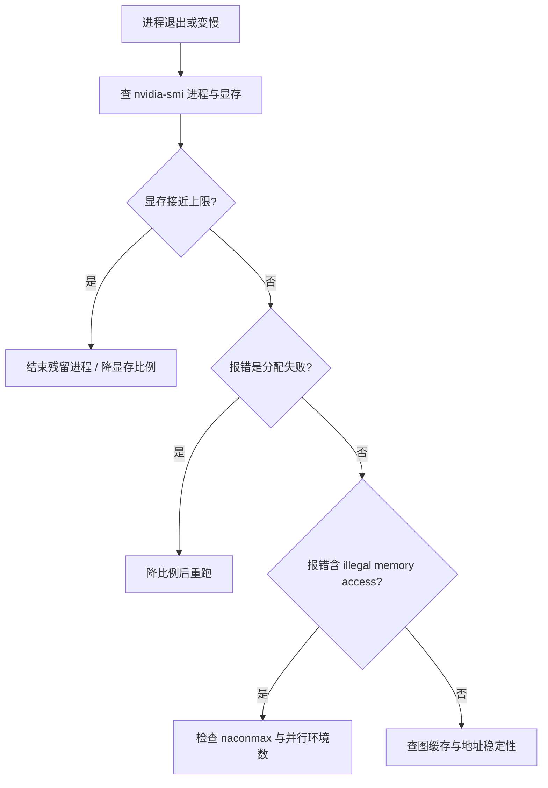
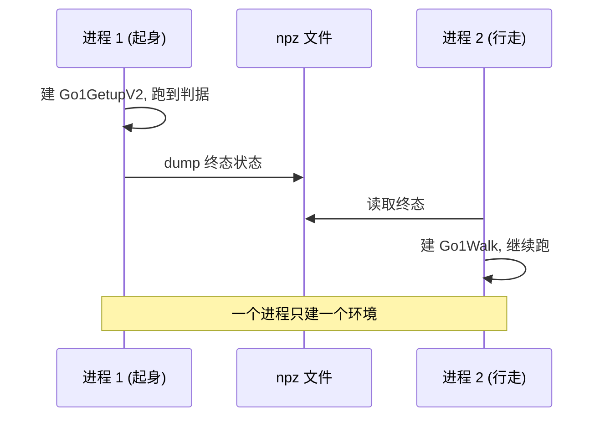

设备侧的故障有个共同点：报错信息指向的位置通常不是原因所在。显存打满表现为“这个查看器只有 3fps”，越界访问表现为一条 CUDA 报错后进程消失，驱动器崩溃发生在保存策略文件的瞬间。按报错去读代码会走很长的弯路。

这套工程把排查顺序固定成“先设备、后代码”：先看 GPU 上有几个进程、显存占多少、时钟降到多少，再回到栈内找原因（`docs/viewer-guide.md:259-266`）。顺序的依据是一次真实回归——文档里的性能结论是对的，出问题的是脚本漏设了一个环境变量（`:269-277`）。

下面按六类故障逐个给出判据与处理，最后合并成一张可执行的清单。

## 1. 显存打满的指纹

两个进程各自预占时，显存被推到 7674 / 8192 MiB，SM 时钟从 1500 MHz 以上掉到 180 MHz；被挤死的那一个进程单步 306.9 ms，另一个 32.4 ms，也就是常说的 3fps 与 30fps 并存（`docs/viewer-guide.md:241-248`）。判据是两个量一起看：`memory.used` 接近上限，且 `clocks.sm` 低于 200 MHz（`:266`）。

处理方式是确认残留进程、退干净后重跑，或把显存比例降到 0.25 让两个进程共存。指南特别提示做 A/B 前先 `pkill -f` 自己的脚本，避免把对照实验变成三方争用（`:267`）。

| 现象 | 判据 | 处理 |
| --- | --- | --- |
| 单进程帧率骤降 | `memory.used` 接近上限、`clocks.sm` < 200 MHz | 结束残留进程 |
| 两进程一快一慢 | 一个 300 ms、一个 30 ms | 两进程都设 0.25 |

## 2. 中途分配失败

训练跑到某个步数抛 `Failed to allocate 83MB on device 'cuda:0'`，属于 warp 图池被吃满（`train/train_getup.py:39-41`）。判据是报错发生在训练中途而不是启动时，且重跑会在相近步数再现。处理是把 `XLA_PYTHON_CLIENT_MEM_FRACTION` 从默认降到 0.45 或 0.40 后重跑。

## 3. 越界访问与 naconmax

`naconmax` 是全体 world 共享的接触容量。起身姿态躺地时每个环境约 33 个接触，用 8192 个环境会越界，实测表现为 `CUDA illegal memory access`（`sim/make_getup_posepool.py:37-39`）。姿态池脚本因此把默认批量定为 2048（`:36`）。

这类故障不会给出“哪个环境越界”的线索，处理方式是降低并行规模或提高接触容量，并记住容量是共享的而不是每环境一份。批量探针在设计批量大小时必须把这条约束算进去。

## 4. 保存策略时的驱动器崩溃

v3 的记录里有一条特殊故障：30 秒测试只能原地站立，策略文件保存时 CUDA 驱动崩溃（`docs/experiment-log.md:212`）。故障发生在保存阶段而不是训练阶段，说明设备侧的错误可以延迟到主机侧动作才暴露：保存前要把设备数组同步回主机，若图状态已损坏，这一步才会触发驱动异常。

处理顺序是先确认该轮训练本身的数值健康度，再检查保存路径与序列化方式，最后才怀疑权重本身。

## 5. CPU 回落与编译反复

JAX 在没有可用 GPU 时静默回落到 CPU，训练仍能跑完，只是慢几个数量级。两个训练入口都会打印后端名（`train/train_go1.py:307`、`train/train_getup.py:208`），这是第一判据。另一类慢来自反复编译：eager 的 `jax.vmap(env.step)` 每帧重新 trace 与编译，实测 500 秒都跑不完一个探针（`docs/status.md:202-203`）。

两类慢的区分办法是看单步耗时是否稳定：CPU 回落下每一步都慢且稳定，反复编译下每帧耗时波动很大。

## 6. 图缓存串味

同一个进程里建两个环境时，后建的环境可能命中前一个的 CUDA graph，症状是“地形里动作完全不动”或“平地里莫名翻身”，而同一段代码换个进程就正常（`docs/viewer-guide.md:474-482`）。处理规则是一个进程只建一个环境；对照实验用两个进程并通过中间文件传递状态，`sim/probe_handover.py` 用 `--stage` 参数把两段拆成两次进程调用，状态经 `npz` 中转（`sim/probe_handover.py:19-22`）。

## 7. 交付前的配置检查

指南要求交付前 grep 四个关键配置：`graph_mode`、`XLA_PYTHON_CLIENT_MEM_FRACTION`、`GALLIUM_DRIVER`、`LP_NUM_THREADS`，原因是本项目两次回归都属于“文档写了、代码没有”（`docs/viewer-guide.md:448-449`）。

| 配置 | 期望值 | 检查命令 |
| --- | --- | --- |
| `graph_mode` | 观测脚本为 `WARP_STAGED` | `grep -n 'graph_mode' sim/*.py` |
| 显存比例 | 查看器 0.25、训练 0.45 | `grep -rn 'MEM_FRACTION' .` |
| 渲染后端 | `GALLIUM_DRIVER=d3d12` 用 setdefault | 看脚本顶部 |
| CPU 线程 | 视机器而定 | 看脚本顶部 |

## 8. 性能基线对照

排查需要基线。仓库给出的基线是：起身 v2 实测 22k 到 25k fps，40M 步约 30 分钟；单步与整帧的对照见查看器指南（`docs/status.md:198`、`docs/viewer-guide.md:241-245`）。低于基线一个数量级就要按前几节的顺序查，不要先改模型或超参。

还有一条与设备无直接关系但常被一起误判的事实：地形只有半边长 6.0 m，出生 xy 取自 ±5 的均匀分布，出界后没有地面，会无限自由落体（`docs/status.md:204-205`）。这种现象看起来像物理故障，实际是场景边界。

## 9. 排查清单

1. `nvidia-smi` 看进程、显存、时钟。
2. 确认后端名是 `cuda`。
3. 确认只有一个环境实例。
4. 确认显存比例与用法匹配。
5. 看单步耗时是否稳定，区分回落与反复编译。
6. 越界报错时检查 `naconmax` 与并行规模。
7. 用 headless 基准与双进程 A/B 复现，再动代码。

## 12. 一次误判复盘

查看器的显存回归案例按时间展开是四步：第一轮怀疑 `graph_mode`，补上 `WARP_STAGED` 后单步从 302 ms 变成 550 ms，说明真因还在；第二轮怀疑物理变慢或地形变重，均被否定；第三步做无窗口 headless 基准，复刻主循环全流程只有 15.7 ms，排除进程内因素；第四步用双进程并发 A/B 复现 306.9 ms，再把显存比例改成 0.25 反证回 27 ms，确认真因是显存争用（`docs/viewer-guide.md:275-281`）。

复盘的价值在于误判的次序：两次修改都作用在错误的对象上，而且第一次修改让数字变得更差。判据“看第 1 步是否分叉”和“先在同机跑一个能出数的基准”都是从这个案例里总结出来的（`:283-284`、`:430`）。

## 13. 小结

### 核心概念

- 显存打满的指纹是 memory.used 接近上限加 clocks.sm 低于 200 MHz。
- 中途分配失败来自 warp 图池不足，降比例即可恢复。
- naconmax 是全体 world 共享，越界会报 CUDA illegal memory access。
- CPU 回落与反复编译是两类不同的慢，用耗时稳定性区分。
- 一个进程只建一个环境，对照实验经文件中转。
- 交付前 grep 四个关键配置。

### 设计权衡

| 决策 | 选择 | 收益 | 代价 |
| --- | --- | --- | --- |
| 排查顺序 | 先设备后代码 | 避免误改配置 | 需要会看 GPU 指标 |
| 并行规模 | 受 naconmax 约束 | 不越界 | 批量上限受限 |
| 对照实验 | 两进程加文件中转 | 图缓存不串味 | 需要写中间文件 |
| 配置检查 | 交付前 grep | 不漏设 | 每次交付多一步 |

## 14. 练习

### 基础题

1. 写出显存打满的两个判据与对应命令。
2. 解释 naconmax 为什么限制了并行环境数的上限。
3. 区分 CPU 回落与反复编译的表现差异。

### 挑战题

1. 设计一份设备侧交付检查表，覆盖清单里七步并给出每步的自动化方式。
2. 给定一次“训练途中分配失败”的日志，写出从显存比例到图池容量的推理过程。
3. 论证用单进程顺序建两个环境替代两进程方案的风险，并给出可验证的判据。

## 附：本页引用的路径

| 路径 | 用途 |
| --- | --- |
| `sim/make_getup_posepool.py` | naconmax 共享与越界案例 |
| `sim/probe_handover.py` | 两进程与文件中转方案 |
| `train/train_getup.py` | 中途分配失败案例 |
| `docs/viewer-guide.md` | 显存指纹、排查顺序与配置检查 |
| `docs/status.md` | 性能基线与场景边界 |
| `docs/experiment-log.md` | 保存阶段驱动崩溃记录 |
