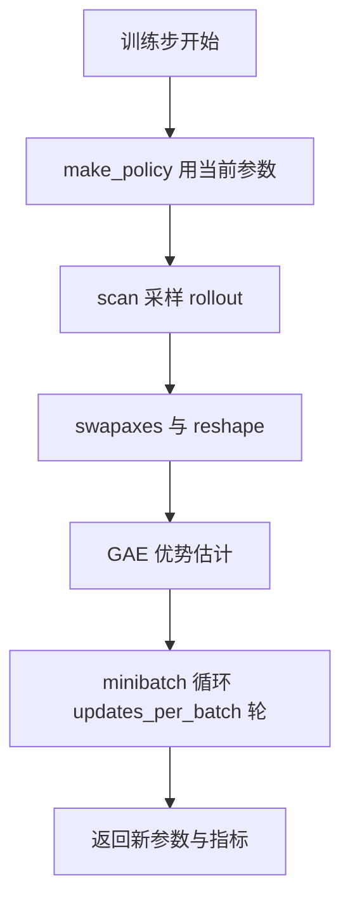
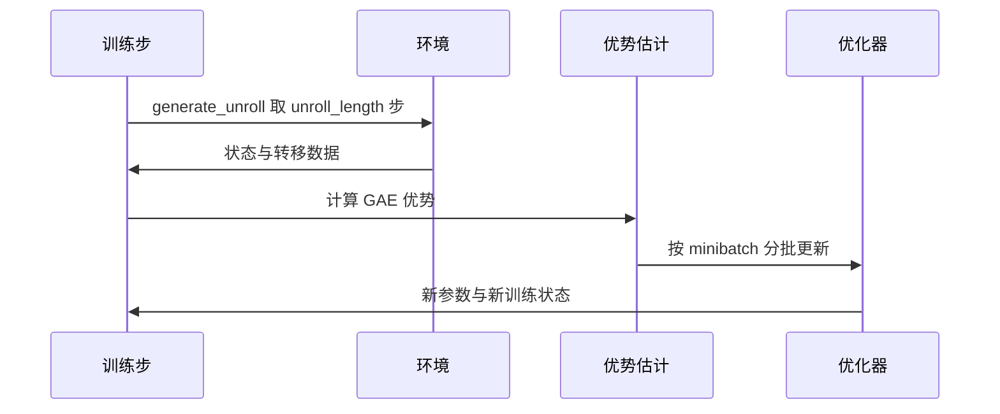

训练脚本本身很短：组装一个参数字典、把一个 `progress_fn` 交给 brax、等它返回一组参数。训练循环本身在 brax 内部，由三层嵌套构成——训练步（采样一段 rollout 并更新一次参数）、epoch（把若干训练步扫成一串）、外层的评估循环（每评估一次就打印一遍指标）。理解这三层的边界，才能解释日志里的数字与磁盘上的检查点。

brax 与 playground 的实现在虚拟环境里，仓库内只有调用方；下面的路径与行号按 0.14.2 记录，仓库里没有对应文件。

## 1. 入口脚本交给 brax 的东西

训练参数先装进一个 `config_dict`，再把 `network_factory` 摘出来单独传给 `make_ppo_networks`；两者合起来通过 `functools.partial(ppo.train, ...)` 固定，实际传入的只有两个实参：环境和进度回调（`train/train_go1.py:738-754`、`:803-805`）。

```python
train_fn = functools.partial(
    ppo.train,
    **training_params,          # num_envs / batch_size / unroll_length / minibatches ...
    network_factory=network_factory,
    seed=args.seed,
    save_checkpoint_path=ckpt_path,
    restore_checkpoint_path=args.restore,
    wrap_env_fn=wrapper.wrap_for_brax_training,
    num_eval_envs=128,
)
make_inference_fn, params, _ = train_fn(environment=env, progress_fn=progress)
```

返回值三项：推理函数、参数字典、以及一个在本工程里被忽略的指标表（`:803`）。

## 2. rollout 的生成

`generate_unroll` 在 `jax.lax.scan` 里被调用，扫描长度是 `batch_size * num_minibatches // num_envs`（`brax/training/agents/ppo/train.py:570-591`）。每次扫描取 `unroll_length` 步，于是整个训练步采到的转移数是 `batch_size × unroll_length × num_minibatches`，与上一单元里的账目一致。

采样用的策略是当前参数构造出来的确定性映射加上动作噪声（`:564-568`）。扫描之后数据做两次形状变换：先在第 1、2 维之间交换，再把前两维拉平，使批次维度变成 `batch_size × num_minibatches`、时间维度保留 `unroll_length`（`:592-597`）。优势估计依赖时间维度，所以第二次 reshape 必须保留它。



## 3. 优势估计与 minibatch 更新

优势在训练步里算完，随后按 minibatch 分批做梯度更新。`minibatch_step` 负责单批的计算，`sgd_step` 负责带优化器状态的一步更新，`num_updates_per_batch` 决定每个训练步里重复多少轮（`:493`、`:522`、`:556`）。这两层没有在入口脚本里暴露，只能通过参数字典间接控制。

更新轮数与 minibatch 数量相乘，得到一次训练步的梯度更新次数。v9 的映射是 384 个 minibatch 乘 10 轮等于 3840 次，与参考仓库的每个 rollout 3800 余次同量级（`RLcontroller_go1_moreinformation/实验记录_Go1复现.md:175-177`）。



## 4. epoch 级的扫描与参数捐赠

`training_epoch` 把训练步扫 `num_training_steps_per_epoch` 次，对指标取均值，然后被 `jax.pmap` 包起来，并对前两个输入开启捐赠（`brax/training/agents/ppo/train.py:657-676`）。捐赠的对象是训练状态与环境状态，含义与上一单元讲的缓冲区捐赠相同：状态在每步之后整体替换，旧 buffer 可以直接复用。

这一层之所以用 `pmap` 而不是 `jit`，是为了支持多设备；单卡上它退化成一次普通编译。对使用者的影响是日志里的指标已经被平均过一次。

## 5. 吞吐指标的计算口径

`training_epoch_with_timing` 包了一层计时：取时间差、累加墙钟时间，并用“epoch 内的环境步数除以耗时”算出 `training/sps`（`:679-700`）。注意它先用 `block_until_ready` 等待指标就绪再停表，所以测到的是计算完成时间而不是派发时间。

入口脚本自己在 `progress` 里另算了一个 fps：用当前步数除以从启动到现在的总耗时（`train/train_go1.py:773-776`）。两个数一起看能区分“这一轮变慢”和“整体被启动开销拖累”。

| 指标 | 计算方式 | 观察用途 |
| --- | --- | --- |
| `training/sps` | epoch 环境步数 / epoch 耗时 | 单轮吞吐 |
| 日志 fps | 当前步数 / 启动至今耗时 | 含启动与评估的端到端吞吐 |
| `eval/episode_reward` | 评估策略的平均回报 | 训练质量 |
| `losses/total_loss` | brax 损失键 | 排查 NaN 与键名 |

## 6. 训练步数的账本

brax 把总预算折算成“每评估周期跑多少训练步”：`num_training_steps_per_epoch` 等于总步数除以（评估次数减一、每训练步环境步数、每评估重置次数三者之积）再向上取整（`brax/training/agents/ppo/train.py:370-381`）。评估次数取 `num_evals`，初始评估占一次，所以公式里用的是减一后的值。

这套折算解释了为什么“给了 5M 步”与“跑了 5M 步”可能差很远：总步数是环境步数，而每个 epoch 的步数由评估频率切分。续训时步数从 0 重新计数，入口脚本用 `step_offset` 在日志里补上真实进度（`train/train_go1.py:769-781`）。

## 7. 一次训练步的数据形状

把形状变化列成表，便于对照源码里的两次变换。设 `num_envs=768`、`batch_size=2`、`num_minibatches=384`、`unroll_length=32`：

| 阶段 | 形状 | 说明 |
| --- | --- | --- |
| 单次 unroll | `(768, 32, ...)` | 每个环境一条序列 |
| 训练步采样总量 | `(768 × 2 × 384 / 768)` 条序列 | 扫描次数 |
| reshape 后 | `(768, 32, ...)` 拉平成 `(2 × 384, 32, ...)` | 保留时间维 |
| minibatch | 每个 64 条转移 | `batch_size × unroll_length` |

采样数据里还夹带三样环境侧字段：截断标记、回合指标与回合结束标记（`brax/training/agents/ppo/train.py:573`）。截断标记用于区分“时间到”与“真的终止”，回合指标则会在训练步末尾汇总进日志。这两类信息由包装器提供，下一节展开。

回到形状表，`768` 与 `2 × 384` 只是同一批转移的两种组织方式：前者按环境排列，后者按 minibatch 排列。优势估计需要时间维连续，所以拉平时保留第二维。

## 8. 进度回调与指标的对应关系

回调的签名是 `progress(num_steps, metrics)`，brax 每次评估后调用一次（`brax/training/agents/ppo/train.py:796`、`:851-855`）。入口脚本从指标表里取五个键打印：总损失、策略损失、价值损失、熵与评估回合长度（`train/train_go1.py:777-780`、`:794-797`）。

取值函数对每个指标接受两个候选键名，取不到时返回 NaN，用于兼容 brax 版本间的前缀差异（`:763-767`）。日志里如果出现 `loss=nan`，先确认是键名问题而不是数值问题。

| 指标键 | 来源 | 用途 |
| --- | --- | --- |
| `eval/episode_reward` | 评估器 | 判断训练质量与选 best |
| `eval/avg_episode_length` | 评估器 | 回合长度（多方向任务不可信） |
| `losses/total_loss` | 训练步 | 排查 NaN 与发散 |
| `losses/entropy` | 训练步 | 观察探索强度 |
| `losses/policy_loss` | 训练步 | 观察信任域内的更新幅度 |

续训时打印的标签是 `num_steps(累计 step_offset + num_steps)`，避免把阶段步数当成总步数读（`:781`）。

回调不只是打印。`eval_reward` 创新高时，回调会把该步的检查点目录整份复制到 `checkpoints/best/`，供后续评估直接取用（`train/train_go1.py:782-793`）。这份副作用让回调同时承担了“选型”和“记录”两个职责，改回调时要留意复制操作仍在发生。

## 9. 小结

### 核心概念

- 训练脚本只负责组装参数并把进度回调交给 brax。
- 一次训练步的转移数是 batch_size 乘 unroll_length 乘 num_minibatches。
- 采样后做两次形状变换，时间维度必须保留给优势估计。
- num_updates_per_batch 与 minibatch 数量相乘决定梯度更新次数。
- epoch 层用 pmap 扫描并对状态开启捐赠，单卡上退化为一次编译。
- 吞吐有两个口径：epoch 内的 sps 与含启动开销的日志 fps。

### 设计权衡

| 决策 | 选择 | 收益 | 代价 |
| --- | --- | --- | --- |
| 采样长度 | unroll_length 固定 | 编译形状稳定 | GAE 窗口受限 |
| 更新密度 | 多轮 minibatch | 收敛快 | 每步计算量增加 |
| 状态管理 | pmap 输入捐赠 | 省显存拷贝 | 旧状态不可再读 |
| 进度回调 | 只传两个实参 | 接口简单 | 循环内部不可插桩 |

## 10. 练习

### 基础题

1. 写出一次训练步的转移数公式，并用 768 / 2 / 384 / 32 算出结果。
2. 解释采样后两次形状变换各自的作用。
3. 说明 training/sps 与日志 fps 的区别。

### 挑战题

1. 给定 num_evals 与 num_timesteps，算出每个 epoch 的训练步数，并说明初始评估的影响。
2. 设计一个实验，验证 unroll_length 减半对更新密度与收敛的影响，写出记录项。
3. 论证对训练状态开启捐赠的安全性需要满足什么条件。

## 附：本页引用的路径

| 路径 | 用途 |
| --- | --- |
| `train/train_go1.py` | 参数组装、训练调用与进度回调 |
| `brax/training/agents/ppo/train.py` | 训练步、epoch 与吞吐计算（虚拟环境内） |
| `RLcontroller_go1_moreinformation/实验记录_Go1复现.md` | 更新密度与训练步数账目 |
