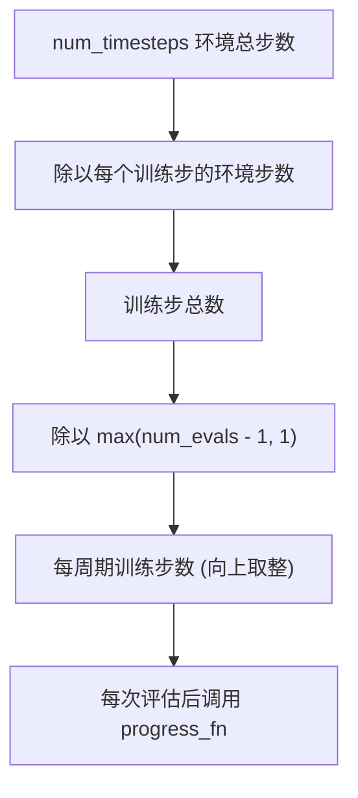
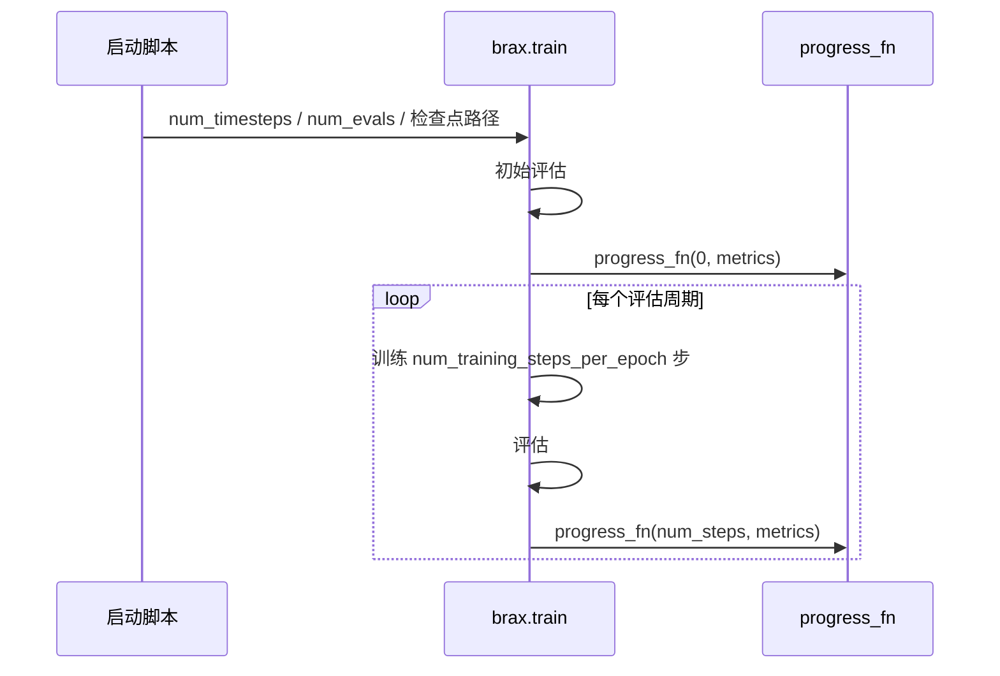
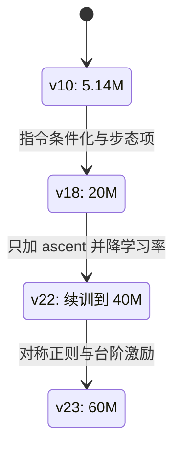

“训练 5M 步”这句话在这套栈里有三种含义：环境步数、训练步数、梯度更新次数。入口脚本给出的 `--num_timesteps` 是第一种，brax 把它折算成每个评估周期的训练步数，再用评估次数切分整个训练过程。三次记账错误之所以难发现，正是因为三个口径的名字都像“步数”。

折算公式写在 brax 的 `train` 函数开头，评估循环的结构写在函数中后段。把这两处放在一起看，才能解释为什么“给了 5M 步”与“跑满 5M 步”会差出十几倍。

三种“步数”口径的混淆是预算问题的根源：环境步数、训练步数与梯度更新次数各有各的用途，评估周期又把前两者切成一段一段。

## 1. 预算是环境步数

`--num_timesteps` 直接进入 `ppo_params` 的 `num_timesteps` 字段（`train/train_go1.py`），行走入口的默认值是 100M，起身入口是 50M（`train/train_getup.py`）。brax 把它当环境总步数使用，而不是训练步数或梯度更新次数。

一个训练步采集的环境步数是 `batch_size × unroll_length × num_minibatches`。用它除总预算，得到训练步总数；再被评估周期切分，得到每个周期的训练步数。

## 2. 评估周期如何切分预算

brax 先算 `num_evals_after_init = max(num_evals - 1, 1)`，再做向上取整的除法：`num_training_steps_per_epoch` 等于总步数除以（评估周期数、每训练步环境步数、每评估重置次数三者之积）（`brax/training/agents/ppo/train.py`）。评估次数减一，是因为第一次评估在训练开始前单独执行。

## 3. 初始评估与进度回调的第一次调用

训练开始前会先跑一次评估，并把结果通过 `progress_fn(0, metrics)` 送出来（`brax/training/agents/ppo/train.py`）。这就是日志里第一行 `0: eval_reward=...` 的来源，步数为 0、回合长度通常很短。入口脚本的初始化把 `best_reward` 设为负无穷，因此初始评估的结果一定会成为第一个 best 检查点候选（`train/train_go1.py`）。

随后进入评估周期循环，循环次数是 `num_evals_after_init`，每个周期内部先跑训练、再做一次评估（`brax/training/agents/ppo/train.py`）。

## 4. 预算为零的边界

brax 在初始化之后先判断 `num_timesteps == 0`，成立则直接返回推理函数、随机初始参数与空指标。这个分支的用途是让“只初始化不训练”的调用有确定行为，评估脚本和查看器都依赖它拿到一份未训练的策略。

对使用者来说，这意味着 `--num_timesteps 0` 不会报错，也不会写检查点，日志里只有初始化信息。

## 5. 续训的步数记账

续训时 brax 的步数计数器从 0 开始，日志里因此会同时出现“本次训练 5M 步”与“真实累计 25M 步”两种读法。入口脚本用 `step_offset` 在标签里补上累计值，并在打印格式里写成 `num_steps(累计 …)`（`train/train_go1.py`）。

`step_offset` 只影响日志显示，不参与训练语义；续训脚本必须另外把学习率调低，因为检查点不含优化器状态。

## 6. 检查点间隔反推预算

检查点按步数命名目录，因此目录之间的间隔等于一次评估周期消耗的环境步数。v4 到 v8 的间隔是 786,432，等于 `batch_size(64) × unroll(32) × num_minibatches(384)`；v9 修正语义后变成 49,152，等于 `2 × 24576`；v10 是 270,336，等于 `11 × 24576`（`RLcontroller_go1_moreinformation/实验记录_Go1复现.md`）。

| 版本 | 检查点间隔 | 折算 | 判定 |
| --- | --- | --- | --- |
| v4 到 v8 | 786,432 | 64 × 32 × 384 | batch_size 语义错误 |
| v9 | 49,152 | 2 × 24,576 | 语义已改对 |
| v10 | 270,336 | 11 × 24,576 | 与参考对齐 |

从间隔反推参数时要注意向上取整：当总预算不能整除周期步数时，实际间隔会比理论值略大。

## 7. 预算怎么一档一档加上去

预算不该一次给足，每加一档应该只回答一个问题：先用能出结果的最小预算验证方法是否成立（5.14M 环境步、209 个 rollout、802,560 次梯度更新到 30 秒不摔），再用中等预算证实“卡在预算”这一判断（20M），最后在需要更高上限时续训加码（续训到 40M、再到 60M）。每一档只改一件事，结论才归因得清。

## 8. 评估指标的口径

评估由 `Evaluator` 驱动，评估环境数是固定的 128，与训练环境数分开（`brax/training/agents/ppo/train.py`、`train/train_go1.py`）。评估包装器与训练包装器是同一套，因此评估里的回合长度受 `BraxAutoResetWrapper` 不回填环境信息的影响，会频繁终止的任务不能用它判断好坏（`RLcontroller_go1_moreinformation/实验记录_Go1复现.md`）。

评估奖励 `eval/episode_reward` 受同样影响但程度较轻：它按回合结束结算，终止频繁时会把短回合的低回报一起算进去，所以看它时要配合逐指令评估工具。

## 9. 冒烟档的预算设置

改完环境或奖励后先跑小预算确认通路，是这个工程的固定做法。起身入口的冒烟命令用 1M 环境步配两次评估，产物写到一个独立的 `logs/getup_v2` 目录（`train/train_getup.py`）。行走侧的一次通路验证用 200K 步，目的是确认新增奖励项确实进入计算、启动参数没有解析错误，而不是看收敛（`RLcontroller_go1_moreinformation/实验记录_Go1复现.md`）。

小预算的好处是评估周期也被压小：`num_evals` 取 2 时只有一个训练周期加一次初始评估，日志能很快给出第一组指标。代价是 `eval_reward` 还停在起点附近，只能用来判断“路径通了没有”。

小预算同样要指向独立的日志目录。检查点闸门只判断目标目录里是否已有内容，指向正在使用的训练目录会被直接拒绝启动，换目录是成本最低的做法（`train/train_go1.py`）。冒烟档的产物本身没有保留价值，但它的目录名要能一眼看出是通路验证，避免和正式档混在一起。

通路验证通过后，正式档从新的日志目录开始，两者的检查点互不影响。

## 10. 小结

### 核心概念

- num_timesteps 是环境步数，折算成训练步数再被评估周期切分。
- num_training_steps_per_epoch 用评估次数减一做分母，初始评估单独执行。
- num_timesteps 为 0 时 brax 直接返回未训练策略。
- 续训步数从 0 计数，step_offset 只补日志显示。
- 检查点间隔等于一个评估周期的环境步数，可反推 batch_size 语义。
- 评估环境数固定 128，评估的回合长度指标在多方向任务上不可信。

### 设计权衡

| 决策 | 选择 | 收益 | 代价 |
| --- | --- | --- | --- |
| 预算表达 | 环境步数 | 与参考统一 | 需要折算 |
| 评估频率 | num_evals 固定 20 | 曲线密度够 | 评估本身占时间 |
| 续训记录 | step_offset 补显 | 不会读错阶段 | 不影响训练语义 |
| 选型依据 | eval_reward 最高 | 自动化 | 依赖评估指标可信 |

## 11. 练习

### 基础题

1. 用 5M 环境步、768 环境、unroll 32、2 序列乘 384 minibatch 算出一个评估周期的训练步数。
2. 说明初始评估为什么计入 best 候选。
3. 解释检查点间隔 49,152 是怎么来的。

### 挑战题

1. 设计一套日志字段，使阶段步数、累计步数与环境步数三个口径不会互相混淆。
2. 给定 num_timesteps 与 num_evals，说明评估周期末尾为什么要向上取整，并给出误差上界。
3. 论证在频繁终止的任务上改用逐指令评估后，训练预算的分配策略应如何调整。

## 附：本页引用的路径

| 路径 | 用途 |
| --- | --- |
| `brax/training/agents/ppo/train.py` | 预算折算、评估循环与初始评估 |
| `train/train_go1.py` | 预算默认值、评估环境数、进度标签 |
| `train/train_getup.py` | 起身入口的默认预算 |
| `RLcontroller_go1_moreinformation/实验记录_Go1复现.md` | 检查点间隔、预算档位与评估口径 |
