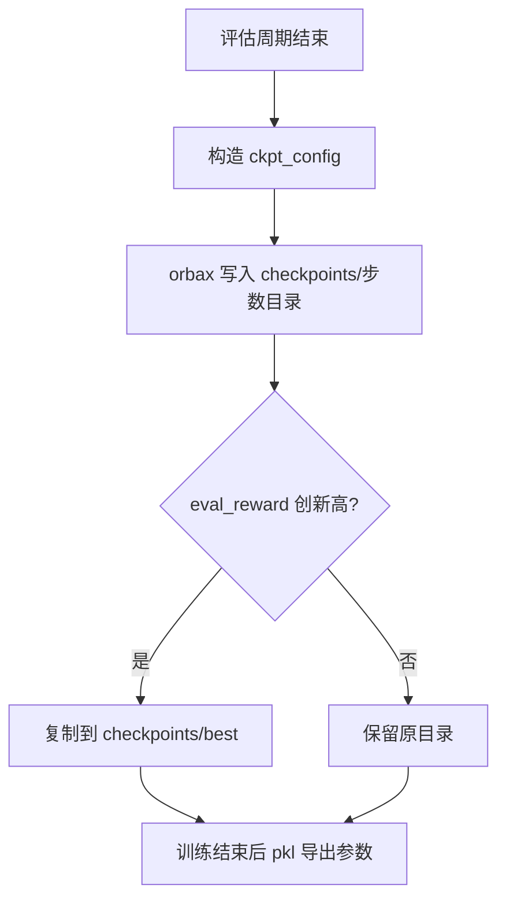
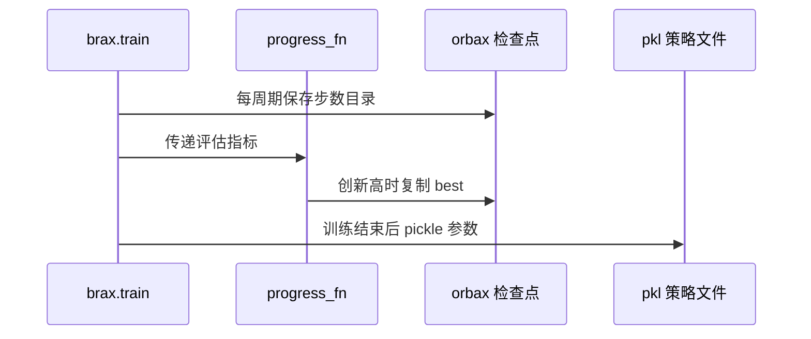

训练过程的产物分两层：brax 自己写的检查点目录，以及入口脚本额外导出的一份策略文件。前者由 orbax 按步数命名，带一份描述网络结构的配置文件；后者是把三个参数树用 pickle 存下来的单文件，查看与评估脚本主要用它。两层产物解决不同问题：检查点用于续训与回溯，策略文件用于部署与对照。

两层之间靠一个约定对齐：参数树的顺序。查看器与评估脚本都要按同样的顺序取出归一化参数、策略参数与价值参数，顺序错了不会报错，只会得到错误的行为。

检查点与策略文件是两份产物：前者用于续训与回溯，后者用于部署与对照，两者的参数顺序必须一致，差异只体现在加载方式上。

## 1. 检查点写什么

保存动作发生在评估周期末尾，由 brax 调用 orbax 完成。写入前先构造一份配置：观测尺寸、动作维度、是否归一化观测、以及网络工厂参数（`brax/training/agents/ppo/train.py`）。这份配置就是 `ppo_network_config.json` 的内容，也是续训守卫判定“这里是不是一个 brax 检查点”的依据。

被保存的参数是三棵树：归一化统计量、策略参数、价值参数。训练状态里的优化器状态与步数不在其中，这一点由入口脚本的守卫打印提醒（`train/train_go1.py`）。

```python
if save_checkpoint_path is not None:
    ckpt_config = checkpoint.network_config(
        observation_size=obs_shape,
        action_size=env.action_size,
        normalize_observations=normalize_observations,
        network_factory=network_factory,
    )
    checkpoint.save(save_checkpoint_path, current_step, params, ckpt_config)
```

## 2. 目录命名与 best 副本

检查点目录用步数命名，入口脚本按 `f"{num_steps:012d}"` 的格式去定位那一次评估对应的目录（`train/train_go1.py`）。十二位补零是 orbax 的命名方式，实验记录里的恢复命令指向的就是这种名字（`RLcontroller_go1_moreinformation/实验记录_Go1复现.md`）。

评估奖励创新高时，回调会把该目录整份复制到 `checkpoints/best/`：先删掉旧的 best 目录，再 `copytree`（`train/train_go1.py`）。复制而不是软链接，是为了让 best 目录能独立归档。



## 3. 配置里的字段与用途

`ppo_network_config.json` 至少含三类信息：观测维度的形状字典、动作维度、网络工厂参数（含策略与价值层宽）。续训守卫读前两类用于比对维度，读第三类用于打印层宽（`train/train_go1.py`）。

| 字段 | 来源 | 用途 |
| --- | --- | --- |
| `observation_size` | 环境的观测字典 | 续训维度比对 |
| `action_size` | 环境动作维度 | 网络输出校验 |
| `normalize_observations` | 训练参数 | 加载时是否带归一化 |
| `network_factory_kwargs` | 网络工厂 | 打印层宽、重建网络 |

## 4. 恢复路径与守卫

brax 的恢复逻辑是 `checkpoint.load` 取出参数，再按开关决定要恢复策略、价值还是两者（`brax/training/agents/ppo/train.py`）。入口脚本在加载环境之前先做一次自检：路径存在、目录里有配置文件、维度与本次训练一致，任何一条不满足就退出（`train/train_go1.py`）。

自检通过后打印一条提示：检查点不含优化器状态与步数，续训需要降低学习率。v22 的续训命令把学习率从 3e-4 降到 1e-4，并用 `--step_offset` 保持日志累计步数与实际进度一致（`RLcontroller_go1_moreinformation/实验记录_Go1复现.md`）。

## 5. 策略文件的内容

训练结束（或被手动终止）后，入口脚本把参数树 pickle 成一份单文件，路径由 `--save_name` 与策略目录拼接而成（`train/train_go1.py`）。仓库里的 `policies/go1_walk_policy.pkl` 与 `policies/go1_getup_policy.pkl` 就是这类产物。

参数树的顺序由 brax 的打包方式固定：归一化参数、策略、价值（`brax/training/agents/ppo/train.py`）。加载方按同样的顺序解包，因此这份文件与检查点目录可以互换使用，前提是网络结构一致。

## 6. 两种加载路径的差异

从检查点目录加载时，brax 走 `checkpoint.load`，它读的是网络配置与参数两部分；从 pkl 加载时，脚本要自己读配置、按配置建网络、再灌入参数。后者容易漏掉两个必须显式传入的项：激活函数与分布类型，否则会建出一个能加载但输出错误的网络（`RLcontroller_go1_moreinformation/实验记录_Go1复现.md`）。

| 加载入口 | 输入 | 需要人工指定 | 典型用途 |
| --- | --- | --- | --- |
| `--restore` | 检查点目录 | 无 | 续训 |
| `--pkl` | 策略文件 | 激活与分布类型 | 查看器、评估 |
| `--ckpt` | 检查点目录 | 激活与分布类型 | 评估、对照 |

## 7. 产物的一致性验证

两条加载路径应当给出同一个策略。v10 的验收用了这个办法：分别从策略文件与检查点目录加载，跑同一条指令 30 秒，两者都得到 `vx=+0.492`、`up_z=1.00`、未摔（`RLcontroller_go1_moreinformation/实验记录_Go1复现.md`）。结果一致说明导出与保存两侧的参数顺序与配置都对上了。

检查点的另一个用途是回溯：按步数命名的目录可以取出任意一档评估时的参数，用来解释“指标从哪一步开始变好”。

检查点目录也承担跨阶段回溯。仓库的 `data/` 下按预算档位保留了多份检查点目录，v22 的 40M 档与 v23 的 60M 档各自独立，便于在同一档内比较不同奖励项的效果。回溯时要注意每份目录只在它自己的配置下有意义，跨档比较前先确认观测维度与网络层宽一致。

策略文件在训练进程正常返回之后才写出，因此被手动终止的训练不会留下 pkl，这种情况要用检查点目录里的最后一档。入口脚本先调用训练函数、再执行导出，两步之间没有中间保存（`train/train_go1.py`）。需要中途产物的实验应额外用 `--save_name` 之外的方式从检查点目录取参数。

## 8. 评估回调在产物链里的位置

回调是唯一能看到评估指标的地方，它同时承担三件事：打印指标、挑选 best 检查点、以及在续训时补上累计步数标签（`train/train_go1.py`）。回调不参与训练计算，但它决定了磁盘上留下哪些证据。



回调里的操作要尽量短，因为它抛异常会直接终止训练。best 复制是整目录拷贝，检查点较大时这一步会占用可观时间，出现在每个评估周期的末尾（`train/train_go1.py`）。

## 9. 小结

### 核心概念

- 检查点由 orbax 按步数命名写入，附带描述网络的配置文件。
- 保存的参数是归一化、策略、价值三棵树，不含优化器状态。
- best 副本在评估奖励创新高时由回调复制。
- 续训守卫比对观测维度，并在加载前拒绝不匹配的检查点。
- pkl 策略文件与检查点目录可互换，前提是网络结构一致。
- 手动从 pkl 建网络必须显式传激活函数与分布类型。

### 设计权衡

| 决策 | 选择 | 收益 | 代价 |
| --- | --- | --- | --- |
| 产物形式 | 检查点加 pkl 两份 | 兼顾续训与部署 | 需要一致性验证 |
| best 管理 | 整份复制 | 可独立归档 | 占磁盘空间 |
| 加载自检 | 维度严格比对 | 早失败 | 改观测后旧检查点不可用 |
| 恢复范围 | 可只恢复策略 | 便于算法对照 | 需理解参数树结构 |

## 10. 练习

### 基础题

1. 列出检查点配置里的四类字段与各自用途。
2. 说明检查点为什么不包含优化器状态，以及续训要做的补偿。
3. 写出从 pkl 建网络时必须显式传入的两个参数。

### 挑战题

1. 设计一次一致性验证，确认 pkl 与检查点目录加载出的策略行为相同。
2. 给定一个观测维度改动，说明续训守卫会拦住什么、需要如何处理旧检查点。
3. 论证 best 目录用复制而非软链接的取舍，并给出磁盘开销的估算方法。

## 附：本页引用的路径

| 路径 | 用途 |
| --- | --- |
| `brax/training/agents/ppo/train.py` | 检查点写入、配置构造与恢复逻辑 |
| `train/train_go1.py` | 守卫、best 复制、pkl 导出与回调 |
| `policies/` | 策略文件产物 |
| `RLcontroller_go1_moreinformation/实验记录_Go1复现.md` | 加载器问题、恢复命令与一致性验证 |
