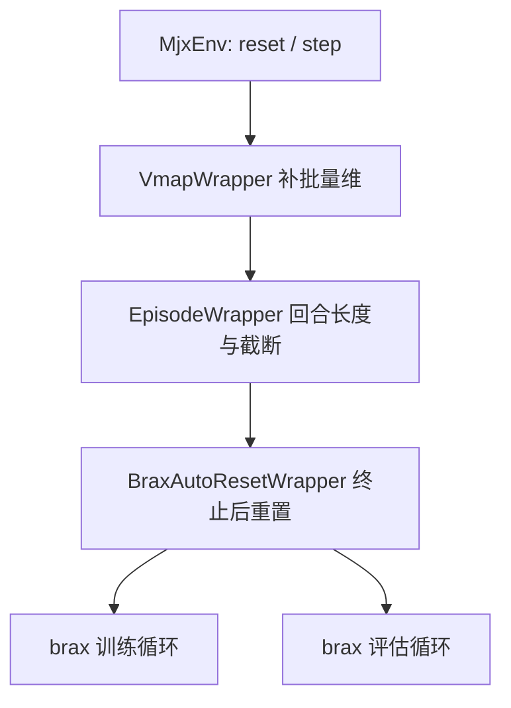
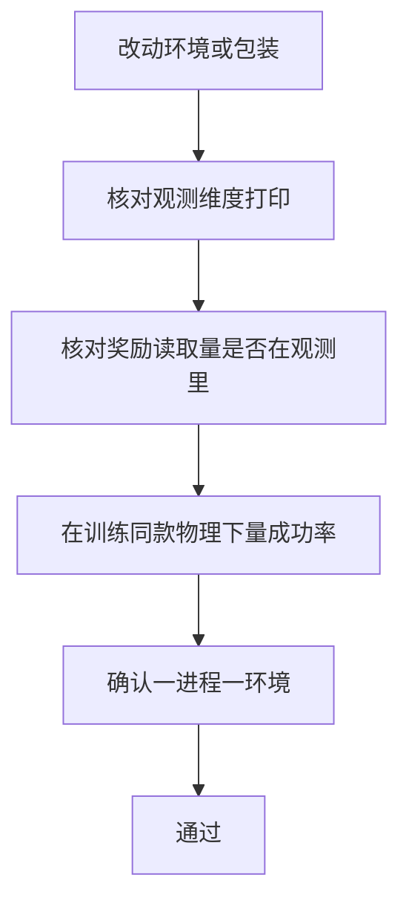

环境类本身只提供 `reset` 与 `step`，brax 需要的批量维度、回合截断与自动重置都由包装器叠加。包装顺序是固定的：先补批量维，再加回合逻辑，最后加自动重置（`mujoco_playground/_src/wrapper.py`）。顺序反过来会得到不同的语义，尤其是自动重置必须包在最外层，否则重置后的状态不会反映到回合统计里。

理解这条链的价值在于解释三个常被误读的量：日志里的回合长度、奖励在终止时的处理、以及评估为什么会给出与实测差五倍的回合数。三者都源自包装器，而不源自环境。

包装顺序一旦改变，截断标记、回合指标与评估口径会同时变化；改动链条之前要先确认这三样分别由哪一层产生。

## 1. 包装链的构造顺序

`wrap_for_brax_training` 返回的链条是：`VmapWrapper` 补批量维度，`EpisodeWrapper` 负责回合长度与截断，`BraxAutoResetWrapper` 负责在终止后重置（`mujoco_playground/_src/wrapper.py`）。若传入了域随机化函数，第一层换成 `BraxDomainRandomizationVmapWrapper`，其余两层不变。

训练入口通过 `wrap_env_fn` 把这个函数交给 brax，评估侧用同一份函数，只是环境数与键不同（`train/train_go1.py`、`brax/training/agents/ppo/train.py`）。



## 2. 批量维度的来源

`VmapWrapper` 把单环境的 `step` 变成对批量状态的映射，brax 因此可以用一个 pytree 表示 8192 个环境的全部状态。批量维度不在环境类里定义，环境只关心单实例的物理。

这一层与上一单元的 `vmap` 讨论同源：批量包装只是把 `jax.vmap` 的映射规则固定下来，并行度由设备上的形状决定。评估时批量是 128，训练时是 `--num_envs`，两者共用同一份包装代码。

## 3. 回合包装的职责

`EpisodeWrapper` 维护每环境的步数计数，达到回合长度时把状态标记为截断而不是终止（`brax/training/agents/ppo/train.py`）。它还会把回合指标与回合结束标记挂到状态的附加字段上，供训练步末尾汇总。

截断与终止的区分影响回报估计：截断由时间上限造成，其后的价值应当继续估计；终止由失败造成，其后的价值为零。开启超时自举后，截断还会额外写入一个 `time_out` 字段用于奖励自举。环境的回合长度由 `episode_length` 参数决定，行走任务是 750 步、起身任务是 300 步（`train/train_go1.py`、`train/train_getup.py`）。

| 字段 | 产生者 | 含义 |
| --- | --- | --- |
| `truncation` | 回合包装 | 达到长度上限 |
| `episode_done` | 回合包装 | 回合结束（含截断） |
| `episode_metrics` | 回合包装 | 汇总进日志的回合指标 |
| `time_out` | 回合包装 | 截断专用，供奖励自举 |

## 4. 自动重置的语义

`BraxAutoResetWrapper` 在环境终止后自动重置。默认 `full_reset=False` 时，它重置到缓存的首个状态，并且只重置数据与观测，不重置环境信息；开启 `full_reset=True` 时才调用环境自己的 `reset`，代价是墙钟时间变长（`mujoco_playground/_src/wrapper.py`）。

训练入口使用默认值，因此训练过程中终止后的回合信息不会完整重置。这一行为直接影响评估指标：环境信息里的步数计数在终止后不清零，评估得到的回合长度主要反映截断计数（`RLcontroller_go1_moreinformation/实验记录_Go1复现.md`）。

```sequenceDiagram
  participant E as 环境
  participant R as 自动重置包装
  participant P as 训练步
  P->>E: step(action)
  E->>R: 状态含 done 标记
  R->>R: full_reset=False, 缓存首态
  R->>E: 重置 data 与 obs, 不动 info
  R->>P: 返回状态与截断标记
```

## 5. 动作重复与环境步长

回合包装在构造时接收 `action_repeat` 参数，表示一个策略动作重复执行多少次物理步进（`mujoco_playground/_src/wrapper.py`）。训练入口把它固定为 1，也就是策略输出与物理步一一对应（`train/train_go1.py`）。

若把它设为大于 1，回合长度按策略步计数，环境步数按物理步计数，预算记账会立刻出现两个口径；同时策略的有效控制频率下降。本工程保持 1 的原因与控制频率有关：训练的控制周期是 0.02 秒，对应 50 Hz（`envs/go1_walk.py`）。

| action_repeat | 控制频率 | 回合长度计数 | 适用场景 |
| --- | --- | --- | --- |
| 1 | 与物理步一致 | 策略步 | 本工程 |
| N | 降为 1/N | 策略步 | 降低控制频率 |


## 6. 包装链与终止语义的耦合

环境里的终止条件决定回合何时结束，包装器决定结束之后发生什么。行走任务用姿态角阈值判定健康终止，横滚与俯仰的上限是 10.0 度（`envs/go1_walk.py`）。v7 修正过终止语义，修正之后 NaN 的出现步数发生变化，说明终止条件与数值稳定性在同一批样本上互相影响（`RLcontroller_go1_moreinformation/实验记录_Go1复现.md`）。

早期把“评估奖励恒为 0”归因于奖励下限加提前终止的正常现象，这条解释后来被证伪：恒零是动作语义错误、奖励漏项与预算记错三者叠加。包装器提供的截断标记本来可以用来区分这两类结束，但只有当终止语义本身正确时它才有意义。

## 7. 评估侧的口径

评估器用同一份包装链、不同的并行规模运评估环境，评估次数与回合长度由参数固定（`brax/training/agents/ppo/train.py`）。评估指标里的回合长度来自回合包装的计数，而信息字段在默认重置语义下不会被清空，于是它更像“距离截断还有多少步”而不是“活了多久”。

这条口径差异在会频繁终止的任务上被放大：多方向行走的评估回合长度是 652 到 733，直接数终止步数只有 124 到 152（`RLcontroller_go1_moreinformation/实验记录_Go1复现.md`）。处理办法是用逐指令评估工具绕开包装器的统计。

批量包装同时决定了观测字典的形状。环境的 `_get_obs` 返回 `state` 与 `privileged_state` 两个键，包装之后每个键都多出一维批量维度，网络工厂按 `policy_obs_key` 与 `value_obs_key` 各取一个（`train/train_go1.py`）。观测维度在批量维之后、特征维的最后一维上，续训守卫比对的就是这一维。

第二项检查是奖励读取的状态量是否都在观测里。包装器不会替环境做这件事，相位这类内部量必须由 `_get_obs` 显式放进观测，否则奖励依赖一个策略看不到的时变量（`RLcontroller_go1_moreinformation/实验记录_Go1复现.md`）。
## 8. 包装链的调试手段

改动环境后按三项检查：启动日志打印的观测维度与预期一致；奖励函数读取的状态量都在观测里；终止条件在训练同款物理下能复现。前两项由入口脚本的维度打印与守卫覆盖（`train/train_go1.py`）。

第三项尤其要注意包装链带来的差异：评估脚本用同一链条，但环境数与重置策略可能与训练不同，对照实验要一个进程只建一个环境，避免图缓存串味（`docs/viewer-guide.md`）。

第三项检查是行为层面的：任何“能站起来”或“能翻过去”的动作，都要在训练同款物理里量成功率，而不是在查看器默认配置里目测（`docs/viewer-guide.md`）。查看器的默认动作范围与训练不同，评估脚本必须显式对齐动作裁剪上限（`docs/status.md`）。

第四项是环境实例数量。包装链与 warp 的图缓存都假设一个进程里只有一个环境实例，对照实验要用两个进程并通过文件交换状态（`docs/viewer-guide.md`）。


## 9. 小结

### 核心概念

- 包装顺序是批量、回合、自动重置，顺序影响语义。
- 批量维度由包装器提供，环境类只实现单实例物理。
- 回合包装区分截断与终止，并提供奖励自举用的 time_out。
- 默认自动重置只重置数据与观测，不回填环境信息。
- 评估回合长度因此近似截断计数，多方向任务上不可信。
- 终止条件的正确性是这些标记有意义的前提。

### 设计权衡

| 决策 | 选择 | 收益 | 代价 |
| --- | --- | --- | --- |
| 包装顺序 | 自动重置在最外 | 统计一致 | 修改链条需重验 |
| 重置策略 | 默认缓存首态 | 训练更快 | 信息字段不完整 |
| 终止语义 | 姿态阈值 | 简单可控 | 阈值改动影响数值稳定性 |
| 评估口径 | 逐指令工具 | 与行为一致 | 需要额外工具 |

## 10. 练习

### 基础题

1. 写出包装链的三层及其职责，并说明顺序为何不能颠倒。
2. 区分截断与终止在回报估计上的差别。
3. 解释 full_reset 开关对墙钟时间与环境信息的影响。

### 挑战题

1. 设计一个实验，验证评估回合长度与逐指令计数之间的差异来源。
2. 给定一次“训练中的回合指标与评估指标不一致”的现象，写出从包装链入手的排查步骤。
3. 论证把 full_reset 打开对训练收敛与显存占用的可能影响。

## 附：本页引用的路径

| 路径 | 用途 |
| --- | --- |
| `mujoco_playground/_src/wrapper.py` | 包装链构造与自动重置语义（虚拟环境内） |
| `brax/training/agents/ppo/train.py` | 附加字段、回合指标与评估器 |
| `envs/go1_walk.py` | 终止阈值 |
| `train/train_go1.py` | 包装函数传入与维度打印 |
| `docs/viewer-guide.md` | 一个进程一个环境的约束 |
| `RLcontroller_go1_moreinformation/实验记录_Go1复现.md` | 终止修正、评估口径与证伪记录 |
