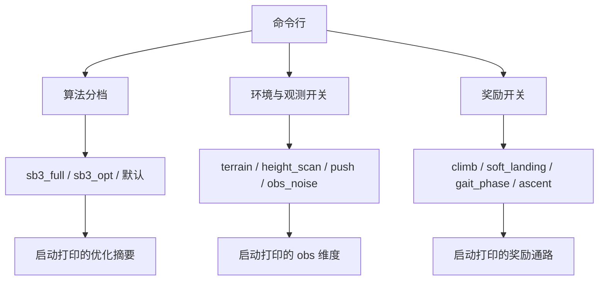
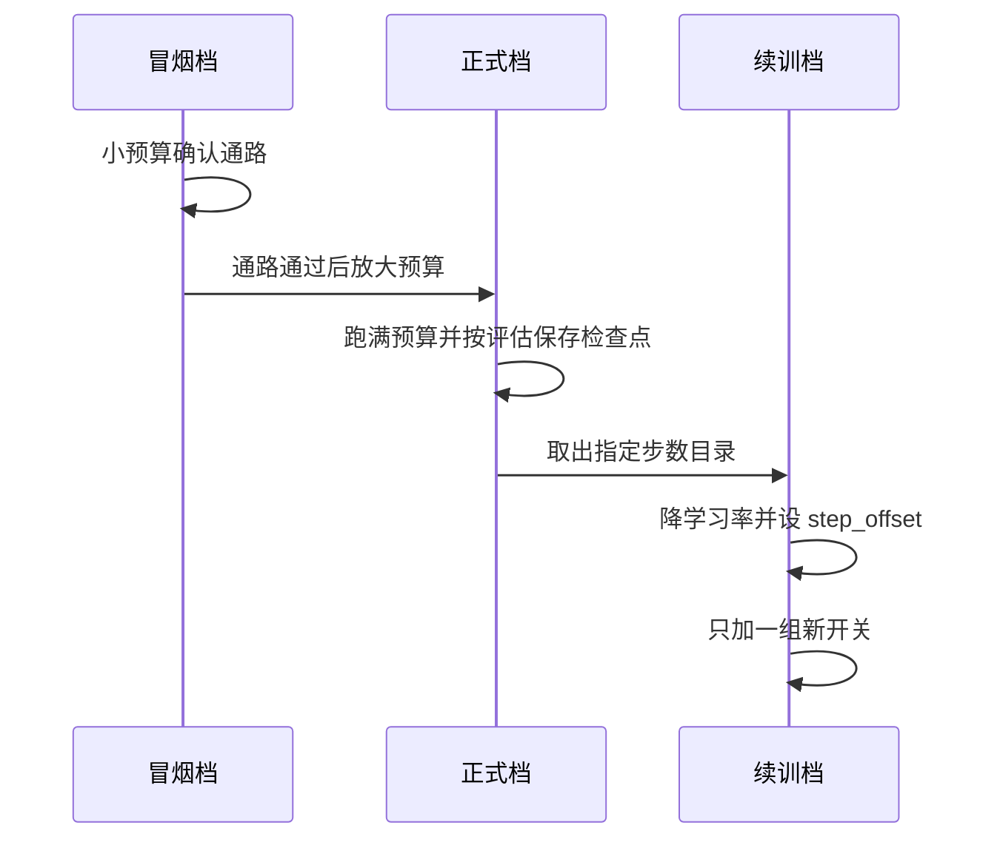

一个训练单元的价值有多大，取决于别人能不能用一条命令复现它。这套工程的实验记录里，每个版本都保留了完整命令行，包括续训来源、步数偏移与日志目录。命令里的开关分成三组：算法分档、环境与观测开关、奖励开关，三组的改动应当分开做。

产物归档同样有约定：日志目录按版本分家，检查点目录按步数命名，策略文件按用途命名并放在固定的 `policies/` 下。约定之外的情况都要在实验记录里写明，否则几个月后自己也会认不出哪份检查点对应哪次改动。

命令能不能复现取决于三组开关是否被完整记录，产物能不能找到取决于目录命名是否有规律，两件事都靠约定而不是靠记忆。

## 1. 三类命令的分工

冒烟命令用极小预算确认通路，正式命令跑满预算，续训命令从上一版的检查点接着跑。三类的开关集合基本相同，差别在预算、日志目录与恢复参数（`train/train_go1.py`）。起身入口的帮助文本里直接把冒烟与正式两条命令并列写出（`train/train_getup.py`）。

```bash
# 冒烟: 1M 环境步, 两次评估
python -u -m train.train_getup --num_timesteps 1000000 --num_evals 2 \
    --save_name go1_getup_policy_smoke.pkl --logdir logs/getup_v2

# 正式: 50M 环境步
python -u -m train.train_getup --num_timesteps 50000000 --num_evals 20 \
    --save_name go1_getup_policy.pkl --logdir logs/getup_v2
```

## 2. 开关的三组划分

算法分组是 `--sb3_full` 与 `--sb3_opt` 一类；环境与观测分组包含 `--terrain`、`--height_scan`、`--push`、`--obs_noise` 等；奖励分组包含 `--climb_reward`、`--soft_landing`、`--gait_phase`、`--ascent` 等。三组的覆盖代码集中在一个分支块里，每处覆盖都带注释说明动机（`train/train_go1.py`）。

划分的用处是控制变量：换算法档时环境与奖励开关保持原样，加奖励项时算法档保持原样。记录里反复出现的“唯一变量”就是要求命令之间只差一组开关。



## 3. 日志目录与检查点归档

日志目录的默认值是 `logs/walk`，实际使用时应按版本改名，例如 v22 用 `models/go1_v22_logs`（`train/train_go1.py`、`RLcontroller_go1_moreinformation/实验记录_Go1复现.md`）。检查点写在该目录的 `checkpoints/` 子目录下，按步数命名，评估奖励最高的那一档会被复制到 `best/`。

跨档的比较产物放在 `data/` 下，例如 40M 与 60M 档各自保留一份检查点集合。归档时要注意检查点不含优化器状态，跨档比较只能比较策略行为，不能比较优化器轨迹。

| 产物 | 位置约定 | 用途 |
| --- | --- | --- |
| 检查点目录 | `<logdir>/checkpoints/<步数>` | 续训与回溯 |
| 最佳档 | `<logdir>/checkpoints/best` | 选型与演示 |
| 策略文件 | `policies/<用途>_policy.pkl` | 查看器与评估 |
| 跨档对照 | `data/<版本>_checks/` | 版本对比 |

## 4. 策略文件的命名

`policies/` 下保留两份主产物：行走策略与起身策略（`policies/go1_walk_policy.pkl`、`policies/go1_getup_policy.pkl`）。冒烟档的产物用 `_smoke` 后缀区分（`train/train_getup.py`）。命名规则的作用是让查看器与评估脚本的默认参数不必改动就能取到最新产物。

README 的查看器用法直接引用这两个文件名，说明命名已经成为命令行约定的一部分（`README.md`）。

## 5. 一条可复现命令该记哪些东西

要复现一次实验，命令、实际生效值与恢复点三者必须成对保留。一次完整改动可以同时带上算法档、环境开关、阈值、奖励项与网络覆盖，下面这条行走实验的命令就是这种完整形态：

```bash
python -u -m train.train_go1 --sb3_full --hard_contact --sample_cmd --fwd_turn \
  --body_frame --tilt_deg 17.5 --natural_gait --dangle_penalty \
  --layers 128,128 --num_timesteps 20000000
```

这里最容易看错的是覆盖关系：命令里的 `--layers 128,128` 覆盖了算法档默认的 (64,64)，实际网络因此是两层 128 宽。只看命令或只看默认值都会记错，所以命令必须与“实际生效值”成对保留。

## 6. 续训命令的三个必要项

续训与正式训练只差三处：恢复来源、学习率与步数记账。恢复要指向具体步数目录，学习率要下调（检查点不含优化器状态），步数偏移要让日志里的累计步数与真实进度一致。下面这条续训命令是完整形态：

```bash
python -u -m train.train_go1 \
  --num_timesteps 20000000 --num_evals 5 \
  --sb3_full --hard_contact --sample_cmd --fwd_turn --body_frame \
  --tilt_deg 17.5 --natural_gait --dangle_penalty --layers 128,128 \
  --terrain --height_scan --push --obs_noise \
  --climb_reward --soft_landing --gait_phase --body_contact --ascent \
  --lr 1e-4 \
  --restore models/go1_v21_logs/checkpoints/000020054016 \
  --step_offset 20054016 \
  --save_name go1_walk_policy_v22_40M.pkl --logdir models/go1_v22_logs
```

`--restore` 指向具体步数目录而不是 logs 根目录，`--step_offset` 与恢复步数一致，这两点是续训命令的必要项。



## 7. 产物清单与验收

一次正式训练结束后，验收要看到四项：日志里评估奖励与回合长度的曲线；检查点目录按周期递增；`best/` 与最优评估对应；策略文件已写出并可被查看器加载（`train/train_go1.py`）。

| 验收项 | 期望 | 对应来源 |
| --- | --- | --- |
| 评估曲线 | 奖励上升、回合长度接近上限 | 进度回调 |
| 检查点 | 每周期一个步数目录 | brax 保存 |
| best 目录 | 与最高评估一致 | 回调复制 |
| 策略文件 | 能被查看器加载并跑 30 秒 | pkl 导出 |

## 8. 小结

### 核心概念

- 命令分三类：冒烟、正式、续训，开关集合相同、预算与恢复参数不同。
- 开关按算法、环境与观测、奖励三组划分，便于控制变量。
- 日志目录按版本分家，检查点按步数命名，best 是复制产物。
- 策略文件命名是命令行约定的一部分。
- 续训命令必须指向具体步数目录并设置步数偏移。
- 命令要与实际生效超参表成对保留。

### 设计权衡

| 决策 | 选择 | 收益 | 代价 |
| --- | --- | --- | --- |
| 命令组织 | 分三组开关 | 变量可控 | 命令行较长 |
| 日志目录 | 按版本分家 | 不会覆盖 | 目录数量增长 |
| 恢复粒度 | 指定步数目录 | 精确可控 | 需要记录步数 |
| 策略命名 | 固定主文件名 | 下游默认可取 | 需要冒烟后缀区分 |

## 9. 练习

### 基础题

1. 写出冒烟与正式两条命令的差别，并说明各自的验收标准。
2. 说明续训命令中 --restore 与 --step_offset 各自的作用。
3. 列出正式训练后的四项验收产物。

### 挑战题

1. 设计一份命令模板，使算法、环境、奖励三组开关可以独立替换且不易混用。
2. 给定一份只有日志目录的训练产物，写出恢复出“实际生效超参”所需的信息与步骤。
3. 论证把检查点与策略文件分别归档的必要性，并给出目录结构方案。

## 附：本页引用的路径

| 路径 | 用途 |
| --- | --- |
| `train/train_go1.py` | 开关分支、日志目录与产物导出 |
| `train/train_getup.py` | 冒烟与正式命令示例 |
| `policies/` | 策略文件产物 |
| `README.md` | 查看器命令与文件命名约定 |
| `RLcontroller_go1_moreinformation/实验记录_Go1复现.md` | v18 与 v22 的完整命令 |
