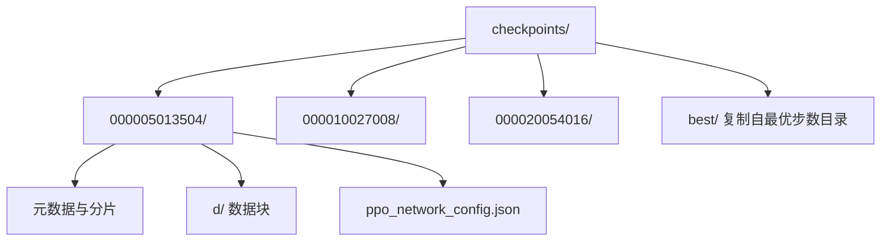
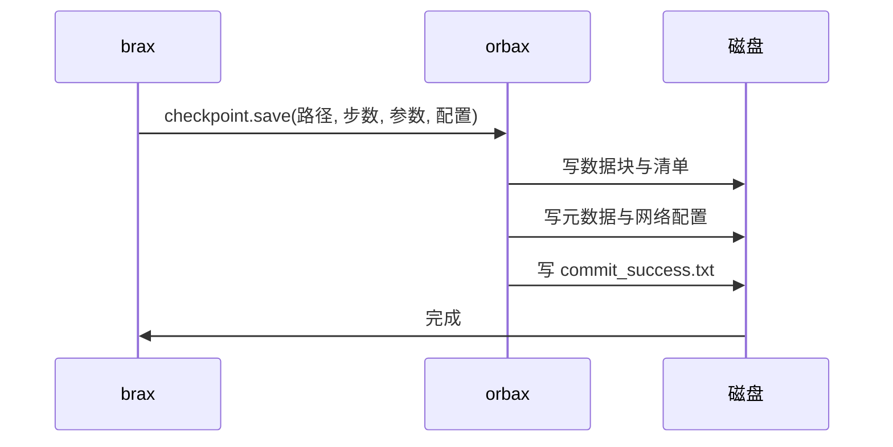

检查点以目录形式保存，而不是单个文件。brax 通过 orbax 保存时，每一步都会创建一个以步数命名的子目录，里面再分成元数据、分片与数据三部分。目录能被独立移动与备份，前提是整个目录一起动，只拷其中一部分会得到一个读不出来的检查点。

这套工程的检查点目录里还额外放了一份网络配置，续训守卫与手工加载都依赖它。除此之外还有一个提交标记文件，用来表示这次写入是否完成——它的存在让“半个检查点”可以被识别出来。

所有条目都来自仓库里现存的检查点目录，反映的是 orbax 0.12.4 的实际布局，升级该库时布局可能变化。

## 1. 两级目录结构

顶层是 `checkpoints/`，下面按步数命名子目录，再加上一个 `best/`。以 v19 的训练日志目录为例，顶层内容是四个步数目录与一个 `best`（`models/go1_v19_logs/checkpoints/`）：

```text
checkpoints/
  000005013504/
  000010027008/
  000015040512/
  000020054016/
  best/
```

步数目录名是十二位补零的步数，与入口脚本定位 best 时的格式一致（`train/train_go1.py`）。`best/` 是回调复制出来的，内容与某个步数目录相同。



## 2. 单个步数目录里的条目

一个步数目录里的内容固定为七个条目（`models/go1_v19_logs/checkpoints/000005013504/`）：

| 条目 | 类型 | 作用 |
| --- | --- | --- |
| `_CHECKPOINT_METADATA` | 文件 | orbax 的检查点级元数据 |
| `_METADATA` | 文件 | 参数树的元数据 |
| `_sharding` | 文件 | 分片信息 |
| `array_metadatas/` | 目录 | 每个数组的分片描述 |
| `manifest.ocdbt` | 文件 | 数据块的索引清单 |
| `d/` | 目录 | 实际数据块 |
| `commit_success.txt` | 文件 | 写入完成标记 |
| `ppo_network_config.json` | 文件 | 网络与观测配置 |
| `ocdbt.process_0/` | 目录 | 写入进程的清单副本 |

这些条目由 orbax 的版本决定，升级 orbax 时布局可能变化，因此不要按文件名写死读取逻辑，读取统一走 `checkpoint.load`（`brax/training/agents/ppo/train.py`）。

## 3. 网络配置文件

`ppo_network_config.json` 是唯一由 brax 之外的人也需要的文件：它记录了观测维度的形状字典、动作维度与网络工厂参数。入口脚本的续训守卫读这份文件比对维度，读不到就判定“不像一个 brax 检查点”并退出（`train/train_go1.py`）。

v19 的这份文件大小是 859 字节，与配置的复杂度成正比。手工加载策略时也要读它，因为激活函数与分布类型不在参数树里，必须按配置显式传入（`RLcontroller_go1_moreinformation/实验记录_Go1复现.md`）。

## 4. 提交标记与半成品保护

`commit_success.txt` 是写入成功的标记。它的价值在中断场景：如果训练在写检查点期间被终止，目录里会出现一部分文件而没有提交标记，读取方据此可以判断这份检查点不完整，而不是等到加载时报出难懂的错。

目录本身也是逐级写入的：先写数据块与清单，最后落元数据与提交标记。这个顺序意味着“看到步数目录”不等于“检查点可用”，需要确认提交标记存在。



## 5. 体积与归档

v19 的整个 `checkpoints/` 目录体积是 1.6 MB，包含四个步数目录与一份 best。体量小是因为策略价值网络只有约两万参数，而检查点只存参数；相比之下，`data/` 下的评估日志与中间产物往往更大。

`best/` 是整目录复制，代价等于一份步数目录；在参数规模更大时，复制成本会随参数线性增长，这一点在选型频率高时需要评估。

## 6. 绝对路径要求

保存路径必须是绝对路径，否则 orbax 在首次保存时抛 `Checkpoint path should be absolute`。入口脚本先做 `os.path.abspath` 再建目录（`train/train_go1.py`），看护脚本在监视检查点目录前也把相对路径转成绝对路径，并在注释里写明原因（`RLcontroller_go1_moreinformation/sim/watch_v19_checks.sh`）。

`--restore` 的路径同样建议用绝对路径，守卫里也会先取绝对路径再判断是否存在（`train/train_go1.py`）。

## 7. 读取与移动检查点

读取有三条路径：续训用 `--restore` 交给 brax；评估脚本用 `--ckpt` 指到某个步数目录；查看器用 `--pkl` 指到导出的策略文件。三条路径的共同前提是目标目录完整，移动或备份时整目录一起动。

移动之后不需要改任何配置，因为配置文件在目录内部、路径不写进参数。这一点让检查点可以在机器之间搬运，只要运行时的依赖版本一致。

## 8. 日志目录与检查点目录的分工

训练入口把检查点写在 `<logdir>/checkpoints` 下，`logdir` 默认是 `logs/walk`，实验中按版本改名成 `models/go1_v19_logs` 这类目录（`train/train_go1.py`）。也就是说检查点是日志目录的一部分，备份日志目录等于备份检查点。

评估与看护产生的日志不放进 `logdir`，而是集中在 `data/` 下按版本分目录，例如 `data/v19_20M_checks/`。这样安排的好处是训练产物与评估产物不会互相覆盖，训练可以换目录重跑而评估记录留在原位。

| 产物类型 | 位置 | 生产者 |
| --- | --- | --- |
| 检查点 | `<logdir>/checkpoints/` | brax 与 orbax |
| 训练 stdout | `data/<版本>_watch_stdout.log` | 训练进程重定向 |
| 看护摘要 | `data/<版本>_checks/watch.log` | 看护脚本 |
| 逐检查点评估 | `data/<版本>_checks/check_<步数>.log` | 评估脚本 |

## 9. 小结

### 核心概念

- 检查点是目录，不是文件；两级结构为步数目录加 best。
- 步数目录名是十二位步数的补零格式。
- 目录内包含元数据、分片、数据块、提交标记与网络配置。
- commit_success.txt 用来识别写入是否完成。
- ppo_network_config.json 是续训守卫与手工加载的入口。
- 保存路径必须为绝对路径；移动检查点时整目录一起动。

### 设计权衡

| 决策 | 选择 | 收益 | 代价 |
| --- | --- | --- | --- |
| 保存粒度 | 每评估周期一份 | 可回溯 | 目录数量随预算增长 |
| best 管理 | 整目录复制 | 可独立归档 | 占用一份额外空间 |
| 配置存放 | 放进检查点目录 | 移动后无需改配置 | 加载方要解析它 |
| 读取方式 | 统一走 checkpoint.load | 不依赖文件名 | 升级 orbax 需回归 |

## 10. 练习

### 基础题

1. 列出一个步数目录里的条目并说明各自的角色。
2. 解释 commit_success.txt 的作用与它出现的时机。
3. 说明为什么保存路径必须是绝对路径。

### 挑战题

1. 设计一个检查点完整性校验脚本，在不加载参数的前提下判断目录是否可用。
2. 给定一次中断的训练，写出从目录内容判断最后一个可用检查点的步骤。
3. 论证把 best 改为软链接的取舍，并说明对归档流程的影响。

## 附：本页引用的路径

| 路径 | 用途 |
| --- | --- |
| `train/train_go1.py` | 绝对路径处理、守卫读取配置与 best 复制 |
| `brax/training/agents/ppo/train.py` | 保存与加载调用（虚拟环境内） |
| `models/go1_v19_logs/checkpoints/` | 现存的检查点目录与条目 |
| `RLcontroller_go1_moreinformation/sim/watch_v19_checks.sh` | 绝对路径处理与看护逻辑 |
| `RLcontroller_go1_moreinformation/实验记录_Go1复现.md` | 手工加载与配置要求 |
