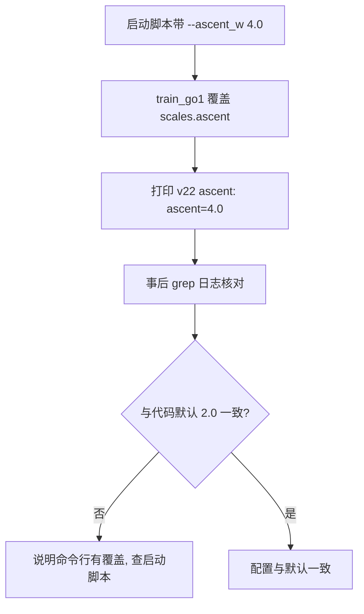
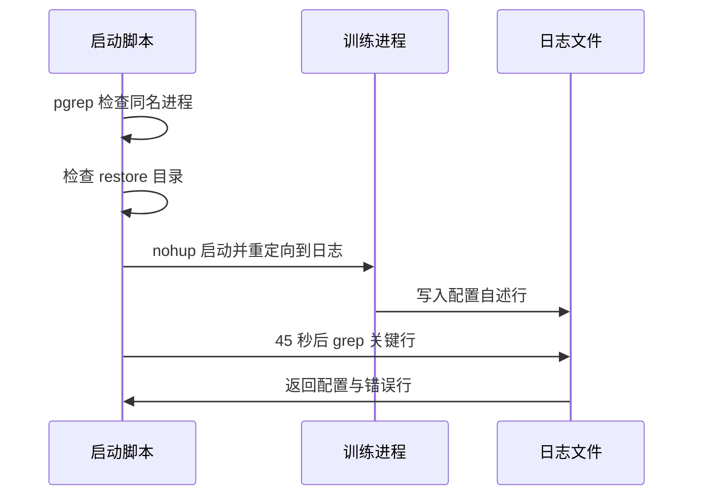

训练日志最有价值的部分是开头二十来行。它们记录的是配置自述，与进度无关：每一行对应一个开关，写清它开了什么、权重多少、影响的维度是哪几个。由于开关覆盖代码分散在几百行分支里，事后核对“这次到底跑的是什么配置”，靠的就是这些行。

启动脚本把这件事做成了流程：先在启动前检查进程与恢复路径，再把日志重定向到文件，最后 grep 一组关键字把关键配置行打回终端。三步合起来，让一次训练的配置指纹在启动阶段就被固定下来。

启动打印是事后核对本次配置的主要凭据，尤其当命令行覆盖了默认值时——那几行会把实际生效的数字写下来。

## 1. 启动打印的三类行

第一类是后端确认行 `backend: gpu`；第二类是开关自述，每开启一个开关打印一行；第三类是维度与优化摘要，包括预期观测维度、学习率、熵、裁剪与网络层宽。

以 v23 的冒烟日志为例，从第 3 行到第 25 行依次是后端、算法档、硬接触、指令条件化、机体坐标系、终止阈值、步态项、悬空惩罚、地形、高度扫描、推挤、观测噪声、爬升奖励、软着陆、相位奖励、爬升门控、对称正则、体接触、维度与优化（`RLcontroller_go1_moreinformation/data/smoke_v23.log`）。

```text
backend: gpu
v9 sb3_full: num_envs=768, unroll=32, minibatch=2序列×32步=64条 ...
v5 hard_contact: 足端硬接触 (XML 原样) + Newton 20 迭代 / ls 10
v11 指令条件化: 每 episode 采样 cmd ~ U([0.0, 0.0, -1.0], [0.5, 0.0, 1.0])
v19 terrain: 地形场景 + 随机出生 (xy±5.0m, yaw 随机, z=地面+0.35m ...)
预期 obs 维度: state=91  privileged_state=162  (含相位 8 维)
优化: lr=0.0001 entropy_cost=0.0 clip=0.2 grad_clip=0.5 layers=(128, 128)
```

## 2. 每行自述的内容构成

自述行的格式不统一，但都包含三样东西：开关名或版本号、关键数值、以及它改动了什么。例如爬升奖励那行同时给出权重、参考量、目标站高、分段惩罚值与正常站立时的实测均值（`data/smoke_v23.log`）；相位奖励那行给出权重、相位向量、步频、摆腿高度与核宽度。

| 行 | 记录的配置 | 排查用途 |
| --- | --- | --- |
| `v9 sb3_full` | 环境数、unroll、minibatch、更新密度 | 确认优化制度 |
| `v5 hard_contact` | 接触模型与求解器迭代 | 确认物理档 |
| `v11 指令条件化` | 指令采样范围与评估固定值 | 确认任务定义 |
| `v19 terrain` | 地形与随机出生参数 | 确认场景 |
| `v20 gait_phase` | 相位向量、步频、摆腿目标 | 确认步态引导 |
| `v22 ascent` | 爬升权重与上限 | 确认奖励项 |
| `v23 symmetry` | 对称权重、beta 与封顶 | 确认正则项 |

## 3. 用打印行反查实际生效值

自述行是发现“命令行覆盖了默认值”的最快途径。v23 的冒烟日志里爬升奖励写的是 `ascent=4.0`（`data/smoke_v23.log`），而代码里 `--ascent` 默认给的是 2.0（`train/train_go1.py`），说明这次运行用了权重覆盖开关。查看 v23 的启动脚本，确实带了 `--ascent_w 4.0`（`RLcontroller_go1_moreinformation/sim/start_v23_train.sh`），并加了行进门控 `--ascent_gate 0.2`。

这件事的记录价值来自一次反套利算术：权重 2 是安全档、4 偏险、8 以上会让“站台顶不动”超过“走路”（`RLcontroller_go1_moreinformation/实验记录_Go1复现.md`）。门控加上之后权重才提到 4，启动打印把这两个数同时留在日志里。



## 4. 维度与优化摘要

维度行把 actor 与 critic 的输入一起打出来，含相位时还会标注（`data/smoke_v23.log`）。这一行是环境改动后第一项要核对的输出，续训时还要与检查点里的维度比对。

优化摘要行给出学习率、熵、PPO 裁剪、梯度裁剪与层宽，并附上恢复路径。层宽在这里是元组形式，因此 `--layers 128,128` 这类覆盖能被一眼看出：摘要会写 `layers=(128, 128)` 而不是分档默认的 (64, 64)。

续训自检紧随其后，打印检查点路径、检查点记录的维度、本次维度以及“维度一致”的结论（`train/train_go1.py`）。这四行是续训成功与否的唯一证据，出错时守卫会直接退出。

## 5. 启动脚本的前置检查

启动脚本 `start_v23_train.sh` 在拉起训练之前做三件事：确认没有同名训练进程在跑，确认续训起点目录存在，创建日志目录（`RLcontroller_go1_moreinformation/sim/start_v23_train.sh`）。进程检查用的是 `pgrep` 加方括号写法，避免匹配到自身。

启动方式是用 `nohup` 把训练放到后台并把标准输出重定向到日志文件，随后打印进程号。这样训练与终端解耦，日志文件成为唯一的事实来源。

## 6. 启动后的关键行回看

脚本在启动 45 秒后用一组关键字回看日志：对称正则、爬升、续训自检、维度一致、预期维度、开始训练，以及 Error 与 Traceback（`RLcontroller_go1_moreinformation/sim/start_v23_train.sh`）。这组关键字同时覆盖“配置生效”与“启动失败”两类信号，等于一次自动化的启动验收。



## 7. 日志开头的噪声

日志开头有两类与训练无关的输出：虚拟环境路径不一致的 `RuntimeWarning`，以及 warp 关于多接触 CCD 的 `UserWarning`（`data/smoke_v23.log`）。它们不影响训练，但会干扰 grep，因此关键行回看要用能避开它们的模式。

`check_*.log` 里同样有这两类噪声，评估摘要脚本在解析时按标签匹配，不依赖行号，因此不受影响。

## 8. 三类日志文件的分工

一次完整实验会产生三类日志：训练进程的完整标准输出、看护进程的摘要与逐检查点评估、以及人工整理的实验记录。三者用途不同，不应互相替代。

训练日志由启动脚本指定到 `models/train_v23_40M.log`（`RLcontroller_go1_moreinformation/sim/start_v23_train.sh`），保存全部进度行；看护摘要写在 `data/<版本>_checks/watch.log`，只保留每个检查点的指标摘要；实验记录则把结论、根因与命令整理成可阅读的章节。

| 日志 | 位置 | 内容 | 读者 |
| --- | --- | --- | --- |
| 训练标准输出 | `models/train_<版本>.log` | 全部进度与配置自述 | 排查训练过程 |
| 看护摘要 | `data/<版本>_checks/watch.log` | 每个检查点的指标摘要 | 看趋势 |
| 逐检查点评估 | `data/<版本>_checks/check_<步数>.log` | 单次评估完整输出 | 复查细节 |
| 实验记录 | `RLcontroller_go1_moreinformation/实验记录_Go1复现.md` | 结论与根因 | 复现与交接 |

三类日志的生成时机也不同：训练日志在启动时创建并持续追加；看护摘要在看护脚本启动时写入；实验记录在阶段结论确定后由人工补齐。

## 9. 小结

### 核心概念

- 启动打印的前二十余行是配置自述，不是进度信息。
- 每个开关一行，写清数值与作用，可用于事后核对。
- 自述行与代码默认值不一致时，说明命令行有覆盖。
- 维度行与优化摘要行是环境与网络改动后的第一道核对。
- 启动脚本做进程、路径与日志目录三项前置检查。
- 启动后用一组关键字回看日志，覆盖配置与错误两类信号。

### 设计权衡

| 决策 | 选择 | 收益 | 代价 |
| --- | --- | --- | --- |
| 配置记录 | 启动时打印 | 事后可查 | 改动开关要记得加打印 |
| 启动方式 | nohup 加重定向 | 与终端解耦 | 需靠 grep 回看 |
| 前置检查 | 进程与路径 | 避免误启动 | 脚本更长 |
| 关键行回看 | 固定关键字组 | 自动验收 | 关键字要随版本维护 |

## 10. 练习

### 基础题

1. 列出启动打印的三类行，并说明各自的核对对象。
2. 解释如何从自述行判断命令行覆盖了默认权重。
3. 说明启动脚本的前置检查有哪三项。

### 挑战题

1. 设计一组关键字，使关键行回看能同时覆盖新增开关与启动错误。
2. 给定一份训练日志，写出恢复“本次实际配置”的完整步骤。
3. 论证把配置指纹写成独立文件（而非日志行）的取舍。

## 附：本页引用的路径

| 路径 | 用途 |
| --- | --- |
| `RLcontroller_go1_moreinformation/data/smoke_v23.log` | 真实的启动打印与噪声行 |
| `RLcontroller_go1_moreinformation/sim/start_v23_train.sh` | 前置检查、启动方式与关键行回看 |
| `train/train_go1.py` | 打印实现、维度行与续训自检 |
| `RLcontroller_go1_moreinformation/实验记录_Go1复现.md` | 爬升权重反套利算术 |
