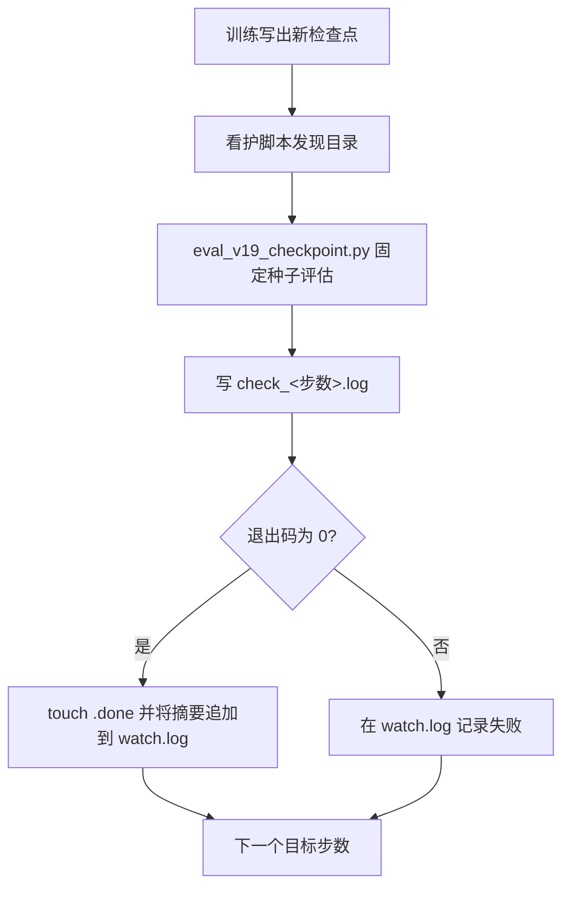
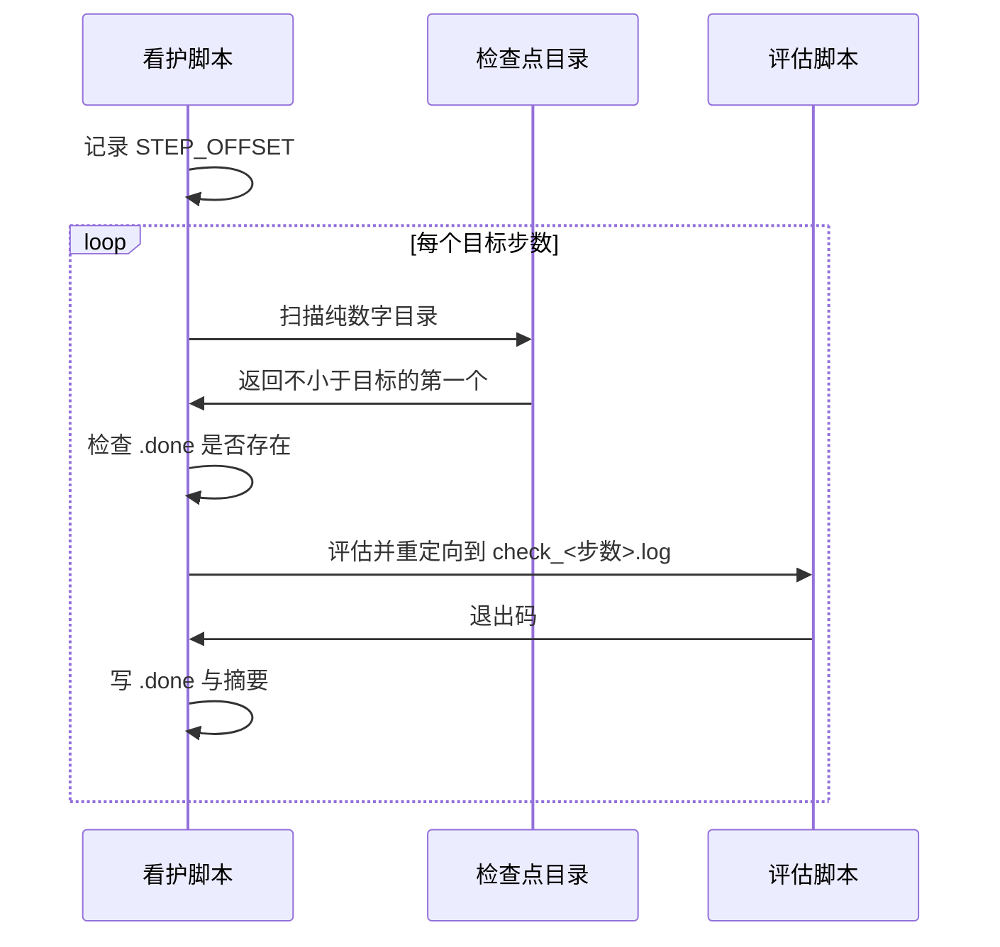

brax 自带的评估不适合做版本对比。它用的是训练同款环境，含随机出生、推挤与观测噪声，所以 `eval/episode_reward` 把“策略变好”和“出生点运气”混在一起；每个检查点又各用各的出生点，5M 与 10M 的数字不可直接比较。

看护脚本解决的就是可比性：每当训练写出一个新检查点，就用固定种子与固定出生点集把它放进测试环境跑一遍，把结果写成一份日志。多个检查点的数字因此落在同一把尺子上。

看护脚本解决的是可比性与幂等两件事：固定种子的测试环境让不同检查点的数字可比，done 标记让评估可以中断重跑。

## 1. 为什么不用内置评估

评估脚本的文档串写明了两个理由：内置评估的数字混了策略改进与出生点运气，且各检查点的出生点不同导致不可比（`RLcontroller_go1_moreinformation/sim/eval_v19_checkpoint.py:6-8`）。它的对策是固定种子与可复现的出生点集，让不同检查点面对完全相同的地形与初始状态（`:10-11`）。

这套做法与单元 62 里的评估口径问题互补：那边说的是“回合长度指标不可信”，这边解决的是“奖励指标不可比”。两者共同指向同一个结论——评估要有自己的尺子。

## 2. 固定种子与批量规模

脚本把测试种子与并行环境数写成常量：种子 20260915、512 个环境（`RLcontroller_go1_moreinformation/sim/eval_v19_checkpoint.py:34-36`）。种子固定是可比性的前提，环境数决定统计噪声：数量越大，存活率这类比例的抖动越小。

评估入口支持两种输入：检查点目录与策略文件，后者用于对照导出的 pkl 与目录是否一致（`:14-15`）。同一个策略用两条路径评估得到同样的数字，说明导出与保存两侧的参数顺序都对上了。

## 3. 看护脚本的等待逻辑

看护脚本按目标步数依次等待，目标列表是 5M、10M、15M、20M（`RLcontroller_go1_moreinformation/sim/watch_v19_checks.sh:19-20`）。每次等待循环每十秒扫一遍检查点目录，筛出纯数字目录中步数不小于目标的第一个，再排序取最小（`:25-28`）。

用“不小于目标的第一个”而不是“等于目标”，是因为检查点的实际步数由训练周期决定：brax 的一个周期是 204 个训练步乘 24,576 环境步，等于 5,013,504，因此“每 5M”实际落在 5.01M 这样的位置（`:3-6`）。脚本注释把这件事写成设计依据，说明为什么不能用定时任务替代看护。

## 4. 幂等与 done 标记

发现检查点后先检查是否已有对应的 `.done` 文件，有就跳过，没有才评估（`RLcontroller_go1_moreinformation/sim/watch_v19_checks.sh:30-32`）。评估成功（退出码为 0）后创建 `.done` 并把摘要行追加到 `watch.log`（`:38-43`）。

这套标记让看护脚本可以中断重跑：已完成的检查点不会被重复评估，未完成的会继续。与检查点的 `commit_success.txt` 是同一类思路，只是粒度更粗。

| 标记 | 粒度 | 生产者 | 作用 |
| --- | --- | --- | --- |
| `commit_success.txt` | 单个检查点 | orbax | 表示写入完成 |
| `check_<步数>.done` | 单次评估 | 看护脚本 | 表示评估已完成 |

## 5. 摘要抽取与失败处理

摘要不靠解析结构化数据，而是用一组标签从评估日志里 grep 出来，追加到 `watch.log`（`:41-42`）。失败时在 `watch.log` 里记一行退出码并保留完整的 `check_*.log` 供复查（`:44-47`）。这种“摘要进总账、细节留单页”的分工，避免总账被长输出淹没。

等待有上限：内层循环 1080 次乘 10 秒，等于最长 180 分钟（`:24-25`）。超时不会让脚本卡死，而是进入下一个目标。

## 6. 续训看护的步数记账

续训时 brax 的步数从 0 重新计数，检查点目录名仍是 5/10/15/20M，但实际代表累计 25/30/35/40M。v22 的看护脚本显式维护偏移量 `STEP_OFFSET=20054016`，并声明所有输出与对比都用累计步数（`RLcontroller_go1_moreinformation/sim/watch_v22_checks.sh:4-7`、`:28-34`）。这与训练脚本里的 `--step_offset` 是同一件事在两个工具里的体现。

## 7. 默认不与训练并发

v22 的看护脚本默认等训练进程退出后再跑检查，原因是并发会抢 GPU：8GB 卡上 v21 的看护与训练同时跑，导致 10M 的检查因为显存不足失败，训练速度也被拖到 1818 fps，而单独训练时是 2900 到 4024 fps（`RLcontroller_go1_moreinformation/sim/watch_v22_checks.sh:8-10`）。等待逻辑最多等 8 小时，每 10 秒用 `pgrep` 检查一次（`:37-45`）。

需要边训边看时用环境变量 `WAIT_FOR_TRAIN=1` 打开并发（`:18-19`、`:30`），脚本注释同时标注了显存争用风险。

## 8. 每个检查点检查什么

v22 的看护对每个检查点跑三项：常规评估、步态诊断与非足端拖地检查（`RLcontroller_go1_moreinformation/sim/watch_v22_checks.sh:12-15`）。三项对应三个不同的问题：奖励与存活、步态是否为对角 trot、以及躯干或小腿是否拖地。

| 检查 | 脚本 | 观察对象 |
| --- | --- | --- |
| 常规评估 | `eval_v19_checkpoint.py` | 奖励、回合长度、存活率、速度跟踪 |
| 步态诊断 | `diag_v19_gait_steady.py` | 对角同步与占空比 |
| 非足端拖地 | `check_body_contact.py` | 体接触次数 |

## 9. 逐检查点日志的复查流程

一次阶段的评估产物都在 `data/<版本>_checks/` 下：总账是 `watch.log`，单页是 `check_<步数>.log`，旁边是 `.done` 标记。复查的顺序是先看总账的摘要行找出趋势与异常步数，再打开对应的单页看分项输出（`RLcontroller_go1_moreinformation/data/v19_20M_checks/watch.log`）。

把摘要行汇总成表格由专门的脚本完成，它用标签正则从每份单页里抽十一项指标（`RLcontroller_go1_moreinformation/sim/summarize_v19_checks.py:11-36`）。脚本注释提醒了一处单位约定：存活率与爬升占比在日志里已经乘过 100，汇总时不能再乘一次，汇总脚本与评估脚本的单位必须对齐（`:39-40`）。

| 产物 | 用途 | 复查时的角色 |
| --- | --- | --- |
| `watch.log` | 摘要与时间戳 | 找趋势与异常 |
| `check_<步数>.log` | 单次评估完整输出 | 看分项细节 |
| `.done` | 完成标记 | 判断哪些已评估 |
| 汇总脚本输出 | 跨检查点表格 | 出图与结论 |

## 10. 小结

### 核心概念

- 内置评估混了策略改进与出生点运气，检查点之间不可比。
- 固定种子与固定出生点集是可比性的前提。
- 看护按“不小于目标的第一个目录”等待，因为周期步数不是整数百万。
- .done 标记让看护可中断重跑且不重复评估。
- 续训看护用步数偏移映射把目录名换算成累计步数。
- 默认等训练结束再评估，避免 8GB 卡上的显存争用。

### 设计权衡

| 决策 | 选择 | 收益 | 代价 |
| --- | --- | --- | --- |
| 评估来源 | 自建固定种子 | 数字可比 | 需要维护评估脚本 |
| 等待方式 | 轮询目录 | 不依赖定时 | 有最长等待上限 |
| 幂等机制 | .done 标记 | 可中断重跑 | 需要清理标记 |
| 并发策略 | 默认串行 | 不抢显存 | 结果要等训练结束 |

## 11. 练习

### 基础题

1. 说明为什么内置评估的数字不能用于检查点之间的比较。
2. 解释看护为什么用“不小于目标”而不是“等于目标”来匹配目录。
3. 写出 .done 标记的作用与它写入的时机。

### 挑战题

1. 设计一个看护脚本，支持任意步数列表与自定义检查项，并保持幂等。
2. 给定一次续训实验，写出把目录名正确换算成累计步数所需的信息。
3. 论证在 8GB 卡上并发看护的可行方案，并给出验证显存争用的判据。

## 附：本页引用的路径

| 路径 | 用途 |
| --- | --- |
| `RLcontroller_go1_moreinformation/sim/watch_v19_checks.sh` | 等待逻辑、幂等与摘要抽取 |
| `RLcontroller_go1_moreinformation/sim/watch_v22_checks.sh` | 步数偏移、并发取舍与检查项 |
| `RLcontroller_go1_moreinformation/sim/eval_v19_checkpoint.py` | 固定种子评估与两种输入 |
| `RLcontroller_go1_moreinformation/data/v19_20M_checks/` | 现存的评估日志与标记 |
