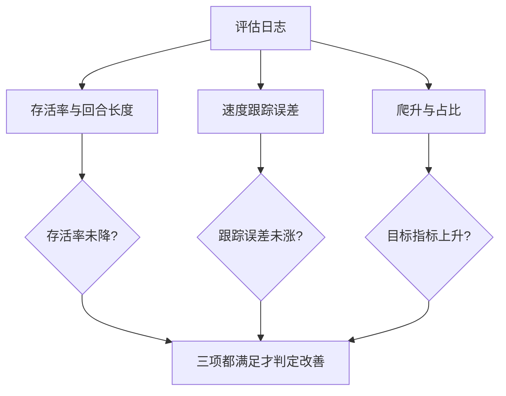
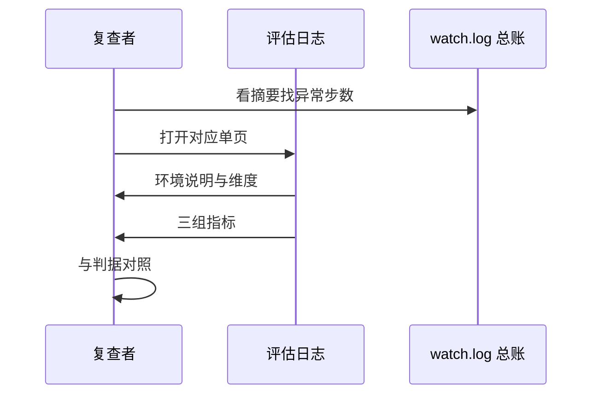

一份评估日志读起来像一份逐项检查报告：开头是环境说明，中间是初始化输出，最后是一组指标。指标的价值取决于它是否可比——固定种子让不同检查点的数字落在同一把尺子上，剩下的工作就是把指标与判据对应起来。

这套工程的评估日志有单段与多段两种形态。单段的每次评估产出一份，对应一个检查点；多段的把若干专题评估拼在一个文件里，用分隔线分段。两种形态都需要一组共同的阅读规则：先看环境与维度，再看指标与判据。

评估日志的可读性取决于读的顺序：先确认评估对象与环境，再确认观测维度与训练一致，然后才读指标并与判据对照。

## 1. 单页评估日志的结构

评估日志的开头三行说明这次评估的对象与环境：`测试 v19@000020054016`、策略的观测维度、以及测试环境的构成（地形加扫描、随机出生、无推挤无噪声、固定种子、256 环境）（`RLcontroller_go1_moreinformation/data/v19_20M_checks/check_000020054016.log`）。

中段是 warp 初始化与 kernel 加载输出，含设备型号与显存。末段是十一个指标行。三段之间没有分隔符，靠内容区分，因此解析要用标签匹配而不是行号。

```text
=== 测试 v19@000020054016 ===
  策略 obs: state=83 privileged=154
  测试环境: terrain+scan, 随机出生, 无推挤/无观测噪声, 固定 seed=20260915, 256 环境
...
  每 episode 奖励                    1104.54
  每步奖励                             1.7207
  平均 episode 长度                     600.4 步 (12.0s / 15s)
  存活率 (未终止)                         65.6%
  速度跟踪误差 (越小越好)                     0.149 m/s
  足下地面最大爬升 (均值)                    0.0215 m
  足下地面最大爬升 (最好)                    0.2821 m
  爬升 >2cm 的环境占比                     33.6%
  爬升 >10cm 的环境占比                     1.6%
```

## 2. 指标清单与含义

汇总脚本里的标签表给出了完整清单（`RLcontroller_go1_moreinformation/sim/summarize_v19_checks.py`）：

| 指标 | 含义 | 判读方向 |
| --- | --- | --- |
| 每 episode 奖励 | 单回合累计回报 | 越大越好，但受存活影响 |
| 每步奖励 | 累计回报除以步数 | 排除回合长度影响 |
| 平均 episode 长度 | 终止前步数 | 越接近上限越好 |
| 存活率 | 未终止的环境占比 | 越大越好 |
| 平均前向速度 | 机体坐标系速度 | 与指令比较 |
| 平均水平速度模长 | 速度大小 | 检查是否原地打转 |
| 速度跟踪误差 | 与指令之差 | 越小越好 |
| 足下地面最大爬升均值 | 地形升高 | 越大越好 |
| 足下地面最大爬升最好值 | 单环境最优 | 观察上限 |
| 爬升 >2cm 占比 | 轻微爬升环境比例 | 分布左端 |
| 爬升 >10cm 占比 | 明显爬升环境比例 | 分布右端 |

前四项衡量“活得好不好”，中间三项衡量“走得准不准”，后四项衡量“爬得高不高”。一次评估同时看三类，才能判断改动是否只优化了其中一类。

## 3. 判据链与结论

指标本身不是结论，组合成判据才有意义。爬升专题的判据是“地形高度变化不小于 0.24 米且从未终止”（`RLcontroller_go1_moreinformation/data/v23_final_eval.log`）；存活率与速度跟踪误差一起看，才能区分“站着不动”与“走得稳”（`data/v19_20M_checks/check_000020054016.log`）。

这种组合判据在实验记录里被反复使用：加奖励项后要同时确认存活率不降、跟踪误差不涨、目标指标上升，否则改动可能只是把行为挤到了另一处。



## 4. 单位约定

日志里的比例已经乘过 100，直接带百分号；汇总脚本在解析后不再乘第二遍（`RLcontroller_go1_moreinformation/sim/summarize_v19_checks.py`）。速度与高度是米制单位，速度跟踪误差也以米每秒计。

解析时用“标签加数值”的正则，浮点数按原样写入表格。这一约定要求评估脚本与汇总脚本的单位改动必须同步，否则表格会静默错一个数量级。

## 5. 多段评估日志

专题评估把若干检查拼在一个文件里，用井号分隔线分段。v23 的最终评估有两个专题：镜像对称性与上下台阶成功率（`RLcontroller_go1_moreinformation/data/v23_final_eval.log`）。每段独立初始化 warp，因此日志更长但每段自洽。

| 形态 | 文件名 | 结构 | 适用 |
| --- | --- | --- | --- |
| 单段 | `check_<步数>.log` | 一次评估 | 逐检查点看护 |
| 多段 | `<版本>_final_eval.log` | 分隔线分专题 | 阶段总结 |
| 冒烟 | `smoke_<版本>.log` | 训练启动输出 | 通路验证 |

## 6. 从指标到结论

写结论时的顺序是：先记录判据，再给指标，最后给解释。例如“爬升激励改动后，爬升 >10cm 占比从某值升到某值，同时存活率不变”，三部分缺一不可。记录里还保留了对同一现象的多份日志引用，便于复查时回到原始输出。

日志引用应当带文件路径与行号或标签名，而不是只写数字，否则无法回溯是哪一次评估。

## 7. 阅读顺序

拿到一份评估日志按四步读：确认评估对象与环境；确认观测维度与训练一致；读三组指标；把指标与判据对照。四步中任何一步发现不一致，都要先解决不一致再解释指标，否则结论建立在错误的输入上。



## 8. 小结

### 核心概念

- 评估日志由环境说明、初始化输出与指标三段组成。
- 指标分三组：存活、速度跟踪、爬升。
- 判据是指标的组合，不是单个阈值。
- 比例在日志里已乘 100，汇总时不能再乘。
- 多段日志用分隔线分专题，每段独立初始化。
- 结论必须同时给出判据、指标与解释。

### 设计权衡

| 决策 | 选择 | 收益 | 代价 |
| --- | --- | --- | --- |
| 日志形态 | 单页加总账 | 细节与趋势兼顾 | 需要两处对齐 |
| 解析方式 | 标签正则 | 不受行号影响 | 标签改动要同步 |
| 判据设计 | 多指标组合 | 避免单一指标误导 | 需要更多评估项 |
| 专题组织 | 多段文件 | 阶段总结方便 | 单文件更长 |

## 9. 练习

### 基础题

1. 列出评估日志的三段结构与各段作用。
2. 说明十一项指标如何分成三组，并各举一项。
3. 解释为什么比例不能在汇总时再乘 100。

### 挑战题

1. 设计一组判据，用于判断“新增奖励项有效且没有挤占原有行为”。
2. 给定一份多段评估日志，写出把一个专题的结论单独抽取出来的流程。
3. 论证把评估日志改成结构化格式（如 JSON）的取舍。

## 附：本页引用的路径

| 路径 | 用途 |
| --- | --- |
| `RLcontroller_go1_moreinformation/data/v19_20M_checks/check_000020054016.log` | 单页评估日志样例 |
| `RLcontroller_go1_moreinformation/data/v23_final_eval.log` | 多段专题评估样例与判据 |
| `RLcontroller_go1_moreinformation/sim/summarize_v19_checks.py` | 指标标签表与单位约定 |
