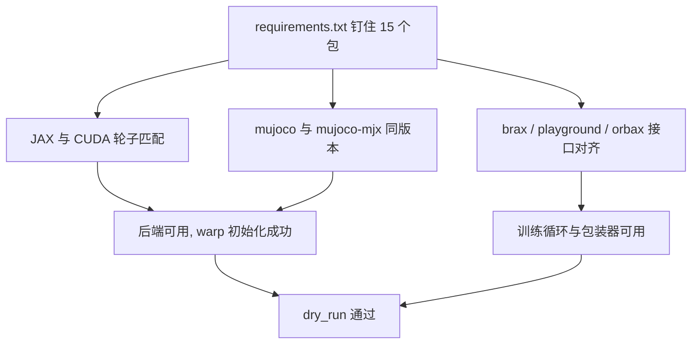
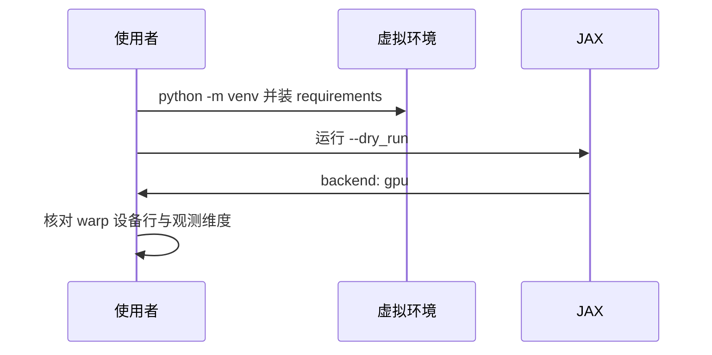

把仓库换到另一台机器上重装环境时，最省事的做法是“装最新的”，结果通常是三种报错里挑一种：JAX 找不到 CUDA 后端、MuJoCo 与 MJX 版本不匹配、或者 brax 的接口签名对不上。这套工程的 `requirements.txt` 就是为这件事写的第一道防线——它把这次成功运行时的版本逐个钉住，并在注释里写明验证过的平台。

钉住版本还有一个不常被提到的收益：版本号本身就是一条诊断线索。报错里出现某个包的路径与版本，可以直接对照清单判断是不是环境漂移。

三步里最容易出错的是第二步：清单不只用版本号，还用注释固定了验证过的平台与两条安装路径。

## 1. 从零到能跑的三步

第一步建虚拟环境，第二步按清单安装，第三步跑一个只建环境与前向的入口确认后端可用（`README.md:53-54`、`:107`）。清单头部还给出了一条带 NVIDIA 索引的安装命令（`requirements.txt:5`）。

```bash
python -m venv .venv && source .venv/bin/activate
pip install -r requirements.txt --extra-index-url https://pypi.nvidia.com
# 只建环境与前向, 不训练
python -m train.train_getup --dry_run
```

工程里所有脚本都用相对虚拟环境解释器调用（`../.venv/bin/python sim/...`），因此不需要激活也能运行，只要工作目录在仓库内（`当前状态.md:191`）。

## 2. 清单里的每个版本

清单从 jax 到 tqdm 共十五个包，分成四组：JAX 计算栈、MuJoCo 运行时、RL 算法栈、以及查看器与工具（`requirements.txt:8-22`）。

| 组 | 包 | 版本 | 作用 |
| --- | --- | --- | --- |
| 计算栈 | `jax` / `jaxlib` | 0.7.2 | 数组计算与编译 |
| 计算栈 | `warp-lang` | 1.16.0 | MJX 的 warp 后端 |
| 物理 | `mujoco` / `mujoco-mjx` | 3.12.0 | 物理引擎与 MJX 绑定 |
| 算法 | `brax` | 0.14.2 | PPO 训练循环 |
| 算法 | `playground` | 0.2.0 | 环境与包装器（PyPI 名 mujoco_playground） |
| 算法 | `flax` / `optax` | 0.11.2 / 0.2.8 | 网络与优化器 |
| 存储 | `orbax-checkpoint` | 0.12.4 | 检查点读写 |
| 配置 | `ml_collections` | 1.1.0 | 环境配置对象 |
| 工具 | `numpy` / `pillow` / `pynput` / `tqdm` | 2.5.2 / 12.3.0 / 1.8.1 / 4.70.0 | 数值、渲染、键盘、进度 |

`playground` 那一行带注释说明它在 PyPI 上的发行名是 `mujoco_playground`，安装名与导入名不一致，这类包最容易在手工安装时装错（`requirements.txt:14`）。

## 3. 为什么要钉住而不是装最新

第一层约束来自 JAX 与 CUDA 轮子的匹配：`jaxlib` 的 GPU 版本按 CUDA 大版本与驱动能力分开提供，装到不匹配的轮子会退化成 CPU 执行或直接导入失败。清单注释给出了另一条官方轮子路径，版本号同样是 0.7.2（`requirements.txt:6-7`）。

第二层约束来自 MJX 内部：`mujoco` 与 `mujoco-mjx` 必须同版本，它们共享底层 C 结构体布局。第三层是算法栈之间：brax、playground 与 orbax 的接口在 0.14 / 0.2 / 0.12 这几个版本上才能对上。



## 4. 两条 GPU 安装路径

第一条是清单里给出的方式：jaxlib 加 NVIDIA 提供的 CUDA 运行库包，通过额外索引安装（`requirements.txt:4-5`）。第二条是按官方说明安装聚合包 `jax[cuda12]==0.7.2`，由官方轮子自带 CUDA 依赖（`:6-7`）。

两条路径的差别在依赖来源：前者把 CUDA 运行库交给 NVIDIA 的包，后者交给官方轮子。验证方式相同——跑 `--dry_run` 看后端是否打印为 gpu（`train/train_getup.py:208`）。

| 路径 | 安装命令要点 | 优点 | 注意 |
| --- | --- | --- | --- |
| NVIDIA 索引 | `--extra-index-url https://pypi.nvidia.com` | 与本仓库验证环境一致 | 需要额外索引可达 |
| 官方聚合包 | `jax[cuda12]==0.7.2` | 依赖自带 | 与 jaxlib 版本需一致 |

## 5. 版本号之外的三件东西

清单头部写明验证过的平台是 Python 3.14、CUDA 12、RTX 5060 Laptop 8GB 与 WSL2（`requirements.txt:2`）。这三项决定了版本号能不能用：Python 版本影响 wheel 是否存在，CUDA 大版本影响轮子选择，操作系统决定驱动与渲染路径。

仓库里 `当前状态.md` 与 `docs/status.md` 都重复了这几项事实，包括虚拟环境路径与“一个进程独占一个环境”的约束（`当前状态.md:189-191`、`docs/status.md:195-197`）。

## 6. 锁定失效时的现象

装了不匹配的 jaxlib 时，最典型的输出是后端打印为 cpu，训练照常运行但吞吐低一个数量级。mujoco 与 mjx 版本不一致时，报错出现在模型加载或第一次前向，而不是安装阶段。brax 接口变化时，报错出现在训练入口的调用签名上。

这三类现象分别对应“后端”“物理”“算法”三层，按这个顺序排查可以少走弯路：先看后端打印，再看单步前向，最后看训练入口。

三层里最难排的是第三层，因为入口报错往往只给出参数名不匹配，而不会直接指出是哪个包升了版本。这时对照 requirements.txt 的逐行版本反而比读报错栈快。

## 7. 环境重建后的验收

验收只有三个观察点：`--dry_run` 打印的后端是 gpu；warp 初始化输出里设备行显示显卡型号与显存；观测维度打印与预期一致（`docs/status.md:196-197`）。三项都通过，环境就算装好了，可以进入冒烟训练。



## 8. 版本升级的连锁成本

升级等于一次整组替换，不是改一个版本号：jax 与 jaxlib 同步、warp 与 mjx 跟随、brax 与 playground 与 orbax 再跟着动。任何一处不对，报错都会出现在看起来无关的地方。

还有一处容易被忽略：orbax 的版本决定检查点的磁盘布局，升级后旧检查点未必能直接读取。升级流程因此必须包含三项回归——重新跑 `--dry_run`、跑一次小预算冒烟、以及用新环境读一份旧检查点。三项全过才把新版本写回清单。

## 9. 小结

### 核心概念

- requirements.txt 钉住十五个包并写明验证平台。
- JAX 轮子必须与 CUDA 大版本及驱动能力匹配。
- mujoco 与 mujoco-mjx 必须同版本。
- 安装名与导入名可能不同，playground 就是一例。
- 两条安装路径的差别只在 CUDA 依赖来源。
- 锁定失效的现象分后端、物理、算法三层出现。

### 设计权衡

| 决策 | 选择 | 收益 | 代价 |
| --- | --- | --- | --- |
| 版本管理 | 全部精确钉住 | 可复现 | 升级需整组验证 |
| 安装路径 | 给出两条 | 适配不同网络环境 | 文档需要同步维护 |
| 平台记录 | 写进清单注释 | 一眼看到边界 | 换机器要更新注释 |
| 验收方式 | dry_run 三观察点 | 快 | 不覆盖运行时性能 |

## 10. 练习

### 基础题

1. 写出从零安装到验收的三条命令及其作用。
2. 说明 mujoco 与 mujoco-mjx 为什么必须同版本。
3. 列出版本号之外还需要记录的三项平台信息。

### 挑战题

1. 设计一份环境自检脚本，覆盖后端、设备与观测维度三项。
2. 给定一次“后端打印 cpu”的报错，写出从清单到驱动的排查顺序。
3. 论证全量精确钉住与使用范围约束（如 `>=`）两种策略的取舍。

## 附：本页引用的路径

| 路径 | 用途 |
| --- | --- |
| `requirements.txt` | 版本清单与安装说明 |
| `README.md` | 安装步骤与入口命令 |
| `docs/status.md` | 环境事实与运行约束 |
| `当前状态.md` | 虚拟环境路径与单进程约束 |
| `train/train_getup.py` | 后端打印与 dry_run |
