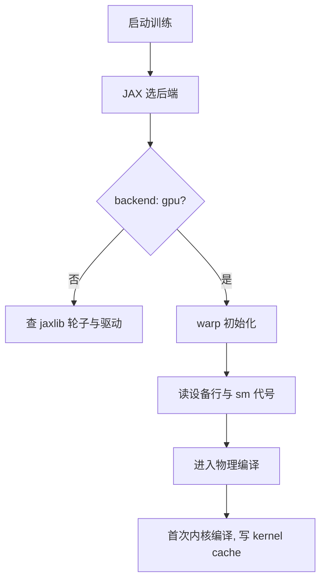
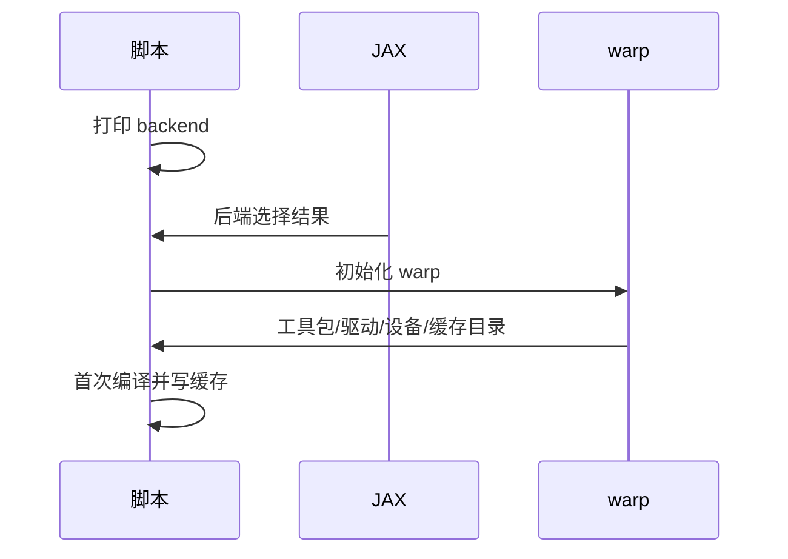

一次训练启动会打印三段与硬件有关的信息：脚本自己的后端标记、warp 的初始化块、以及设备行。这三段分别回答“用不用 GPU”“计算栈的版本是什么”“显卡是哪一张”。它们看起来重复，实际上来自三个不同的层，出了问题也各自指向不同的原因。

在 WSL2 下还需要区分计算路径与显示路径：训练只用计算路径，查看器要用显示路径，而后者在 WSL 里没有常规的显卡设备节点，需要另找通道。

在 WSL2 下计算与显示走两条不同的通道：训练只用计算通道，查看器才需要显示通道，后者要靠直通驱动而不是常规设备节点。

## 1. 三段信息各说一件事

第一段是训练脚本打印的 `backend: gpu`，它只说明 JAX 选中了哪个后端（`train/train_getup.py:208`）。第二段是 warp 的初始化块，给出 CUDA 工具包、驱动与设备清单（`RLcontroller_go1_moreinformation/data/smoke_v23.log:27-33`）。

第三段是设备行，包含显卡型号、显存、计算能力代号与内存池状态。三段的关系是：后端标记看 JAX，工具包与驱动看 warp，型号与显存看设备行。

```text
Warp 1.16.0 initialized:
   CUDA Toolkit 12.9, Driver 13.2
   Devices:
     "cpu"      : "CPU"
     "cuda:0"   : "NVIDIA GeForce RTX 5060 Laptop GPU" (8 GiB, sm_120, mempool enabled)
   Kernel cache:
     /home/tc63/.cache/warp/1.16.0
```

## 2. 三行版本信息的含义

`CUDA Toolkit 12.9` 是 warp 编译内核时使用的工具包版本，它与 JAX 依赖的 CUDA 运行库版本可以不同。`Driver 13.2` 是主机上的显卡驱动版本，它决定能跑多新的工具包。

`sm_120` 是显卡的计算能力代号，对应较新的架构。这一项很重要：编译出的内核按这个代号生成，若工具包不支持该代号，就会在第一次内核加载时报出与设备不匹配的错误（按通用做法，具体报错文案随工具包版本变化）。

| 信息 | 来源 | 说明的问题 |
| --- | --- | --- |
| backend: gpu | JAX 后端选择 | 是否在用 GPU |
| CUDA Toolkit 12.9 | warp 编译环境 | 内核编译可用性 |
| Driver 13.2 | 主机驱动 | 支持的工具包上限 |
| sm_120 | 显卡架构 | 内核代号匹配 |
| 8 GiB / mempool enabled | 设备行 | 显存预算与分配策略 |

## 3. WSL2 下的计算路径与显示路径

计算路径走 CUDA，训练与评估只用这一条。显示路径在 WSL2 下没有常规的显卡设备节点，因此“看不到 `/dev/dri`”是正常现象，不能据此断定只能用软件渲染（`docs/viewer-guide.md:160-161`）。

查看器实测的结论是给渲染库指定直通驱动后帧时间从毫秒级降到 15.3 毫秒（32 环境），设置方式是在导入渲染库之前用 `setdefault` 写入环境变量，允许使用者覆盖（`docs/viewer-guide.md:169-176`）。这条经验与训练无关，但同属“环境装配”的一部分。



## 4. 驱动与轮子的版本关系

驱动版本决定能用的 CUDA 工具包上限，工具包版本决定轮子能否加载；JAX 侧需要的是与 CUDA 大版本匹配的 `jaxlib`（`requirements.txt:6-7`）。三者构成一条链：驱动够新、工具包与轮子匹配、内核代号被支持。

升级驱动通常向下兼容，升级工具包或轮子则可能引入不匹配。因此仓库把验证过的组合写在清单里，换机器时优先复现组合，而不是各取最新。

## 4. GPU 可见性的核对方法

核对分三步：在 WSL 里跑 `nvidia-smi` 看是否列出显卡；看 warp 设备行里 `cuda:0` 的型号与显存；再跑一次训练入口的 `--dry_run` 看后端打印。三步都过，说明计算路径可用。

诊断时要注意两类容易误导的信号：`nvidia-smi` 的利用率不高、WSL 内的负载值也很低，都可能出现在 GPU 正忙的情况下，因为 WSL 里的负载统计并不反映 GPU 状态；这时要看的是 GPU 进程与显存占用（`docs/viewer-guide.md:235`、`:402`）。

另一条与环境装配相关的约束是进程数：一个进程只建一个环境实例，两个环境同进程会撞上 warp 的 CUDA graph 地址缓存（`当前状态.md:189-190`）。并发实验要用两个进程，并为此调低各自的显存预留比例。

## 6. 内核缓存与首次启动

warp 把编译好的内核缓存在用户目录下的版本化路径中（`RLcontroller_go1_moreinformation/data/smoke_v23.log:32-33`）。首次启动会看到一长串 `Module ... load ... (cached)` 行，其中标注 cached 的表示命中缓存。

缓存按 warp 版本分目录，因此升级 warp 会重新编译一遍。这一过程只影响启动时间，不影响训练吞吐；但如果缓存目录不可写，每次启动都要重编译，表现是启动明显变慢。

## 7. 排错顺序

遇到与硬件有关的报错，按后端、设备、渲染的顺序排查：先确认 `backend` 打印为 gpu；再看 warp 的设备行是否列出显卡；训练场景到此为止，只有查看器才需要继续看渲染路径。



## 8. 同一张卡上同时开训练与查看器

8GB 的笔记本显卡上同时跑训练与查看器会互相拖慢。查看器文档给出一组对照：两个进程各自把显存预留压到 0.25 时，实测每步 27.1 毫秒、36.9 fps；不做限制时同一场景退化到 306.9 毫秒（`docs/viewer-guide.md:241-253`）。结论是显存分配策略要按“几个进程同时跑”来定，而不是按单个进程的峰值。

训练侧的同类现象出现在看护脚本上：v21 的看护与训练抢显存，导致某次检查因为显存不足失败，训练速度也被拖慢（`RLcontroller_go1_moreinformation/sim/watch_v22_checks.sh:8-10`）。因此并发要问的不只是能不能跑，还有跑出来的数字还算不算数。

| 场景 | 进程数 | 显存策略 | 结果 |
| --- | --- | --- | --- |
| 单独训练 | 1 | 按脚本默认 | 参考吞吐 |
| 训练加查看器 | 2 | 各自压低预留 | 27.1 毫秒每步 |
| 训练加查看器 | 2 | 不限制 | 306.9 毫秒每步 |
| 训练加看护 | 2 | 未协调 | 检查失败并拖慢训练 |

## 9. 小结

### 核心概念

- 后端标记、warp 初始化块与设备行来自三个不同的层。
- 驱动决定工具包上限，工具包与轮子必须匹配，内核按显卡代号编译。
- WSL2 下计算走 CUDA，显示要另找直通驱动。
- `/dev/dri` 为空不能推断只能软件渲染。
- warp 内核缓存按版本分目录，只影响启动时间。
- 硬件报错按后端、设备、渲染三层顺序排查。

### 设计权衡

| 决策 | 选择 | 收益 | 代价 |
| --- | --- | --- | --- |
| 版本组合 | 固定验证过的搭配 | 少踩不匹配 | 落后于最新 |
| 渲染驱动 | setdefault 允许覆盖 | 可回退 | 需要打印实际值 |
| 缓存策略 | 按版本分目录 | 互不污染 | 升级后重编译 |
| 排错入口 | 先看后端标记 | 定位快 | 覆盖不到显示问题 |

## 10. 练习

### 基础题

1. 说明三段硬件信息各自回答什么问题。
2. 解释驱动版本与 CUDA 工具包版本的关系。
3. 说明 WSL2 下 `/dev/dri` 为空为什么不能作为软件渲染的证据。

### 挑战题

1. 设计一个启动自检，把三段信息与预期值比对并输出结论。
2. 给定一次“首次启动很慢、第二次很快”的现象，写出定位到缓存目录的步骤。
3. 论证把渲染驱动设置写进脚本与写进文档两种做法的取舍。

## 附：本页引用的路径

| 路径 | 用途 |
| --- | --- |
| `RLcontroller_go1_moreinformation/data/smoke_v23.log` | warp 初始化块与内核缓存行 |
| `docs/viewer-guide.md` | WSL 渲染路径与实测帧时间 |
| `requirements.txt` | 轮子版本与安装路径 |
| `train/train_getup.py` | 后端打印 |
