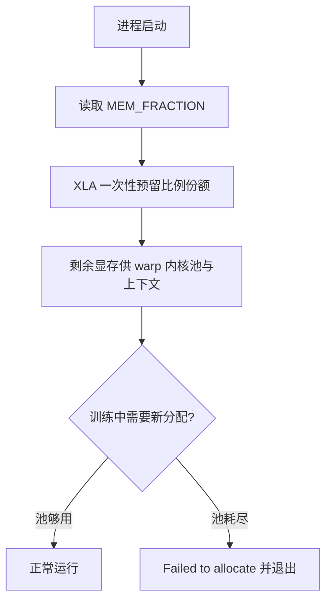
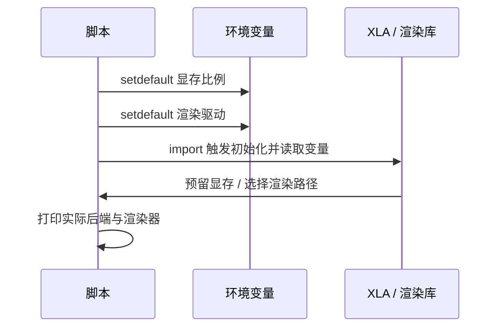

同样一段训练代码，在两个终端里跑出两种结果，原因往往不在代码里，而在启动前设过哪些环境变量。显存预留比例决定 XLA 圈走多少显存、留给 warp 内核池多少；渲染驱动决定查看器用直通还是软件渲染；线程限流只在软件渲染时才需要打开。

这些变量的共同特点是必须在导入相应库之前设置，设置晚了就完全无效。工程里的脚本因此把赋值放在文件最前面，并用 `setdefault` 允许外部覆盖（`train/train_getup.py:38-42`）。

## 1. 赋值顺序决定有效性

显存预留比例由 XLA 在初始化时读取，而 XLA 在 `import jax` 时初始化，因此这行赋值必须出现在导入之前（`docs/status.md:199`）。工程里所有需要限制显存的脚本都遵守这一顺序，并在注释里写明原因。

渲染驱动同理：渲染库在第一次创建上下文时读取环境变量，之前的赋值才有效。用 `setdefault` 而不是直接赋值，是为了让使用者在命令行外覆盖，方便对照实验（`docs/viewer-guide.md:173`）。

## 2. 显存预留比例管什么

这个变量是一个 0 到 1 的比例，XLA 按它一次性预留显存。不设时默认按约 0.75 预留，8 GiB 的卡上就是约 6.1 GiB，留给 warp 内核池的只剩约 2 GiB（`train/train_getup.py:39-41`）。

预留不足的表现很直接：训练跑到中途报显存分配失败并退出，报错里带着一个不大的字节数，例如 `Failed to allocate 83MB on device 'cuda:0'`。这个字节数看起来小，但它是在池已经耗尽时申请的最后一块，不代表真实需求（`train/train_getup.py:40-41`）。

## 3. 各脚本的实际取值

取值随场景变化：训练入口给 XLA 留 0.45，评估脚本给 0.3，双进程查看器场景用 0.25（`train/train_getup.py:42`、`RLcontroller_go1_moreinformation/sim/eval_v19_checkpoint.py:27`、`docs/viewer-guide.md:253`）。

| 场景 | 取值 | 理由 |
| --- | --- | --- |
| 训练（含频繁重置） | 0.45 | 给 warp 池留出足够空间 |
| 单进程评估 | 0.3 | 评估不需要大池 |
| 双进程查看器 | 0.25 | 两个进程各自压缩 |
| 未设置 | 约 0.75 | 默认值，易在长训练中耗尽剩余池 |

工程里 21 个模拟脚本中有 19 个显式设了这个变量，剩下两个不需要 GPU 或已在调用方设过（`docs/viewer-guide.md:271-272`）。

确认真实预留量的办法是看 GPU 进程与显存占用，而不只是相信脚本里的数字（`docs/viewer-guide.md:402`）。同一张卡上其他进程占用的部分会从可用显存里扣掉，这解释了为什么同样的比例在不同机器上表现不一样。

## 4. 渲染驱动与线程限流

WSL2 下没有常规显卡设备节点，默认可能落到软件渲染。实测给渲染库指定直通驱动后，32 个环境下的帧时间降到 15.3 毫秒；不指定时明显更慢（`docs/viewer-guide.md:169`）。变量用 `setdefault` 写入，回退方式是把它设成空串，此时才需要限制软件渲染线程数（`:181-182`）。

| 变量 | 作用 | 何时需要 |
| --- | --- | --- |
| 显存预留比例 | 划分 XLA 与 warp 的显存 | 每个 GPU 进程 |
| 渲染直通驱动 | 让渲染走显卡 | 查看器 |
| 软件渲染线程数 | 限制 CPU 渲染线程 | 回退到软件渲染时 |

## 5. 变量设了不等于生效

文档里反复出现的教训是“文档写了、代码没有”：说明中列出的配置项，实际脚本里可能漏设。因此交付前要用一次 grep 核对四个关键配置是否都在代码里出现：图模式、显存预留比例、渲染驱动与软件渲染线程数（`docs/viewer-guide.md:448-449`）。

核对之外还要打印实际值。驱动变量被使用者覆盖时，脚本内部的 `setdefault` 不生效，只有把实际渲染器名称打印出来才能确认真走了哪条路（`:441`）。

在双进程场景下，这个差额会直接决定第二个进程能不能启动：它按自己的比例预留时，看到的可用显存已经被第一个进程扣掉了一部分。

## 6. 并发实验里的变量组织

需要同时跑两个进程做对照时，显存比例要按进程数重新分配，否则两个进程都按单进程的取值去预留，第二个进程会直接失败。查看器文档给出的对照方法可以直接照搬：先用双进程并发复现出慢速场景，再把比例压到 0.25 反证回正常速度（`docs/viewer-guide.md:280`）。

并发还有一条与显存无关但同样重要的约束：一个进程只建一个环境实例，两个环境同进程会撞上 warp 的 CUDA graph 地址缓存；需要两个环境时用两个进程，并通过文件交换状态（`当前状态.md:189-190`、`docs/viewer-guide.md:452`）。

| 并发形式 | 数量 | 需要的变量调整 | 状态交换方式 |
| --- | --- | --- | --- |
| 单进程单环境 | 1 | 无 | 内存内直接传 |
| 双进程对照 | 2 | 各自降低显存比例 | 文件 |
| 训练加查看器 | 2 | 各自降低显存比例 | 检查点文件 |
| 训练加看护 | 2 | 建议串行 | 检查点目录 |

## 7. 显存不足的三类表现

第一类出现在启动阶段：同一张卡上已有进程占着显存，新进程按比例预留时直接失败，报错发生在第一个张量分配上。第二类出现在训练中途：预留本身成功，但留给内核池的余量在长训练与频繁重置中被吃光，报错发生在某一步的分配上（`train/train_getup.py:39-41`）。

第三类出现在评估或查看器：这些脚本自己也要预留显存，与训练并发时会互相挤压，表现为检查失败或帧率骤降（`RLcontroller_go1_moreinformation/sim/watch_v22_checks.sh:8-10`）。三类的处理方式不同——启动阶段要查其他进程，训练中途要调低比例，评估阶段要考虑串行。

| 表现 | 出现时机 | 首选处理 |
| --- | --- | --- |
| 启动即失败 | 第一个分配 | 查同卡其他进程 |
| 训练中途失败 | 长训练某一步 | 调低预留比例 |
| 评估或查看器变慢 | 与训练并发时 | 改成串行或降比例 |

核对的具体做法是拿四个变量名去源码里搜，逐个确认赋值语句存在：图模式、显存预留比例、渲染驱动与软件渲染线程数。文档里记着这条清单的来由——同一类问题在本项目出现过两次，都是“文档写了、代码没有”（`docs/viewer-guide.md:448-449`）。

打印时要打印实际生效的值，而不是脚本里写的那一行。对渲染来说就是打印查询到的渲染器名称；如果使用者已经用环境变量覆盖，`setdefault` 不生效，只有实际值能说明走了哪条路（`docs/viewer-guide.md:441`）。

还有一处容易忽略的是子进程继承：训练脚本由启动脚本拉起时，父进程的环境会被继承，脚本内部的 `setdefault` 因此不会覆盖已有值。排查这类问题时要把父进程的环境一起看，而不只是读脚本内容。

## 8. 小结

### 核心概念

- 显存比例与渲染驱动都必须在相应库导入之前设置。
- 不设比例时默认按约 0.75 预留，长训练容易耗尽剩余池。
- 分配失败报出的字节数不等于真实需求。
- 取值随场景变化：训练 0.45、评估 0.3、双进程 0.25。
- 渲染默认可能落到软件渲染，需要显式指定直通驱动。
- 变量设了不等于生效，要 grep 代码并打印实际值。

### 设计权衡

| 决策 | 选择 | 收益 | 代价 |
| --- | --- | --- | --- |
| 比例取值 | 按场景分档 | 各自留足余量 | 需要记住对应关系 |
| 设置方式 | setdefault | 允许外部覆盖 | 覆盖后要打印实际值 |
| 渲染回退 | 空串强制软件渲染 | 保留可用路径 | 需要线程限流 |
| 核对方式 | grep 加打印 | 覆盖文档与代码 | 需维护核对清单 |

## 9. 练习

### 基础题

1. 说明显存预留比例为什么必须在导入之前设置。
2. 解释分配失败报出的字节数为什么不能当作真实需求。
3. 列出三个变量的作用与触发场景。

### 挑战题

1. 设计一次对照实验，量化比例取值对训练吞吐与稳定性的影响。
2. 给定一次“渲染很慢但没有报错”的现象，写出从变量到实际渲染器的排查步骤。
3. 论证把四个关键变量集中到一个配置模块的取舍。

## 附：本页引用的路径

| 路径 | 用途 |
| --- | --- |
| `train/train_getup.py` | 显存比例设置与注释中的失败症状 |
| `docs/viewer-guide.md` | 渲染驱动实测、比例取值与核对清单 |
| `docs/status.md` | 赋值顺序约束 |
| `RLcontroller_go1_moreinformation/sim/eval_v19_checkpoint.py` | 评估侧比例取值 |
